# 查博士 CEO 和高管被警方带走：牵扯数据倒卖，姚劲波为实控人

> 原文：[`mp.weixin.qq.com/s?__biz=MzIyMDYwMTk0Mw==&mid=2247510499&idx=4&sn=a84d3f732ffe4b478c0828dbfe8ef561&chksm=97cb62dba0bcebcd533419ca18e3c466a0a59d470c453ad7789f18f0404582e3125d8639d566&scene=27#wechat_redirect`](http://mp.weixin.qq.com/s?__biz=MzIyMDYwMTk0Mw==&mid=2247510499&idx=4&sn=a84d3f732ffe4b478c0828dbfe8ef561&chksm=97cb62dba0bcebcd533419ca18e3c466a0a59d470c453ad7789f18f0404582e3125d8639d566&scene=27#wechat_redirect)

三言财经消息，据自媒体“第一消费金融”，2 月 27 日上午，查博士 CEO 和核心高管被警方带走，核心维保服务暂停。据知情人士称，事发原因是数据查询相关业务出事了，“可能是因为爬虫”。

公开资料显示，查博士是北京酷车易美网络科技有限公司（简称“酷美”）运营的平台，为车辆经销商和电商、金融平台客户提供车辆维修保养、保险、估价等数据查询服务。

对于被查一事，查博士方面向三言财经回复称，因为一个离职的员工在做中介倒卖数据，公司是在配合调查。

对方还表示，CEO 段学超和高管只是在配合调查，核心维管服务已经恢复部分品牌，恢复一部分品牌的维保记录了。

但是具体倒卖什么数据，倒卖给谁，对方表示不清楚。

查博士的核心功能之一是提供有偿维保记录查询，这是二手车买卖参考的一个重要数据。在媒体的报道中，问题也似乎出现在了这里。

查询维保记录会要求车主提供车架号 VIN，功能介绍中这样写着，“多方数据记录还原真实车况；脱敏处理信息安全；大数据分析，解读更准确”。

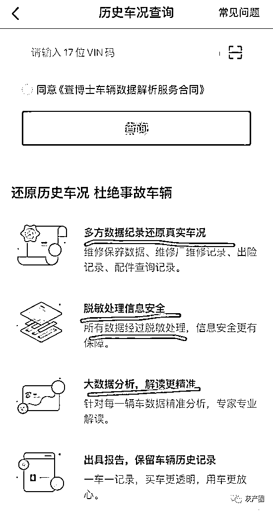

涉及的数据包括维修保养记录、维修厂维修记录、出险记录、配件查询记录等。

那么被倒卖的数据会是这些重要数据吗？

目前，三言财经实测发现，目前维保记录等功能可以正常打开，但是付费后能够提供服务我们还不得而知。

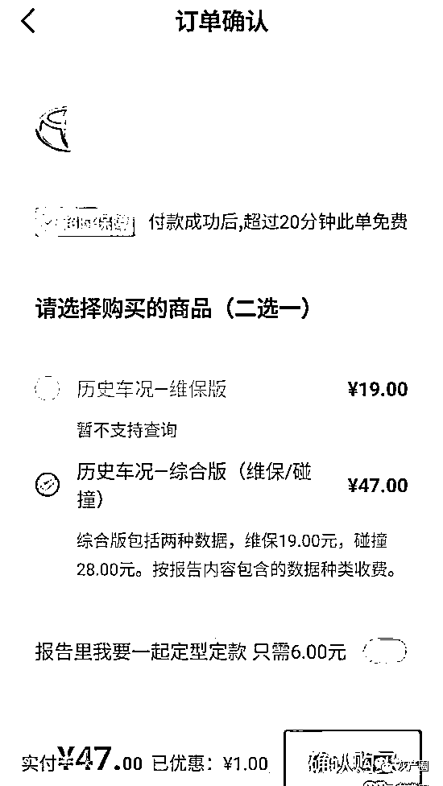

作为数据平台，这不是查博士第一次陷入数据风波了。

事实上，查博士此前曾陷卧底丑闻，派遣员工到竞争对手公司“窃取”信息，此外查博士还涉嫌联合车商坑害客户。

而另一方面，查博士与 58 集团有着紧密的联系。

查博士与 58 集团联系紧密

姚劲波为其实控人

工商资料显示，查博士成立于 2016 年 1 月 25 日，注册资本 309.07 万元，法人代表段学超，股东包括北京云企互联投资有限公司（33.68%）、宁波保税区思清投资合伙企业（有限合伙）（22.30%）、北京车易保网络科技有限公司（19.15%）等 10 个股东。

查博士成立后先后完成 5 轮融资，其中 58 同城参与了天使轮投资。

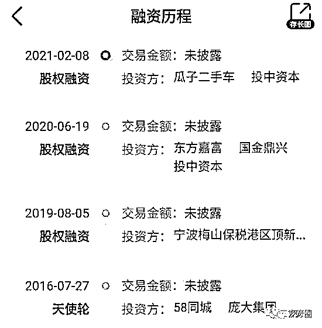

而最近一轮融资发生在上个月，投资方分别为瓜子二手车及投中资本。

天眼查数据显示，查博士疑似实控人为姚劲波，总股权比例为 16.52%。而姚劲波为 58 同城创始人、总裁兼 CEO。

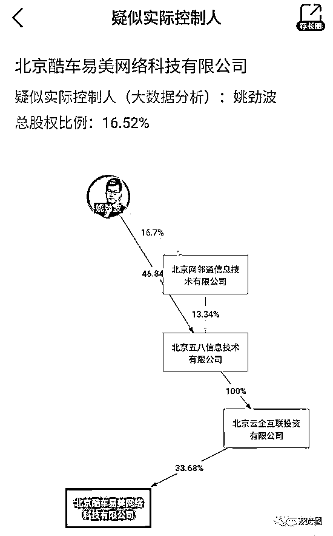

此外，58 同城副总裁丛林曾担任过查博士的董事长。

而且，现在丛林还担任查博士第三大股东，即北京车易保网络科技有限公司的法人代表及大股东。

据公开报道，查博士现任 CEO 段学超在 2018 年还以 58 集团汽车事业部高级总监的身份出现在公开场合。

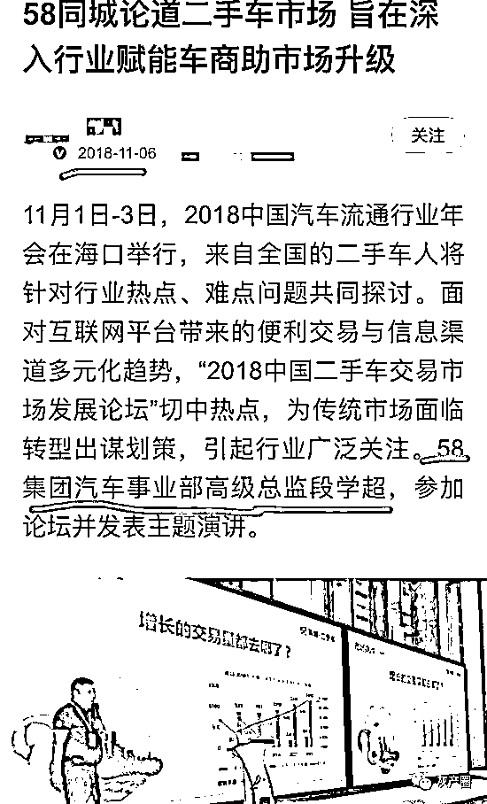

在 2020 年 7 月份的报道中，查博士也被冠以 58 的前缀。种种迹象表明，查博士与 58 有这几位紧密的关系。

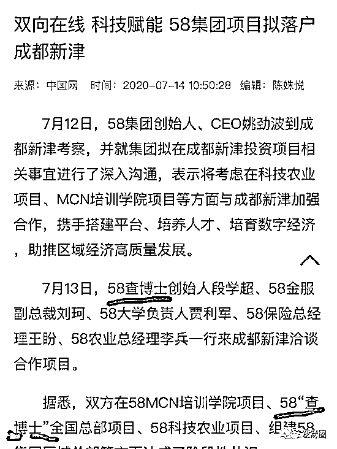

对于 58 同城来说，由于二手车起步业务较晚，也许为了避开与优信、瓜子二手车等正面竞争，58 选择从汽车数据服务平台开始，为以后二手车的业务积累流量。

在服务上，查博士和 58 是互相打通的，通过 58 能够使用查博士提供的“维保查询”功能。查博士也有绑定 58 账号的选项。

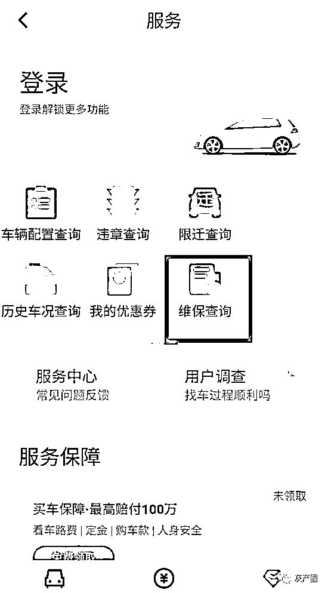

58 App 页面

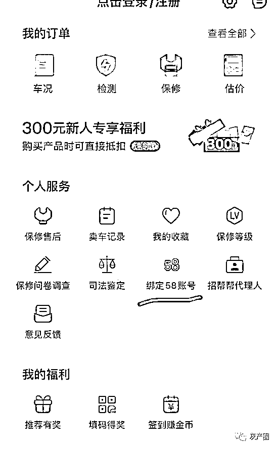

查博士 App 页面

而就在这一赛道上，查博士也遇到了强劲的对手“车鉴定”，并引发了一场卧底丑闻。

查博士曾现“卧底丑闻”

派遣员工到竞对窃取信息

就在丛林掌权期间，查博士被曝出卧底丑闻。

2017 年，有媒体报道称， 查博士员工王某以每月 4000 元报酬，在 2016 年 7 月派遣 90 后女生张某到车鉴定上班，并要求张某给自己发送车鉴定的客户信息等公司内部资料。八个月后，张某被车鉴定发现而暴露身份。

据悉，张某定期向查博士提供车鉴定内部运营数据、商业活动策划方案、定价策略、大客户名单、联系方式、充值记录、查询数据等商业秘密和信息。

查博士，车鉴定，分别是两款二手车信息服务类 App，存在竞争关系，分别属于两家公司：北京酷车易美网络科技有限公司和北京泰格斯信息技术有限公司，不过车鉴定成立要比查博士要早很多。

据工商资料显示，车鉴定成立于 2011 年，法定代表人为翟耀纲，注册资本 500 万元，主营业务是为用户提供车辆维修保养历史记录和相关信息查询，在二手车交易中其平台数据成为参考依据。

对此，当时 58 同城回应称，“查博士目前是独立运营，从 58 层面我们不予置评，以法院流程为准”。

据《等深线》报道，在卧底事件被发现几天后，在 2017 年 2 月 14 日丛林联系车鉴定的联合创始人、COO 康金良，并表示道歉，“这事儿办的不漂亮”。

当时康金良问丛林是不是代表查博士，丛林却称自己无法代表查博士，姚劲波才可以。

2017 年 2 月 15 日，车鉴定以公司名义向朝阳区人民法院发起诉讼获得受理，车鉴定诉酷车易美不正当竞争。

车鉴定认为，查博士获取其客户名单和相关信息，并开展疯狂营销，通过大打价格战甚至赠送短期免费服务的方式，致其客户流失，严重损害车鉴定的商业利益，构成不正当竞争。因此，对查博士及卧底员工提起诉讼，要求停止不正当竞争行为，索赔 2000 万元。

而在 2017 年 3 月 2 日晚间，丛林在接受《等深线》采访时称，“这就是互黑，不存在的事情嘛”，并不属实，已交律师处理，等待法院判决。

2018 年 6 月，该起诉讼有了一审判决，北京市朝阳区人民法院做出一审判决，判被告查博士立即停止涉案不正当竞争行为，赔偿车鉴定 130 万元。并且查博士要在财新网连续等在 30 日声明，给车鉴定公开消除影响。

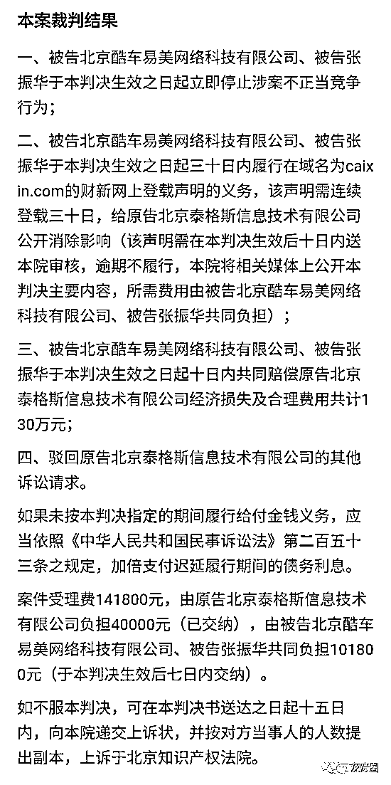

不过，车鉴定和查博士均对一审判决不服，后向北京知识产权法院提起上诉，但在二审期间，双方达成和解并撤回起诉。

泡水车作出“无泡水承诺”

查博士曾涉嫌联合车商坑害消费者

在消费者投诉平台“黑猫投诉”上，近日关于“无法退款提现”的投诉不少，有人是检测失败要求退款，有人认为查博士的检测结果与实车不符要求退款。

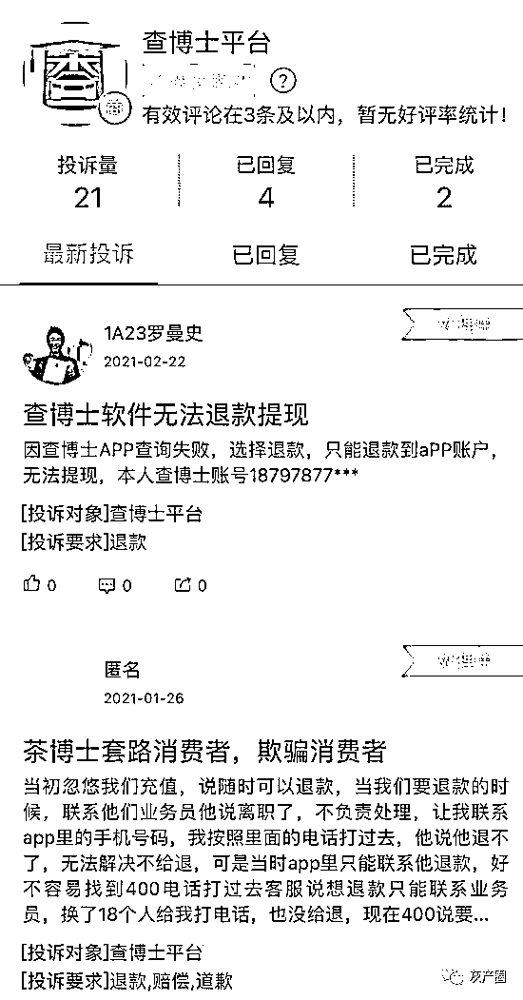

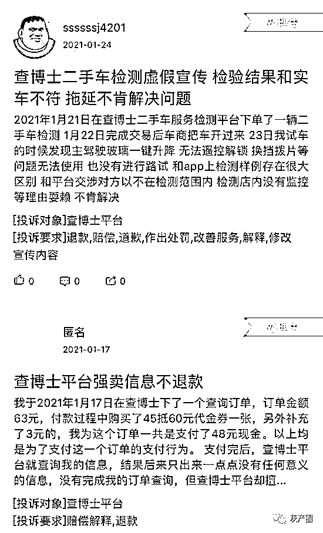

而此前，查博士还被消费者告上了法庭，原因是涉嫌联合车商欺骗消费者。

2020 年 1 月，中国裁判文书网发布《王潇与大同市金保惠汽车服务有限公司、大同市阳光喜人汽车服务有限责任公司等产品销售者责任纠纷一审民事判决书》。

判决书显示：2019 年 3 月 18 日，原告与被告金保惠汽车签订了《协议合同书》。该协议约定原告以 18 万元，购买被告的白色大众 CC 二手车。

根据原告陈述，被告金保惠汽车在门店中醒目位置张贴店堂告示：“无火烧车、水泡车、事故车”，且被告查博士出具的《查博士事故保协议》中明确做出案涉车无重大事故，无火烧，无泡水的保障承诺。

2019 年 5 月，原告发现该车辆在驾驶过程中有异响、空调不能用等情况遂去修理厂修车，维修师傅告知原告该车辆可能是泡水车。

随后原告于 2019 年 5 月 25 日去查博士复检，但查博士一直未出具检车报告。后原告通过其他机构对涉案车辆进行了鉴定，结果表明：案涉车辆为泡水车。

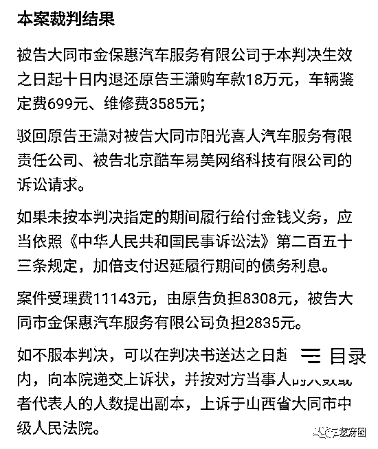

最终法院认为，被告金保惠公司将泡水二手车，以 18 万元的价格出售给原告。原告主张由被告金保惠公司返还 18 万元购车款，并赔偿车辆鉴定费 699 元、维修费 3585 元，有法律根据，予以支持。

来源：三言财经

← 向右滑动与灰产圈互动交流 →

