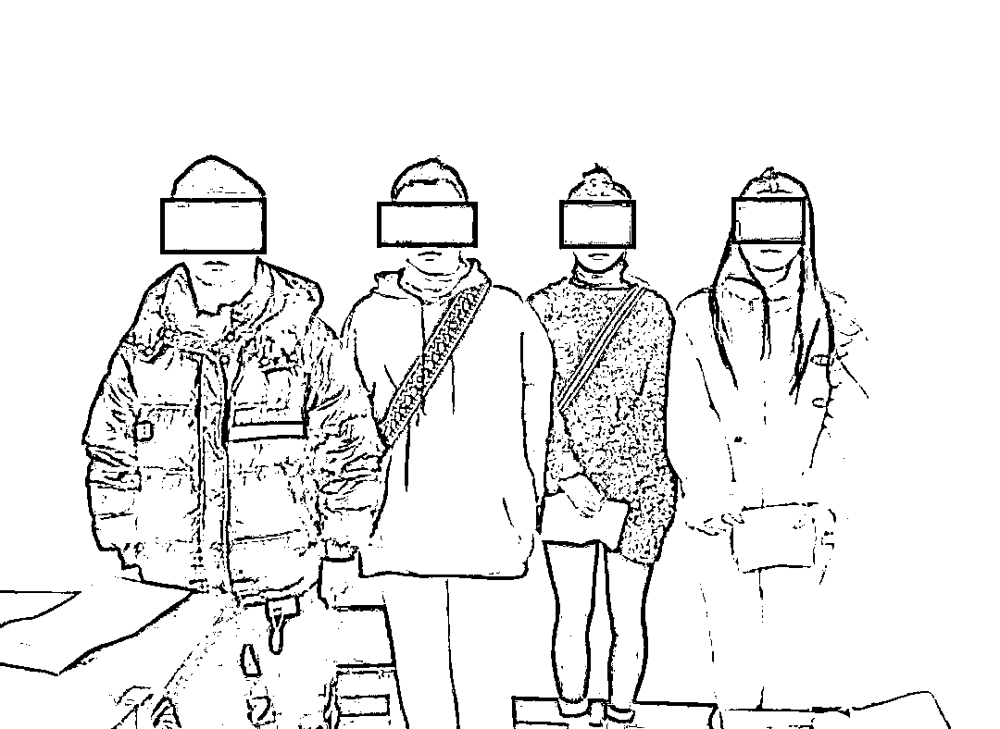
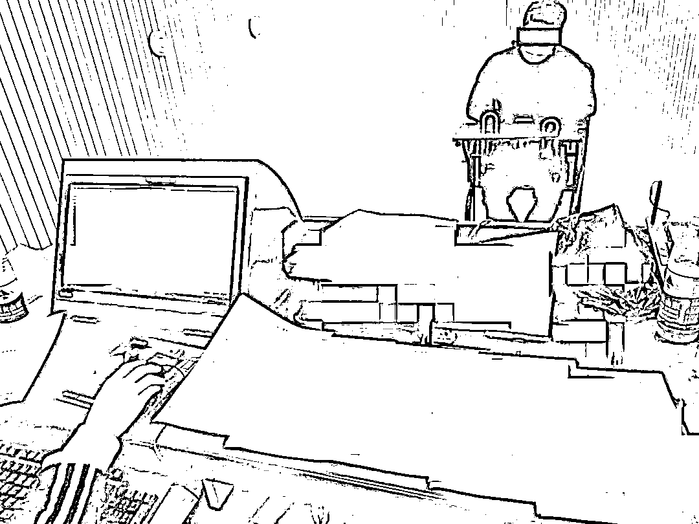
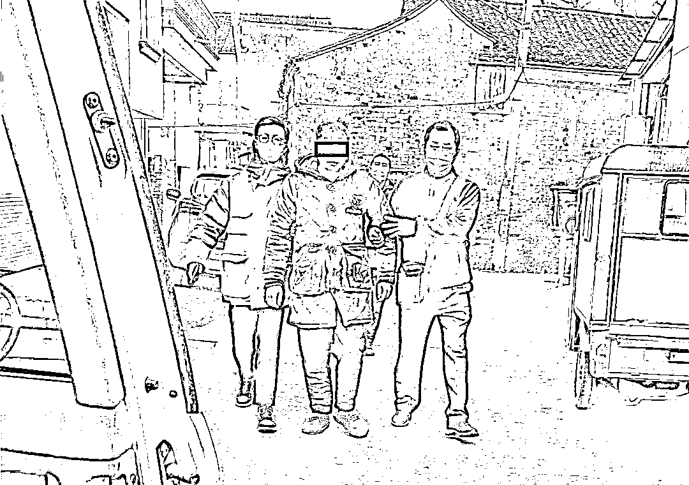
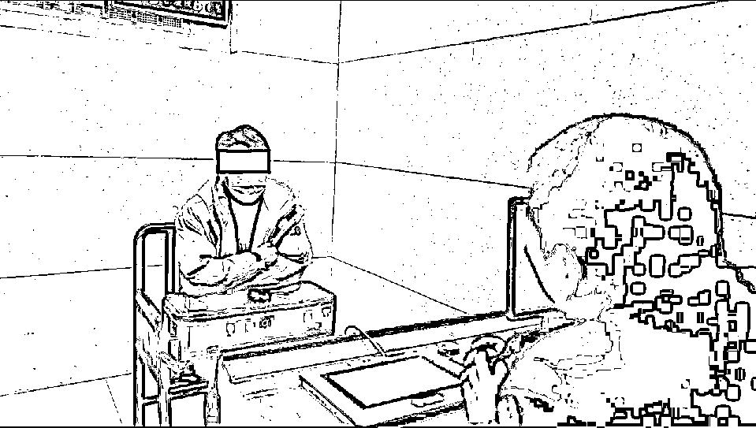

# 超 1.1 亿！14 人被抓！就是这些人，帮犯罪集团干黑活！

> 原文：[`mp.weixin.qq.com/s?__biz=MzIyMDYwMTk0Mw==&mid=2247510499&idx=5&sn=04b4ed8177c52f820f8e26cb0aa80784&chksm=97cb62dba0bcebcd34971489fe8776bd1caad43b52f8e60734821e9edacf2ed42891fd703518&scene=27#wechat_redirect`](http://mp.weixin.qq.com/s?__biz=MzIyMDYwMTk0Mw==&mid=2247510499&idx=5&sn=04b4ed8177c52f820f8e26cb0aa80784&chksm=97cb62dba0bcebcd34971489fe8776bd1caad43b52f8e60734821e9edacf2ed42891fd703518&scene=27#wechat_redirect)

近日，椒江公安分局发布一起案件

铲除黑灰产业窝点***2 处***

抓获犯罪嫌疑人***14 名***

冻结银行卡***50 余张***

涉案流水达***1.1 亿余元***

 **1 月中旬 **

白云派出所民警在梳理案件时发现：2020 年 4 月份，市民金某被网络刷单形式骗走 25000 元。经过对案件的重新分析，发现厉某等人（天台人）存在重大作案嫌疑，涉案银行卡每天流水高达数十万至几百万。

案件上报后，分局立即组织反诈中心、网警等部门开展侦查。初步确定了犯罪团伙的组织结构及窝藏地点。

2 月 17 日，民警直奔天台，厉某等人落网。

厉某交代，去年 3 月份，初中同学於某找到他，让他以每套 300 元的价格办理几套银行卡，然后卖给於某用于网络赌博、诈骗。当时厉某正好缺钱，同学又找上门，就答应了。

民警立即动手，抓获犯罪嫌疑人於某。在证据面前，於某交代，自己以每套 300 元的价格收购了 20 多套银行卡，并再以每套 1000 元的价格转手卖给他的朋友丁某。民警顺藤摸瓜，连续作战五天五夜，陆续将丁某等 10 名犯罪嫌疑人全部抓获归案。

经查，丁某自 2020 年以来，通过和诈骗分子勾结，向於某等人低价收购手机卡、银行卡、u 盾、身份证复印件等物，以每套七八千元的价格贩卖给诈骗分子，从中抽取佣金，共非法获利 50 余万元，帮助电信网络犯罪团伙转移涉案资金 1.1 亿元。

目前，丁某、於某等 14 名犯罪嫌疑人因涉嫌帮助信息网络犯罪活动罪被采取强制措施，案件仍在进一步侦查中。

▶▶▶▶

“实名不实人”的电话卡和银行卡，不但会被犯罪分子用来实施电信诈骗，还会用来进行网络诈骗、网络赌博、洗黑钱等违法犯罪活动，而这些钱大部分都是通过买卖的银行卡走账，难以追查和打击。

普法

时间

➤ **买卖银行卡是违法行为，可能涉嫌犯罪。**

**《中华人民共和国刑法》第 177 条规定**，非法持有他人信用卡，数量较大的；使用虚假的身份证明骗领信用卡的；出售、购买、为他人提供伪造的信用卡或以虚假的身份证明骗领信用卡的， **涉嫌妨害信用卡管理罪**。

最高法、最高检 2019 年联合发布的 《**关于办理非法利用信息网络、帮助信息网络犯罪活动等刑事案件适用法律若干问题的解释**》明确，出售、出租、出借银行卡或支付账户为犯罪分子利用信息网络实施犯罪提供帮助， **可能以涉嫌帮助信息网络犯罪活动罪追究责任**。若情节严重，如为三个以上对象提供帮助的、支付结算金额 20 万元以上的、违法所得 1 万元以上的等，可处三年以下有期徒刑或者拘役，并处或者单处罚金。

防范

时间

① 妥善保管好自己的身份证、银行卡、网银 U 盾等账户存取工具，保护好登录账号和密码等个人信息，对于废弃不用的银行卡，应及时办理销户业务，并将卡片磁条毁损，不随意丢弃。 

② 不出租、出借、出售个人银行卡、身份证和网银 U 盾等账户存取工具，以免造成更大的经济损失，并承担法律责任。 

③ 一旦发现买卖银行卡的犯罪行为，应及时向公安机关举报，配合公安机关或发卡银行做好调查取证工作，共同维护公平诚信的良好社会秩序。

请广大市民群众

**务必提升个人信息保护意识**

**不为了蝇头小利而被骗子利用**

来源：台州公安，利箭在出击

← 向右滑动与灰产圈互动交流 →

