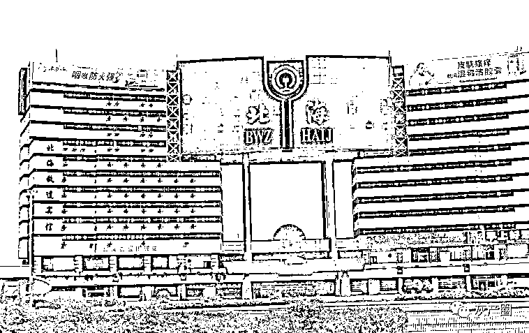
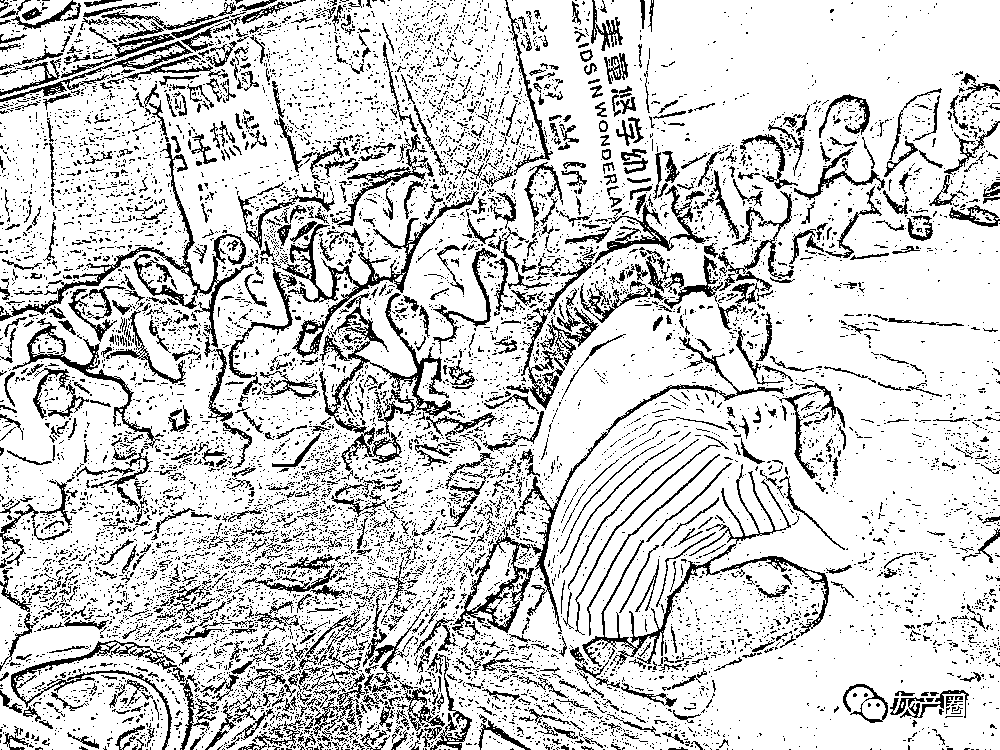
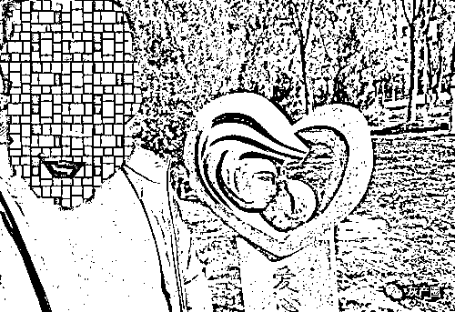
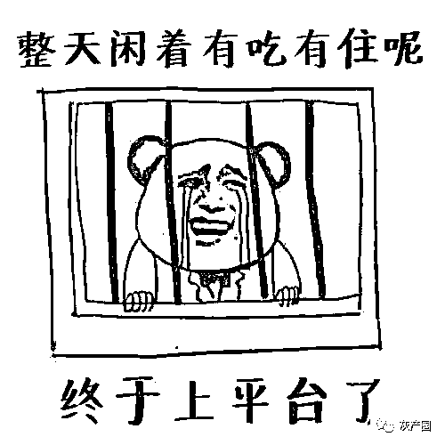
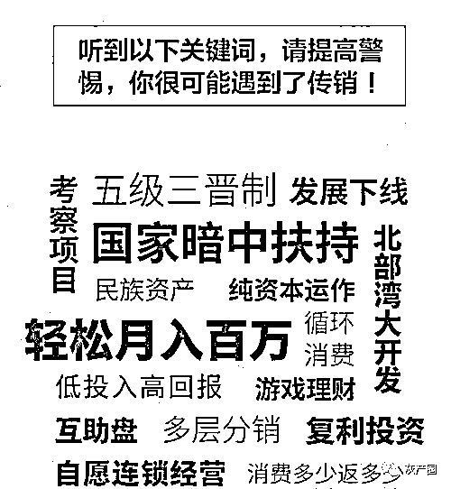
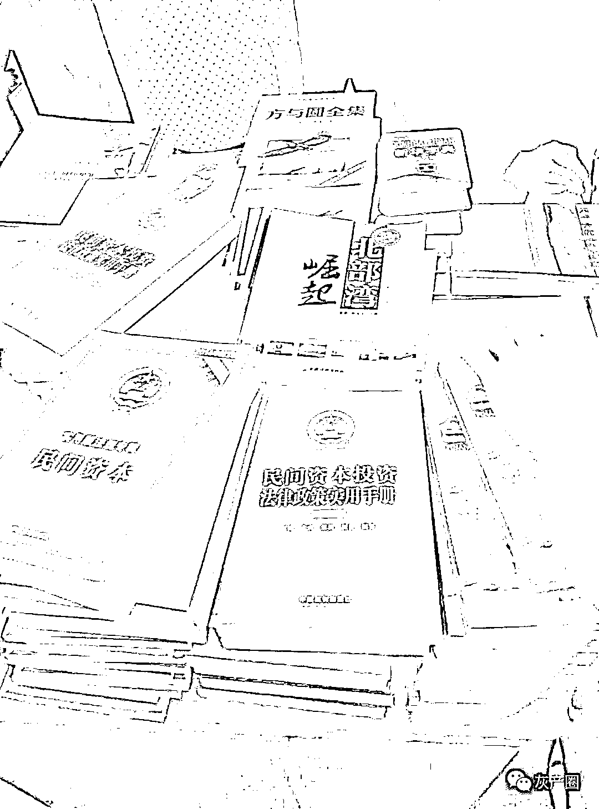
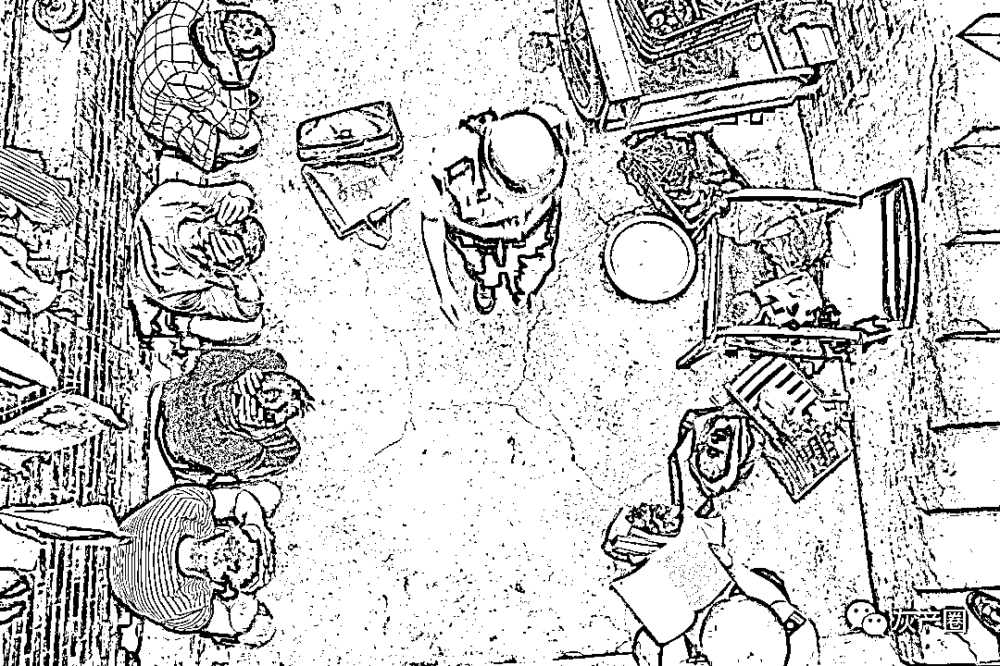

# 亲 历 | 南 派 传 销

> 原文：[`mp.weixin.qq.com/s?__biz=MzIyMDYwMTk0Mw==&mid=2247510562&idx=1&sn=f8ce4c2dca51f56ee4d3574bbd50080e&chksm=97cb611aa0bce80cc95983690770601dc7dcfd5c362d85c583e33f2ccdb6eaa9cc52637f6efd&scene=27#wechat_redirect`](http://mp.weixin.qq.com/s?__biz=MzIyMDYwMTk0Mw==&mid=2247510562&idx=1&sn=f8ce4c2dca51f56ee4d3574bbd50080e&chksm=97cb611aa0bce80cc95983690770601dc7dcfd5c362d85c583e33f2ccdb6eaa9cc52637f6efd&scene=27#wechat_redirect)

我曾进过南派传销组织，也很庆幸遇上的是文明的南派，南派基本上是以精神控制为主，很少采取暴力手段。与其相对的是把人骗到荒郊野外，暴力囚禁，不给钱就殴打北派传销。

那时我刚刚大学毕业，不知道为什么走了狗屎运，被一家不错的国有企业录用了，第一天报到时，就发了一部「小灵通」手机。

领导严肃地对我说，发「小灵通」不是乱搞福利，而是工作需要，这样可以保证随时能联系到我，当然了，每个月还给我报销 100 元话费。

我拼命点头，感觉他说啥都对。

这可是个好单位，我得珍惜，于是每天勤劳得像个小蜜蜂，不是在打水，就是在拖地，要不就是在认真学习……

有一天早晨，我突然接到了一个高中铁杆同学的电话，故事就这样猝不及防地开始了，一段奇幻的人生漂流拉开序幕。

第 1 幕·有熟人带着好事来找你

就在我活在虚幻的幸福中，开始人生美好前程的时候，一个电话改变了我的人生轨迹，让我有了重新出发的冲动。

电话是我高中时候的老铁打来的。我们铁到什么程度呢？如果不是身高不一样，我们都能穿一条裤子，妥妥的。

我们同吃、同住、同学，星光闪烁的夜晚，一起在操场上漫步，讨论的全是人类向何处去的话题。唉，谁没有年轻的时候呢？

高考结束以后，大家风流云散，各奔东西。

后来听说他去了广东，再后来就失去了联系。我们姑且叫他小高。

电话接通后，我听着这个熟悉的声音，开始有些激动，好兄弟终于又联系上了，如同我们当初永不分离的誓言。

「班长，你最近在哪里高就？」

「我刚毕业，刚到一个国企。这么多年不见，你死哪儿去了？」

「哈哈哈，我现在在广东的一家工厂做主管，我们主要生产电子元器件。你知道，南方这样的工厂很多。」

「高中毕业以后，你就去那儿了吗？」

「对啊，我考得不好，后来就南下打工，这些年一步一步打拼，终于到了主管这个位置。」

我当时嘴贱，顺口问了一句：「主管拿多少钱？」

他说：「大概一个月 6000 多元吧。」

听到这个消息，我如五雷轰顶，突然就明白了一句老话——「人比人该死，货比货该扔。」老子辛辛苦苦读几年大学，本来已经觉得春风得意马蹄疾了，没想到骑的是一匹瘸腿的六级残废马。

「你一个月多少钱工资？」他问。

「1000 多元吧。」说这个数的时候，我就像当年洗澡时被他们拿走了内裤一样羞愧难当。

他立刻为我打抱不平，说：「班长啊，像你这种人才，拿这点儿钱太委屈了。你要是在我们这儿，少说也得 1 万元。」

还是老同学了解我呀，我心潮起伏地想。

他说：「我最近比较忙，今天特别想你，就给你打个电话。我要去忙了，回头再细聊，有时间给我打电话，这是我的电话。」

事后来看，这是传销团伙的第一步，选择身边最熟悉的人下手。原因无他，因为这些人对他们不设防，最容易得手。

我想说的是，各位亲人啊、朋友啊、亲爱的你们啊，要警惕啊！如果你接到一个久未谋面的同学的电话，不管你们过去的关系有多亲近，只要他嘘寒问暖地了解你的近况，之后又吹嘘自己小有所成，这个时候你就要警惕了，这很有可能是一个陷阱的开始。

我当时就着了道，挂了电话之后，整个人都蔫儿了。

你看，小高落榜以后，都能打拼出一片天地，在那里发展那么好；我作为一名青年才俊，一个月才拿 1000 多元，如果去了南方，现在每个月都 1 万多元了，怎么想心里都很委屈。

就像潘金莲不小心把叉竿掉在窗外，恰好遇到西门大官人一样，我开始心猿意马。

各位，这往往是骗子行骗的前奏，虚构出一个让你向往的幻境，打乱你的第一道心防，慢慢激发你人性中的贪婪。

过了几天，小高又给我打电话了：「你今天忙吗？」

我早已被他的精彩故事吸引住了，想都没想就说：「今天不忙，我们详细聊一聊。」

你看，骗子还没挖坑呢，自己就想往里跳。

他说：「班长，今天我们不聊工作，就是叙旧。你看，当年咱们在一起的时候，你是多么雄姿英发、羽扇纶巾啊，我们一起指点江山，激扬文字，粪土当年万户侯！」

「是啊。」他的这些话，把我带回到那段理想主义的岁月。

「班长，这个世界上能让我佩服得五体投地的人可能就只有你了，你那时身无分文，却心系天下，思考人类向何处去，境界老高了。」

各位，不瞒你们讲，我已经开始飘了。这样一来二往，我这位小高同学借着叙旧的名义，把我灌得五迷三道，成功把我拉进他预设的局中。

这是第一个阶段——做局，请君入瓮。

后来，他再打电话时，装作漫不经心地说了一句：「班长啊，我上次打完电话之后，跟我们老板说了你的情况。老板特别欣赏你这种人，他说如果将来有机会的话，可以来一起工作。」

是吗？我的天哪！你们老板太有眼光了！

他说：「正好我们原来的厂办主任升职了，老板需要个新的厂办主任，我跟他说你的协调能力特别强。机会难得，你可以考虑考虑，厂办主任的收入大概税后 1.2 万多元，加上年终奖什么的，能到大概 1.5 万元。」

我的小心脏开始怦怦直跳，各位，你能理解一个月薪 1000 多的青年突然要涨薪到 1.5 万多元的心情吗？

我内心那头沉睡的贪婪巨兽突然间醒来了，生龙活虎地在灵魂里走来走去，驱赶着我，撕咬着我，逼着我走向那个神奇的远方。

事后想一想，一个大工厂的厂办主任能叫你这么一个初出茅庐的小伙子去干？你究竟是三头六臂还是神通广大？但是，这些都不重要了，我已经主动钻进了对方的精神催眠体系里，不需给饵自咬钩，主动往上扑。

我说可以过去考察一下。小高最后说：「那好，你来了可要多待几天啊，正好咱们叙叙旧，聊一聊，方便的话就相当于旅游。我给你安排好。还有，你要一个人来，这种机会就不要轻易告诉别人了。」

「好好好，放心，放心！我嘴严得很！」

这就到了第二个阶段——邀约。

别人的邀约可能需要铺陈许久，我的邀约是主动给人家发出的。干工作积极，上当受骗也是非常迅速，毫不含糊，咱就是这样的利索人。

我果断向单位请了长假，说是请长假，其实是准备一去不复返。

我把当时手中所有值钱的东西都变卖一空，比如那个崭新的「小灵通」，一跨省就不能用，于是低价卖给了别人。

再加上自己若干年打拼的积蓄，加起来大概 500 多元。都说人穷的时候智商会下降，看来是有道理的。

我把这些钱存入存折，带着毕业证、身份证等证明我是我的资料，一个人快意地踏上了南下的列车，开始了一段「年轻我们的奇幻漂流」。

其实踏上火车那一刻，我已经想好了，下了火车之后，我一定要像伟大的邓小平先生一样，先在那里画一个圈，让它堆起座座金山银山。

你看，年少就是这么轻狂。

第 2 幕·进了传销窝，先把证件交上去

出发前，我给那哥们儿发了一个传呼（年轻人如果看不懂「传呼」是什么，可以自行百度），跟他说哪一天几点几点到。

结果一下火车，我就看见哥们儿带了一个姑娘在等着迎接我。这混得真不错，爱情事业双丰收。

但看那姑娘，长得就像南国的铁树，棱角分明。总的来说，她是一个让人望而生畏的姑娘，是一个让人愿意与之远远保持距离的姑娘，是一个永远不会让你产生邪念的姑娘。

我说：「这个就是弟妹？」「NO，NO，NO！这是我的同事，你不要乱说！」小高越这么说，我就越觉得他俩肯定是恋人，只是不好意思承认。

他说：「我已经把酒店给你安排好了，去住吧！」我一看，真够哥们儿啊，于是我们就七拐八拐地到了附近的一家酒店。

虽然那地方自称是酒店，但在我看来，那是我从小到大见过的最单薄含蓄的地表建筑物了，上面只是象征性地有个房顶，四面像纸糊的一样，看上去环保透气。

我一个人进去之后，他俩就几乎进不去了，房间太小了。

就这样，他俩半探着身子在门口跟我聊了半天，说的都是「跟单位请假了吗？办得怎么样啊？」诸如此类的闲言碎语。后来他们说道：「出去吃个饭吧，正好叫了几个同事。」

我说：「太麻烦了，咱们自己出去吃就行，别叫同事了。」结果，吃饭的时候就来了他们一个所谓的领导。这个小哥倒是能言会道，问我：「你是怎么来的？」

我说：「我是请假来的。小高同学是我铁哥们儿，我特别相信他的话，这次是准备扎根南国这方热土了。我一来就看到了这高高的椰子树，看到了这高大浓密的大榕树，这浓郁的南国风情一下子就把我这个文艺青年给征服了。我愿意扎根南国，永不北上！」

领导听了我这个表态之后，很满意，说：「这个小伙子还是不错的啊！」

到了第二天，小高说：「你第一次来，带你转一转。」我一想这个要求很合理，但这次他来的时候不对劲儿，因为他带来了新的姑娘。

这姑娘长得像一棵椰子树，非常高，也非常平，根本爬不上去。这样说有点儿不厚道了，总的来说，也是让人感觉望而生畏，不容易亲近。

他后来又陆续带来了几个姑娘，但给我的印象都不是特别好，感觉好像他把全世界需要拯救的剩女都集中在他们工厂了。

我说：「你怎么又换女朋友了？」

「哎呀，你开什么玩笑？这是我同事。她今天休假，正好出来陪陪你。」

「不用陪！我们转转就是了。」

我们参观了当地的公园。到了晚上，又来了一个领导跟我吃饭，然后把我的生辰八字、家里情况又问了一遍。

我不明就里呀，就又给他说了一遍我的决心。他也认为我是个可造之才，所以，这两顿饭吃得很愉快。

到了第三天，小高带我参观了当地几所高校，看了几处繁华的建筑，告诉我：「你看，这里多好啊，经济发展很快，我们身处改革开放的最前沿，这方热土成就了无数的财富传奇。」

我说：「对，我知道，我们也要成为传奇当中的一员！」我后来发现，在上钩的过程当中，我基本上处在不需扬鞭自奋蹄的状态，见坑就加速助跑往里跳。

所以，他们对我的接纳是非常融洽的，认为我这个人特别好交往，从没见过我这种傻子。

到了第四天，他们终于说：「要不你到我们宿舍住吧，条件差一点儿，你不要嫌弃。」

我说：「这没什么，都是苦孩子出身，露天野营我也干过，再苦的条件都不怕。」

他们一看，这哥们儿真行啊，是标准的传销好苗子。

所以，他们就带着我到了宿舍。那是一个三居室，一进门，小高就跟我说：「把你的行李、书包、钱包、身份证、毕业证什么的都给我吧，你别出去搞丢了。」

各位，你们看一下，在你对他们完全不设防的情况下，他提这个要求，你会觉得很自然，甚至觉得他特别贴心。

所以，我怀着感恩的心情，把证件、钱包等全部家当，包括里面有 500 多元的存折，全部交给了小高。

这都不重要，重要的是，一进门就有两个女孩子热情地迎了上来，对我大叫一声：「哇，靓仔！」

跟各位说句实话，从小到大，长得靓是我最隐蔽的一个优点，只是从来没有人发现过这个优点，只有我自己知道。

你想想，在这千里之外，素未谋面的两个女孩子一见面，就把我人生最深处的秘密给说了出来，你说我是不是特别感动？

「哈哈，嗨！你们怎么知道我是靓仔？谢谢！」我特别高兴，觉得这个团队真的很有爱，真的很温暖，于是说：「老同学啊，你这儿真不错，工作不错，连同事关系都那么好。」

话还没说完，这两个姑娘上来，一人一只脚，搬着就给我脱鞋。

「哎！干吗，干吗，干吗？停，停，停！」

「靓仔，我们给你洗洗脚，你这一天辛苦了。」

「美女，请听我说，淡定，淡定。我，我的脚特别敏感，最怕别人碰，别人一碰的话，我就会大笑而死。」

「靓仔，你说的是真的吗？」

「说的是真的，我自己来，谢谢，谢谢！」

…………

吃饭的时候，我记得大概就是一荤两素配白米饭。这帮人边吃边说，小高在团队里面如何优秀，在工厂里面如何受领导重用，受同事爱戴，现在做主管，很快就要高升了。

这是第三个阶段——圆谎。

各位，你要知道，现在这一圈人里面，就我一个「傻子」了，其他的都是明白人。他们之所以要圆谎，为的就是把我带入一个更大的谎言当中。

你想想，多可怕啊，他们所有人都在合伙骗一个人，这个人除非是大罗神仙，要不然真的很难不上当。我对他们的话深信不疑，感觉美好的未来正在徐徐展开，全然没有考虑一个月薪 6000 多元的主管这些天一直带着我吃米饭。

食无肉，行无车，住纸糊屋，这些都是明显的破绽，但是都被我用「平易近人」的理由给忽略掉了。

吃饭的时候，有一个穿黑背心的东北帅小哥——他是真正的靓仔，人挺拔，美丰仪——凑过来给我讲故事，说在南方，人与人之间的感情很淡漠，我说「是是是」；他说大家只相信金钱，我说「对对对」。

「我今天去银行取钱的时候，看见一个老板取了 500 万元，连眼都不眨，夹在胳膊底下就开车带走了。」

其他人都跟着说：「是吗？哎哟，这人真有钱，开的什么车？」

他说：「是一辆跑车。」大家就开始一阵唏嘘：「这种车真是太棒了！我们将来一定要努力工作变成有钱人。」

这就到了第四阶段——开蛊。

所谓开蛊，就是开始蛊惑你，组团来忽悠你，首先就是刺激你对金钱的欲望。

请注意这里是「欲望」，不是「愿望」。其实，每个人都想挣钱，但欲望是不可遏制的。

我当时没有考虑这个场景的细节，很多年以后，我从银行取了 20 万元往外走，都觉得已经很沉了；他说那个老板取了 500 万元，用胳膊一夹就走了，我觉得这根本夹不起来，除非老板是西楚霸王转世，力大无比。

这么看，抢银行不但是个技术活，也是个力气活，如果是 500 万元，估计得搬一阵儿。但是这些细节都不可考了。

当时一听，我就说：「哎，对！生子当如孙仲谋，大丈夫应该有一番自己的事业，什么金钱呀，豪车呀，都是我们人生当中的一部分！」

各位，你瞅瞅我这个人，特别适合被骗，人家还没怎么骗你呢，自己就上赶着爬到树上了，根本就不需要别人引导你。

东北靓仔和大伙儿对我的反应都很满意，基本上给出了评委们能给的最高分。这样的交流每餐都有，只是你自己意识不到，人家团队对你的攻心战已经开始了。

这就是由弱渐强地刺激你对金钱的欲望，对事业的渴望，对成功的渴望，让你欲火焚身，不能自拔。

接下来，就是让你感受到一种极度的接纳感。无论你讲什么，这帮人的回应都十分热情、真诚，让你感觉人和人之间的关系是那么的美好。

你哪怕讲了一句很烂的话，他们都会给你鼓掌；哪怕你就是一堆狗屎，他们也会给你一片土壤，让你感到身为狗屎的尊贵。

在这个过程当中，个人的意志逐渐被消解掉，所有的戒备心都悄然放下，你的防线在整个团队不动声色的进攻中，一步步被破坏掉。

第 3 幕·讲故事，做游戏，摧毁自尊是目的

#### 

事后再看，我发觉这种局面相当可怖，所有人都在算计一个茫然无知的人。他们整个团队配合默契，天衣无缝地蚕食着你所有的理性。

一次中午吃饭时，有人给我讲了一个笑话：

发大水的时候，有一个基督教徒掉到了水里，他说：「我这么虔诚，上帝一定会来救我。」这时候远远来了一艘船，要救他走。他拒绝了，说：「你们不用来救我，上帝会来救我的。」船上的人看了看，留下一句「傻帽」就开走了。

后来呢，又来了一架直升机，也要来救他，还扔下了救生索。他又拒绝了，说：「谢谢，上帝会来救我的，你们走吧。」直升机也飞走了，过了一会儿之后，他就淹死了。

淹死之后，他见到了上帝，埋怨地说：「上帝啊，我这么虔诚的人，你为什么不来救我？」上帝说：「我派人去救你了，先是派了一艘船，后又派了一架直升机，但是你不愿意跟他们走，我有什么办法呀？」

讲完这个故事，那人就问：「你听完这个故事有什么感受？」

你还别说，咱这个人就是会聊天。

我说：「这个故事给我们一个启发，当机会来临的时候要毫不犹豫地抓住。」众人一起给我鼓掌，说：「你这个人太有慧根了，太有悟性了。」

这个时候，我真的有点儿相信他们喜欢上我了，因为每次都是不等他们挖坑，自己就主动加速助跑往坑里跳。

有一天，吃过晚饭后，他们说：「咱们玩个击鼓传花的游戏吧。」

说来真是邪门，基本上都是一到我的时候，鼓声就停，这鼓声一停，就揭开一个小纸条，上面有需要回答的问题。

我后来发现，这问题里大有玄机。

鼓声停在别人那儿的时候，问题一般都是：「红军长征走了多少里？」「《西游记》里唐僧师徒一共几个？」

到我的时候，问题就变了，一般都是：「红军长征一共多少人？他们各叫什么名字？」「《西游记》里的妖怪老家都是哪里的？」

这种问题我怎么能回答上来？回答不上来就表演节目，比如说用屁股写「8」字。

大家可以体会一下，用屁股写「8」字是一个多么卖弄风骚的姿势，我这么矜持的人，怎么可能做出这种伤风败俗的动作？

所以我最后说，唱歌，讲故事都行，就这个不行。

一会儿工夫，我又被他们抓住了，你可以理解为这是一个团队围猎的过程，他们把绳索不断拉紧。

这次他们不要求我用屁股写「8」字了，改成了用嘴巴在墙上写一个「我爱你」。我觉得很肉麻，没办法执行，就在这个时候，小高同学跳出来说：「没关系，我来给大家表演。」

他跳出来，用屁股来回摆动着写「8」字，扭着脖子写「我爱你」，非常滑稽可笑。

我突然有了一种陌生感，感觉他变化挺大。上高中的时候，他是很羞涩、很内向、很厚道的一个人，这时候怎么变得这么奔放和夸张？

就在他代我表演的时候，团队的其他成员没有一个嘲笑他的，反而都给他加油鼓掌，导致我一度有个错觉，感觉这个团队还真是蛮有爱的。

其实，这是一个群体围猎的游戏，在温水煮青蛙的过程中，他们按照流程有条不紊地往前推进，激发你对金钱的欲望，摧毁你基本的廉耻感，还专门给你讲不要脸就可以成功，干大事的人都不要脸这样的道理。

大家想一想，这一日三餐都是他们洗脑的课堂，他们不断用各种模式发起围猎，一个无辜的普通人很难防御太久。时间长了，你就心志渐乱，潜移默化中有了一种见怪不怪的心态，以妄为常。

就是在这个可怕的心理渐变过程中，你慢慢有了从众心理，为了获得群体的接纳，你的行为也会慢慢向他们靠拢。

所以，短短两三天的时间，我的整个人生观都发生了偏移。

但是我也隐隐感到有些地方不对。不对在哪儿呢？就是他们带我去的地方全是那种不花钱的景点，比如大学啊，公园啊，并且他们看上去也没什么很忙的工作，主要工作是陪我。

我刚开始觉得很不好意思，后来觉得这帮人怎么没事干呢。但是直到那时，我也没想到这帮人是搞传销的。

这一晃就到了第五天，我跟小高说：「你得带我去见你们领导了，行不行给个话。你知道，我是请假来的，请了五天假，要不然假期满了，我就得回去了。」

可能经过这几天的考察，他们认为我已经过关了，所以在我提出这个请求后，他们进入了下一个环节——开框架。

什么叫开框架呢？就是找一个特别能说会道的人，给你最后的致命一击，来一个集大成的洗脑成果。

所以，小高听我说要见领导，就带我穿大街走小巷，一路左转右转，左绕右绕，来到了一栋小区里的居民楼旁边。

我这个人是傻，但不是智障啊。在他带我绕路的过程当中，我始终有个疑问——就这前后两栋楼，绕来绕去干吗？

他认为我已经被绕晕了，但万万没有想到，我到一个陌生的地方，喜欢记一些标志性的景物，这个习惯帮助了我。

绕那么多弯之后，他带我进了一个单元门，上了三楼，一推门走了进去，这是一个三居室结构的房子。

进去之后，门的左手边是一间房，房门虚掩，我往里一瞟，一屋子人席地而坐，多么熟悉的公安机关查抄传销团伙的场景啊。

这个瞬间，我的眼前犹如有一道闪电劈下，我战栗了一下，瞬间明白了自己身在一个什么样的处境里。

说起来，我到现在都很佩服那时的自己。那时候的我就是一个刚刚毕业的生涩小青年啊，但我不动声色，慢悠悠地继续往里走，以至于 10 多年后，我还想给当时的自己磕一个头——哎呀，表现得太完美了！

他们三绕两绕地把我带到最里面那一间房，有一个大姐在那里，就是所谓开框架的导师。实事求是地说，传销这个行业看来是真不行，一个美女都没有，这表明美女、资金这些优质资源非常厌恶这个高风险行业。

我一进去，大姐就做领导状，嘘寒问暖，说：「这几天过得怎么样啊？小伙子，还适应不？」

我说：「领导，都还挺适应的。」

这个时候，我的内心平静如无风的海，只是专心和她扯淡，她说改革开放，我就说南国春风早；她说国家政策，我就说党的改革路线。总的来说，两个人素未谋面，但是在这一瞬间配合得相当默契，堪称天衣无缝。

这开框架的大姐彻底被自己骗住了，认为是她滔滔不绝的辩才把我彻底征服了，我也表现得像是彻底被她征服了。

我说：「您如此年轻有为，听我同学说，您是咱们团队中了不起的人物。」

「哪里！有点儿过奖了。」她虽然很谦虚，但依然掩饰不住内心的骄傲，所以有些时候，只要牌面明了，忽悠和反忽悠，有可能会在一瞬间易位。

不等她回过神来，我就说：「考察了几天，无论从当地的风土人情——南国这片改革开放的热土吸引了我；还是我们同事的关系——那些美女都嘘寒问暖，要帮我洗脚，我都特别喜欢这里。应该说，『喜欢』这个词不足以表达我此刻的心情，准确地说，我深深地爱上了这个地方。」

大姐听到这个之后，两眼笑开了花，因为她仿佛看到一个传销界的新星在冉冉升起，她今天的开框架成功了。

就在她高兴的时候，我很谦卑地提了一个请求：「我是请假来的，现在假也到期了，我想给单位领导打个电话，正式辞职。我就不回去了，在这里扎根，在南国大干一场。」

大姐确实放松了警惕，说：「好的，你这个要求很合理，人言而无信是不对的，要诚信，和过去的单位、领导要好聚好散。」

这个时候，就看出搞传销的穷来了，大家竟然都没有移动电话。这就给我创造了一个天赐良机到楼下打公用电话。

我说：「领导，您说得太对了，我到楼下打个电话，把这事办一下。然后，我们就是一个 team（团队）了，You are my leader（你是我的领导）！」

大姐已经深深陶醉在她的胜利里，对我这个请求大手一挥就放行了，但是她依然没有忘记他们正规的工作流程，随口唤出两个身高一米八五左右的彪形大汉，让他们「陪」我去打电话。

我说：「不用不用，我自己去就行。」

「南方的治安不太好，让他们陪着你去。」

我心说只要能出这个门，我就有机会。所以，我们三个人有说有笑地下了楼，有说有笑地出了小区，有说有笑地走到了一个十字路口。

各位，这要是细说起来，我也算是粗中有细的人了，游玩的这几天，我就对周围的地形做了大致观察，发现小区旁边有一个派出所，派出所边上的路口平日里车水马龙，周边还有几个商场和广场，应该是市中心一带。

走到十字路口，我看前面有交警执勤，广场有几个保安来回溜达，心里就有了数。

过马路的时候，我停下来微微一笑，对两个陪同的大汉说：「两位，请回吧。」这两个大汉不明就里说：「不不不！我们陪着你去，保证你的安全。」

我说：「两位，只要你们不跟着我，我就安全了。从现在开始，你走你的阳关道，我走我的独木桥，可好？」

两个大汉这时候才发现事情不对劲儿，勃然变色，一前一后地逼上来说：「你什么意思？把话说明白。」

我说：「我已经把话说得很明白了，你们干的什么勾当，我十分清楚。但是我告诉你们，我不想干这个事情。」

他们两个一前一后，像熊大和熊二一样，气呼呼地说：「你有没有想过说这话的后果？」

我说：「想过了，但是你们俩有没有想过，如果你们谁敢再往前走一步，动我一下，我会毫不客气地立刻反击。中国人就喜欢看热闹，你们俩在 30 秒之内是不可能把我制服的，信不？」

他俩看了看，感觉在 30 秒内的确不可能制服我。就在他俩迟疑之间，我说：「30 秒之内，中国人会围成一个看热闹的圈，信不？前面的交警、路上的巡警、广场的保安都会过来，信不？」

熊大和熊二看了看四周，信了。

我说：「然后你们就会被迅速地顺藤摸瓜一锅端了，信不？」两个大汉听到这里，脸色开始发白，可以看出来他俩基本是属于四肢发达、头脑简单类型的。

这几个逻辑推演过后，他俩明显底气不足了。我发现多读书还是有用的，两个大汉被我这几句话镇得原地不动，呆若木鸡。

我说：「两位，赶紧走吧。把我的同学叫来，我就跟你们拜拜了！」

两个大汉说：「好，算你狠，你等着。」

两个人风一样回去报信了，我站在原地等小高来。我为什么没有立刻走呢？大家别忘了，我的所有证件，还有那 500 元的「巨款」，都放在他们宿舍里呢。

我现在身无分文，连个证件都没有，想走也没有办法。

我现在就盼着小高出来，好说服他一起走。但是，令人不安的是，他好像人间蒸发一样，再无影踪。

过了一会儿，从小区里急匆匆地奔出来两三个人，过来说：「咱们中间是不是有什么误会？」

我说：「几位，误会这个事就不要再说了。我劝你们放聪明一点儿，赶快把我同学叫来，把我的钱包、身份证、毕业证这些还给我。大家一拍两散，井水不犯河水。」

他们说：「你误会了，其实我们不是搞传销的。这几天你没看到吗？我们做的是正规生意。」

「哎呀，几位就别再啰嗦了，没有什么意义，你们赶快回去吧。」我一边说，一边从小区门口往外走，走过了繁华的十字路口，来到了农业银行附近，因为我看到这地方有摄像头。

大家以后出门在外，也多一些安全意识，在这种有公共摄像头的地方，不法分子一般不敢乱来。果然，他们看我决心已定，相互看了看，其中一个人悻悻地走了。

这是上午九点钟左右的事情，此时的街头车水马龙、人群熙攘，看上去岁月静好。

这个时候我特别想让小高来，但心里全无怪他的意思，以我对他的了解，他应该是一时鬼迷心窍。我想带他一起走。

但是，他一直没有出现，我也不敢轻举妄动。就在双方的尴尬僵持间，来了几个姑娘，就是前几天的那几位「靓女」。

她们一见面就悲戚地说：「靓仔，你是不是想抛下我们走？」我说：「是，人各有志，不能勉强，赶快让我同学来，咱们好聚好散。感谢大家这几天对我的关照！」

几个姑娘上来又摇我的胳膊又晃我的手，我说：「几位，男女授受不亲，不要动手动脚的，请大家自重。」

那几个姑娘发现美人计不起作用，其实她们哪里知道，不是美人计不起作用，而是来的根本都不是美人。

再后来，对方画风突变，不知什么时候来了一个身高一米六左右的「彪形大汉」。他穿着小背心、趿拉着一双人字拖，跑到我跟前说：「你晓得这是在谁的地盘上吗？」我一听，怎么开始讲黑话了？

「我晓得，在中华人民共和国的地盘上。」

「不是，答错了，是在我们的地盘上。你晓得前两天新闻上那个被卸了胳膊的人胳膊是怎么被卸的吗？」

「我晓得，用刀卸的呗。」

「我告诉你，是我们卸的。」

「哦，是你们啊，明白，你们这是要去投案自首吗?」

「别打岔，你晓得如果今天不配合我们，会有什么后果吗？」

「晓得，会被你们打死。」

「哎，明白人，现在跟我走。」

我当时就特别奇怪，如果要派人恐吓我，那就应该派刚才那一米八的小伙子，这样我觉得还是有点儿威慑力的。派这个一米六左右的小哥来是什么意思啊？

我没有说话，慢慢走到他前面，低下头，感觉隔了好远地俯视他；他倔强地仰着头，仰视着我，我们四目相对，火花四溅。

我一字一顿地说：「你——给——我——滚！」他仰视着我，突然感到很无奈，扭头趿拉着济公式的拖鞋就走了。

就这样，他们来了一拨又一拨人，劝我「弃暗投明」「共图大业」，我就背靠银行「舌战群儒」。

时间慢慢到了正午，我突然意识到，他们最终的战略意图根本不是说服我，而是拖垮我。

这时候，他们还假模假样地给我送饭，被我给拒绝了。太阳一点点向西落去，我更加明白了，他们原来打的竟然是一场消耗战。

因为过了六点，警察就结束执勤了，银行也下班了，街上会变得空荡荡，只剩下我自己。显然，那才是最危险的境地，双方毕竟已经撕破了脸。

明白这个问题之后，我顿时一身冷汗，心想：「不行！战术必须调整，必须做出改变！」

眼看天色将晚，我鼓起勇气跑到街边的公共电话摊，操着一口山寨到令人发指的广东话跟摊主说：「雷好（你好）啊，我想打个电话啦，但是钱包丢了啦，我让同学送钱过来付话费啦，你看行不行啦？」

你还别说，那哥们儿还挺仗义的，他的口音非常像电影演员吴孟达：「好啦，出门在外，请讲普通话啦，你打啦！」

我立刻拿起电话，给小高打了一个传呼：「五分钟，如果你不出现的话，我立刻报警。如果不相信，你们可以试试看！」

我把电话挂了，很酷。

这个大哥看了我几眼，目光颇为复杂——不是说丢钱包吗，怎么还报警呢？但是电话已经打出去了，他也懒得管了。

也许是我这一天不屈不挠的卓越表现彻底征服了这个传销团伙，也许是最后这个电话起了作用，总之不论什么原因，五分钟之后，小高神奇地出现了。

我跟他说：「小高，我首先跟你讲几句话，你不要说话。第一，我不恨你。以我对你的了解，你应该是为我好，是不是？」

小高说：「是。有福同享，有难同当，才是好兄弟。」

我说：「我对这一点深信不疑，丝毫不质疑你的动机。第二，我认为这是传销，不是正经事业，你现在跟我一起走。第三，如果你不走，请把我的证件、钱包等等拿给我，好吗？看在咱们过去兄弟的分儿上。」

他有些犹豫。实事求是地说，我刚才说的不是违心话，我到现在都不恨他，因为很多年之后，我们又见面了，当时他已经脱离那个体系了，兄弟们把酒言欢，一笑泯恩仇。我对他的人品和出发点一直没有怀疑过。

我一直认为，他因为太老实忠厚，被人给洗了脑。他的确相信这是一个发家致富的机会，他太想成功了，也太想拉着我一起成功了。

所以我讲的这几句话都是肺腑之言。我说：「你现在就跟我走，别人有没有限制你的人身自由？」

他说：「没有，你看我现在是自由的。」

很庆幸，我当时遇上的是南派传销，这个传销组织的特点基本上是以精神控制为主，很少采取暴力手段。与其相对的是北派传销，特点是以帮找工作的名义，把人骗到荒郊野外，暴力囚禁，不给钱就殴打，死伤众多。

不幸中的万幸，我碰到的还是比较文明的南派，大家做事还是有底限的，求财嘛，干吗要打人？所以小高说：「我很自由，但是我坚定不移地相信这个事情，你千万不要放弃，都已经来了，为什么不试一把呢？」

我说：「有些事情是可以试的，有些事情是没必要试的。这个事情有无数惨痛的案例摆在我们面前。现在，我给你两条路，我们一起走，还是好兄弟；或者，你把我的身份证、钱包什么的都拿来，再给我取 300 元，这个事就翻篇了，我们还是好兄弟。如果你啥都不管，你就走吧，我们从此一刀两断。」

有人会说我过分了，把身份证、钱包什么的拿过来就行了，为什么还要别人给 300 元呢？

各位有所不知，我是到了当地才发现，当时虽然银行卡可以跨地区取钱，但是存折不行，所以我相当于身无分文。我连一分钱回去的路费都没有，必须让小高给我取钱。如果他不取钱的话，我还真不知道该怎么办。

可能在我这种强大的气场之下，他们整个团伙经过认真评估，终于发现不还我证件的风险比较高，因为他们还来不及转移。

于是小高就把我的身份证、毕业证、钱包，还有一些生活资料都拿了回来。他说：「不给你取钱了，我送你去火车站，到那儿给你买票。」

就这样，我们就坐公交车去火车站。当时天还是亮着的，除小高外还有一个人陪着我，直到我登车前十几秒钟，他们还说：「这么好的机会，你就这么轻易放弃了，以后会感到心痛的。你的青春留了白，这一次错过，就是生命中的大遗憾。」

我说：「各位，其他不说了，就此别过了，拜拜了您呐。」等到开车的那一刻，我整个人才完全放松下来。

后来有人说，他们之所以「敬业」地一路把你给送到车站，主要是怕你去公安局举报他们。不过他们真的想多了，小高在里面，我投鼠忌器，并没有举报他们的打算。

大概坐了两天一夜的火车，我又「咣当咣当」回到了原来的单位。好在是请假，领导们都不知道我干什么去了，波澜不惊。

但是对我来说，这几天就好像一个世纪那么漫长。

后来，过了七八年的样子，我和小高又见了面，他已经不干传销了，改行做了 IT 培训。

这次见面，我们在一块儿吃饭时，都心照不宣地没有提那件往事，正所谓「度尽劫波兄弟在，相逢一笑泯恩仇」。

许多人不知道的是，在那个千里之外的异乡的下午，我心境黯然之时，小高说了这样一句话：「你放心！你真想走的话，没有人能拦得住你。如果他们敢拦你的话，就踏着我过去。」

所以，从那时到现在，我和小高的情谊一直没有变。

尘埃落定后，回望岁月的旅途，这个事情有点儿像南柯一梦。整个过程当中，你会感到很梦幻，像穿越了一部荒诞电影。

这里，还有一件小事值得一提。我回来后，某天和几个师弟在一起打排球，闲聊起来，悚然得知，他们几个也面临着同样的情况：老同学盛情邀约前往，地点竟然也是我刚归来的那个南方城市。

我说，你们问他工作地点是不是在某地某街某巷几号楼，然后告诉他们，不要害人害己，他们自己心里就明白了。

果然，他们依计而行，对方被打了一个措手不及，未能得逞。

可见，传销危害之烈，贻害范围之大。

接下来，我们来教你如何躲避传销的坑。首先，我们来看一下传销的危害。

知识点 1·传销的危害

传销是中国明令禁止的一种经济类邪教，危害特别大。我个人总结有以下几点。

危害 1：参与者普遍贫困

参与传销的人基本上是社会底层民众。你很少看到「白富美」和「土豪」参加传销活动，只有底层人因为没有很好的上升通道，没有很好的致富门路，才会产生一些空想和幻想。传销唤醒了他们内心对财富的渴望和贪婪。

为什么说参与者普遍贫困呢？在这个体系内，没有一个人从事生产，他们做的都是零和博弈，把你的钱骗到他们那儿，最后让你从受害者变成加害者，再去骗其他人。传销团伙中没有生产者，有的只是消费者和掠食者。它不像普通的合作，大家能通过社会分工实现共赢。

危害 2：参与者的情感和世界观普遍遭受重创

其实，参与传销的人中很少有从头到尾被欺骗的，好多人都是到了一定阶段就识破了骗局，但为时已晚。传销参与者伤害的第一个圈层往往是父母子女、兄弟姐妹，再往后是同学朋友，因为这些人不设防，容易骗。

所以这些人一旦发现被骗，就会对亲情、友情、爱情这些世间最美好的情感产生致命怀疑——世间还有人可以信任吗？他们的情感和世界观遭受了重创。

危害 3：败坏社会风气

实际上，在传销猖獗的地方，不少当地人就处于传销链条当中，尽管他们没有直接参与传销的任何环节，却为传销组织提供了租房、融资、餐饮、打掩护这些服务，为虎作伥，甚至派生出黑恶势力。

知识点 2·传销的特征

#### 

我们国家聪明人不少，但一些人把小聪明用到了登峰造极的地步。

传销这个行当从我国台湾地区传到大陆以后，像病毒一样迅速产生了很多变种，从南向北，从北向南，不断变异，产生了所谓南派传销、北派传销，现在已经升级为二合一变种了。

那么，我们怎么判断面对的公司或者机构是不是在搞传销呢？

传销也在「与时俱进」，经常打着高科技公司、互联网科技的名义活动，并且传销头目也出现了高智商化、高学历化的特点。它们的网站服务器和头目都在境外，所以对于传销组织的甄别越来越困难。但是，我还是总结出了传销的几个特征：

特征 1：位置偏僻难找

正常的社会组织都很透明，比如说去公司应聘，正常来说，招聘方的人力资源经理会和你面谈，谈薪资、待遇、在哪儿上班、干什么业务。这些很清楚，并且基本上是在办公场所谈。但是传销就不一样了，传销者会神神叨叨地带你去居民楼，去荒郊野外。

所以不论男生女生，找工作的时候一定得睁大双眼，一旦发现车试图驶出市区，开往一些偏僻的民居或者荒郊野外，就要立刻采取行动，要么让同学来接，要么让司机停下，要么报警，要么伺机逃脱——这个时候还是有机会逃脱的，一旦进了他们的窝点，再想逃脱就困难了。

特征 2：没有实际业务

传销者跟你讲半天，吹到天上去，却没有任何产品可以展示，即使有，也是那种一看包装就很简陋低端的东西。他们的目的主要是骗人头费，而没有实际业务。

特征 3：人人闲着无事

如果你去的是一家正规公司，那么大家都会很忙，没工夫啰啰嗦嗦跟你说这道那。如果你到了一家公司，发现一群人天天围着你转，没正事可做，那就基本上可以判定，你进了传销组织，因为他们正在不间断地对你洗脑。

特征 4：鼓吹一夜暴富

传销者总会跟你讲暴富的故事，忽悠层层返利的神话。他们热衷于鼓吹一夜暴富，激发你对财富的极度渴望。

如果一家公司有以上特征，就基本可以判定是传销组织了。

我们还要跟大家说一点，我们通过手机 APP，比如「天眼查」，就可以很容易地查到正规公司的信息，比如股权结构、业务范围，所以大家在应聘之前最好先查一查。也可以直接百度一下，比如说「蝶贝蕾」，一搜就能看到很多人说这是家骗子公司。做事情前多了解一些信息，总是没坏处的。

如果万一，我们说的是万一啊，你误入传销组织，千万要保持冷静，像我们一样随机应变。因为传销分子的主要目的是求财，而不是害命，所以安全脱身的可能性还是非常大的。但是，之前也发生过毕业生误入传销组织被殴打身亡的悲剧。这个事件令人非常痛心，同时也提醒刚出校门的同学在自身社会经验比较匮乏的情况下，更要小心谨慎。

这种悲剧，大概率是可以避免的，大家要永远记住一句话：和生命相比，金钱的损失都是可以忽略不计的。生命至上。

知识点 3·传销的土壤

#### 

讲完了传销的几个特征，我再给大家讲一讲传销组织为什么一直存在，即滋生传销的土壤有哪些。

土壤 1：不劳而获的人性弱点

但凡是人，都有人性的弱点。对于容易陷入传销骗局的人来说，他们的弱点就是期望不劳而获，或者少劳多获，幻想自己一夜暴富，甚至对生活缺少一种踏实的态度，生性好赌。所以，人性的弱点是滋生和助长传销组织的前提条件。

土壤 2：逻辑教育的缺失

从小到大，我们受到的逻辑教育太少了，对这种常识类的东西，了解得太少了。久未见面的朋友突然之间联系你，大肆吹嘘他生活得多么好，然后问你过得怎么样。说实话，这就不怎么符合逻辑。因为真正的友谊不会那么热情如火，而是细水长流。还有，奇迹这种事不大可能发生在普通人身上。所以，我们对一些事情的思考缺乏逻辑支撑，脑子一热就去了。

逻辑教育的缺失，也包括风险教育的缺失，导致很多年轻人走出校门后不知道怎么处理这些事情，缺少一种生存的逻辑和智慧。比如说，你到了之后，对方神神秘秘地告诉你，这是一个国家暗中支持的保密项目。你想想，你是谁呀？怎么可能参与到国家暗中支持的保密项目中？如果明白这个道理，你就不会有妄念了。

知识点 4·斩草要除根

传销之所以这么猖狂，屡禁不止，我认为从本质上来说，原因就在于我们对作恶者的惩戒力度大大小于他获得的收益。所以，从根源上解决传销问题，还是要靠制度。制度说来说去很空泛，我先给大家讲两个小故事。

故事 1：合格率 100% 的降落伞

第二次世界大战期间，美国空降兵的指挥官曾面临一个头疼的问题——当时他们的降落伞的合格率为 99.9%。按说这个合格率已经很高了，可这还意味着从概率上来算，每 1000 个跳伞的士兵中就会有一个因为降落伞不合格而丧命。

军方要求厂家必须让降落伞合格率达到 100%。厂家负责人两手一摊，说：「长官，你枪毙了我也没用，我们已经竭尽全力了。从工艺水准来看，任何生产线不出现次品是不可能的，99.9% 已是极限了，除非出现奇迹。」

后来，美国军方负责人就改变了检测制度，说：「我不要求你们的合格率达到 100%，但我要变一下交货制度。每次交货前，我会从这批降落伞中随机挑出几个，让你们的负责人亲自跳伞检测。」从此，奇迹出现了，降落伞的合格率真的达到了 100%。

故事 2：死亡率为 0 的运输船

英国在澳大利亚建立殖民地的初期，因为那里地广人稀，尚未开发，政府就鼓励国民移民过去。可是当时的澳大利亚非常落后，没有人愿意去。政府就想出一个办法，把罪犯送到澳大利亚。这样一方面解决了英国本土监狱人满为患的问题，另一方面也解决了澳大利亚的劳动力问题，还有一条，他们以为把坏家伙们都送走，英国就会变得更美好。

英国政府雇佣私人船只运送犯人，按照装船的人数付费，多运多赚钱。很快政府发现这样做有很大的弊端，就是罪犯的死亡率非常之高，超过了 10%，最严重的一艘船死亡率达到了惊人的 37%。政府官员绞尽脑汁想降低罪犯运输过程中的死亡率，包括派官员上船监督，限制罪犯装船人数，等等，却都起不到什么效果。

终于，他们找到了一劳永逸的办法，就是改变付款方式：由根据上船人数付费改为根据下船人数付费。船东只有将人活着送达澳大利亚，才能赚到运费。

新政策一出炉，罪犯死亡率立竿见影地降到了 1% 左右。后来有的船东为了提高生存率，还在船上专门配备了医生和医疗设备，将死亡率几乎降到了 0。

我讲这两个小故事，是想说明什么呢？传销之所以在中国屡禁不止，很重要的原因是我们缺少系统化的反制传销的制度。我觉得，想要减少传销组织的活动，应该依靠以下措施。

措施 1：普及防传销知识

在我们的教育体系内，特别是大学公共课里，一定要有关于国民的逻辑教育和品格教育的课程。开个玩笑话，可以把我们的这本书发给每个学生看看，让他们在学校里就意识到什么是传销，传销的特征有哪些，误入传销组织后如何脱身，等等；让他们一见到传销人员，就能敏锐地识别出来。

措施 2：加大处罚力度

我们现在对传销人员的处罚过于轻微，特别是对于只谋财不害命的「南派传销」，没有很重的处罚，导致他们敢于铤而走险。传销像造假一样，利润高、风险低，所以很容易死灰复燃。

中国已经进入了人工智能和大数据时代，国家机关可以把传销组织的头目、骨干列入黑名单，让这些人每逢坐高铁、住酒店时都要接受各路盘查和警告，让他们成为人人喊打的过街老鼠，使他们的非法成本变得非常高。

我们想说的是，对于陷入传销的人来说，无论是主动还是被动，问题都是付出不多，但是想要的太多，人性当中的贪欲被激发出来，上了贼船，越来越难下。

在创业、求职、谈恋爱、交朋友时，在所有的社交行为当中，我们首先要尊重常识和逻辑，首先要相信天上不会掉馅饼。所以，你觉得碰到好事的时候，要三思而后行。我们生活在社会当中，大家一定要遵守法律，遵守规则，勤劳致富。

最后，想给各位分享的是，天上虽然不会掉馅饼，但容易落鸟屎，这样的「天屎」不要也罢。

← 向右滑动与灰产圈互动交流 →

