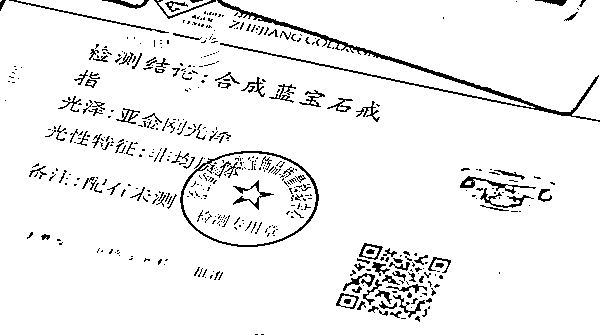

# 珠宝是塑料的、故事是编的！ 网红靠卖惨视频虚假宣传，收割百万粉丝！

> 原文：[`mp.weixin.qq.com/s?__biz=MzIyMDYwMTk0Mw==&mid=2247510562&idx=2&sn=6bcdb921449e65df8a9bd280d2077809&chksm=97cb611aa0bce80c8f5fb132fa866cd12ef6105ad1605efc3653c5990eaa9eb678eb578d362f&scene=27#wechat_redirect`](http://mp.weixin.qq.com/s?__biz=MzIyMDYwMTk0Mw==&mid=2247510562&idx=2&sn=6bcdb921449e65df8a9bd280d2077809&chksm=97cb611aa0bce80c8f5fb132fa866cd12ef6105ad1605efc3653c5990eaa9eb678eb578d362f&scene=27#wechat_redirect)

本

**最近，有不少网友向看看新闻 Knews 记者反映，他们在某网络短视频平台“权哥讲情感”和“权姐讲情感”的账号中，看到所谓“权哥”实地拍摄的家道不幸的女子和孩子的故事，让不少看了的人纷纷落下了同情的眼泪。**

**之后，“权哥”则以伸张正义的方式，替这些不幸的孩子以搞慈善的名义，直播售卖起了珠宝。**

****

**“权哥”表示，一方面是想为此帮助那些孩子，一方面这些珠宝也被渲染得非常划算。经过网络博主这样的攻势，很多人都下了单，助上一臂之力。**

**但收到货后大家却有了惊人的发现...**

[`v.qq.com/iframe/preview.html?width=500&height=375&auto=0&vid=e3231bmmocw`](https://v.qq.com/iframe/preview.html?width=500&height=375&auto=0&vid=e3231bmmocw)

**含着泪助力**

**收到的珠宝却是塑料做的！**

杨女士是某视频平台用户，之前看了“权哥讲情感”账号，其中那一个个悲情故事，有情感纠葛的、有小孩要开刀缺钱的，可谓个个是催人泪下。

“权哥”化身慈善家称要帮助孩子，要把负心父亲珠宝厂的珠宝强行拍卖，资助孩子；在直播带货视频中，“权哥”还总是说手中珠宝多么贵，实际每件售价数百元是卖得多么划算。出于同情和信任，杨女士和不少网友纷纷解囊相助。

从 12 月至今，杨女士前后购买了所谓海洋之星、钻戒、蜜蜡、珍珠等饰品多达 2 万多元。

可收货到后却发现，全部都货不对板！

杨女士表示：“**这蜜蜡我都不好意思说，卖 400 多元，原价好像是 2900 多元，我已经记不得了。鉴定下来说这是塑料，人家也不跟我鉴定了，直接说不要鉴定，一看就是假的**。”

而受害者何止杨女士一个！

网友向女士也是从今年 1 月份开始看“权哥、权姐讲情感账号”系列视频，也被其中的故事感动得一塌糊涂。天天晚上看，看了哭。

感动之后，也在直播中，买了“权哥”的珠宝。

结果到货后，让她气不打一处来：**手中 1400 多元的 5 件珠宝，和描述的完全不一样！说好的钻石成了合成碳硅石，蓝宝石也是合成的！**

**故事是编的！**

**人也是请来演的！**

而碰到这种情况的消费者，全国各地的还有不少！一位来自安徽的消费者表示：自己买的项链和耳钉，还有手链，他介绍是水珍珠，发过来也不像水珍珠，卖 200 多元。

大家进一步调查后发现，这些让他们掉了不少泪的感人故事竟然全都是假的！

**有参与“权哥”相关苦情戏的演员站出来指证，直言权哥卖惨的故事全部是虚构的！靠的就是演！**

得知真相后，当事人们纷纷要求退货退款，但基本都被卖家拒绝。经过视频平台方面的协调，向女士也仅仅被承诺可以退还两单。

可以说，抖音平台的监管作用几乎不存在！那么这起事件，法律人士是怎么看的？

**赵山 上海鼎力律师事务所律师**

**利用编纂的卖惨视频来骗取广大消费者和网友的同情，再售卖假货的行为，可能已经涉嫌诈骗。利用这一点去欺骗老百姓的钱，已不仅仅是一般的欺骗行为，甚至可能会上升为刑事诈骗行为。主要看被骗群众数量，以及被骗数额总数是多少？如果达到一定数额，相关群众都选择报案，这时候警方可能会介入这样纠纷，甚至会刑事立案。**

**后续：“权哥”转战快手平台**

在新浪旗下黑猫消费者服务平台，早在 2 月 18 日就有消费者对“权哥”卖的问题产品进行了投诉，**称在直播间中虚假宣传，找人演戏诱导中老年人购买劣质三无首饰**。

据悉，或许是投诉者过多，事情不断发酵后，拥有 253.3 万粉丝的“权哥讲情感”账号，已经主动下架卖惨视频。

而“权哥”又转战阵地，从抖音平台去到了快手平台，在另一账号“人性·放大镜”上继续投放，而该号也已有 8.3 万粉丝。

是的，换了个马甲转战另一平台了！

针对看看新闻 Knews 记者的采访要求，截至发稿前，平台官方始终没有任何回复。我们不禁要问，直播带货这种销售模式，究竟如何保障消费者的权益？

来源：看看新闻 Knew、《新闻坊》栏目

← 向右滑动与灰产圈互动交流 →

