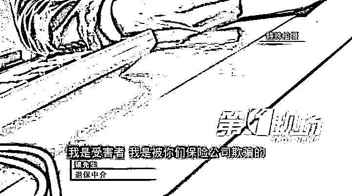
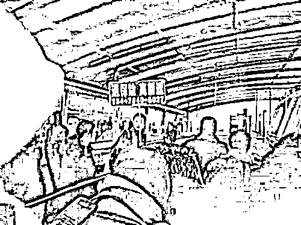
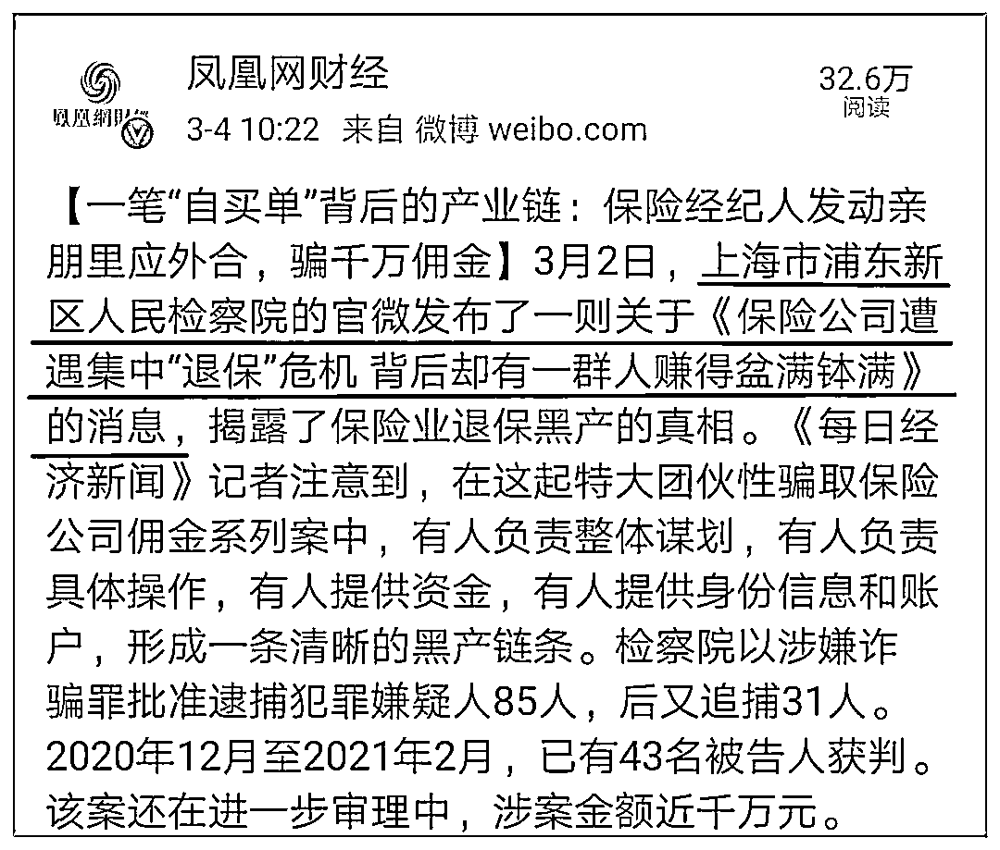
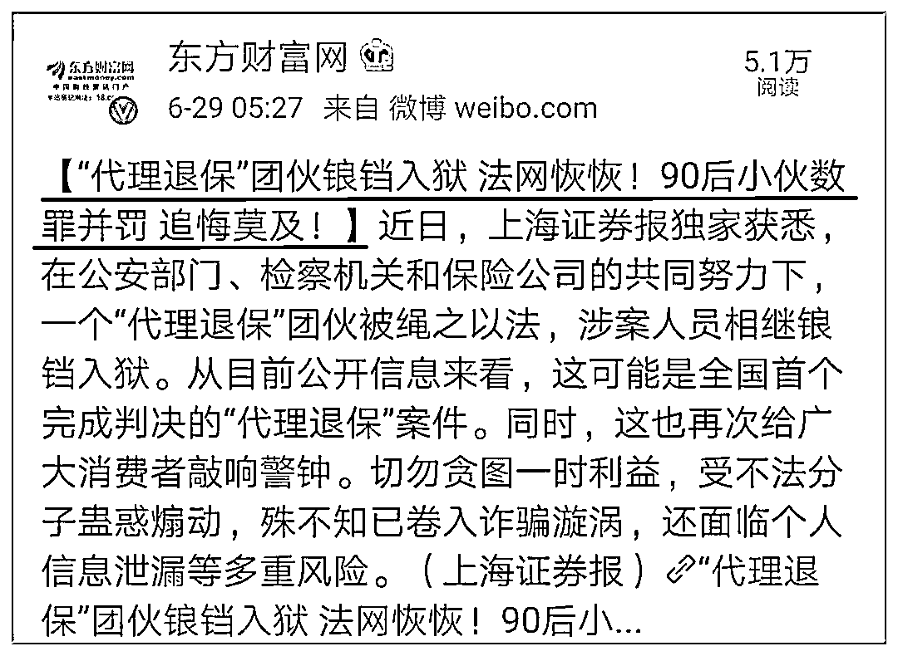
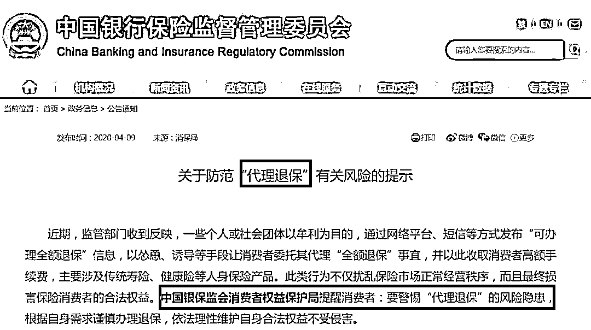
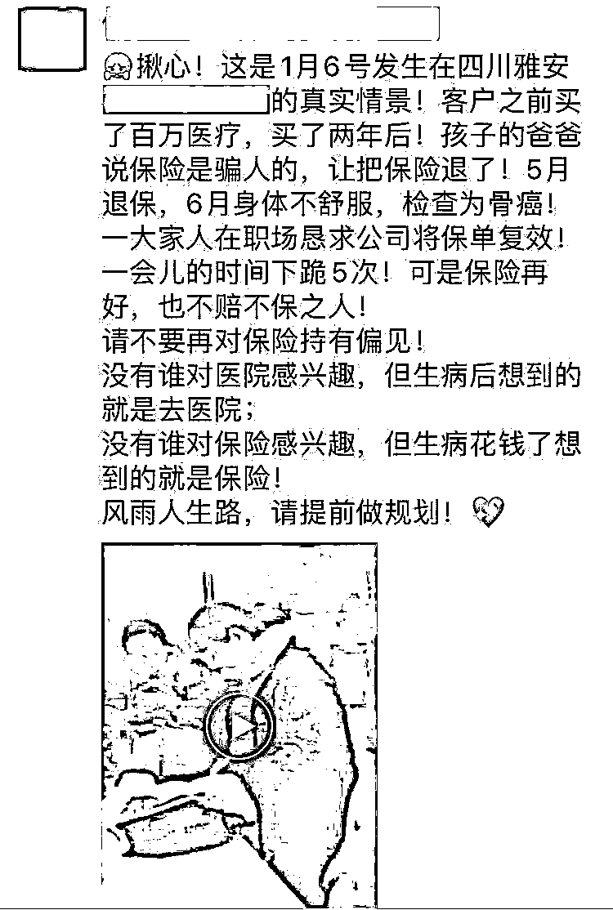

# 监管出手了：打响保险退保黑产第一枪，43 人获判！银保监发出重要提醒......

> 原文：[`mp.weixin.qq.com/s?__biz=MzIyMDYwMTk0Mw==&mid=2247510562&idx=3&sn=e421e304be760fe77571b8923f954106&chksm=97cb611aa0bce80c9a66bb603811cd90078e6393d1dc9ca5f19fb305888340d6fa8e302adc4d&scene=27#wechat_redirect`](http://mp.weixin.qq.com/s?__biz=MzIyMDYwMTk0Mw==&mid=2247510562&idx=3&sn=e421e304be760fe77571b8923f954106&chksm=97cb611aa0bce80c9a66bb603811cd90078e6393d1dc9ca5f19fb305888340d6fa8e302adc4d&scene=27#wechat_redirect)

最近在抖音、淘宝、朋友圈……随处可见退保的视频和信息，但他们身后退保中介的身影无处不在。

几乎在一夜之间，一群不法分子盯上了保险业。形形色色的退保中介穿梭于大街小巷，出现在各大社交平台，可谓是触目惊心、无孔不入。

代理退保，已经形成了退保黑产业了，“全额退保，不成功不收费、招代理、专业维权、法务援助”.......这些字眼在抖音、微信朋友圈、小红书，甚至火车站、高速车站都能看到关于“代理退保”的宣传。

**大连火车站，一个中年男子高举“退保险 高额返”的牌子，醒目地站在出站口。**

“代理退保”产业链已成保险业毒瘤，不仅扰乱保险公司的正常经营秩序，更损害保险消费者的合法权益，一时不慎自食苦果的案例屡见不鲜。

**面对这种扰乱保险公司正常经营和损害消费者利益的现象，监管出手了，3 月 2 日，上海市浦东新区人民检察院的官微发布了一则关于《保险公司遭遇集中“退保”危机 背后却有一群人赚得盆满钵满》的消息，揭露了保险业退保黑产的真相。**

检察院以涉嫌诈骗罪批准逮捕犯罪嫌疑人 85 人，后又追捕 31 人。2020 年 12 月至 2021 年 2 月，已有 43 名被告人获判。该案还在进一步审理中，涉案金额近千万元。

**这已经不是第一起因为“代理退保”触犯了法律被判刑的案例了，2019 年浙江省义乌市人民法院对一例“代理退保”案件作了宣判，或是全国首例对该事件的判决。**

他们抹黑保险业形象，对保险消费者进行误导，危及保险公司的日常业务运转，严重干扰了金融市场秩序，扰乱了保险监管环境。而当风险真正来临，这些被诱导退保的保险消费者，因为失去了保险的庇护而无法得到经济补偿，往往损失惨重。**中国银保监会曾发布了公告提示《关于防范“代理退保”有关风险的提示》，提醒消费者别上“代理退保”的当。**

**律师提醒，通过正规途径反映问题、提出诉求，是消费者维护自身合法权益的正当权利。但“全额退保”宣传已触犯法律，消费者轻信“退保黑产”将得不偿失。**

保险消费者应该都知道，保单合同一般有犹豫期设置，普遍在 10 天左右。犹豫期内，消费者可以撤销合同，退回全部保费；犹豫期过后，消费者再想退保，就只能拿回现金价值，在保单前几年，现金价值一般远远低于保费金额。

然而，近一段时期，微信公众号、百度贴吧、淘宝、抖音、小红书等平台上，出现了大量声称可以助你全额退保的个人和组织。真的有这么神奇吗？过了犹豫期，难道还能退回全部保费？

来，带你直击所谓恶意投诉全额退保的全过程。

**戳视频↓↓↓**

[`mp.weixin.qq.com/mp/readtemplate?t=pages/video_player_tmpl&action=mpvideo&auto=0&vid=wxv_1152685283100475396`](https://mp.weixin.qq.com/mp/readtemplate?t=pages/video_player_tmpl&action=mpvideo&auto=0&vid=wxv_1152685283100475396)

视频来源：“深广电第一现场”公众号

这家“挂羊头卖狗肉”的公司的工作人员，透露了成功实现全额退保的秘籍：一找茬、二卖惨、三撒泼。首先要找保险营销员的瑕疵，“咬死”对方存在欺骗和诱导行为。只要保险公司一天没有答应退保，就要“豁出去”摆出一副要把事情闹大的架势，逼迫保险公司退保。

他们煽动保险消费者到保险公司全额退保，四处散发广告，扬言受理各大保险公司保单的全额退保业务。**他们以代理退保业务为名，从中收取 30%-50%的高额手续费。**

**多地银保监局发声警示——消费者务必“擦亮眼睛”受损失的不只是保险公司。最终为退保买单的还是消费者自己。**

记者在调查中了解到的一个真实案例显示，今年 3 月，江女士生病住院，其丈夫胡先生想起几年前江女士曾投保过一份保单，就想申请理赔。但万万没想到的是，江女士的这份保单早已在 2019 年 11 月办理了退保手续，现已无保险保障。

原来，2019 年 11 月，江女士被一不良团伙以高收益产品诱导，委托其通过“恶意投诉”进行了退保。胡先生对此懊悔不已，希望保险公司能够考虑恢复保单效力。然而，不幸的是，经调查，保单退保所有书面签字均由江女士本人签字确认，具有法律效力，江女士的保单无法再恢复了。

这世界上从来不缺好心办坏事的人，拿保险来说，很多人本身对保险有偏见，以为这样可以省了一笔钱，殊不知，疾病和意外这种东西根本无法预测，很多案例都是前脚退保后脚确诊，让人悔不该当初。

只想说在这个世界上，有两件事一定不要做：劝人离婚、劝人不要买保险！更不要劝人退保，为自己积点德，给别人一点希望，因为一旦真正的困难来临，凭你一己之力，真的是帮不了的。

退保后，5 跪保险公司

其实像这样的案例不计其数，留给他们的只有懊悔，如果时间可以重来，他们一定不会退保，可是人生没有如果，只有结果。

保险不是没用，而是“暂时没用”，平时一把雨伞卖 5 元，人们嫌贵；大雨倾盆，同样的雨伞卖 30 元，立马出手！平时买份保险 5 千元，人们嫌贵；重疾来临，医院要价 20 万，卖房卖车都得花！

**退保代价你承受不起****1.退保必然会导致经济损失。**过犹豫期退保时仅退还保险单的现金价值，退保越早，投保人得到的退保金越少，特别是在未缴满两年保险费的情况下，退保金更少。**2.再次投保缴费标准将提高。**一般来说，投保同一种险种，被保险人的年龄越大，缴费标准越高，如果退保后重新投保，便会因年龄的增长而多缴保费。 **3.保障责任随着退保而丧失。**退保后投保人原本享有的保险权益因此失去，面对随时可能发生的风险，被保险人将无法及时获得各项保障。 **4.重新投保将受到一定限制。**若因退保而重新考虑投保长期性人寿保险，其保险条款中约定的疾病身故、疾病致残或自杀的保险责任免除期将重新计算。若投保人在责任免除期内发生保险事故，保险公司不予赔偿。 **5.重新投保时可能会被拒保。**某些人寿保险条款，以被保险人身体健康且不超过规定年龄为条件。退保后再投保，可能会因身体状况的变化或超过规定的年龄而被拒保，从而失去获得保险保障的权利。

如果你是理智的，你绝不会因为朋友的一句话而放弃保险，所有的人都必须对自己的人生和家庭负责，你可能遭遇的风险，只有保险才能为您将损失降到最低，帮您抵御风险带来的灾难。无论关系再好的朋友都不敢如此承诺。

写在最后，当今社会上总有这么一些所谓的“好心人和黑心人”，自己不去了解保险或对保险有误解，还要把错误的观点传给别人，劝别人不要买保险甚至别人买了保险还劝人退保，这些人说的轻点是不懂保险，说的严重些他们是在毁掉你的家，如果你身边有这样的“好心人和黑心人”赶紧远离，不要有一秒钟的犹豫。

来源：V 保险

← 向右滑动与灰产圈互动交流 →

