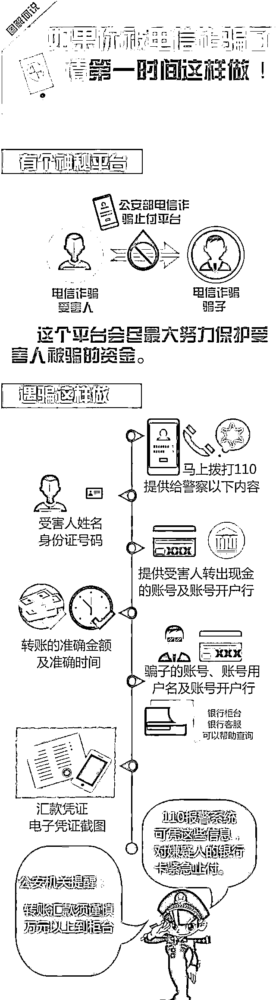
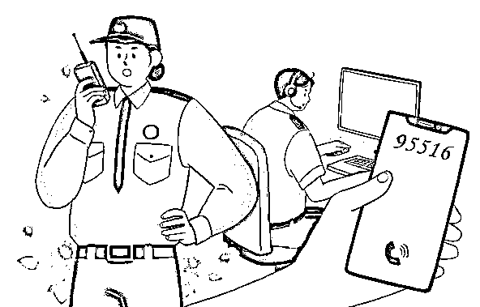

# 权威发布：如果你被电信诈骗了，请第一时间这样做！

> 原文：[`mp.weixin.qq.com/s?__biz=MzIyMDYwMTk0Mw==&mid=2247510562&idx=4&sn=f7d93aca6341ae3ab7615a0a28789b8e&chksm=97cb611aa0bce80c77b7643665628bca9197ac9142031b31f5147b81bbfb484d999979c6bad8&scene=27#wechat_redirect`](http://mp.weixin.qq.com/s?__biz=MzIyMDYwMTk0Mw==&mid=2247510562&idx=4&sn=f7d93aca6341ae3ab7615a0a28789b8e&chksm=97cb611aa0bce80c77b7643665628bca9197ac9142031b31f5147b81bbfb484d999979c6bad8&scene=27#wechat_redirect)

？？

**被骗了**

**我该怎么办**

正确且快速止损的方法 

赶紧来学习一下~

**感觉被骗了，我该咋办？**

**1**

****尽快拨打 110 或到最近的派出所报案****

****拨打 110 报案后，民警会立马采取措施止付，防止报警人财产损失进一步扩大。值得注意的是，**电话报警后，报警人还需尽快前往最近的派出所进行笔录，**案件才能进一步开展侦查。****

******110 报警只能快速止付，案件侦破还得到派出所进行详细笔录。******

****2****

******准确记录骗子的账号、账户姓名等相关信息******

****保存好汇款或转账的凭证，如：在 ATM 机转账的凭条、微信、支付宝转账的截图。****

******一定要清楚保留本人及对方的****完整****账号！******

********

****在遭遇电信网络诈骗后，并已经造成经济损失，最正确的做法应当是**第一时间拨打 110 报警。******

******我给骗子转钱了，直接从对方账户把钱****还给我不就行了吗？******

******1******

********账户往往不是犯罪分子本人账户********

********银行账号和银行卡，很可能是诈骗分子花钱从贩卖个人信息的不法分子手中购买后去开设的。********

********2********

************犯罪分子设立多级账户，层层转账************

**********犯罪集团往往会开设多级账户，通过银行快速层层转账，最后在分布在全国各地的 ATM 机上进行提现。**********

************因此，公安机关侦办这类案件就需要投入大量的警力、经费，远远不是我们想象的那么简单。************

************号码我通过 114 查过了，是真的呀************

**********诈骗分子往往利用**改号软件**，可以实现“想显示什么号码，就显示什么号码”，还诱导受害人通过 114 查询电话真伪。**********

**********南通公安提醒：辨别主叫号码是否虚假，最简单的方法是：**回拨。************

********遭遇电信网络诈骗后的应急措施****************************************

**********第一时间自救**********

********看对方账户是哪家银行的，通过该银行网银、电话银行等，对嫌疑人银行卡采取输错多次错误密码（一般为 3-5 次）、口头挂失等方式阻断嫌疑人取款。时间一般为 24 小时，这宝贵的 24 小时将使对方无法将钱转移，避免损失扩大，也为警方破案提供时间。********

**********及时报警**********

********收集被骗过程的汇款凭证、通话记录等相关信息，前往当地派出所或拨打 110 报警。********

**********拨打中国银联专线 95516 请求帮助。**********

********************

**********以上是遭受损失后的应对**********

**********下面说说没有资金损失的应对方式**********

********遇到这种情况，您先稳稳心神，只要钱没被骗走，咱还是人生赢家。不过，为了尽快将骗子绳之以法，避免再去蒙骗他人，以下几点需要注意……********

********1********

********如果手机已中木马病毒，哪怕没有资金损失也要及时刷机！刷机！刷机！并且更改相关密码。因为虽然没有资金损失，但木马病毒很有可能已经盗取了你手机内的各项信息。********

********2******** 

********将相关网络诈骗信息线索，甚至是诈骗录音，通过 110 报警电话或 12110 短信报警平台、网络 110 等方式提供给公安机关，警方会将这些线索汇总并开展工作。********

********以上就是在遇到电信网络诈骗后的应对处理方法。总之，遇到此类情况，首先要保持淡定，并及时报警。警方会尽最大努力帮助您。********

********来源：十堰人民路派出所********

********************************

********← 向右滑动与灰产圈互动交流 →********

****************