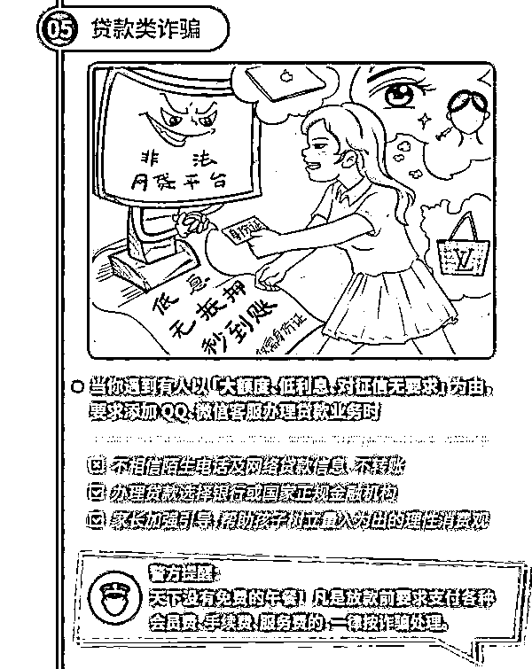

# 超 31 名孩子被骗！有人被骗超 20 万！抓紧告诉娃这些！

> 原文：[`mp.weixin.qq.com/s?__biz=MzIyMDYwMTk0Mw==&mid=2247510562&idx=6&sn=3e41e9e881f6c1f67d797199a7b53346&chksm=97cb611aa0bce80c427ca8f41ad913c7fa9ebfdc846c3e56eeb229008bb5353fa40bb0e97b57&scene=27#wechat_redirect`](http://mp.weixin.qq.com/s?__biz=MzIyMDYwMTk0Mw==&mid=2247510562&idx=6&sn=3e41e9e881f6c1f67d797199a7b53346&chksm=97cb611aa0bce80c427ca8f41ad913c7fa9ebfdc846c3e56eeb229008bb5353fa40bb0e97b57&scene=27#wechat_redirect)

**家长注意！**

****家长注意！****

******家长注意！******

********

****抓紧提高自己的防骗意识。****

****不然，会被骗子笑掉了牙！****

****骗子：我只想骗 1.5 万。受害人：不，我一定要给你 2 万！****

****这究竟是怎么回事？****

******1******

********

****南海松岗一名母亲，****

****微信里突然没了 66.66 元！****

****隔天下午，微信里离奇“丢失”7000 多元！****

****紧接着，她被网贷了 20 多万！****

****而这钱，一分都没进她的口袋。****

****这一幕，就发生在 2 月中旬。****

******来龙去脉******

****2 月 16 日晚，12 岁女孩小新，拿着母亲的手机玩 QQ，在一个“X 泽哥哥生日派对现场群”内收到一条信息“扫码免费领取 X 泽生日派对礼物”。****

****对方声称“扫微信收款码，不会成功支付，只要将支付失败的页面截图给我，即可领取礼物”。****

********

****信以为真的小新，连忙扫码支付，但令她万万没想到的是，她竟然支付成功了。****

****眼前一幕，吓得她急忙向对方要求退款 66.66 元。****

********

****骗子****

********

****入群添加“财务”为 QQ 好友，让其帮忙办理退款。****

****没有多想的小新，赶忙添加“财务”为好友。****

****隔天下午，该“财务”以办理退款为由，要求她将母亲微信里的钱转到其发过来的一个微信收款码上，承诺操作完后金额全数退回。****

****急于拿回退款的小新，将 7701 元都转给了对方，但退款并未如期到来。****

****紧接着，“财务”又要求其在微信上进行贷款，小新当即拒绝。但“财务”威胁如不按要求操作，就会影响其母亲的征信，还会持续扣母亲的钱。****

****害怕了的小新，只好偷偷申请贷款。****

********************************

****为避免母亲责备，在人脸认证时，我欺骗母亲称是为了要完成网络作业，需要拍照作为证明，最终，分多次共贷款了 20 万元。****

****************

****随后，“财务”又向小新推荐了一个购物小程序，要求其在该小程序里购买购物卡等物品。****

****就这样，小新将 20 万元转给了对方。直到对方再次要求提供母亲的银行卡，小新寻找银行卡时被母亲发现才知道被骗。**** 

****心疼母亲！****

****明明没有花钱却背负了 20 万网贷，且微信里的 7000 多元都没了！****

****骗子真是太可恨了！****

****怎么可以如此欺骗、恐吓一个 12 岁的孩子？****

******2******

********

****然而，更可恨的是，这样的骗子不止一个！****

******超 31 名孩子被骗↓↓↓！******

****近日，南海公安公布，自 2 月 1 日至 18 日，南海区发生电信网络诈骗案件共 200 余宗，其中涉未成年的诈骗案件达**31 宗**。****

****1 月 1 日至 2 月 16 日，浙江台州市，三门县电信网络诈骗案件共立案 70 起，涉及学生的诈骗案件**13 起**，被骗金额总和超 8 万，占总案发量的 18.57%。其中，买卖游戏账号装备 4 起，引诱汇款 4 起，招聘兼职刷单 3 起，购物消费 1 起，其他 1 起。****

******典型案例之购物消费诈骗：******

****2 月 15 日，学生小杨报案称：2 月 12 日晚，他在某购物 app 上搜索 iPhone11 手机时，看到一个只要 550 元的 iPhone11 手机。客服告诉小杨，春节期间搞活动冲销量，支付方式需要用支付宝搜索口令红包，然后将口令红包密码和收货地址等信息截图发给客服。小杨照做后过了几天，询问客服物流信息，对方告诉小杨大年初三会发货。结果当天，小杨再去找客服时，发现对方一直不回复，直到这家店铺显示不存在时，小杨才知道被骗了，共计损失 550 元。****

******教训之购物消费常见套路：******

****骗子发布廉价商品信息→→吸引用户添加他为好友→→引诱用户支付→→用户质疑，张口稳住→→拉黑。****

******典型案例之买卖游戏账号装备：******

****2 月 17 日，常州市的 13 岁学生小童报警称：网购游戏装备被骗 4 万余元。事发当时，他用家长的微信添加了名游戏装备“卖家”为好友。对方要求他登录其提供的游戏平台交易。心仪装备的他，按对方要求扫二维码付款。不料，扫码付款后，对方称钱款没有到账、由于他的操作失误资金被冻结，须支付解冻金、押金、保证金，多次付款后，才意识到被骗。****

******教训之网购游戏装备常见连环套路：****** 

****添加自称是“卖家”的陌生网友→→登录对方提供的网址→→扫码付款→→资金被冻结→→支付解冻金→→继续支付押金、保证金。****

********

****看完上述案例中孩子们被骗的整个过程，大家有没有觉得很眼熟？****

****不是一般地熟啊…....****

****都是些老生常谈的套路......****

****眼熟儿就对了！****

******骗子行诈的套路千篇一律，骗你的本质始终如一：钱！******

********

****🔼  摄图网****

****所以，**家长们一定要告诉孩子：凡是涉及金钱的交易，要告诉大人，请大人帮忙判断。******

******一旦不小心被骗，不要害怕，要勇敢地告诉大人，及时止损，并报警求助。****** 

****同时，**让孩子熟悉以下几个针对青少年的诈骗套路**↓↓↓：****

********************************************************

****当孩子们知道了骗子的套路后，纵使其套路再深，娃儿们也不容易中招了！****

******3******

********

****另外，开头第一起案例的发生，离不开家长的一个小疏忽——**轻易将支付密码告知孩子！******

****试想，倘若孩子不知道家长微信支付密码，就算骗子手段再多，还能这么轻易骗到娃儿吗？****

****因此，家长们平日里要保护好自己的银行卡、支付宝、微信支付等账号的密码，不要轻易告知孩子。****

****并且，家长还要教育孩子天上不会掉馅饼！****

****免费的午餐，往往存在着坑人陷阱。****

****如果需要什么物品，要和大人沟通。****

****比如需要网上购买游戏装备等物品时，在征得大人同意后，去官方网站购买，不要擅自向陌生人转账，更不要相信一些游戏界面里玩家发布的低价信息，谨防上当受骗。****

****来源：学生安全教育平台，反诈骗先锋********************

****← 向右滑动与灰产圈互动交流 →****

********