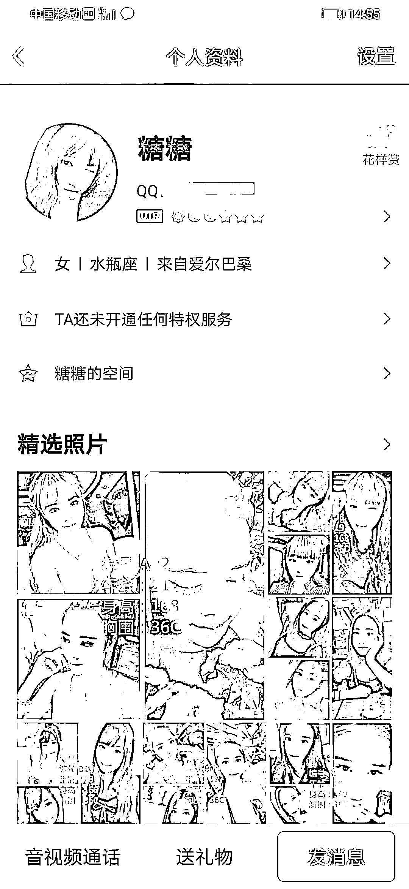
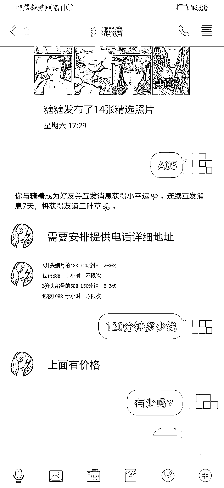
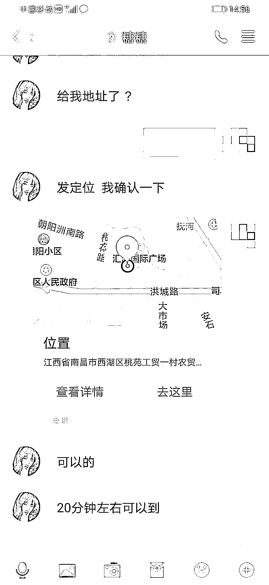
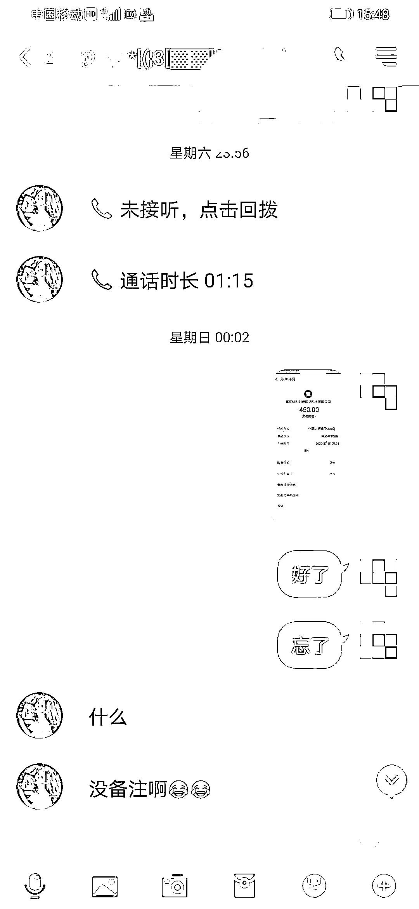
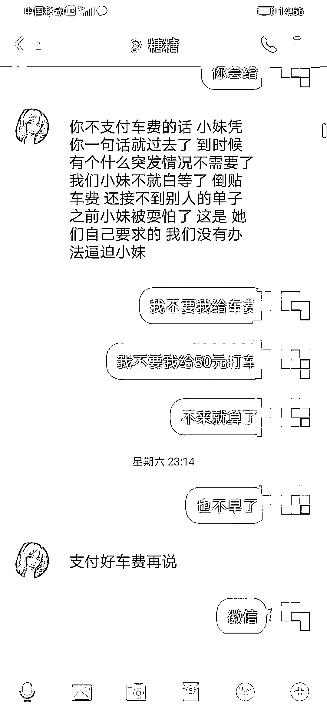
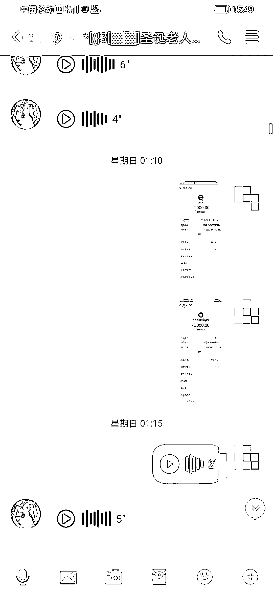

# 色字头上一把刀，警惕社交平台上的桃色陷阱！

> 原文：[`mp.weixin.qq.com/s?__biz=MzIyMDYwMTk0Mw==&mid=2247510589&idx=1&sn=41fdb645016cfca207143d19b7e42ada&chksm=97cb6105a0bce8136def1969b2d15eaa6c8176689f37af60ad84fe086a31eb0c9f2f1284ca3b&scene=27#wechat_redirect`](http://mp.weixin.qq.com/s?__biz=MzIyMDYwMTk0Mw==&mid=2247510589&idx=1&sn=41fdb645016cfca207143d19b7e42ada&chksm=97cb6105a0bce8136def1969b2d15eaa6c8176689f37af60ad84fe086a31eb0c9f2f1284ca3b&scene=27#wechat_redirect)

寂寞无人夜

“附近的人”发来打招呼的消息

称可以提供色情服务

你是否会蠢蠢欲动？跃跃欲试？

色字头上一把刀

小心落入假卖淫真诈骗的“桃色陷阱”！

虚假色情服务类诈骗 

犯罪分子伪装成色情服务的提供者，诱使受害人上钩，并利用被害人羞于启齿的心理，一步一步实施诈骗。犯罪分子在互联网上留下提供色情服务的电话，待受害人与之联系后，称需先付款才能上门提供服务，受害人将钱打到指定账户后发现被骗。

常见诈骗手段1、骗子通过社交平台上发布虚假色情广告

2、加好友后“明码标价"商讨价格 3、确定位置后要求先付定金

4、之后又会以保证金、体检费等借口要求继续转钱

5、直到受害人意识到被骗，骗子拉黑删除

虚构色情服务类诈骗主要是利用受害人羞于启齿不敢报案的心理实施诈骗。诈骗分子先是网下载性感照片，然后利用社交软件寻找被害人，向被害人发送色情图片，以明码标价、上门服务等方式诱使受害人上当，随后巧立名目，多次要求汇款，实施诈骗。

警方提醒，嫖娼属于违法行为。遵纪守法，洁身自好是杜绝此类诈骗案件的根本，如果发现被骗，请第一时间拨打 110 报警，或就近到公安机关报案。

来源：南昌网警巡查执法，反诈骗先锋

← 向右滑动与灰产圈互动交流 →

