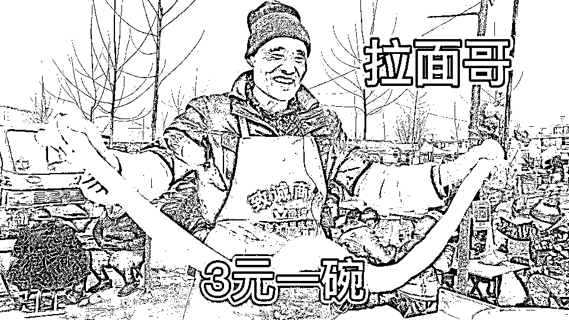
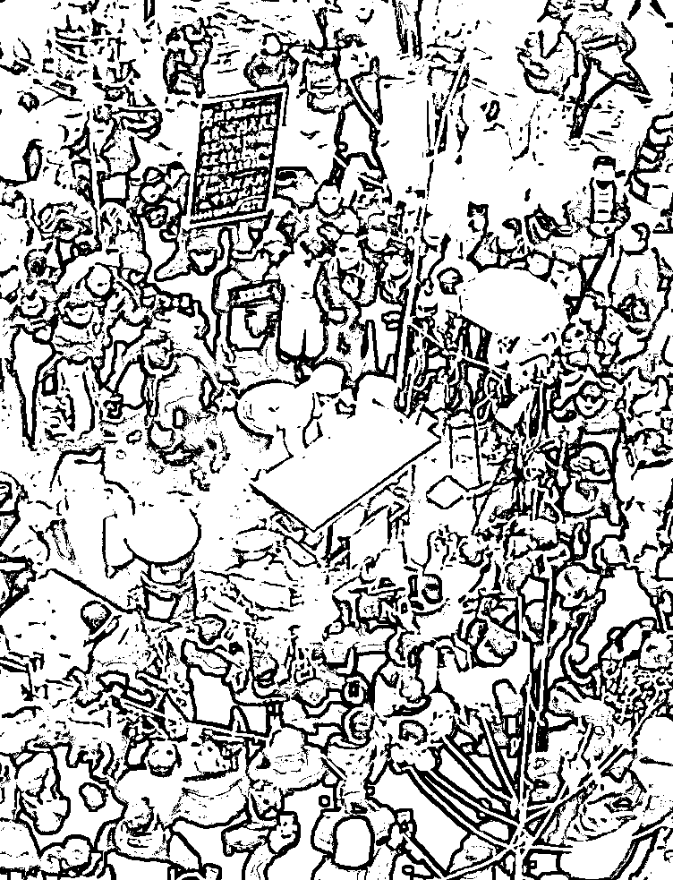
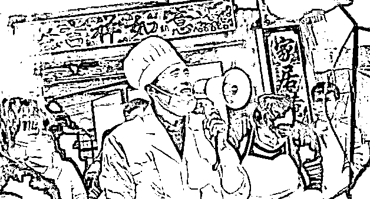

# “拉面哥”火了，牛鬼蛇神都出来了...

> 原文：[`mp.weixin.qq.com/s?__biz=MzIyMDYwMTk0Mw==&mid=2247510589&idx=3&sn=1504f855faa6a678cdded47759ec1559&chksm=97cb6105a0bce81350db1b760d507e32cc0ae23610c340d1365fe06dcb9fd4d49c047b39ebfb&scene=27#wechat_redirect`](http://mp.weixin.qq.com/s?__biz=MzIyMDYwMTk0Mw==&mid=2247510589&idx=3&sn=1504f855faa6a678cdded47759ec1559&chksm=97cb6105a0bce81350db1b760d507e32cc0ae23610c340d1365fe06dcb9fd4d49c047b39ebfb&scene=27#wechat_redirect)

日前，山东临沂市费县梁邱镇一农民，**因赶集出摊卖拉面“3 元 1 碗 15 年不涨价”，坚持惠民利民而走红网络。**但很快这位“拉面哥”却苦于被大批自媒体运营者蹭热度、“蹭流量”，其中部分人的手段甚至突破法律法规边界，侵害“拉面哥”合法权利，严重影响其家人和村民的正常生活。

[`v.qq.com/iframe/preview.html?width=500&height=375&auto=0&vid=k3232c4h494`](https://v.qq.com/iframe/preview.html?width=500&height=375&auto=0&vid=k3232c4h494)

网友曝光现场奇葩主播有多少

记者调查发现，当下部分短视频平台为牟利纵容、默许账号运营方打着“弘扬正能量”的幌子“谁红就蹭谁”，手段极端、行为无序，导致违法侵权问题频发。

“3 元 1 碗 15 年不涨价”

“凭着善良的心意走红”

和面、揉面、溜条、甩动，在费县梁邱东大集上程运付的拉面摊位，来吃面的人络绎不绝，他一边忙着手头的活，一边还不忘和老主顾们打招呼。“3 元一碗，便宜又实惠，我经常来吃。”正排队等拉面的王长兰对记者说。

程运付是梁邱镇马蹄河村村民。从 2005 年底开始赶集摆摊卖拉面，他和妻子每天开车带着面粉、案板和煮面的大锅，辗转于周边几个乡镇的集贸市场。“一直是 3 元一碗，只不过之前是带肉的，现在不带肉了。”程运付说。

对于多年未涨价，程运付坦陈，其实他多次计算过成本上涨的账，也想过要涨价，但他过过苦日子，就想让老百姓吃上便宜实惠的拉面。**“来吃面的都是周边老乡，平时干活出大力的，挣钱辛苦，如果涨价，可能很多人就舍不得吃了。”**

如今，程运付一天能卖出三四百碗拉面。据他计算，**按照当前的成本，一碗拉面大概也能赚个几角钱。“只要原料价格不大涨，我还会坚持 3 元不涨价。”**

“3 元拉面”加上质朴的话语、憨厚的外表，程运付迅速在网络平台“凭着善良的心意走红”，被网民亲切地称为“拉面哥”。

这边刚红

那边“蹭流量”的就蜂拥而来

记者了解到，程运付和“3 元拉面”走红很快引来了多地网红及视频博主。为了蹭到“拉面哥”的热度及流量，这些人涌进他的拉面摊和村子，对其“围追堵截”，这不仅使“拉面哥”一家无法正常生活，影响赶集出摊，还导致村里道路交通“瘫痪”，严重侵扰村民们生产生活。

记者调查发现，“拉面哥”的遭遇并非个例。不少自媒体、短视频账号运营者信奉“流量为王”“流量是金”，逢热必蹭，谁红蹭谁，如不久前的丁真。而“蹭流量”的套路则大致有这样几种：

**——“正”蹭。**这种套路往往是打着“弘扬正能量”“传播新风尚”等旗号正面对当红或流量人物进行拍照直播等，实则是为自己的账号加流量、涨“粉丝”。记者 2 月 27 日在“拉面哥”家门口看到，当天尽管他并不在家，但 100 多名各路网红和视频博主围聚在他家周围围观、拍照、直播。2 月 28 日，“拉面哥”赶集出摊后，他的摊位被前来蹭流增粉的人群围得水泄不通，无法正常经营。

“我开了一家店，平时做直播，现在正是涨粉的好时候，就连夜开了 6 个小时的车赶过来了。”一位来自江苏镇江的视频博主表示，知道这种行为打扰了“拉面哥”的正常生活，但在流量时代，蹭点流量没什么大不了的。

**——“反”蹭。**这种套路往往信奉“黑网红也是网红，被骂的流量也是流量”，不问是非、不分轻重地对热度和流量人物、事件进行调侃、审丑甚至无中生有、造谣生事，只为博取网络关注流量。比如不久前对马保国的一轮审丑大潮。另外像今年初，有多人“为了蹭热度，获取网络流量”发布涉疫情网络谣言，因此承担法律责任。

**——“硬”蹭。**虽然“八竿子打不着”，但为自身私利强行入镜。记者发现，为蹭“拉面哥”流量，他家门口不仅有拍照、直播的，还有不少人打卖狗广告、卖充电宝、卖食用油。在其摊位前，还出现了征婚、唱歌、送锦旗、贴寻人启事等五花八门的行为。

“蹭流量”过界后果严重

网络平台一旦失察必须追责

北京航空航天大学法学院助理教授赵精武等专家表示，“蹭流量”行为本属于中性的营销手段，但为了经济利益或提升知名度，**以极端手段“蹭热点”则往往是以侵害他人合法权益为代价，很可能涉及侵权，情节严重的甚至可能构成犯罪行为。**

北京市华泰律师事务所合伙人邓佩律师认为，民法典规定自然人享有姓名、肖像、隐私等项权利，如相关权利被侵害，“拉面哥”有权提起诉讼，请求侵权人承担停止侵害、排除妨碍的责任，自己因此受到的损失或者侵权人因此获得的利益，他也有权诉请赔偿。

邓佩还提醒，如果“蹭流量”相关行为严重阻碍村庄交通，影响村民生产生活则可能涉嫌严重扰乱社会公共秩序，一旦具有社会危害性，重则依照《中华人民共和国刑法》的规定可能构成犯罪，轻则可由公安机关依法给予治安管理处罚。

北京师范大学网络法治国际中心高级研究员臧雷指出，当前治理以极端手段“蹭流量”歪风的难点在于如何有效斩断一味追求“流量为王”“流量是金”者的变现牟利渠道，**这就要求网络平台运营方坚持正确价值底线，维护良好网络生态，不能为平台“一己私利”，将流量视作企业唯一目标，滥用平台技术和资源。**

中国政法大学光明新闻传播学院常务副院长姚泽金强调，《互联网直播服务管理规定》中明确规定互联网直播服务提供者应当落实主体责任，建立直播内容审核平台，视情采取警示、暂停发布、关闭账号等处置措施，相关网络平台应旗帜鲜明地反对其账号运营者以极端手段“蹭流量”的行为，积极对恶意炒作、过度消费热点当事人等内容进行限制，承担起应尽的社会责任。

姚泽金还建议，**网监、公安等相关部门应加强执法力度，划出清晰红线，形成对过度围观、恶意炒作等极端“蹭流量”行为的有力震慑。**

**对于自媒体运营者**

**蹭热度、蹭流量的行为，**

**你的态度是？**

来源：新华社，红网

← 向右滑动与灰产圈互动交流 →

