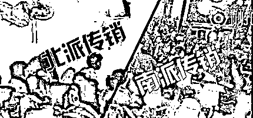

# 南派住别墅北派打地铺,传销竟也分门派！

> 原文：[`mp.weixin.qq.com/s?__biz=MzIyMDYwMTk0Mw==&mid=2247510625&idx=1&sn=4405207f2e4b9e6393ac59e635955729&chksm=97cb6159a0bce84f916cf35a6bf74e99d761b87705f47ab19b782b4a1785e13ae73c3d740349&scene=27#wechat_redirect`](http://mp.weixin.qq.com/s?__biz=MzIyMDYwMTk0Mw==&mid=2247510625&idx=1&sn=4405207f2e4b9e6393ac59e635955729&chksm=97cb6159a0bce84f916cf35a6bf74e99d761b87705f47ab19b782b4a1785e13ae73c3d740349&scene=27#wechat_redirect)

**传销派系众多，骗术多样，按其风格大致分为北派和南派。**

北派传销与南派传销有什么区别呢？

南派传销和北派传销都属于异地传销（异地邀约，把人从甲地骗到乙地，封闭或者半封闭式洗脑），都利用传销的惯用制度“五级三阶（晋）制为制度，通过购买商品或者投资份额取得加入资格（入门费），运用几何倍增原理发展下线组成上下线层级关系；层层返利形成多层次计酬。这两种传销模式完全具备传销的特征，是《禁止传销条例》严令禁止的。

[`v.qq.com/iframe/preview.html?width=500&height=375&auto=0&vid=x05332iy80b`](https://v.qq.com/iframe/preview.html?width=500&height=375&auto=0&vid=x05332iy80b)

你不得不知的南北派传销骗局

北派传销属于异地传销的初级版，南派传销属于异地传销的升级版。这两派传销，并不是严格按地域划分的，主要是**操作模式**上有很大的区别。 

**北派传销**

北派传销打着“直销”、“网络营销”、“人际网络”等旗号，属于低端传销，上当受骗的人年龄较小，层次比较低，20 岁左右的年轻人居多，毕业或者未毕业的大学生占有很大的比例。

**主要特征是异地邀约，吃大锅饭、睡地铺，一个家住 10 多个人，集中上课，以磨砺意志为假象，条件比较艰苦。**有的组织有控制手机、非法拘禁等限制自由的情况。

以“三商法”、“五级三阶制”（有的叫六级四晋制或日式级差制及其类似的制度，代表制度有出局制、超越制、回归制等）为制度，上线款（入门费）主要有 2900 元和 3900 元不等。

一般假冒一家公司，以卖化妆品或者保健品为名，实际上产品只是一个道具，都是一些三无产品或者根本无产品，传销组织名称比较杂乱。

现在北派传销受南派“资本运作”高端传销影响，洗脑手段升级，传销理论向南派学习，投资金额也越来越大，从最初的投资几千元到数万元不等（投资一套 2900 元或者 3900 元不等，鼓吹多投资多回报，有的投资 10 套，或者 15 套，甚至更多）。

北派传销最初发源地在东北一带，由传销鼻祖辽宁鞍山人杨玉勇在 98 年禁止传销后发展到河北、天津、山东等地，后来逐渐裂变，很多网头开始挑旗单干，将北派传销扩散到全国各地。

**南派传销**

南派传销打着“连锁销售”、“自愿连锁经营业”、“纯资本运作”、“商会商务运作”、“民间互助理财”等旗号，属于异地传销的升级版，参与者以三四十岁有独立经济能力的人为主，很多高端人群深陷其中，有退休教授、博士、海龟、研究生、甚至退休干部，很多沿海一带的老板和富人也卷入了这场金钱的游戏，当然有些相对低端的体系参与者也不乏农民、打工者、大学生。

**南派传销的主要特征是以考察项目、包工程、旅游探亲为名把新人骗到外地，然后以串门拜访为由一对一洗脑，来去自由，吃住条件好**，有一句稍显夸张的话叫“北派打地铺，南派住别墅”，南派由于参与的人层次较高，经济能力较好，一般租住高档小区，家庭式居住，每个家庭住的人比较少，有的高端体系规定每个家庭住两三个，就是低端体系也要求不能超过六七个人。 

南派传销也是以传销惯用制度“五级三阶（晋）制”为制度，投资 1 份 3800 元到 21 份 69800 元甚至更多，投资金额越来越大。南派传销由最初的“连锁销售”挂靠一家虚拟的公司卖产品为名，到“纯资本运作”打着“虚拟经济”的旗号不讲公司和产品，传销的一个新动向，这种金融传销损失更大，有的都投资几十万，甚至上百万，确实触目惊心。传销已不再仅仅是穷人玩的游戏，正在向高层次、高智商、高学历、高投入方面发展，值得我们全社会关注。

南派传销打着“西部开发”、“北部湾开发”、“中部崛起”的旗号，以“国家项目”、“国家暗中支持”为幌子，传销理论更完善，印刷了很多非法出版物、光盘等，编造国家领导人讲话，甚至红头文件为“行业正名”，更具有欺骗性和迷惑性。

南派传销发源地最初在广西来宾、玉林、南宁、北海一带，后来扩散到云贵川、湖南、湖北、江西、安徽、浙江、江苏、陕西、河南等省，现在合肥、贵阳、长沙、南京、武汉、昆明、西安、成都、郑州等地都成为这种传销的重灾区。

**前几天发布了关于南派传销的文章后**

**（[亲 历 | 南 派 传 销](http://mp.weixin.qq.com/s?__biz=MzIyMDYwMTk0Mw==&mid=2247510562&idx=1&sn=f8ce4c2dca51f56ee4d3574bbd50080e&chksm=97cb611aa0bce80cc95983690770601dc7dcfd5c362d85c583e33f2ccdb6eaa9cc52637f6efd&scene=21#wechat_redirect)）**

**不少小伙伴留言**

**自己身边就有人被骗**

**新型传销真是太可怕了**

↓↓↓

**如何识别传销呢？**

**下面再为大家划重点**

↓↓↓

**新型传销十大表现形式**

一、打着“国家扶持”“有政府背景”等旗号，以“连锁销售”“连锁加盟”等为幌子，以考察、旅游等方式，从事传销活动。

二、打着“国家扶贫项目”“好项目产业大联盟”等旗号，以“发展代理”“建立工作站”等方式，从事传销活动。

三、借助销售保健品、化妆品等，实际上是利用拉人头，以人头数量计算报酬的传销骗局。

四、打着“电子商务”的旗号，以“网购”“网络直购”“网点加盟”等形式从事网络传销活动。

五、宣传“免费获利”“消费不用花钱”“消费增值”“消费多少返多少”等，实际是诱骗人们参加传销活动。

六、以创业投资为由头，以“在家创业”“网络创业”“网络资本运作”“原始股投资”“基金发售”为诱饵，欺骗、引诱年轻人上当。

七、以玩网络游戏、网上博彩为名，发展会员从事“游戏股票”“幸运博彩”等游戏充值卡，以直销奖、销售奖为诱饵发展下线。

八、打着“慈善救助”“爱心互助”等幌子，以“爱心支助贫困学子”“消费养老”等形式，欺骗善良的群众上当受骗。

九、打着“微信营销”旗号，以微信、微商为平台，采取夸大宣传、造假炫富等方式，诱骗亲友，以商品零售为幌子，实际是以发展下级代理商的形式从事网络传销。

十、打着“免费旅游”的旗号，以“免费旅游”等噱头，通过加手机微信好友的形式发展下线，拉群众入会交费，从事网络传销。

毕业季刚过，很多人都在找工作。

而一些传销组织也利用这一机会，

把黑手伸向了大学生。

灰产圈提醒大家，

去往陌生的地方求职一定要多个心眼，

**谨防传销骗局。**

← 向右滑动与灰产圈互动交流 →

