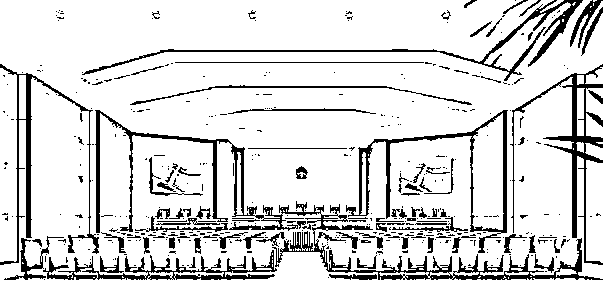
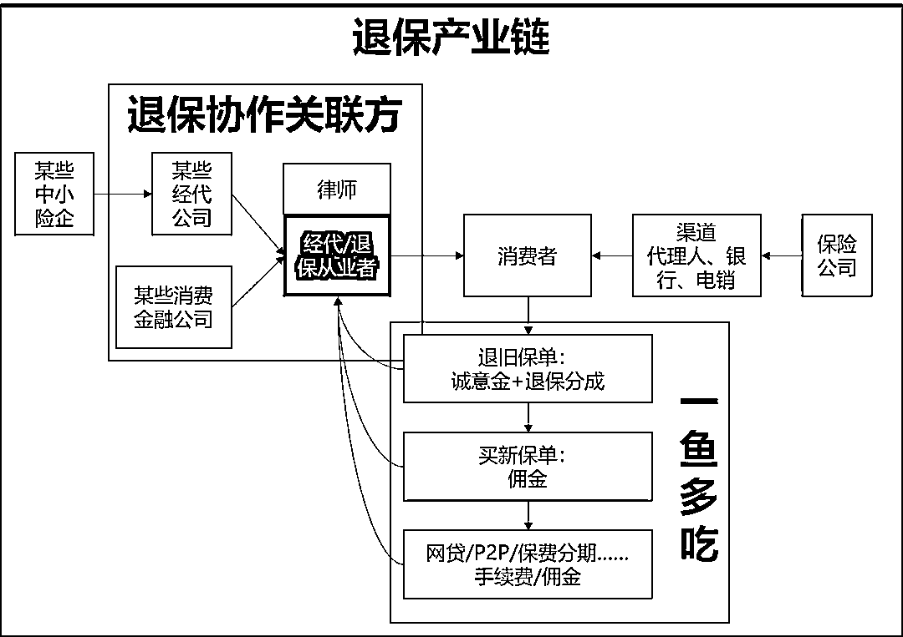
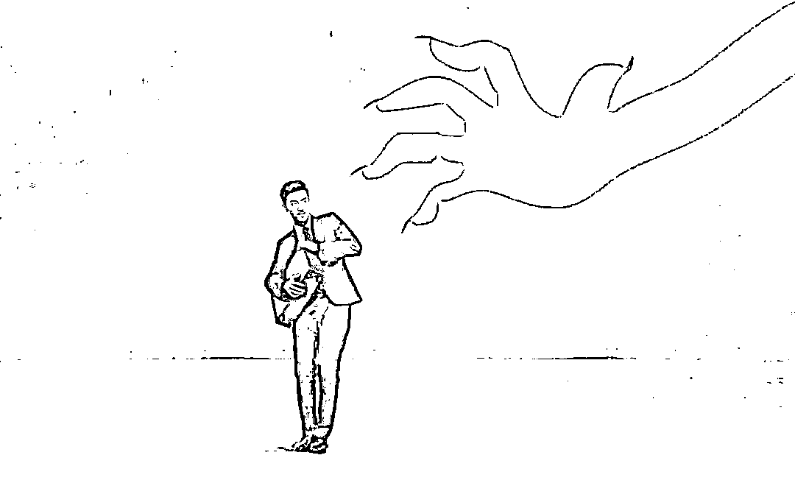
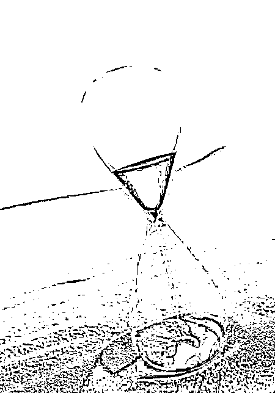
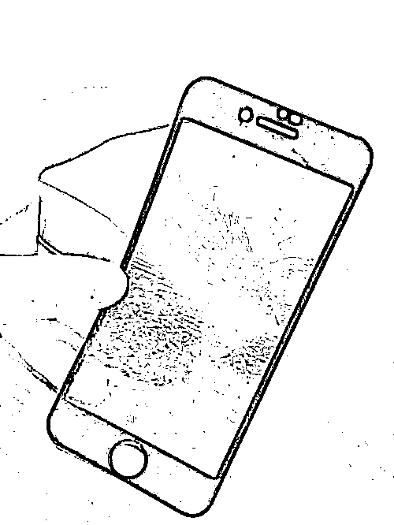
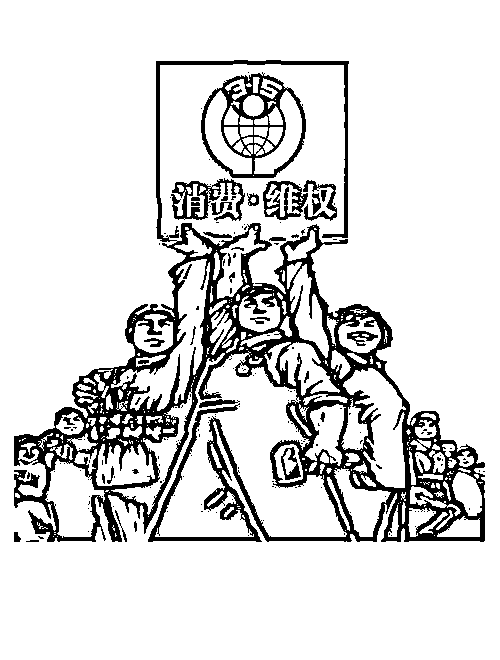

# 保险黑产：这回彻底凉了？

> 原文：[`mp.weixin.qq.com/s?__biz=MzIyMDYwMTk0Mw==&mid=2247510625&idx=3&sn=5647b5ad5b62435c55a89add54dbf923&chksm=97cb6159a0bce84f49e681e45e9aac1ba9f14f4ecc1ad349534705e5b192c654dcaed40e4f73&scene=27#wechat_redirect`](http://mp.weixin.qq.com/s?__biz=MzIyMDYwMTk0Mw==&mid=2247510625&idx=3&sn=5647b5ad5b62435c55a89add54dbf923&chksm=97cb6159a0bce84f49e681e45e9aac1ba9f14f4ecc1ad349534705e5b192c654dcaed40e4f73&scene=27#wechat_redirect)

**  这回彻底凉了？**

**带你揭秘保险黑产**

**let's go!**

**一、案例**

热点

让我们先来看一个案例

嫌疑人周某及犯罪同伙无保险从业资质，非法窃取消费者信息，自称是保险公司售后人员，诱导消费者办理减保、退保，并推荐保险产品，涉及客户**800 余人**，涉案金额超**6000 万元**。开平市人民法院以侵犯公民个人信息罪判处周某有期徒刑**6 个月**，并处罚金**5000 元**。

**首**

**          正义永远不会缺席**

此案为银保监会部署开展保险领域恶意投诉治理工作以来，全国破获的首起黑产人员涉侵犯公民个人信息犯罪司法判决。

**    这个案件的处理为黑产组织敲响了警钟，但是仍然不乏暗藏的地下组织，一双双黑手仍在悄悄的伸向消费者......**

**二、手段**

醒

目

招

牌

“全额退保，不成功不收费、招代理”，“专业维权、全额退保”......

想必大家在很多渠道都见到过类似的招牌，这些招牌背后将隐藏着什么套路，请随着小编一起来揭秘！

**打广告**

搜集信息渠道包括微信朋友圈、专用微信群、抖音、小红书，百度贴吧(退保吧/保险吧等)、财商训练营、招募广告，以及非法买到的个人信息。

**全额退**

       接触客户，了解投保经过，完善信息，找准产品漏洞，怂恿退保，承诺全额退。

**签协议**

签署代理退保协议，通常收取 10%的定金。

**断联系**

       指导客户取证，要求客户配合去保险公司修改联系方式，甚至有代理直接控制客户手机号、银行卡，阻断客户与保险公司的联系。退保到手后,代理通常会收取退保金 30%的报酬。但收代理费并不是结束。

**新产品**

通过对客户收入状况的了解，推荐新保险公司的保险产品，或者其他投资理财、借贷产品，再一次收取保险公司或其他机构的佣金。

**卖信息**

       业务价值开发完成后，将信息再次转卖给下一家。

**巧升级**

通过线下集中培训，线上传播书面、语音、视频等多种形式的教学素材，包装成收费课程。培训内容包括:激发需求、介绍投诉流程、编造投诉理由、钓鱼取证、施压沟通等。

**     我的一位朋友曾说过：“黑产代理可谓‘一鱼四吃’，一是退保成功收 30%代理费，二是介绍新单成功收佣金，三是将客户信息转卖给下一家收割一次；四是制式培训招聘代理复制前面经验，再收割一次。”**

**三、危害**

**“退保黑产”损害险企利益的同时，也严重危害消费者合法权益，行业内几乎人人喊打，“代理退保”行为隐藏着如下风险：**

时间流逝

一寸光阴一寸金.寸金难买村光阴。买保险要趁早，肯定越早越便宜。买大公司的还是买小公司的？其实都没有标准答案，保险责任的背后纷繁复杂，一分价钱一分货。一些退保代理会以此为切入点进行劝说，在犹豫期间，时光在渐渐流逝，往往意外就在一念之间，带来的将会是终身的遗憾。

资金受损

   某些“代理退保”行为并非真正为了保护消费者合法权益，而是以牟利为目的。退保前要求消费者支付高额手续费或缴纳定金，退保后诱导消费者“退旧投新”，购买所谓“高收益”理财产品或其他公司保险产品以赚取佣金。部分组织还利用其所掌握的消费者银行卡及身份证复印件等，截留侵占消费者退保资金，甚至有不法团伙诱导消费者参与非法集资，一旦落入骗局，消费者资金损失难以挽回。

保障缺失

为牟取利益，一些从事“代理退保”的个人或团体冒充监管部门或保险公司工作人员进行虚假宣传，称消费者所购保险产品“存在欺诈行为。消费者未来再次投保时，由于年龄、健康状况的变化，可能将面临重新计算等待期、保费上涨甚至被拒保的风险。用来未雨绸缪的护身符变成了一张纸，那才是真的悲剧。

信息泄露

     一些从事“代理退保”的个人或团体打着“维权”幌子获取消费者信任，并与消费者签订所谓的“代理维权服务协议”，要求消费者提供身份证、保单、银行卡、联系方式等涉及消费者隐私的敏感信息。除“代理退保”外，有的组织还从事信用卡套现、小额贷款业务，消费者个人信息资料存在较高的被泄露或被不法分子恶意使用的风险。以至于你不知道下一个坑会在何处等着你。

维权受阻

     我们按照自己的意愿、正常地办理退保是没问题的，但如果你是在黑代理处“维权”退保，他们在帮你“维权”的过程中，可能会切断你和保险公司的关系，以你的名字做各种你不知道事情，而这些可能会被相关部门记录下来。有的组织甚至在消费者想终止“代理退保”协议时，采用极端手段骚扰消费者，迫使其再次投诉。

**    吃完险企吃消费者，“退保黑产”引保险业公愤，“退保黑产”在 2019 年快速做大，并引发行业高度关注，引得多家银保监局就此发声。**

**四、抵制**

***透***

***过***

***数***

***据***

***看***

***本***

***质***

，“退保黑产”所利用的，一方面是消费者的专业知识匮乏；另一方面，则是充分利用了保险公司销售环节普遍存在的不规范，根据银保监会最新发布的数据，2019 年全年累计接受消费者投诉 93719 件，同比增 5.95%。其中，保险合同纠纷投诉 88745 件，同比增长 2.61%，占投诉总量的 94.69%。因此，消费者采取有利的抵制措施势在必行。

**   充分考虑自身保险需求**

**01**

**1、于公司：**保险产品的主要功能是提供风险保障，不同的人身保险产品其保障范围、缴费方式等有所差异。保险公司在业务开展过程中，充分考虑自身产品特点，不要只说好的方面，也要充分告知客户投保的风险和注意事项，谨慎办理承保。

**2、于消费者：**消费者应了解所购保险产品的保险责任、保障功能、除外责任和退保损失等重要信息，根据自身风险保障需求，谨慎衡量是否有必要终止保险合同。尤其要慎重对待所谓“退旧投新”“高收益”产品等宣传，树立科学理性的消费观念，防止上当受骗。

**    注意保护个人信息**

**02**

保单是重要的金融单据，包含重要个人信息，消费者要注重保护个人隐私，提高自我保护意识，妥善保管重要身份信息、敏感金融信息。不要将银行卡、身份证、保险合同等重要单证轻易转交他人，以免被非法使用，蒙受损失。如果受到不法侵害，应及时向公安机关反映，保护自身权益。

**    通过正规渠道依法合理维权**

**03**

消费者如果对保险产品有疑问或相关服务需求，可以直接通过保险公司公布的官方维权热线或服务渠道反映诉求；也可以通过其他方式向监管部门反映。

**    多方联合打击**

**04**

2020 年以来，银保监会、各家保险公司、主流新闻媒体都陆续发布过很多相关的风险提示以及保险消费者权益受损案例。

监管部门、保险公司、媒体发布风险提示的同时，部分省市地区司法部门分已介入调查，上海、广东等地已抓获了不法分子数名，并对被举报的部分代理退保人员进行了约谈和训诫。

**    保险消费者作为最有风险意识的群体，请谨慎防范“代理退保”，根据自身需求，通过合法、理性的方式，与保险公司沟通解决一切保险相关问题。**

**结语**

原本为客户利益出发的维权，演变成了为蛀虫牟利的“黑产”，行业需要更完善，但蛀虫不能横行，否则从消费者到行业，没有赢家。

退保黑产，终究只是疫情，也终将退潮而去。

来源：河北平安寿险 

← 向右滑动与灰产圈互动交流 →

