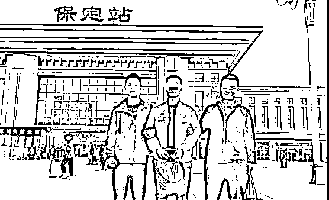
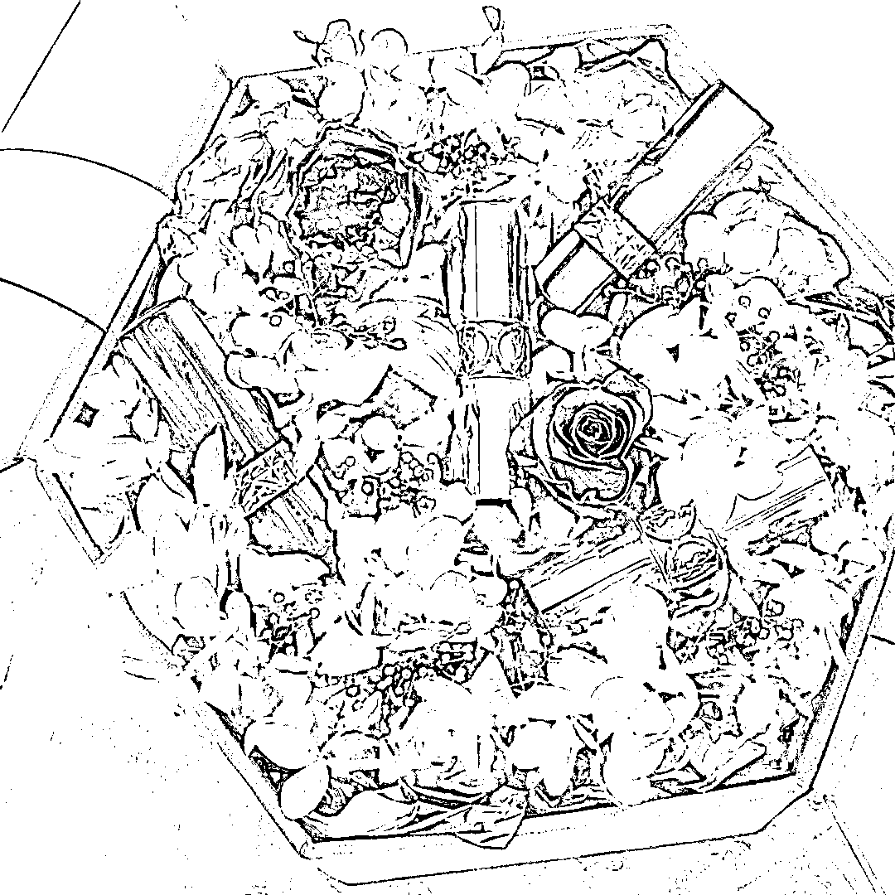
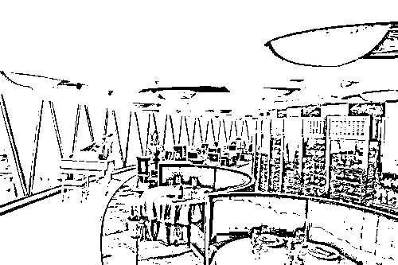
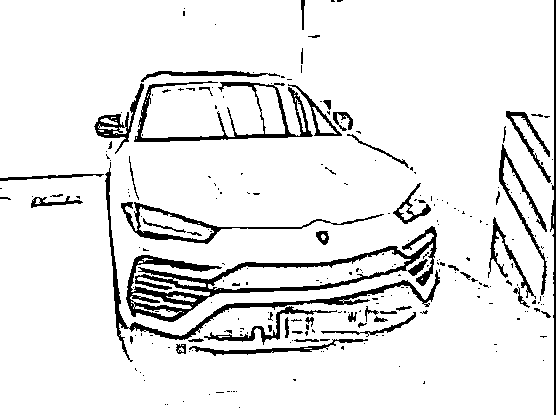
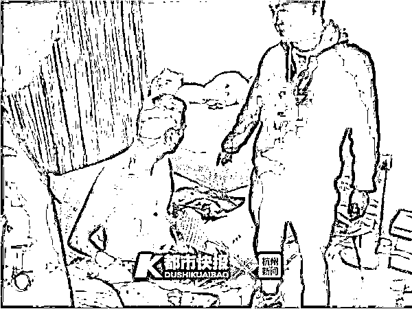

# 开豪车的男子诈骗“高知女性”4000 多万后，法院判了！

> 原文：[`mp.weixin.qq.com/s?__biz=MzIyMDYwMTk0Mw==&mid=2247510625&idx=4&sn=f21e0cfa3011354952e7f858ff1923f8&chksm=97cb6159a0bce84f8bcd48c98b64e5c2d5fc647fc4c1b09aa22f4646ac72d4839d24f0342291&scene=27#wechat_redirect`](http://mp.weixin.qq.com/s?__biz=MzIyMDYwMTk0Mw==&mid=2247510625&idx=4&sn=f21e0cfa3011354952e7f858ff1923f8&chksm=97cb6159a0bce84f8bcd48c98b64e5c2d5fc647fc4c1b09aa22f4646ac72d4839d24f0342291&scene=27#wechat_redirect)

一个普普通通的顺风车司机，

竟然同时与多名高知女性谈恋爱！

有的女友为了他离婚，

有的女友至今忘不了他。

**4000 多万的人民币，**

**加上价值百万的豪车，**

全都来自女友们的赞助！

你以为他拥有超高的颜值？

还是高精尖的技术型人才？

都！不！是！

**他是杨某，初中学历，**

**长相普通，还离异三次。**

**事情是这样的**

余杭警方最先接到女子桃桃（化名）报警，称男友从她这里借走 1000 万后失踪，她怀疑自己被骗了。随后一周，又陆续有三个女子小红、小柳、绿歌（均为化名）报警，都是来找失踪男友的。

从四位报警人的陈述中，民警发现了端倪——她们的男友竟然是同一个人！经调查，自 2017 年 6 月至 2019 年 9 月，杨某从四人处共“借”走 2000 余万元，但 9 月下旬开始，他忽然就像人间蒸发一般，杳无音信了。

**随着警方的调查，**

**杨某的身份和骗局，**

**慢慢浮出了水面。**

**他在杭州 11 年，**

**先是做了上门女婿，**

**其后三度结婚离婚！**

杨某老家河南，刚来到杭州时，在余杭一家纺织厂里做业务员。后来，他和纺织厂老板的女儿谈起恋爱，做了上门女婿。但这段婚姻只持续了两年时间，老婆发现杨某是个满嘴“跑火车”的人，在外好面子、讲排场，在家却是个“甩手掌柜”，两人的感情迅速变淡，最终离了婚。

离婚后，前妻家把纺织厂给了杨某。但其实厂里的经营状况并不好，可就算发不出工资，杨某也不同意裁员，有客户和朋友上门，看见员工这么多、规模这么大，都以为杨某生意做得不错。

而且，杨某很注重衣着打扮，**穿的衣服和鞋子都是名牌，发型也精心打理，戴的手表自称是一只价值 30 万的“拉菲”。**靠着这身行头，杨某很快又找到了新女友，从 2014 年到 2016 年，他又结了两次婚，但均以离婚告终。

最后一次婚姻失败后，杨某在余杭开了家公司，但只有初中文化的他，不擅长经营，大多数时间都花在出入高档会所和应酬交际上，公司接不到单子，一直处于亏损状态。

可在公司里，杨某从来没有表现出“入不敷出”的样子，**他常常高谈阔论地和别人聊炒股票、炒外汇等，**说起中国香港的投资市场也头头是道，有的员工甚至主动拿出积蓄，想让他帮着一起做投资。

**但光靠“画大饼”是没法赚钱的，**

**公司“凉凉”后，**

**杨某靠开顺风车结识女性，**

**还专找婚后夫妻感情不融洽的女性。**

报警人说，杨某开的是一辆奥迪 A6 轿车，他把自己伪装成体验生活的“霸道总裁”，一路上跟女乘客聊自己“父母双亡”的身世，聊自己在杭州打拼的不易，以博取对方同情。**如果女乘客表现出好感，或者没有明显的抵触，他就会加对方的微信，以便后续联系。**

民警在调查中发现，杨某的下手目标还是有一些共同特性的女性。桃桃（化名）等四位女性，都是工作稳定的公司白领，且都已经成家，但夫妻关系并不是很融洽。

杨某可能是通过聊天或观察发觉了这一点，在之后的聊天中，时常对她们嘘寒问暖，做她们的“感情树洞”，博取好感。

**碰上情人节、七夕节等节日，杨某会送上名牌包包、鲜花等礼物，甚至还会帮着挑选适合女性气质的口红色号。**

图片来源网络，图文无关

**在这种霸道总裁+暖男的人设攻势下，**

**桃桃很快就沦陷了，成了他的女友。**

交往时间越久，桃桃越是对杨某“有钱人”的身份深信不疑，他生活中的种种痕迹，似乎都在说明这一点。

**杨某住的是西溪某高档小区一间 200 多平方米的大平层，市场价每平方米四五万元，屋内采用中式装修，床、家具等都是实木的。**

.jpg")

图片来源网络，图文无关

杨某的朋友圈里，经常会晒一些出入商会聚会的照片，照片里的他西装革履，一副老板做派。

杨某女友之一的小红说，杨某是个非常自信和自我的人，就连讲话都是“霸道总裁”风格，比如给她挑口红，不允许她自己选颜色，而是“我觉得好看才重要”。**她还一度感慨，言情小说里的“男主角”真让自己给碰上了。**

被骗金额最大的桃桃甚至为杨某离了婚。认识杨某以后，杨某每天都会给她发微信问候，每次“出差”会给她带香水、化妆品等礼物，有时还带着她去一些高档餐厅、会所吃饭娱乐。这种“被宠成小公主”的感觉让桃桃无力抗拒，对比之下，她越来越觉得老公实在是“太差劲了”。

图片来源网络，图文无关

交往一段时间之后，杨某便开始以**公司资金周转不灵、公司需要补缴税款、外币兑换要手续费**等种种理由，向女友们借钱。

自己这么有钱为什么还要借钱？杨某说得冠冕堂皇：“开公司的人流动资金总是有限的，谁没个调头的时候？”他还给女友看过自己的法人证书，证明自己在上海、北京、香港等地都有公司。 

**还有女友为他借遍了亲戚朋友**

**甚至找到借贷平台借钱**

靠着女友们的“鼎力相助”，短短两年时间里，杨某的奥迪 A6 换成了 100 多万的保时捷，接着又换了一辆 460 万元的兰博基尼。

有一回，杨某称公司有一笔大单子，但资金短缺，桃桃奔忙了几天，借遍了身边的亲戚好友，又加上借贷平台上借来的钱，凑足了 320 万交给杨某。

当时，杨某感动不已，承诺一定会娶桃桃为妻，给她一个“最盛大的婚礼”。桃桃没有想到，这些她好不容易借来的钱，其实根本没有用于投资，全都被杨某用来吃喝玩乐挥霍掉了。

骗无可骗之后，杨某带着公司里最漂亮的女员工私奔，藏身于河北保定，直到 10 月 17 日，被余杭警方抓获归案。

来源：都市快报，法拉理，广州普法

← 向右滑动与灰产圈互动交流 →

