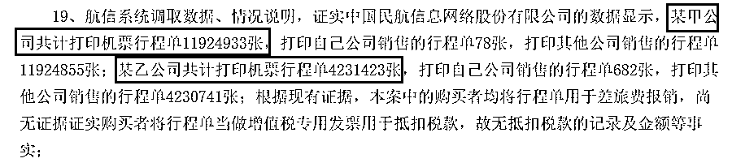

# 太猖狂！88 年阿里旗下员工，四年贩卖 66 亿机票行程单，结果…

> 原文：[`mp.weixin.qq.com/s?__biz=MzIyMDYwMTk0Mw==&mid=2247510678&idx=2&sn=9c6cfa3081aecd692b3ef08fbf5dbc7e&chksm=97cb61aea0bce8b83eeef035febbbd05501fa0f162b1c054878f1fa1f6a7411ecbbf2d78a588&scene=27#wechat_redirect`](http://mp.weixin.qq.com/s?__biz=MzIyMDYwMTk0Mw==&mid=2247510678&idx=2&sn=9c6cfa3081aecd692b3ef08fbf5dbc7e&chksm=97cb61aea0bce8b83eeef035febbbd05501fa0f162b1c054878f1fa1f6a7411ecbbf2d78a588&scene=27#wechat_redirect)

利

**电子客票的行程单是很多单位报销差旅费的凭证，有人就把主意打到了这上面，靠出卖行程单获利。**

**近日，裁判文书网披露了一起非法出售发票大案，涉及票面金额 66 亿元！**

****

**我们仔细阅读了一下裁判文书的内容，细思极恐。**

**案件显示，阿里飞猪交通业务部国内交通（机票）运营专员罗某，出生于 1988 年，利用职务之便非法获取的电子客票号，打印国内各大航空公司或各大机票销售代理平台售出的机票行程单，并予以销售。**

**经查，罗某及其妻子在 2015 年到 2019 年 4 年间，前后打印了 1600 多万张机票行程单，共非法获利人民币 1000 万元以上，涉及票面额人民币 66 亿元以上。**

****88 年阿里飞猪员工倒卖航空行程单****

****4 年获利超 1000 万元****

********

******根据裁判文书显示，2015 年 7 月，罗某入职飞猪公司，担任阿里飞猪交通业务部国内交通（机票）运营专员，负责飞猪公司自营的五家机票代理店铺业务。******

************

******在 2015 年至 2019 年期间，罗某及其妻子刘某等 7 人使用上海某商务咨询有限公司（以下简称某甲公司）、杭州长隆航空服务有限公司（以下简称简称某乙公司）的账号密码登录 eTerm 系统，利用非法获取的电子客票号，在位于杭州市余杭区的家中，打印国内各大航空公司或各大机票销售代理平台售出的航空运输电子客票行程单后进行销售。******

******罗某的电子客票号一方面来自于职务便利获取，从飞猪公司内部盗取电子客票号码，另一方面通过向其他公司或个人购买。******

******根据裁判文书显示，2016 年初，罗某以代打行程单名义向上海某商务咨询有限公司股东郭某提出租赁该公司的账号密码及购买空白行程单，租账号密码的费用是 1200 元／月，空白行程单 0.15 元／张。******

******2016 年，罗某以其妻妹的名义注册了杭州长隆航空服务有限公司，后以该公司名义登录航信系统打印行程单及领取空白行程单。******

******除了从飞猪公司内部盗取电子客票号码外，王曦、潘某也向罗某提供电子客票号码。2019 年 3 月，罗某联系潘某要电子客票号码，谈好 0.3 元／个，潘某让焦某通过ＱＱ邮箱发给罗某，一共向其提供约 130 万个电子客票号码，罗某向潘某、焦某支付现金 40 万元左右。******

******根据裁判文书显示，罗某及其家人通过上海某商务咨询有限公司（简称某甲公司）、杭州长隆航空服务有限公司（简称某乙公司）在上述期间打印了 1600 多万张航空行程单。**共计非法获利人民币（以下币种同）1000 万元以上，涉及票面额 66 亿元以上。********

************

********最终，罗某犯非法出售发票罪，判处有期徒刑六年**，并处罚金人民币四十五万元（刑期自判决执行之日起计算。判决执行前先行羁押的，羁押一日折抵刑期一日。即自 2019 年 10 月 17 日起至 2025 年 10 月 16 日止。罚金限判决生效后十日内缴纳）。追缴罗某等人的违法所得，上缴国库。******

******另涉案六人分别获刑 3-5 年不等。******

******机票行程单被冒领引发投诉******************

******因航信系统里的行程单只能打印一次，被罗某以及家人的上海某商务咨询有限公司、杭州长隆航空服务有限公司打印行程单的乘机人，通过真实出票单位的航信系统能查到行程单是被哪家公司打印。******

******据上海某商务咨询有限公司（以下简称某甲公司）创始人郭某交代，郭某还将其的上海手机号码给罗某用，用于处理投诉的事情，投诉内容是某甲公司打印了其他公司售出的机票行程单。******

******当时郭某询问罗某上述事情，罗某称是误打；2018 年 5 至 6 月，大量票务公司打电话给郭某，称其公司盗打了他们公司已出售未出票的行程单，郭某才知道罗某利用其公司名义盗开其他公司的行程单，但因为郭某贪财没有多问，也没管到底是不是盗开；罗某前后大概给郭某 100 多万，后者获利 80 万元左右。******

********罗某会怎么处理这些投诉呢？********

******据罗某交代，其妻妹刘某 2 负责对接客户、打印并邮寄行程单、对接投诉等工作，妻子刘某 1 偶尔帮忙接投诉电话，其中飞猪的投诉通过钉钉联系，其他平台客服通过某甲公司、某乙公司的对外号码联系。******

******如果被打印的行程单没有寄出，就直接寄给投诉人，如果已经卖掉，就用补打系统再打一张行程单。******

******面额万元的行程单******

******售价 30 元******

************

******基金均在裁判文书中还注意到一个细节。******

******根据现有证据，本案中的购买者均将行程单用于差旅费报销。那么购买行程单的价格又如何呢？******

******证人曾某的证言，证实 2017 年 1 月至 2019 年 1 月，其为报销及为同事购买行程单，其间，其微信转账共计 48020 元，平均 1 万元面额价格为 30 元，涉及行程单面额约 1600 万元。******

************

******而根据前面的供述，罗某购买空白行程单的成本不过 3 毛钱左右。这其中的暴利让人铤而走险。******

******天网恢恢，疏而不漏。暴利让人迷失了心智，但是终究逃不过法律的制裁！******

******来源：中国基金报******

************************

******← 向右滑动与灰产圈互动交流 →******

************