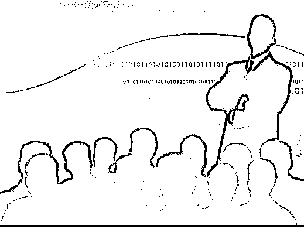
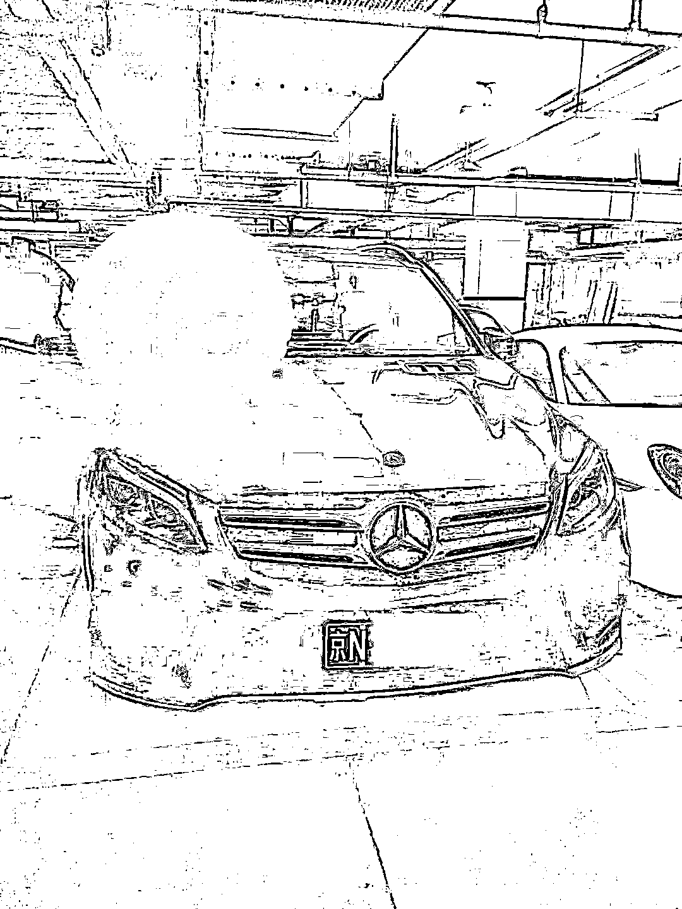
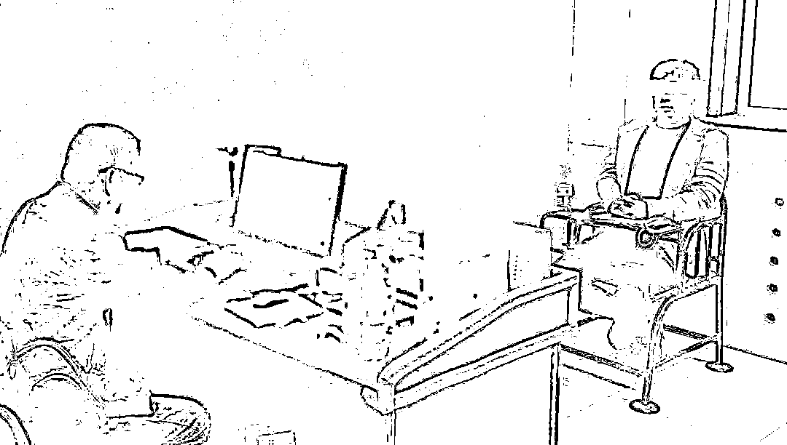

# 住别墅、开豪车、实控 11 家公司……这名“霸道总裁”对温州商人下手后现形了！

> 原文：[`mp.weixin.qq.com/s?__biz=MzIyMDYwMTk0Mw==&mid=2247510678&idx=3&sn=3269bf3fe244bdb684f7b8965ccb36e1&chksm=97cb61aea0bce8b878cbb950d892d66b27f7735eb165fc6a3eccda3e876410f01512a91e1f62&scene=27#wechat_redirect`](http://mp.weixin.qq.com/s?__biz=MzIyMDYwMTk0Mw==&mid=2247510678&idx=3&sn=3269bf3fe244bdb684f7b8965ccb36e1&chksm=97cb61aea0bce8b878cbb950d892d66b27f7735eb165fc6a3eccda3e876410f01512a91e1f62&scene=27#wechat_redirect)

他，表面上住别墅、穿名牌、开豪车，过着豪奢生活，背地里，骗财骗色。去年疫情期间，化名卓某的东北男子仇某因签订虚假销售熔喷布合同，对永嘉商人叶某行骗被警方抓获。这个外人眼里的顶级“富豪”终于现出原形。日前，该案移交上海警方做进一步调查。

***“家世显赫”***

**开豪车住别墅还有 11 家公司？**

家住北京最顶级的别墅区，座驾是价值几百万元的兰博基尼，随便吃顿晚饭就消费数万元，名下实际控制 11 家公司……这样的大手笔，即便是在富人云集的北京城，也称得上是顶级“富豪”了吧。 

图片来源：CFP

东北男子仇某今年 34 岁，他自称英籍华人，从小在部队大院长大，家族背景显赫。他身材高大，又打扮时尚，举手投足间，一副成功人士的派头。由于特殊的身份，所有人只知道他叫卓某，对于他的真实身份，身边的人都不知情，包括最好的生意伙伴张某，以及多位亲密女性伙伴。他虽然出资注册了多达 11 家公司，但大多数都是合伙人张某出任法人。而作为仇某的“代言人”，在张某的助力下，仇某显赫的家族背景和经济实力更是让外界深信不疑。

仇某的豪车之一。

他出手非常阔绰，送给别人的礼物都是 10 多万元一副的水晶限量版象棋，出门住的宾馆都是几万元一晚豪华套房，上百万元的豪车，只要有一点刮擦，马上换车。”据一位知情人士介绍，正是因为生活太奢华，他的真实身份几年来一直没被人怀疑过。

***“温柔陷阱”***

**富婆被骗千万还为其生下小孩**

几年前，由于业务需要，他在给名下公司租赁场地时，认识了在北京从事房产中介的杨女士，由于租赁业务频繁，一来二去两人成为朋友，再由朋友发展成了男女朋友关系。在杨女士眼里，仇某成熟稳重，温柔体贴，并且事业有成，值得自己托付终身。

在北京从事多年房产中介行业，杨女士自身也身家不菲，有自己的别墅和豪车。“有一次他说自己要投资，让我给他资金周转，我就把我的别墅以 800 万的价格出售了，并且把钱给他用于投资。”杨女士说，仇某回头就花了 360 多万元买了一辆兰博基尼超跑，但是没过多久，因资金遇到困难，这辆超跑被 200 多万元贱卖。“而 200 多万元的卖车款，我也没看到，应该是被他挥霍了。”直到警察找上门，将仇某抓获，杨某甚至不敢相信眼前的一切是真的，而此时她和仇某的孩子出生仅 23 天。除了卖别墅的 800 万元，杨女士前后共有近千万元被杨某拿走。 

不仅是杨女士，仇某还同时交往另 3 个女朋友。生女士是 2019 年 5 月在卖家具的时候和仇某认识。此后，两人发展成为恋人关系，她被仇某以各种理由借走了 160 万元。她没想到，眼前的“富豪”男友竟然是一个骗子。

***“现出原形”***

**疫情期间虚构交易被打回原形**

2019 年 11 月，在上海经商的永嘉商人叶某通过张某认识了仇某，在多次推杯换盏、觥筹交错后，仇某的大方阔气，让叶某也对他的身份和实力深信不疑。 

2020 年 3 月份疫情期间，仇某获悉叶某的服饰有限公司有做口罩需要熔喷布材料后多次向叶某介绍熔喷布的事情，并吹嘘自己有条件和能力搞到低价的熔喷布。

2020 年 4 月 7 日至 4 月 30 日，叶某以公司名义和个人名义，以每吨 32 万元~33 万元的价格分 5 次向法人代表为张某的某商贸公司（实际控制人是仇某）购买价值 700 多万元的熔喷布。

但事后，仇某仅仅向叶某发送了 800 公斤质量不合格的熔喷布。在发现熔喷布达不到要求后，且仇某迟迟未能履行合同，叶某起了疑心，要求仇某解除合同，并退还 700 多万元的货款。事后，仇某迫于压力，仅退还了 200 多万元，并且将叶某微信拉黑失联。叶某随后向永嘉警方报警，随后仇某和张某落网。

根据警方查实，仇某，黑龙江省人，大学专科文化，是一个有诈骗前科的人员，他曾于 2013 年因信用卡诈骗被哈尔滨市人民法院判处缓刑。就此，北京顶级“富豪”仇某的面具被揭穿。

来源：温州商报

← 向右滑动与灰产圈互动交流 →

