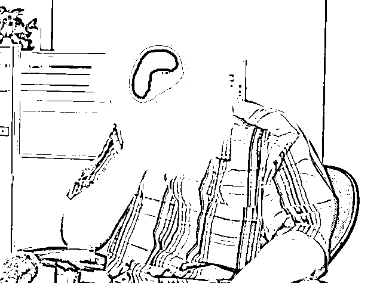

# 7 名中国人被骗到东南亚赌博，惨遭勒索、虐待！狗链锁脖、关笼毒打......

> 原文：[`mp.weixin.qq.com/s?__biz=MzIyMDYwMTk0Mw==&mid=2247510678&idx=4&sn=bb50431b4bd14305531ea8f30371ec46&chksm=97cb61aea0bce8b85cf3ad7fed0fc925fce9d798c084a0bba29ecf1667e6df03f48c4bf747db&scene=27#wechat_redirect`](http://mp.weixin.qq.com/s?__biz=MzIyMDYwMTk0Mw==&mid=2247510678&idx=4&sn=bb50431b4bd14305531ea8f30371ec46&chksm=97cb61aea0bce8b85cf3ad7fed0fc925fce9d798c084a0bba29ecf1667e6df03f48c4bf747db&scene=27#wechat_redirect)

近年来，中国人在东南亚被绑架勒索和虐待的事件频频发生，人们很难想到，繁华的旅游胜地东南亚，它的神秘背后竟然蕴藏着难以想象的危险。

近日，中国重庆警方联合东南亚某国警方，成功侦破一起震惊海内外的跨境赌博衍生的绑架勒索案。

境外不法分子打着免费旅游的名义，掏空受害者的身家，丧心病狂地折磨他们的肉体，让他们过着炼狱一般暗无天日的生活......这一案件一经曝光，引发了人们的极度关注与热议。

**7 名中国人被绑架至东南亚虐待**

**惊人手段残忍到无法想象**

****

****这场令人震惊的跨国大案，受害者前后多达 290 余人，其中有 7 名中国人，他们在被警方解救后，讲述了那段不堪回首的噩梦:****

********

****受害者（河北人）：都是用棍子打的，手臂上都是淤血，棍子打、鞭子抽，两个脚全是肿的。****

****受害者（女）：他们打人的时候，我说我不敢看， 我站着发抖，他们说你要看，不看就打你。我闭上眼睛，他们就揪我头发，逼我看他们打人。****

****我害怕，心都在抖，我每一天都睡不着觉，每天都做噩梦。他们说， 杀你一个人就像捏死一只蚂蚁一样。****

****受害者（江苏人）：蹲在厕所里，把衣服脱光，用冷水洗澡，用脚踹，一边还跟我家里视频， 当场我妈就进医院了。****

****受害者（河北人）：有一个进去比我晚，他欠七万人民币，鼻梁骨断了，手断了，胳膊断了， 脚最后都不动了，还打。****

****这些话光是听着就让人头皮发麻并且气愤不已，我们无法想象他们经历怎样的痛苦。****

********

********

********

********

****据悉，犯罪分子对受害者使用电棍、警棍、手铐，不把人当人，用狗链子把脖子锁起来，有的还关到铁笼子里边，惨无人道的非人待遇，还用竹签子插十指手指甲......手段简直连“残忍”一词都不足以形容。****

******这起惨案是如何侦破的******************

******这起案件之所以浮出水面并成功告破，还要从一起报案说起。******

******去年 10 月份，一位中国男子到重庆市公安局渝中区分局报案，称他在东南亚某国遭遇了绑架，并被勒索赎金 61 万元巨额赎金。******

************

******他向警方说道：“他们太凶残了，我仿佛进了人间炼狱。”并告知民警，在东南亚某国和自己一样被绑架的还有多人，他们一起被关押在暗室，经历各种虐待。******

******重大复杂的案情引起了警方高度重视，重庆市公安局迅速成立“10·21”专案指挥部，集约多警种 330 余名精干警力，全力侦破此案。最终联合东南亚某国警方共同侦破这起案件。******

******以为“天上掉馅饼”******

******岂料坠入精心策划的骗局******

************

******其实不管是最初报案的中国男子，还是后来解救出的受害者，其实都是中了犯罪分子的骗局。******

************ 

******经过深入侦查取证，发现这是一个分工明确、危害巨大的跨国犯罪集团。其作案手法是通过境外“洗码客”和“中介”寻觅赌客，以提供赌博筹码为诱饵将赌客诱骗至东南亚某国一赌场，然后实施绑架伤害，向家属勒索财物。******

******犯罪分子一开始惯以免费出国旅游为诱饵，以令人心动的“邀赌”微信出发。其实，这背后是一场精心策划的骗局，一旦你坐上了飞机，就是噩梦的开始......******

************

******到达东南亚就会被不法分子绑架和非法拘禁，并且将经历威胁、毒打和勒索赎金等遭遇，不仅身心会受到极大摧残，更是会过上炼狱一般的生活......******

************

******这起让人震惊的跨国大案******

******终于成功告破！******

******受害者前后多达 290 余人******

******遍及全国 29 个省市区******

******涉案资金达 7000 余万元******

******重庆警方 57 个抓捕组同时行动******

******抓捕犯罪集团成员 121 人******

******在国外现场解救被绑架的 7 名受害者******

******提醒大家，“天上不会掉馅饼”，不要轻易落入不法分子圈套。此外，跨境赌博风险巨大、危害巨大，一旦沾上往往深陷其中难以自拔，轻则钱财散尽，重则家破人亡，走向毁灭。******

******大家要认清跨境赌博“十赌十骗”，“十赌十输”的骗人本质和严重危害。自觉提高拒赌反赌意识，不参赌，不从事与赌博相关的工作。从根源上杜绝危险。******

******来源：网络******

************************

******← 向右滑动与灰产圈互动交流 →******

************