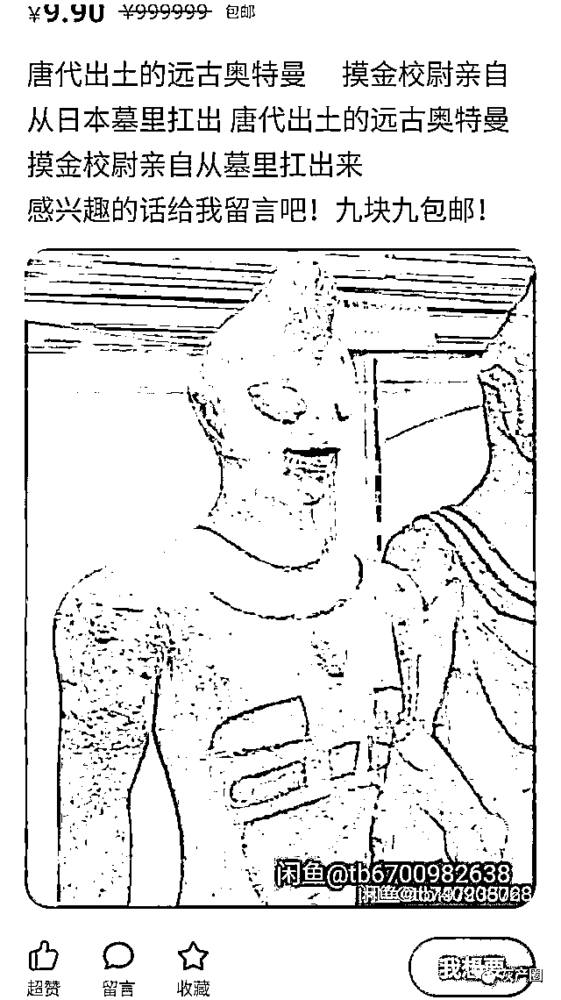
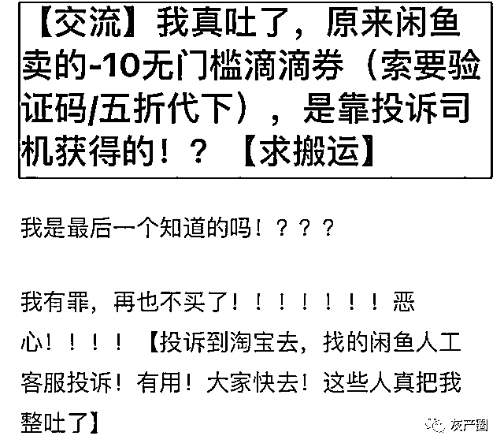

# 闲鱼上的这种生意太缺德，正常人干不出，为了赚钱不要良心？

> 原文：[`mp.weixin.qq.com/s?__biz=MzIyMDYwMTk0Mw==&mid=2247510765&idx=1&sn=afc319438aff6140d66cdfd09ccc010e&chksm=97cb61d5a0bce8c3f22b0c6630678777d73b66ce1c30a5af0cba2de44dddaf753cafa914e352&scene=27#wechat_redirect`](http://mp.weixin.qq.com/s?__biz=MzIyMDYwMTk0Mw==&mid=2247510765&idx=1&sn=afc319438aff6140d66cdfd09ccc010e&chksm=97cb61d5a0bce8c3f22b0c6630678777d73b66ce1c30a5af0cba2de44dddaf753cafa914e352&scene=27#wechat_redirect)

伴随着电商行业的飞速发展，网上购物逐渐成为人们消费的重要途径。

淘宝、京东、苏宁易购等网上购物平台看得人眼花缭乱，但要论起商品的多样性还得看闲鱼。

闲鱼的定位是二手交易市场，其二手市场的特性决定了它的用户既可以是买家，也可以是卖家。

和淘宝等购物平台繁琐的卖家注册流程不同的是，打开闲鱼，在首页点击“+”号，你便可以出售物品，成为卖家。

对于资深的淘货买手来说，闲鱼还是一个捡漏的好地方，有些富有的朋友常常会以极其低廉乃至干扰二手市场的价格卖出一些新鲜的数码产品，当然手速快的同时也得眼睛亮，闲鱼上“自用、爱惜、大学生”已经成为一些二道贩子的常用词。

正儿八经卖东西可以，抖机灵？也 OK。

闲鱼常年存在着各种抖机灵的神贴，从会修车的猫到唐代出土的奥特曼，很无聊的话逛闲鱼解闷也不失为一个办法。

成为闲鱼卖家很容易，但闲鱼也不是完全没有监督机制的，违法违规的商品肯定不能卖，商品中带了“代做作业”、“代做设计”的关键词，也可能迎来限流或者下架、警告。

总而言之，闲鱼还是有规矩的。

有些人则学会了在规矩里面找窟窿，严格意义上来说，他们破坏的不单是闲鱼的规矩。

优惠券，各种 APP 的，肯德基、麦当劳、滴滴、饿了么等 APP 的优惠券在闲鱼上是抢手商品。

打工人，能省一分是一分。

两块九买 10 块的优惠券，这种明显稳赚不亏的买卖多诱人啊？

如下图的滴滴快车券在网上销量惊人，单个链接下面就有一百多人想要。

随便点进一个卖家的主页，笔者发现对方仅仅一天就卖出了 11 件商品，都是滴滴的 10 元抵用券。

其他售卖快车券的卖家也差不多是这个水平。

一个人上哪能得到这么多优惠券呢？

滴滴也不是做慈善的企业，就算做慈善了，那也是给 100 个用户一人发一张券，怎么可能给一个人发一百张券呢？

点进快车券的商品页面，写着“拍下给我号，秒到”。

一般来说，直接给你兑换码让你自己兑换，由对方代下单再给你取餐码之类的都是正儿八经的优惠券，有来处有去处的那种。

“给个号，秒到”是个新奇的说法，一位曾经购买过快车券的豆瓣网友给出了这些卖家的“货源”。

这些优惠券是靠着投诉滴滴司机获得的。

这名豆瓣网友在闲鱼购买快车券后，发现滴滴给自己发了一条通知——投诉已处理。

这条投诉不是网友本人发起的，而是购买快车券后，对方上网友的号完成的操作。

有网友从卖家处得知，找人工客服投诉司机迟到，有概率获得 10 元快车券。

因此，这些滴滴快车券卖家才能有这么大的“货源”，有来者不拒的底气。

有网友告知原豆瓣楼主，投诉司机并不会扣司机钱，但会扣分，而这个分数和接单息息相关，分高有单接，分低接不到。

司机也可以对乘客不合理的投诉进行申诉，网友补充，在维护司机权益上，滴滴已经是最成熟的一个 APP 了。

尽管司机可以申诉，但像这样大批量地卖出快车券，有那么多针对司机的投诉，说不定一个司机会迎来好几个不合理投诉，无疑增加了司机的工作量。

该豆瓣网友在得知快车券是通过投诉司机获得后立刻投诉了卖家，找闲鱼人工客服投诉是有用的。

滴滴出行关注到相关内容后，表态称将配合公安机关严厉打击黑色产业链，也会和闲鱼沟通下架涉事商家。

效果并不乐观，3 月 9 日仍能在闲鱼上搜索到大量的“10 元滴滴快车券”，在笔者搜索的时候，正巧碰上几张快车券被“卖”出。

贩卖快车券的用户不只一个，他们的昵称多为“滴滴 XX”。

有的被禁言了。

有的还没有。

不少买家在购买优惠券的时候并不了解优惠券的来源，平台和司机即使想要追责也只能追到可能一无所知的买家身上，但买家也是无辜的，只能咬碎牙往肚里咽。

整个过程里只有赚黑心钱的卖家真的“赚”了。

靠着滴滴一个平台显然不能完全杜绝类似事情的发生，闲鱼无疑要在监管机制上更用心。

单单封号是不够的，类似的“滴滴 XX”账号封了一个还有一个，但一刀把滴滴优惠券都封了也不合适，肯定会误伤正儿八经卖优惠券的卖家，闲鱼还需要多多探索，制定行之有效的监管、举报机制。

来源：冷眼旁观蛋

← 向右滑动与灰产圈互动交流 →

