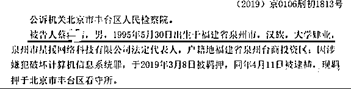
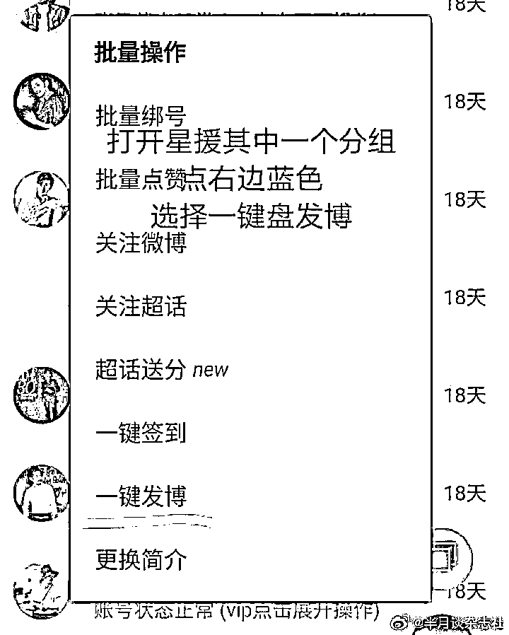
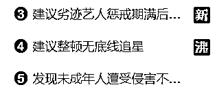
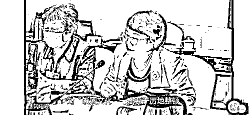
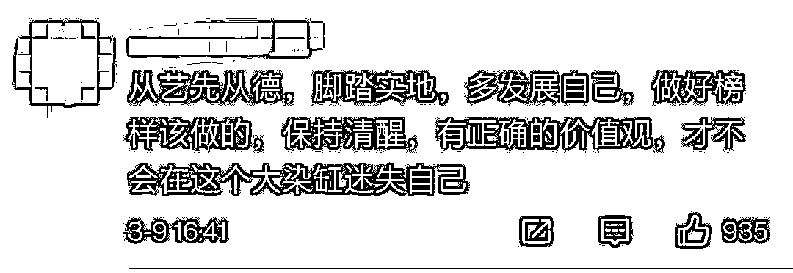
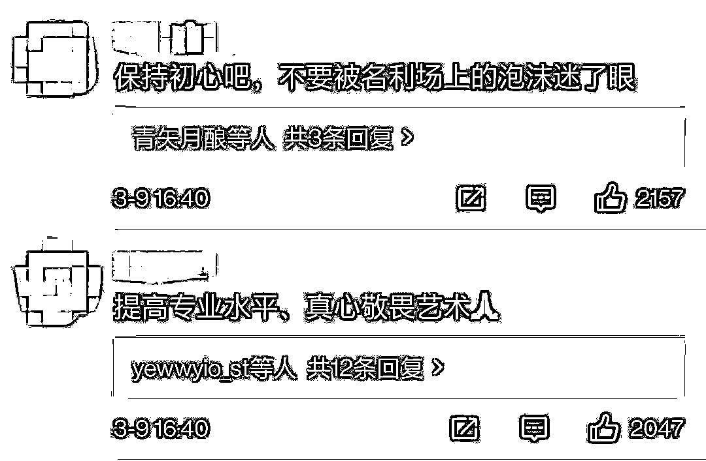

# “蔡徐坤微博转发过亿”幕后推手获刑 5 年！

> 原文：[`mp.weixin.qq.com/s?__biz=MzIyMDYwMTk0Mw==&mid=2247510765&idx=4&sn=25e34e08c9b5d43538221fd380658263&chksm=97cb61d5a0bce8c31e9cc8c7ce1a4b8a66836ffa50735228525b04828648ca2559b56fcf3af7&scene=27#wechat_redirect`](http://mp.weixin.qq.com/s?__biz=MzIyMDYwMTk0Mw==&mid=2247510765&idx=4&sn=25e34e08c9b5d43538221fd380658263&chksm=97cb61d5a0bce8c31e9cc8c7ce1a4b8a66836ffa50735228525b04828648ca2559b56fcf3af7&scene=27#wechat_redirect)

2018 年 

“蔡徐坤一条微博转发过亿”事件

引发舆论对流量造假的关注

按照当时的微博用户数量

转发量一亿意味着每三个微博用户中

就有一人转发了蔡徐坤的微博

人民日报官微曾评论称

**“一亿转发量”，你们也真敢刷。”**

2019 年 6 月

操纵上述微博刷量事件

的幕后推手“星援”APP 被查

近日

中国裁判文书网公布了

“星援”APP 开发者蔡坤苗的判决书

**其因提供侵入计算机信息系统程序罪**

**一审获刑五年**

非法侵入计算机程序

95 后男子获刑

裁判文书透露，被告人蔡某某，男，1995 年 5 月 30 日出生于福建省泉州市，汉族，大学肄业，泉州市星援网络科技有限公司法定代表人。被告人于 2019 年 3 月 8 日被北京市公安局丰台分局太平桥派出所民警抓获，到案后如实供述基本犯罪事实。

北京市丰台区法院审理查明，2018 年 1 月至 2019 年 3 月间，被告人蔡某某未获得被害单位北京微梦创科网络技术有限公司授权而**自行开发“星援”APP，有偿为他人提供不需要登录新浪微博客户端即可转发微博博文及自动批量转发微博博文的服务。**后大量用户以向“星援”APP 充值的形式有偿使用该软件，并通过运行上述软件侵入新浪微博服务器。

经鉴定，“星援”APP 通过截取新浪微博服务器中对应账号的相关数据，后使用与其截取数据相同的网络数据格式向该服务器提交数据并完成与该服务器的交互，以实现**不登录新浪微博客户端即可转发微博博文的功能以及自动批量转发微博博文的功能。**

经统计，至案发时该软件已有用户使用 19 万余个控制端微博账号登录，被告人蔡某某获取违法所得人民币 6253752.86 元。

**法院判决，被告人蔡某某犯提供侵入计算机信息系统程序罪，判处有期徒刑五年，并处罚金人民币十万元。**

热搜“沸”了！

代表建议整顿无底线追星行为

在当下，“饭圈文化”已经成为我们无法忽视的一种社会现象，其中涌现的私生饭、拉踩、互撕等非理性追星行为更是引起了人大代表们的关注。

**宋文新：整顿无底线追星**

今年两会期间，全国人大代表、泰安市文化产业中等专业学校副校长宋文新就建议整顿“无底线追星”行为，并表示艺人走红应靠作品而非流量。

“我理解无底线就是他的粉丝投入了大量的时间、大量的精力、大量的金钱去追星了，并且这个追星已经成为一个体系化或者团队化，或者已经出现有组织了，你追他就不是一种偶像了。”

宋文新认为，尤其是**“无底线追星”中的私生饭和饭圈互撕，破坏了社会秩序，超出了“饭圈文化”的合理边界，需要大力整顿。**

**韦震玲：明星后援会应依法登记**

全国政协委员、广西柳州市检察院副检察长韦震玲说，由于资本的介入，近年青少年追星乱象愈演愈烈，比如集资给明星送金条、奢侈品等应援礼物，收买营销号为明星及相关公司打榜带流量，网络骂战诋毁诽谤其他明星或明星的粉丝，有的已涉嫌违法犯罪。

她说，演艺明星的粉丝后援会在运作上实际已经是社会组织，通过网络组织人员、筹集资金，号召粉丝买明星代言的产品，具备了较强的社会动员能力，对于它们的约束、管理目前是真空状态。

**粉丝后援会应该在民政部门登记，明确责任，规定权利、义务，“能组织做什么活动，是否能够筹集经费，在哪个层面筹集，必须按照相关规定登记备案，依法开展活动、接受年检。”**

**廖昌永：艺人要严格要求自己** 

**全国人大代表、歌唱家廖昌永在两会期间接受采访时表示，面对一夜爆红，艺人要保持清醒，不要迷失自我。**

[`v.qq.com/iframe/preview.html?width=500&height=375&auto=0&vid=h3232jo47b6`](https://v.qq.com/iframe/preview.html?width=500&height=375&auto=0&vid=h3232jo47b6)

廖昌永表示，很多年轻偶像、明星一夜爆红，集万千宠爱于一身，粉丝把缺点都屏蔽了，很容易迷失自我。这时候“粉丝要冷静、媒体要冷静、艺人要冷静”。 

正因为粉丝对偶像有多高期待，就可能有多大失望。所以艺人要严格要求自己、提高专业水平、真心敬畏艺术。艺人只爱自己、不爱观众的时候，就是观众离开的时候。

网友：从艺先从德

来源：看看新闻 Knews、中国青年报、人民日报、中国裁判文书网、澎湃新闻、观察者网

← 向右滑动与灰产圈互动交流 →

