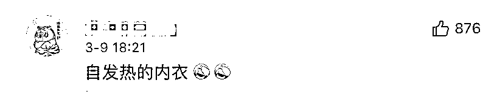

# 当护肤品用上了“量子技术”

> 原文：[`mp.weixin.qq.com/s?__biz=MzIyMDYwMTk0Mw==&mid=2247510765&idx=5&sn=9de8935574f1be47800192b8ccda0644&chksm=97cb61d5a0bce8c33cba3b53b80b656f3861270cdde36ba19b270b630d1572cfb8e1b27e6e1d&scene=27#wechat_redirect`](http://mp.weixin.qq.com/s?__biz=MzIyMDYwMTk0Mw==&mid=2247510765&idx=5&sn=9de8935574f1be47800192b8ccda0644&chksm=97cb61d5a0bce8c33cba3b53b80b656f3861270cdde36ba19b270b630d1572cfb8e1b27e6e1d&scene=27#wechat_redirect)

大家一定都见过，市面上有一些护肤品标有 “量子护肤” “量子面膜”等等词汇，用于吸引顾客，但商品中所称的 “量子”是真的吗？ 

3 月 9 日，中国科学院院士潘建伟在接受央视新闻采访时给出了明确回答：

量子护肤如果宣称用了 “量子技术”肯定是假的。因为量子比较时髦，大家都喜欢挂个名。但我觉得护肤品真的是好的话，不需要挂量子，挂了这个肯定不是特别好的护肤品。 

**网友：智商税产品**

[`v.qq.com/iframe/preview.html?width=500&height=375&auto=0&vid=b3232mjlrhh`](https://v.qq.com/iframe/preview.html?width=500&height=375&auto=0&vid=b3232mjlrhh)

在评论区

网友们更是吐槽了

一堆智商税产品

**你还见过哪些“高科技”？**

来源：红网、中国青年报、央视新闻

← 向右滑动与灰产圈互动交流 →

