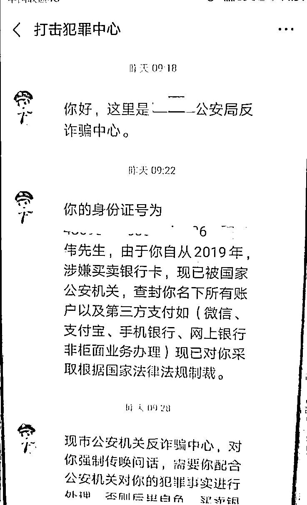
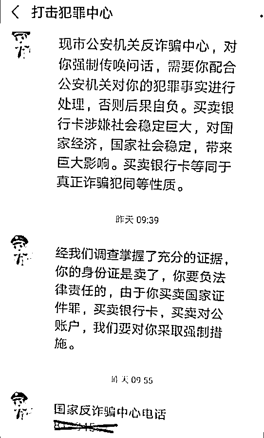
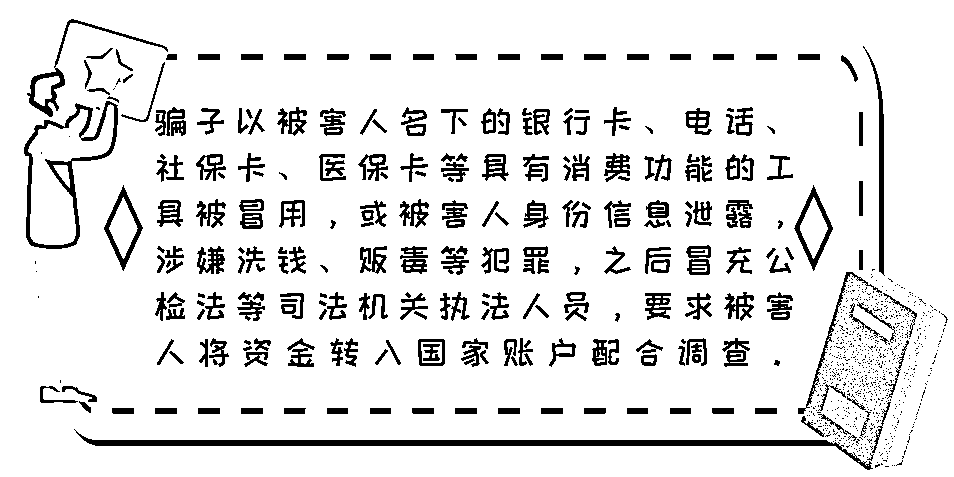
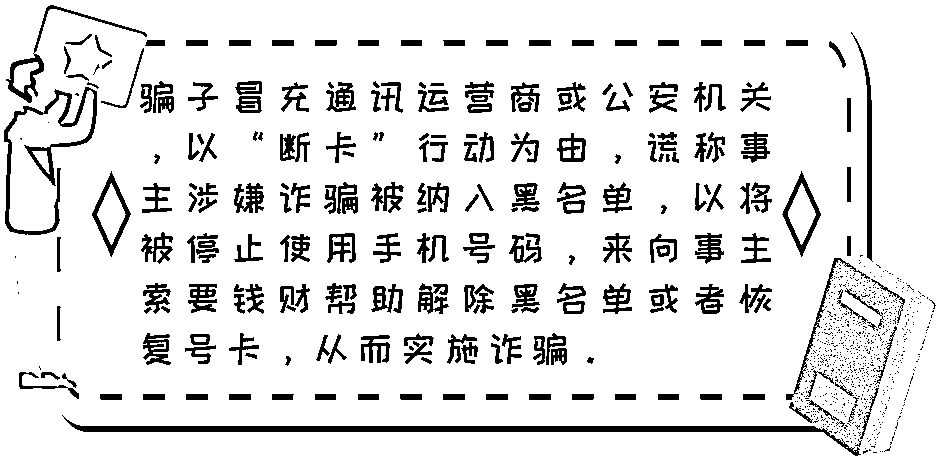

# 注意！诈骗理由再升级，这次骗子盯上的是“断卡行动”！

> 原文：[`mp.weixin.qq.com/s?__biz=MzIyMDYwMTk0Mw==&mid=2247510765&idx=6&sn=4b5efdbf74eebf093bef7890823c6921&chksm=97cb61d5a0bce8c36b6887706571282c6b5ffc3d512c27952af78982dd49610ec2b439c5de7f&scene=27#wechat_redirect`](http://mp.weixin.qq.com/s?__biz=MzIyMDYwMTk0Mw==&mid=2247510765&idx=6&sn=4b5efdbf74eebf093bef7890823c6921&chksm=97cb61d5a0bce8c36b6887706571282c6b5ffc3d512c27952af78982dd49610ec2b439c5de7f&scene=27#wechat_redirect)

当收到自己的银行卡和电话卡

“涉嫌诈骗、网络赌博”

的短信和电话时

不少小伙伴都能意识到

这是明显的**电信诈骗套路！**

但对方自称公、检、法单位工作人员

并且能准确说出

你的姓名、身份证号等信息时

一些小伙伴刚开始也会心存疑虑稍加分辨，也能明白这是**冒充“公检法”诈骗的套路！**

但是诈骗分子最近又使出新花招他们不仅冒充公检法及通信局工作人员还在话术中加入**“断卡”专项行动**企图为“电信网络诈骗”披上正义的外衣！

** 案例回顾**

2021 年 1 月 6 日，市民刘先生接到电话，对方自称陕西省通讯管理局工作人员。

在电话里，对方告知刘先生：

     通过近期的**“断卡行动”**，公安机关发现您名下有张电话卡涉嫌发送诈骗短信，需要您配合调查。

骗子 1

刘先生一听便否认了自己办理电话卡的行为，这时，对方让刘先生自行报警处理。

但刘先生表示不想报警，对方便将刘先生的电话“转接”到“武汉公安局”。

“转接成功”后，一个自称“武汉打击治理中心民警”的“周警官”表示：会帮刘先生查询下他的“案件情况”。结果让刘先生吓一跳，据“周警官”称：

骗子 2

    你有大麻烦了，你名下不止有手机卡“涉案”，还有一张银行卡也涉及案件！

听到这里，刘先生慌了，赶紧问“周警官”自己下一步要如何“配合调查”。周警官让刘先生添加微信方便下一步联系。

添加成功后，他先是给刘先生看了自己的警官证，随后在对话中称刘先生涉嫌买卖银行卡，现会对刘先生名下的所有账户及第三方支付账号进行查封，并要采取强制措施。

刘先生一再表示自己没有任何“贩卡”的行为，**“周警官”称可以帮刘先生“证明清白”。**

怎么帮？“周警官”娓娓道来——

骗子 2

      你先把名下所有的银行卡的资金情况交代一下。首先要去银行办一张新卡，然后再将全部资金转入进这张新卡，才能确保你的财产安全。

刘先生为了快点洗清自己的嫌疑，立即按照“周警官”的要求办理银行卡，而后“周警官”又以“验证资金情况”为由**向刘先生索要手机收到的验证码。**

当刘先生报出了四次短信验证码之后便接到新开卡银行的客服来电，**告知刘先生被扣款 20 万元。**

这时刘先生联系“周警官”询问情况，发现被对方拉黑，**这才意识到被骗并报警。****骗术虽然不是新骗术****但是诈骗理由却是新理由****以往的骗局是**

**而此次新型骗局是**

尽管电信网络诈骗手段不断翻新但万变不离其宗都离不开手机卡和银行卡！

2020 年 10 月 10 日，国务院打击治理电信网络新型违法犯罪工作部际联席会议部署在全国范围内开展**“断卡”行动**，严厉打击整治非法开办贩卖电话卡、银行卡违法犯罪。

[`mp.weixin.qq.com/mp/readtemplate?t=pages/video_player_tmpl&action=mpvideo&auto=0&vid=wxv_1558513463340105732`](https://mp.weixin.qq.com/mp/readtemplate?t=pages/video_player_tmpl&action=mpvideo&auto=0&vid=wxv_1558513463340105732)

△央视财经《正点财经》栏目视频

**警方提示**

市民群众若存在有身份证有遗失经历、前期电话卡或者银行卡有异常等情况，一定要抽空去查询下名下是否有不知情的电话卡或者银行卡存在，**以免被当作“违法犯罪嫌疑人”进行打击、惩戒，影响个人生活。**

此外，存在出售、出借、出租手机卡、银行卡等违法犯罪行为的，请迅速到公安机关投案自首，争取宽大处理。

如何防范电信网络诈骗？

**谨记“三不一多”原则****:**

未知链接**不**点击

陌生来电**不**轻信

个人信息**不**透露

转账汇款**多**核实

来源：深圳市公安局，邯郸市反诈中心

← 向右滑动与灰产圈互动交流 →

