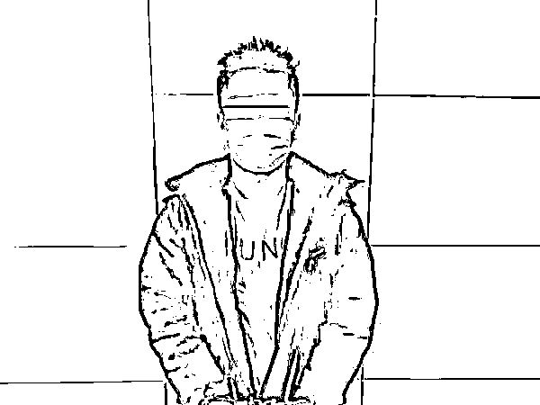
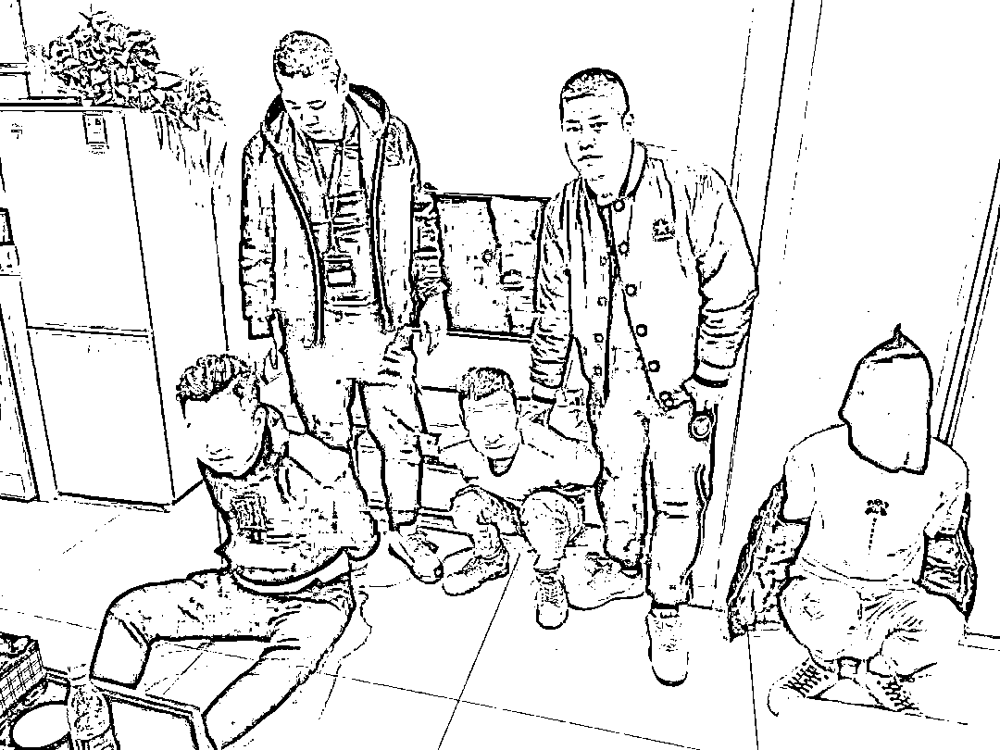
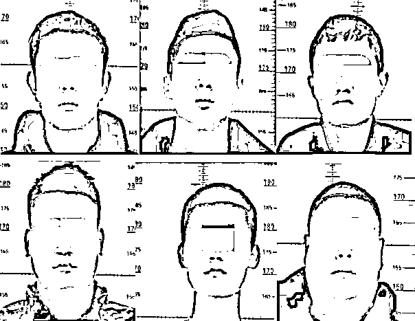
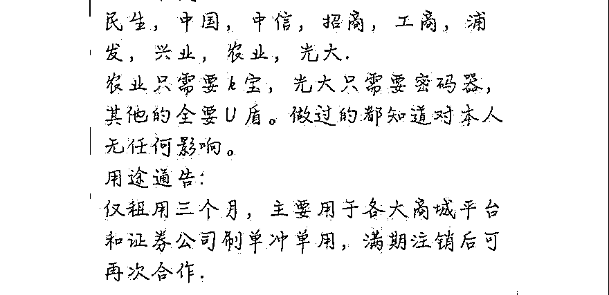

# 临沂公安重拳断卡！又有多人因此被抓！

> 原文：[`mp.weixin.qq.com/s?__biz=MzIyMDYwMTk0Mw==&mid=2247510765&idx=7&sn=3be37c66a649f2d29e6de60d1b1b02a3&chksm=97cb61d5a0bce8c36372b2fb273caa99f63645c0ca9625bc5faaaa1e434f07ef1006ebae3c08&scene=27#wechat_redirect`](http://mp.weixin.qq.com/s?__biz=MzIyMDYwMTk0Mw==&mid=2247510765&idx=7&sn=3be37c66a649f2d29e6de60d1b1b02a3&chksm=97cb61d5a0bce8c36372b2fb273caa99f63645c0ca9625bc5faaaa1e434f07ef1006ebae3c08&scene=27#wechat_redirect)

**用身份证办张电话卡或者银行卡出售，**

**就能赚几十元甚至上百元；**

**遇到这种“好事”你心动吗？**

**千万别！**

**目前我市公安机关正在开展“断卡”行动，**

**严厉打击此类违法行为。**

**“断卡行动”**

**你必须知道的那些事！**

**什么是“断卡”行动？**

**此次“断卡”行动中的“卡”是指广义上的“卡”：** 

****在手机卡方面：****

**既包括我们平时所用的三大运营商的手机卡，也包括虚拟运营商的电话卡，同时还包括物联网卡。**

****在银行卡方面：****

**既包括个人银行卡，也包括对公账户及结算卡，同时还包括非银行支付机构账户，即我们平时所说的微信、支付宝等第三方支付。**

**       打击案例      **

1

3 月 1 日 11 时，郯城县公安局抓获嫌疑人施某广。经查，自 2020 年 8 月以来，施某广贩卖多张银行卡送至云南边境，银行卡均被用于电信诈骗。3 月 1 日，施某广在云南出售银行卡返回临沂时，在机场被抓获，民警当场查获其贩卖银行卡获利人民币两万元，现该案正在审查中。

2

3 月 4 日，兰山公安分局反诈中心在兰山区某公寓内打掉一个架设 GOIP 设备为境外诈骗窝点提供话务支持团伙，抓获徐某、郑某东、孙某、王某飞、张某 5 名犯罪嫌疑人，现场扣押 GOIP3 台，手机卡 600 余张。经查，犯罪嫌疑人徐某等人于 2020 年下半年以来，多次利用 GOIP 设备为境外诈骗人员提供话务支持。截至目前，已查实 26 起诈骗案件，涉案价值 300 余万元。现该 5 名犯罪嫌疑人已被刑事拘留。

3

2 月 26 日，市反诈中心会同沂水县反诈中心相继抓获利用 GOIP 设备为境外诈骗团伙提供帮助的上线犯罪嫌疑人朱某和于某，起获 GOIP 设备 1 台，涉案电话卡一宗，案件正在进一步侦办中。

4

近日，临沭县反诈中心根据断卡行动下发线索，连续抓获李某、李某某、郇某乐、高某、高某洲和颜某波等 6 名涉嫌帮助信息网络犯罪活动罪犯罪嫌疑人。经查，上述 6 名嫌疑人自 2020 年 12 月以来，在明知他人将银行卡用于电信网络诈骗活动的情况下，先后到临沭县城各银行网点办理银行卡并高价出售给犯罪嫌疑人颜某波，从中牟利。犯罪嫌疑人颜某波在收购多人银行卡后，邮寄至境外收贩卡团伙，最终被境外电信网络诈骗犯罪团伙用于转移涉案资金。现上述 6 名犯罪嫌疑人均被刑事拘留。

5

2 月 25 日，市反诈中心会同临沭县公安局抓获犯罪嫌疑人李某。李某在明知其所办理的个人银行卡会被他人用于犯罪的情况下，以 800 元一张的价格将 3 张银行卡售卖给他人，从中获利 2400 元。经查，李某所办银行卡内资金涉及多地电诈案件，银行卡流水 70 余万元。现犯罪嫌疑人李某已被采取刑事强制措施。

**卖卡失信，有何后果？**

市反诈中心将纳入惩戒的所有“两卡”人员，公开向社会曝光。对此次“断卡”行动中公安机关认定的出租、出借、出售手机卡，且被用于电信网络诈骗犯罪造成损失的失信用户，三大基础运营商要实施只保留 1 张电话卡，五年内不得办理手机卡入网业务的惩戒措施。

**对公安机关认定的失信用户，按照人民银行 85 号文相关规定，实施仅保留 1 张银行卡，5 年内不得新开账户、暂停非柜面业务、支付账户所有业务的惩戒措施。同时，纳入金融信用基础数据库管理，录入个人征信。**

全市公安机关将全面梳理涉“两卡”违法犯罪团伙线索、全面溯源打击“两卡”违法犯罪团伙、组织开展大规模集中抓捕行动，集中抓获一大批“两卡”违法犯罪团伙，集中整治一大批“两卡”犯罪活动猖獗的重点地区，集中曝光一大批开办“两卡”较多的通信和银行营业厅，集中惩戒一大批“两卡”违法失信人员，打好攻坚战。

**“断卡”行动针对谁？**

“断卡”行动将打击“两卡”买卖链条上的所有人。

**第一类：****开卡团伙。**自行或者经组织前往银行、营业厅或者通过信息化手段开办银行卡、电话卡的人员（即“卡农”），以及金融机构、运营商内部利用管理漏洞大批量开设电话卡、银行卡或者为开设提供便利的“内鬼”。

**第二类：带队团伙。**诱骗或者组织他人开办电话卡、银行卡的团伙，这类团伙经常以“扫村”“扫校”方式忽悠村民、大学生办卡，性质十分恶劣。

兼职群中收卡广告穿上了刷单冲单的伪装

**第三类：收卡团伙。**主要是接收带队团伙手机卡、电话卡的团伙，这些人又称“卡头”。有些物流公司、公司的员工也参与收卡。

**第四类：贩卡团伙。**主要是接收全国各地收卡团伙办理的电话卡、银行卡，层层贩卖赚取差价的人员。

**我们每个人要做什么？**

警方建议，**请身份证有遗失经历、前期电话卡或者银行卡有异常情况的市民朋友，一定要抽空去查询自己的名下是否有不知情的电话卡或者银行卡，并及时处理。**“断卡”行动中，一张卡涉案名下所有卡或者业务都可能被暂停，将会对生活造成很大影响。

特别提醒广大群众尤其是大中专学生，一定要重视自己的信息安全，**绝对不能出租、出售、出借或者购买银行卡或支付账户（微信、支付宝等），否则不仅 5 年内暂停银行账户非柜面业务、支付账户所有业务，也会在个人征信上留有污点，影响贷款等****，**还可能涉嫌帮助信息网络犯罪活动罪，并追究刑事责任。

**出售、收购银行卡、电话卡****属于违法犯罪！****一旦发现买卖两卡的违法犯罪行为****请及时向公安机关举报！**

来源：平安临沂，利箭在行动

← 向右滑动与灰产圈互动交流 →

