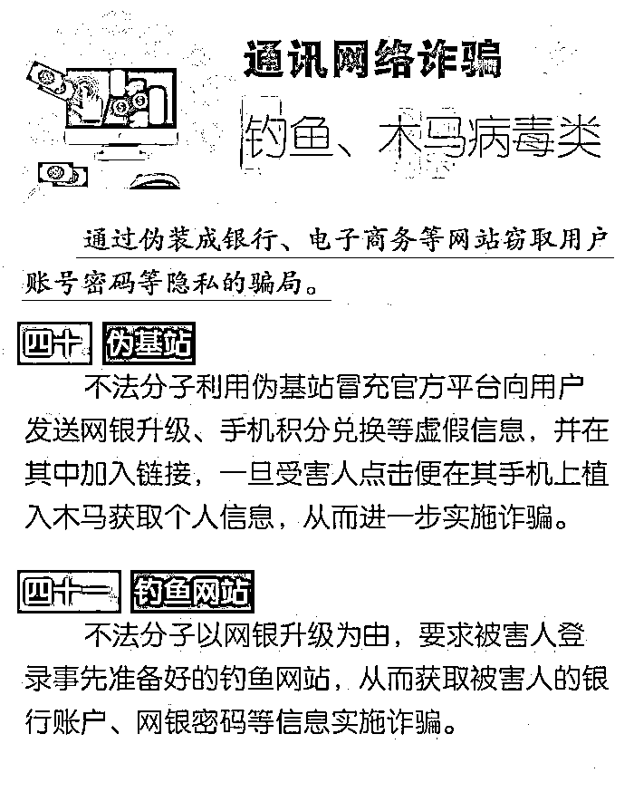

# 公安局真出力了，这张反诈图浏览量过亿！

> 原文：[`mp.weixin.qq.com/s?__biz=MzIyMDYwMTk0Mw==&mid=2247510816&idx=2&sn=e65ea8ffc321b8795d8fcb25ded3ad43&chksm=97cb6018a0bce90e060dde1e463538052bb19ac5396336f4a7424b210ded4bcbecf79afbd679&scene=27#wechat_redirect`](http://mp.weixin.qq.com/s?__biz=MzIyMDYwMTk0Mw==&mid=2247510816&idx=2&sn=e65ea8ffc321b8795d8fcb25ded3ad43&chksm=97cb6018a0bce90e060dde1e463538052bb19ac5396336f4a7424b210ded4bcbecf79afbd679&scene=27#wechat_redirect)

这张由「南京公安」制作的宣传图，汇集了当下中国最常见的 58 种电信网络诈骗手法，**堪称悬在诈骗犯罪分子头上的达摩克里斯之剑，反诈宣传工作最得心应手的武器。**

**但经过警方常年不懈打击，中国电信网络诈骗基地已统一搬迁至东南亚**

**骗子不好抓了！防骗才是第一位的！请记住下面这张图片。**

**58 种诈骗手法 9 大类型**

**这张图，全网浏览量已经超过 1 亿多，**但与此同时，还有很多人没看过这张图，时刻有被诈骗的风险。

勿以善小而不为，勿以恶小而为之！你的一次随手转发，可能会挽救一个家庭免遭倾家荡产的厄运。

**↓↓↓最后↓↓↓**

**请务必转发！****让更多人看到！**

来源：南京公安

← 向右滑动与灰产圈互动交流 →

