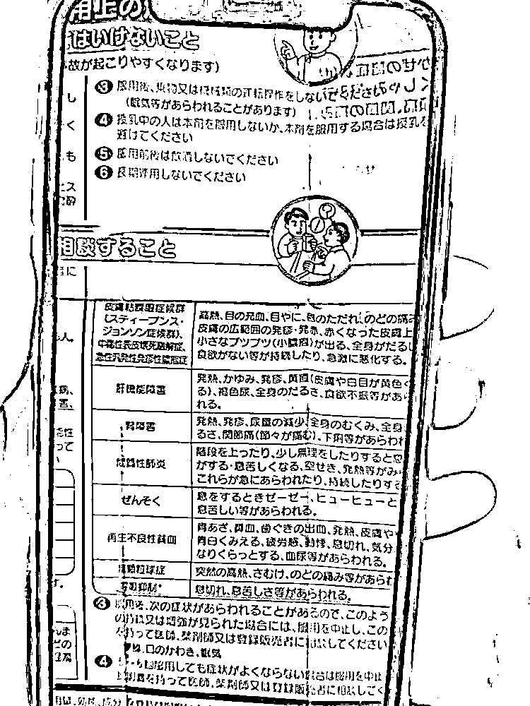

# 紧急提醒！这些常用网红药，可能暗藏风险！很多人家里都有

> 原文：[`mp.weixin.qq.com/s?__biz=MzIyMDYwMTk0Mw==&mid=2247510816&idx=6&sn=3590b09462828e6bc16e069dceebb16e&chksm=97cb6018a0bce90e31913555fd7c61ae6a94d1cca75bf8d25bbfc597b9790e032400f6e195dd&scene=27#wechat_redirect`](http://mp.weixin.qq.com/s?__biz=MzIyMDYwMTk0Mw==&mid=2247510816&idx=6&sn=3590b09462828e6bc16e069dceebb16e&chksm=97cb6018a0bce90e31913555fd7c61ae6a94d1cca75bf8d25bbfc597b9790e032400f6e195dd&scene=27#wechat_redirect)

如今，说到购物

就不得不提到飞速发展的网上购物

除了国内商家可以线上开店外

海淘、代购等模式也十分火热

最近几年

**日本的感冒药、无比滴**

**德国的咳嗽药、退烧药**

**……**

这些风靡朋友圈的“海淘”药品

被很多爸妈青睐

**但**

**是**

** 你真的了解海淘药品吗？ **

**一些儿童海淘药，价格贵**

**对孩子健康却不一定好！**

这些药品你家有吗？

一起来看看

**部分药品成分**

**与国内常用药成分差不多**

**日本面包超人感冒药**

去过日本的小伙伴

大都买过这款网红感冒药

**但据深圳市儿童医院科普**

**TA 和国内儿童感冒药常用的成分差不多**

而且，面包超人系列属于复方感冒药，里面的成分甚至比国内感冒药还用的多。美国 FDA 建议，**2 岁以下儿童不要使用复方感冒药，容易服药过量。**

然而最需要注意的，还属蓝色止咳款——

“旧版蓝色止咳款中含有的可待因，是一种中枢性强效镇咳药，可能导致成瘾。**我国药监局明文规定，含可待因的感冒药禁用于 18 岁以下青少年！**

**澳洲 Panadol 感冒退烧止痛液**

**德国 Hexal Paracetamol 婴儿退烧 PP**

**栓德国 Nurofen 退烧果汁等**

据医院科普，不管是澳洲退烧“神药”，还是德国退热栓或退烧果汁，**药物成分与国内的退烧药布洛芬和对乙酰氨基酚，没啥不同。**

医生提醒——

“家中如果同时备有国产退烧药和海淘退烧药，**药物过量或者用错药的风险会大大增加。****德国 Mucosolvan 沐舒坦儿童果汁**

德国沐舒坦，通俗来说就是“化痰药”。其实，**这款海淘药在国内有生产，而且和海外版是同一个药企生产。在国内大多数药店，就能买得到国产版。**

海淘药品上的使用说明

多使用的是当地语言

这也导致很多家长看不懂说明书

容易出现乱用药的现象

**这些“网红药”存在风险**

**说明书却被很多人忽略**

**德国小绿叶止咳糖浆**

这款药被不少代购商称为“纯天然成分、毫无副作用，新生儿都可以使用”，主要成分为常春藤叶提取物。

**它虽是植物提取成分，但依然有风险——**

“

该药品的说明书注明，**“如对植物成分过敏，则不宜服用”****。**

说明书“副作用项”也明确，**“该药可能会引发过敏反应，如呼吸困难、皮疹、荨麻疹等，也可能致恶心、呕吐、腹泻等胃肠不适。”**

**美国无糖 Delsym 止咳药**

这款网红药，号称是“美国唯一不用处方就能买到的止咳药”。

**然而，这款药的主要成分却是右美沙芬，有抑制呼吸的风险。而且，说明书上明确说了，4 岁以下儿童不能使用。**

除了一些口服药之外

还有不少外用药

也是很多家庭“海淘”常备的

但有些外用药同样有风险

**这些外用药**

**很多人家里都有**

**日本无比滴**

说到“无比滴”

相信大家都再熟悉不过了

无比滴，分为成人版和儿童版

但儿童版真的就适合儿童吗？

成人版中含有樟脑和薄荷醇，具有中毒的高风险。因此，不建议给 2 岁以内宝宝使用。 

儿童版中，虽去除了这两种成分，但里面含有**2%的苯海拉明**（一种抗组胺药）。

深圳市儿童医院药师谢芳接受媒体采访时表示，含有 2%的苯海拉明浓度，对于儿童来使用是相对较高的。**儿童使用建议浓度在 1%以下，所以无比滴对于 2 岁以下的儿童也要特别小心。**

**Burt's bees 小蜜蜂紫草膏**

这款“美国清凉油”，宣称能治疗湿疹、红臀、蚊虫叮咬、皮肤皲裂、刀伤、烫伤，主要成分含有紫草叶。

谢芳表示，紫草膏口服的时候是具有**肝毒性**的，**外用的时候要注意皮肤破溃的地方，不建议 2 岁以下的孩子使用。**

以上这些“网红海淘药”

有没有你曾经买过的？

实际上，对于海淘药

还可能存在这些风险

▼

** 商家夸大宣传 **

朋友圈很多代购，常常在宣传语中标榜“原装进口”、“纯天然”、“疗效超强”。但夸大宣传并不代表实际效果，了解有效成分、适应症状，才是正确使用的前提。

** 运输有风险 **

为了保证药效，有些药需要冷藏，有些需要防湿防潮，有些需要避光储存。

而海淘通常所用的邮寄物流系统，没有那么严格的运输标准。尤其是夏季高温，对很多药品产生的影响都是毁灭性的。

** 看不懂说明书 **

海淘药品说明书一般采用本地的文字，部分国人存在看不懂说明书的问题，可能出现乱用药的现象。

另外，一旦服用药物后出现不良反应，难以跨境维权。

** 疗效存疑 **

由于东西方人种差异，海淘儿童药品在我国儿童使用中，可能需要进行剂量调整。如果按照药品说明书使用，可能存在过量给药或给药不足，影响治疗效果的风险。

此前，曾有人

因随意服用“海淘药”而进了医院

▼

2020 年 4 月，深圳的李先生不慎感冒，朋友见状送来了自己从日本带回来的感冒药，李先生接过药就吃了两颗。没想到，吃完没多久，他开始全身不适。

第二天，李先生发现**他的手背开始长疹子，慢慢地疹子越来越多，甚至蔓延到全身上下，还发起了高烧。**李先生赶紧去到深圳市人民医院就医，医生诊断其为**“急性泛发性发疹性脓疱病”**。

医生仔细研究了他服用的药品说明书，发现这种“感冒药”成分非常复杂。**而且说明书中【副作用】一项，赫然写着“急性泛发性发疹性脓疱病”，与此前的诊断完全一致。**

在日常生活中

偶尔还是会出现需要用药的情况

如何鉴别药品质量是否有问题？

以下这几点要记住

▼

1.药品内外包装严重破损、漏液、霉变。

2.片剂、胶囊的颜色发生改变，表面粗糙或者有裂缝，气味发生变化。

3.粉末颜色发生变化、结块。

4.透明的液体制剂中有明显沉淀、摇一摇后也没有溶解。

5.软膏、乳膏颜色发生改变，有油漂浮。

6.本应透明的眼药药液变浑浊。

但是这些方法都无法完全保证药品质量

** 要从根本上保障用药安全 **

** 还应使用国家批准的合法药品 **

如何简单辨别合法儿童药品？

**合法药品包装上印有原国家食药监总局批准的国药准字号**，在原国家食药监总局网站上检索该药准字号能检索出药品与生产企业信息，部分药品企业也提供防伪标示以供鉴别。

说了这么多

在这里还是希望家长们

淘药品不要盲目跟风

用药最好是听从医生的建议~

来源 ：长沙晚报

← 向右滑动与灰产圈互动交流 →

