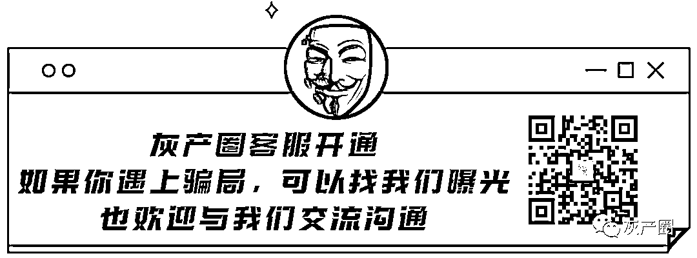

# 微信重磅消息！单向好友删除检测功能，终于要来了？

> 原文：[`mp.weixin.qq.com/s?__biz=MzIyMDYwMTk0Mw==&mid=2247513532&idx=6&sn=f9c45eceabee23d8a70971c30b3e7e6e&chksm=97cb7e84a0bcf7927e7a45f1eea7aeae8ac8c35a73700258e819fb2ab0aa3bd08bc609ffe3f3&scene=27#wechat_redirect`](http://mp.weixin.qq.com/s?__biz=MzIyMDYwMTk0Mw==&mid=2247513532&idx=6&sn=f9c45eceabee23d8a70971c30b3e7e6e&chksm=97cb7e84a0bcf7927e7a45f1eea7aeae8ac8c35a73700258e819fb2ab0aa3bd08bc609ffe3f3&scene=27#wechat_redirect)

不知不觉微信已经诞生了十年。

众所周知，微信上线至今虽然历经无数次迭代，但是“双向删除好友”功能一直迟迟没有上线。

相信大家都有这样的经历，别人删了你的微信，你根本不知道，只有当你给他发消息收到红色感叹号才会知道已经被删了，特别尴尬。

所以直到现在你都不知道你朋友列表中哪些是已经把你删了的，哪些是没删你的。

为了检测好友，很多人想了各种招，有些人选择了清粉软件，还有通过微信转账、拉群的形式。

于是网上出现了很多号称“不打扰，不群发”的清理工具，表面看似没有问题，其实存在很大的隐私风险。

之前小编就发布过一篇文章“[紧急提醒！微信“清粉”，不靠谱！](http://mp.weixin.qq.com/s?__biz=MzIyMDYwMTk0Mw==&mid=2247504903&idx=3&sn=8b022b89ab9b239a6d93b3bc14395acb&chksm=97cb1f3fa0bc9629c6c5f9069d09f02f3e448d533d8a6262500bb06eddf0db5a7aecfa42a263&scene=21#wechat_redirect)”起因就是因为嫌疑人通过清粉工具窃取用户隐私……

因此，好友互删的功能大家等了十年，成为微信用户最期盼的刚需功能，不过至今还没有用到。

对于用户的呼声，微信团队并非视若无睹。

**0****1**

**腾讯申请“单向好友检测专利”**

近日，据天眼查显示，4 月 23 日，腾讯科技（深圳）有限公司公开了一项“社交账号的单向好友检测方法、装置、介质和计算机设备”专利。

来自企查查

该专利申请时间为 2019 年 10 月，也就是说，腾讯早在 2019 年就已经开始为单向好友检测功能做准备了。

专利摘要中提到，本申请涉及一种社交账号的单向好友检测方法、装置、介质和计算机设备。所述方法如下图所示：

同时专利中还提到：“该方法操作简单，无需发送大量的冗余信息，提高了单向好友检测的效率，减少了系统消耗”。

所述方法包括：获取基于社交应用好友检测指令，所述单向好友检测指令包括被检测社交账号的账号标识；

基于所述单向好友检测指令，与获取根据所述被检测社交账号的第一通讯录以及所述第一通讯录中各社交账号对应的第二通讯录确定的单向好友标识；

根据所述单向好友标识获取单向好友信息，在所述社交应用界面中展示所述单向好友信息。

**0****2**

**专利图附上**

**文字看不懂，专利图附上：**

专利附图

总结一句话就是，腾讯要出新专利了，新专利就是官方让你直接一键检测哪些微信好友把你删了！

然而，当功能真的要来的时候，部分网友却不怎么感冒了：

其实 QQ 早就有了“单向好友管理”功能，微信憋这么久是不是要放一个大招。

当然，微信单向检测好友功能什么时候真正亮相，还要看官方的实际行动。

而腾讯选择此时公开这一专利，说明这一功能已经离我们越来越近了。

**最后，对于微信的单向删除检测功能你怎么看，欢迎留言交流。**

来源：微擎团队

← 向右滑动与灰产圈互动交流 →

