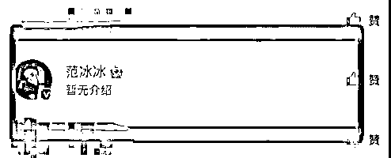

# 郑爽偷税被查，范冰冰点赞

> 原文：[`mp.weixin.qq.com/s?__biz=MzIyMDYwMTk0Mw==&mid=2247513590&idx=1&sn=0387651532fd674310e7c2cc80f59343&chksm=97cb7ecea0bcf7d871a3e951321318263057166e45554b20d10206601916d687d702a16bb76f&scene=27#wechat_redirect`](http://mp.weixin.qq.com/s?__biz=MzIyMDYwMTk0Mw==&mid=2247513590&idx=1&sn=0387651532fd674310e7c2cc80f59343&chksm=97cb7ecea0bcf7d871a3e951321318263057166e45554b20d10206601916d687d702a16bb76f&scene=27#wechat_redirect)

知名艺人郑爽因偷税漏税、阴阳合同、天价片酬等违法行为被调查，郑爽表示会配合一切调查。

几乎同一时间，**75 位一线明星艺人注销了 200 家关联企业**，这也给人一种此地无银三百两的感觉。其中甚至还有艺人在上次的补税名单当中。

4 月 29 日，微博一位网友发布动态，希望能公开补税 117 亿的艺人名单，不要逮住一个人就往死里搞，全部公布出来整改，别把限薪令拿来糊弄观众。而这条微博也被范冰冰点赞。

4 月 30 日，范冰冰发新微博，表示世界原本便是不公平。有网友翻出了范冰冰当年在《还珠格格》中的台词，笑称这才是范爷内心真实写照：

来源：IT 之家

← 向右滑动与灰产圈互动交流 →

