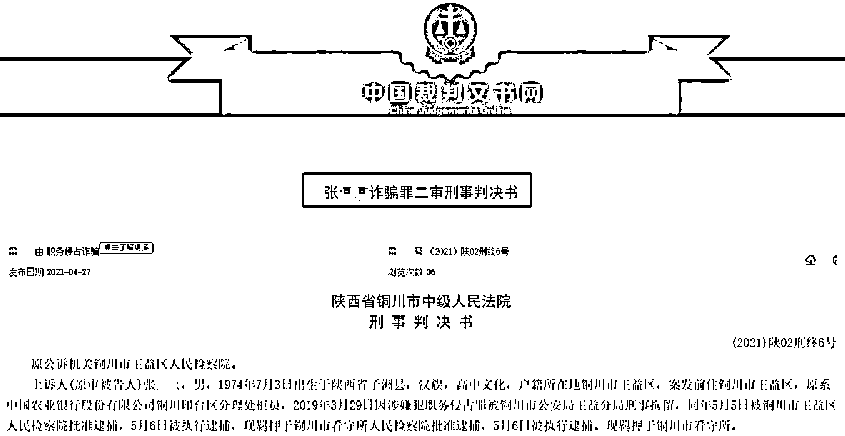

# 理财款竟流向赌场！农行柜员惊天“鬼手”，狂骗 380 万！

> 原文：[`mp.weixin.qq.com/s?__biz=MzIyMDYwMTk0Mw==&mid=2247513590&idx=3&sn=350cf650792670ec3023916c61c18bc8&chksm=97cb7ecea0bcf7d84a248195794d51aa4969c96bc63d891d2d35bfded9843e743f7f539eb877&scene=27#wechat_redirect`](http://mp.weixin.qq.com/s?__biz=MzIyMDYwMTk0Mw==&mid=2247513590&idx=3&sn=350cf650792670ec3023916c61c18bc8&chksm=97cb7ecea0bcf7d84a248195794d51aa4969c96bc63d891d2d35bfded9843e743f7f539eb877&scene=27#wechat_redirect)

在银行大厅经正式员工指导购买的理财，最后竟然被用于赌博？近日，中国裁判文书网披露的一则判决显示，农行一柜员一手制造了惊天诈骗案，在数年内瞒天过海，致使多名老年人中招，其本人最终也获重刑。 

理财款竟被银行柜员拿上了赌桌

裁判文书显示，1974 年 7 月出生的张某某，自 2010 年 2 月起担任中国农业银行铜川红旗街分理处高柜柜员。

柜员的工作经历，让张某某熟知该行理财产品等销售流程，也逐渐动起了“歪心思”，将目标锁定在自己熟识的银行客户上。

经查明，自 2017 年 12 月 26 日至 2019 年 1 月 20 日，张某某发现孙某等五位被害人出现在银行大厅时，就脱离自己的高柜岗位，利用工作之便，以假装帮助本案被害人申购理财产品之机，哄骗被害人多次输入银行卡密码，借机把被害人购买理财的资金转入自己控制的账户或者取现，供其赌博或者其他消费支出。

张某某自己供述，客户以为购买了理财产品，其实上都是被他挪用了，“把钱赌博输完了”。

经事后查明，张某某采取上述手段，先后七次将孙某等申购理财的资金共计 88.5 万元据为己有。

张某某如何完成“大挪移”？

从具体操作上看，总共分为以下几步：

1、张某某和被害人到自助服务区后，被害人将自己持有的银行卡插入自助柜员机，准备购买理财产品，张某某代替被害人在自助柜员机上进行购买理财操作，由被害人第一次输入银行卡密码进行确认，自助柜员机出具理财产品的银行小票。

2、进行上述操作后，自助柜员机会同时冻结与申购理财产品数额等值的卡内现金，张某某打印理财产品申购小票给被害人，被害人持有理财产品申购小票，使被害人误以为已经购买成功。

3、紧接着，张某某又输入操作，申请撤销购买，并对被害人谎称是在继续完成购买理财，欺骗客户第二次输入密码确认，银行卡内冻结资金被解冻，张某某不打印撤销申购的小票，被害人对撤销申购不知情。

4、之后，张某某再输入理财操作，继续对被害人谎称完成购买理财所需，欺骗客户第三次输入密码确认，张某某将资金转往其控制的账户或取现，张某某不打印转账回执，被害人对其资金转移不知情。

受害人之一的白某表示，2018 年 7 月和 2019 年 1 月，张某某先后帮忙购买了 17 万元和 21 万元的理财产品，并提供了单据。她购买理财产品时，张某某让她按密码她就按，等到了 2019 年 4 月取本金和利息时，银行的工作人员告诉她，“张某某把她卡上的钱都花了”。

“假装购买理财”糊弄老客户

张某某的诈骗手段远不止用在银行大厅。

张某某与被害人刘某甲认识多年，彼此熟悉，相互信任。刘某甲有一张农业银行卡，由张某某持有该卡及密码来代为购买银行理财产品。

从 2017 年 10 月到 2018 年 5 月，刘某甲先后三次向该卡存入合计 140 余万元，到了 2018 年 8 月 19 日，刘某甲计算卡中累计资金为 142 万元，就又向该卡存入 8 万元，共计 150 万元，要求张某某全部用来购买理财产品。

但刘某甲没想到的是，当时卡中的 42 万元均已被张某某在此之前分多次支取，用于赌博或者消费支出。

为隐瞒资金已经被支取的真相，张某某假装购买理财。先后在自助柜员机打印出 100 万元和 50 万元预申购成功的理财小票后，就将该次申购撤销。最后将两张理财小票交给刘某甲，谎称已经购买 150 万元的理财产品。

刘某甲信以为真后，张某某更加肆无忌惮，分多次支取卡内资金进行赌博。

截至 2019 年 3 月 21 日，除该日购买理财的 8.08 万元人民币外，该银行卡余额为 74.29 元，刘某甲累计被骗取 141.9 万元。

借款年利率 96%？

高息背后暗藏陷阱

除此之外，张某某多次以高息为诱饵，向穆某某等六名受害者借款。但是在支付了部分利息后，这种庞氏骗局便再也难以维系。他用这种借贷的方式，诈骗了 100 多万元。

2017 年 10 月，张某某以高息为诱饵，借穆某某 15 万元，经穆某某同意后将卡内 15 万元转走，并打有一张 15 万元的借条，约定利息 7.5%。2018 年 4 月及 2018 年 10 月 15 日张某某两次分别支付利息 5400 元、5900 元，之后再未归还。

穆某某表示，2017 年 10 月，他去银行取钱时，张某某说有一个利润更高的理财，但不是农行的理财产品，是一家公司需要资金，可以通过其购买。他当时不同意，觉得风险太大。张某某说自己是农行的员工，工资很高，不会侵占他的钱。他就把农行卡给了张某某。2019 年 5 月 21 日，他才知道被张某某骗了。

被害人王某某陈述证明，2016 年 4 月 8 日，她到农行红旗街分理处准备购买理财产品。张某某接待她，说四五个人准备投资 100 万元，共同办理财，返利肯定比银行高。张某某还保证，说自己是职工，有固定收入，不会骗她的钱。她信以为真。她在银行柜台将 17 万元转给了张某某。张某某让她在银行门口等。10 分钟左右，张某某拿着一张借条，约定月息 8%，半年还一次利息。

月息 8%，意味着年化已经达到了 96%。

2019 年 3 月底，张某某给王某某打电话，说最近资金出了问题，想延后还利息。她同意了。过了一段时间，她给张某某打电话一直打不通。到银行之后，才知道张某某被公安机关带走了。

2019 年 3 月 25 日，张某某主动投案。

获刑 14 年 8 个月

一审法院认为，张某某诈骗他人资金 430.4 万元，数额特别巨大，应依法惩处。

其中，他以帮助购买理财为手段，欺骗被害人并将钱款 88.5 万转至其控制银行卡账户内或取现，并用于赌博或支取消费，其行为已构成诈骗罪。

同时张某某隐瞒真相，采取欺骗手段，将刘某甲账户资金 141.9 万元占为己有，其行为构成诈骗罪且犯罪数额特别巨大。

此外，张某某隐瞒其借款的真实用途，在已经不具备还款能力的情况下，仍然支付高息，大量借款，采用借贷方式诈骗 200 万元，其行为已构成诈骗罪。

一审法院判决被告人张某某犯诈骗罪，判处有期徒刑十四年八个月。并责令被告人张某某退赔原工作单位农行铜川七一路支行 88.5 万元及利息，返还被害人刘某甲等损失。

此后，张某某提出上诉。

二审法院认为，张某某多次实施诈骗，且诈骗对象多为老年人，可酌情从重处罚；其将部分赃款用于赌博，可酌情从重处罚。

对向穆某某等人借的 200 万元，张某某及其辩护人认为应属民法调整的民间借贷行为，经查，张某某明知没有归还能力，以借款为名，将“借款”用于赌博或支付其他“高息”，致使六名被害人难以通过民事途径追回被骗财物，主观上具有非法占有他人财物的目的，其行为构成诈骗罪。

最终，二审法院除了对张某某诈骗穆某某等六人钱款数额认定为 149.5 万元，责令返还部分予以调整，总诈骗额调整为 379.9 万余元外，其他定罪量刑部分并未改变。

编辑：舰长 来源：中国基金报

← 向右滑动与灰产圈互动交流 →

