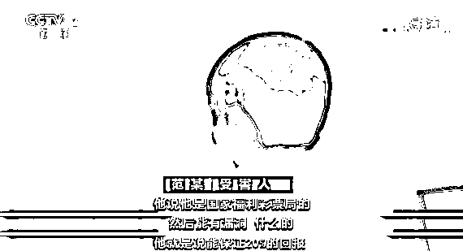
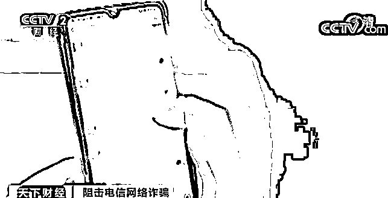
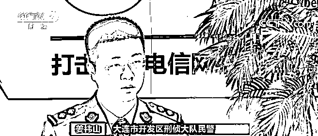
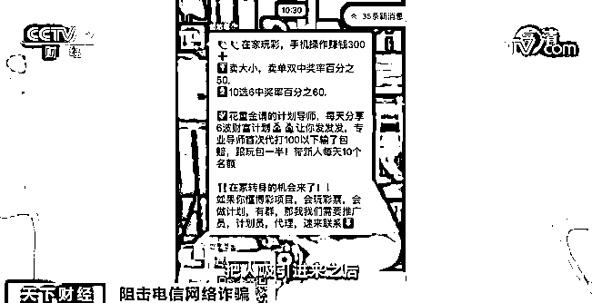
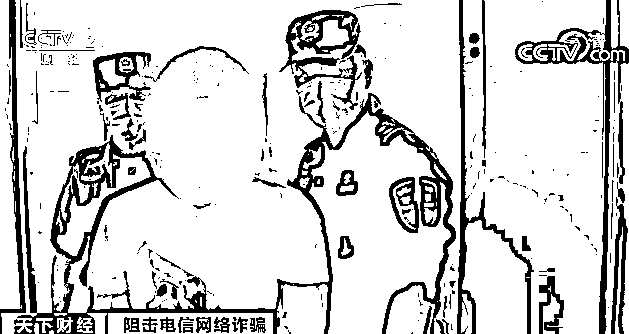
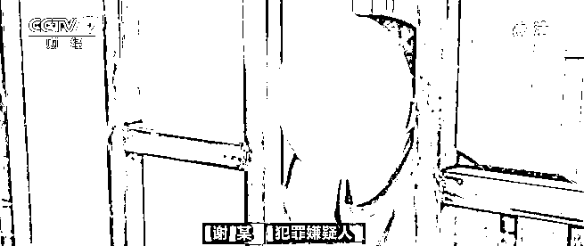

# 看似“躺赚”实则被骗，跨境电信诈骗团伙骗走 7 亿元！

> 原文：[`mp.weixin.qq.com/s?__biz=MzIyMDYwMTk0Mw==&mid=2247513590&idx=4&sn=aa2a100ffcd255d05f8c0081f1c6a3b5&chksm=97cb7ecea0bcf7d850e4e29bdcad982455355be793913f7cc4137ab439714db114abcd314b49&scene=27#wechat_redirect`](http://mp.weixin.qq.com/s?__biz=MzIyMDYwMTk0Mw==&mid=2247513590&idx=4&sn=aa2a100ffcd255d05f8c0081f1c6a3b5&chksm=97cb7ecea0bcf7d850e4e29bdcad982455355be793913f7cc4137ab439714db114abcd314b49&scene=27#wechat_redirect)

只需两个小时，就可以让你账户里的 30 万元变成 50 万元，这样的投资你动不动心？**但实际上，从你转账的那一刻开始就已经被骗了。**

日前，辽宁大连警方就打掉了一个特大跨境电信诈骗团伙，受害人范女士跟记者讲述了她的被骗经历。

两小时赚 20 万元

看似“躺赚”实则被骗 280 万元

[`mp.weixin.qq.com/mp/readtemplate?t=pages/video_player_tmpl&action=mpvideo&auto=0&vid=wxv_1847197601662566408`](https://mp.weixin.qq.com/mp/readtemplate?t=pages/video_player_tmpl&action=mpvideo&auto=0&vid=wxv_1847197601662566408)

△央视财经《天下财经》栏目视频

2019 年底，范某通过一个网络平台认识了一个自称是彩票公司的内部员工，能够带她投资赚钱。 

范某在这名所谓的内部人员引导下，注册了一个叫乐彩网的博彩网站，并在声称是专业老师的指导下，开始赚钱。 

**受害人 范某**：他刚开始说你投 100 元就行，提现了 120 多元。我觉得挺好的，投得越来越多，一千、两千、五千。

让范女士最终决定大笔投入的原因是在一次博彩里，她两个小时就赚了 20 多万。 

**受害人 范某**：我投 30 万元，好像赚了 50 多万元。大概两个小时左右。 

不仅如此，跟自己在一个微信群里的好友们也都是捷报频传。之后，范女士的投入从一次几千到一次几十万，但总是输多赢少，最后一次在范女士投进 100 万之后，发现自己被对方拉黑了。

而此时，**范女士已经投进去了 280 万**。不仅如此，群内那些所谓的赚钱的宝妈们也根本联系不上，之后范女士选择了报警。 

涉案资金超 7 亿元！

警方展开跨国追捕

看了范女士的例子，可能有人想问，如果在她投入 30 万赚了 50 万的时候果断退出来，就不会损失 280 万了，**而实际上这就是电信诈骗中最典型的“杀猪盘”诈骗。骗子实施的是量身定做的骗术。** 

[`mp.weixin.qq.com/mp/readtemplate?t=pages/video_player_tmpl&action=mpvideo&auto=0&vid=wxv_1847198627304112139`](https://mp.weixin.qq.com/mp/readtemplate?t=pages/video_player_tmpl&action=mpvideo&auto=0&vid=wxv_1847198627304112139)

△央视财经《天下财经》栏目视频

**大连市开发区刑侦大队民警 姜祎山**：引导投资的过程中也在不断地交流，看到底是什么经济状况，或者能够投资多少。他觉得你可能只能拿出 20 万或 30 万，当你把这笔钱投进去了之后，他就会把这笔钱直接黑掉。 

经过警方 4 个多月的循线追踪，范女士遇到的是一个组织分工明确的诈骗团伙，该团伙成员上百人，团伙组织层级严密、责任分工明确，以公司企业化运作为掩护，通过在老挝金三角经济特区唐人街某楼内设置诈骗窝点，对境内受害人疯狂实施诈骗。**涉案金额高达 7 亿多元。** 

**大连市开发区刑侦大队民警 姜祎山**：每一个组一般是四个人，有组长、导师，有负责引流的。把人吸引进来之后，有专门负责跟他聊天儿的，有专门负责指导他怎么购买彩票的，这四个人就可以完成一次完整的诈骗过程。

2020 年 5 月，专案组民警获悉该团伙 4 名主管级骨干成员返回国内，入境后在云南勐腊被集中隔离，至 5 月 18 日即将隔离期满，随时可能分散逃离。

为防止该团伙成员再度组织人员出境，专案组针对该团伙在国内人员的分布情况，确定了境内 30 名组长级别以上人员的抓捕名单，在 5 月 19 日凌晨四点展开集中收网行动，抓获国内回流团伙成员 50 人，端掉境内电诈窝点 5 处，收网行动的同步冻结涉案账户及关联嫌疑账户共 8800 余个，冻结资金 7 亿余元，斩断了境外团伙对境内实施电信诈骗的资金链、数据链。 

任由骗术怎么变 我不转账应万变

[`mp.weixin.qq.com/mp/readtemplate?t=pages/video_player_tmpl&action=mpvideo&auto=0&vid=wxv_1847198145059815430`](https://mp.weixin.qq.com/mp/readtemplate?t=pages/video_player_tmpl&action=mpvideo&auto=0&vid=wxv_1847198145059815430)

△央视财经《天下财经》栏目视频

从抓获的嫌疑人中，警方了解了该组织境外运营的详细过程，犯罪团伙采取的是分级管理，每月按诈骗金额的多少来提成，骗得越多提成就越多。所以嫌疑人会想尽办法让你上当。

**犯罪嫌疑人 谢某**：每个团队营业额的百分之三或百分之五，十万一个档，五十万一个档，一百万一个档，两百万、三百万这样一直递增上去，来拿提成。 

靠提成赚钱，犯罪分子当然想尽办法去行骗。每个团伙都有自己的话术脚本，内容五花八门。

针对当前电信诈骗的窝点大都在境外，目前境内打击电信诈骗犯罪需要打防结合，多部门联动，形成反诈合力。 

**大连市公安局反信息诈骗大队队长 孙瑞睿**：现在反诈中心已经入驻了六大国有银行，包括三大运营商的人员。比如说一个案件发生之后，驻点银行可以发挥紧急止付、冻结的效能。大大提升了资金挽损的效能。记住一句话，**任由骗术怎么变，我不转账应万变。**

来源：央视财经

← 向右滑动与灰产圈互动交流 →

