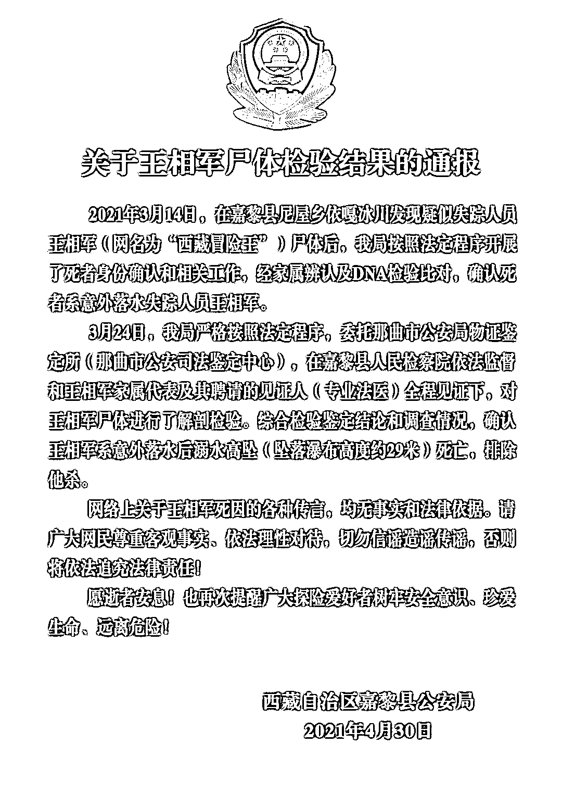

# 排除他杀！“西藏冒险王”尸检结果公布

> 原文：[`mp.weixin.qq.com/s?__biz=MzIyMDYwMTk0Mw==&mid=2247513590&idx=5&sn=f28c1d5bd90db6c341aa89a6d52e40a8&chksm=97cb7ecea0bcf7d8ee62dadc908e087b1cc4cf6b325cbfe141d8804eeca4bbec937947133408&scene=27#wechat_redirect`](http://mp.weixin.qq.com/s?__biz=MzIyMDYwMTk0Mw==&mid=2247513590&idx=5&sn=f28c1d5bd90db6c341aa89a6d52e40a8&chksm=97cb7ecea0bcf7d8ee62dadc908e087b1cc4cf6b325cbfe141d8804eeca4bbec937947133408&scene=27#wechat_redirect)

## 确认王相军系意外落水后溺水高坠（坠落瀑布高度约 29 米）死亡，排除他杀。4 月 30 日，西藏自治区嘉黎县公安局通过官方公众号发布《关于王相军尸体检验结果的通报》：2021 年 3 月 14 日，在嘉黎县尼屋乡依嘎冰川发现疑似失踪人员王相军（网名为“西藏冒险王”）尸体后，经家属辨认及 DNA 检验比对，**确认死者系意外落水失踪人员王相军。**通报称，3 月 24 日，嘉黎县公安局严格按照法定程序，委托那曲市公安局物证鉴定所（那曲市公安司法鉴定中心），在嘉黎县人民检察院依法监督和王相军家属代表及其聘请的见证人（专业法医）全程见证下，对王相军尸体进行了解剖检验。综合检验鉴定结论和调查情况，**确认王相军系意外落水后溺水高坠（坠落瀑布高度约 29 米）死亡，排除他杀。**
通报指出，网络上关于王相军死因的各种传言，均无事实和法律依据。请广大网民尊重客观事实、依法理性对待，切勿信谣造谣传谣，否则将依法追究法律责任！ 此前报道2020 年 12 月 26 日，网上有消息称，“西藏冒险王”王相军 12 月 20 日在探险途中掉进冰川暗河中遇难。随后，王相军的弟弟王龙，以及与王相军同行的伙伴“小左”均证实了这一消息。“冰川哥”王相军资料图年仅 30 岁的王相军，网名“西藏冒险王”，他也被粉丝们称作“冰川哥”。在将近 8 年的时间里，王相军探访了中国 70 余座冰川，拍下珍贵的影像资料，记录冰川的消融，还曾经受邀参加第 25 届联合国气候变化大会，呼吁大众关注气候变化与冰川保护。王相军生前摄影作品事件发生后，一段关于“西藏冒险王”王相军的视频引发关注。有网友称，这段视频经过降噪处理后出现“别说话，他死就死”以及“好重啊，这家伙，还在流血”等对话，让一些网友猜测：短视频账号名为西藏冒险王的“冰川哥”王相军遇难可能另有原因。

*   1 月 22 日，嘉黎县公安局在该局官方公众号上通报称，网传一则关于“西藏冒险王”王相军失踪成谜的视频，该局高度重视，已介入调查，调查结果将及时通报。

    **→**[“西藏冒险王”疑似被害？网友对视频做降噪处理，同伴被质疑](http://mp.weixin.qq.com/s?__biz=MzIyMDYwMTk0Mw==&mid=2247508193&idx=2&sn=7eb34b350132f953326273f14da82a75&chksm=97cb6bd9a0bce2cf365500013a24320e43c38b087ae37b0ad56dd892ea5a9560f949381a1a6d&scene=21#wechat_redirect)

*   2 月 22 日，嘉黎县公安局针对“西藏冒险王王相军失踪成谜”事件发布通报指出：王相军是意外落水失踪，“蓝洞”降噪视频与此无关。**网传的关于王相军事件的质疑、猜测等言论均无事实依据。**

    **→****[“西藏冒险王失踪”调查结果公布！](http://mp.weixin.qq.com/s?__biz=MzIyMDYwMTk0Mw==&mid=2247509794&idx=3&sn=b8253ee3a1c031c6afab2993c8b2c824&chksm=97cb6c1aa0bce50c27ad5a6d3cfaf019e6a548a8e49c0306ee9312e57d7bf34817f64ded83f6&scene=21#wechat_redirect)**

*   3 月 18 日，嘉黎县公安局发布情况通报：3 月 14 日，嘉黎县尼屋乡群众对依嘎冰川下游河道巡查时，在冰层下发现一具尸体并向公安局报告。警方组织人员赶赴现场开展勘查和打捞工作，**并打捞出一具男尸。经初步调查，死者疑似意外落水失踪人员王相军。**

来源：央视新闻、嘉黎公安、红星新闻、北京青年报

← 向右滑动与灰产圈互动交流 →

