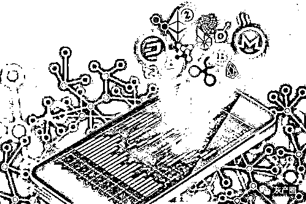

# 币圈资金盘合集，31 个项目，有你参与的吗？

> 原文：[`mp.weixin.qq.com/s?__biz=MzIyMDYwMTk0Mw==&mid=2247513590&idx=6&sn=460b6b1eecd9cfffad9967f602e8be9f&chksm=97cb7ecea0bcf7d882cc1911c033c346c421ee1c753fae7f0ae6d58255c5065ad22bd1297f79&scene=27#wechat_redirect`](http://mp.weixin.qq.com/s?__biz=MzIyMDYwMTk0Mw==&mid=2247513590&idx=6&sn=460b6b1eecd9cfffad9967f602e8be9f&chksm=97cb7ecea0bcf7d882cc1911c033c346c421ee1c753fae7f0ae6d58255c5065ad22bd1297f79&scene=27#wechat_redirect)

市场二八定律不变，20%暴富的人之下，必定掩盖了 80%血本无归的投资者。如今的资金盘已经像野草一样蔓延疯长，尽管监管一再戒严，但仍挡不住投机者的坑蒙拐骗，人性的贪婪驱使着更多的投资者跳入火坑。 

**今天就说一下最近大家比较关心的项目最新情况，希望大家擦亮眼睛去参与一些优质项目，不要再做接盘侠！**

 

**1、抹茶交易所（空投钓鱼，有风险）**

据投资者爆料，2.25 日在抹茶杠杆里借币了 3000 个 zks 代币参与空投活动，结果不仅没有得到空投，反而需要双倍偿还代币。

空投前公告没有说明不允许杠杆用户参加，空投结束反倒出来了一则免责声明，否则就封号冻结账户，明显的店大欺客，空投钓鱼。

**2、T1 矿场（高风险预警，资金盘）**

平台近两个月频繁修改提现规则，更是坐地起价，在收益不变的基础上，两次调高 T1 矿机价格。此外，据投资者爆料，平台现在提现的时间越来越慢，有时候甚至 72 小时内都不见得可以提现成功。

由此可见，T1 矿场的资金链很有可能出现了问题，崩盘迫在眉睫。

**3、DETA 数字生态链（伪公链，真骗局）**

平台宣称新加坡大机构背景，美国雷达实验室开发，但实际所谓的机构背景都是杜撰出来的，DeTA 新加坡基金会投资机构也早在 3 月份的时候走完了注销程序。声称自己是公链，但 DeTA 项目顶多只有个波场智能合约，还是有后门的中心化的系统，完全控制在项目方手里。

**4、bopucoin(波普)对冲合约（已崩盘）**

4 月 4 日清明节，BOPU 平台应用 APP 突然无法打开，无法查询到数据，服务器被关闭了，注册页面也显示 502 网关错误，项目微信群也都已经被解散了。目前正在维权中。

**5、欧贝链 OBC（发行空气币，不靠谱）**

欧贝链（OBC）全名为“OBet Chat”，虽然打着“金融创新”、“区块链”的旗号，，但实际就是一个利用高新技术包装自己虚构的资金盘骗局：利用“公链噱头”发行空气币，后台操盘价格，托底拉升、高点抛售，最终的结果不是暴跌，就是操盘手高点套现让散户套牢。

**6、链信新币 BBT（空气币，旨在收割，远离）**

对于链信的项目方来说，发行空气币并不是头一次，就连大儿子 CCT 都已经成为弃子了，更何况是其他代币呢？这次发的 BBT 新币也是如此，上个月刚出了一个 CBT 挖矿，现在又出来 BBT 挖矿，其目的只有一个，就是为了忽悠投资者接盘。

**7、本体之星 ONTS（不靠谱）**

ONTS 本体之星这个项目，实际就是一个一个用币替代积分的伪区块链电商生态服务平台。说是说注册就赠送代币，投资就可以放大 5 倍收益，但这 5 倍收益却是需要每天千分之二才能释放。或许还没等到拿回本金的时间，平台都已经跑路了，更别说什么利润了。

此外，ONTC 的整个持币地址从头到尾有且仅有 19 个，就连项目介绍的白皮书也是漏洞百出，各种东拼西凑，复制抄袭，明晃晃的欺骗大众。

**8、太希币 TSH（不靠谱）**

平台宣称代码全部开源，但实际上官方宣称的这个开源代码仅仅才更新了五条，并且最近更新的一次还是在 19 年，此后便一直没有动作。

此外，项目方说自己是俄罗斯实验室开发的项目，团队成员都是来自世界各国的高新技术人才，但团队照片却是百度都能搜索的到的模特艺术照。而且，180 亿的代币分配给了团队，一旦砸盘，随时归零。

**9、MDF 智能合约（崩盘）**

MDF 其实就是 MMM 庞氏骗局+区块链智能合约的综合体，2021 年 4 月 6 日，MDF 智能合约宣布重启，其背后的潜台词就相当于崩盘了。

据爆料，此次崩盘的原因是因为项目方利用代码“后门”每天最少从合约地址抽水上百万的资金，导致抽的太狠，池子里干了，宣布重启。

**10、BTCV 比特金库（不靠谱）**

BTCV 本身是由 BTC 分叉而来的代币，是模仿比特币的算法而成，但本质是国人包装的一个资金盘，不仅创立时间非常的短，就连其网站 IP 也是在荷兰。

虽然线上没有怎么宣传，但实际线下各种路演，瞄准了那些场外的大爷大妈，以“矿机直销”的名义，通过洗脑投资者，通过高额的利益去拉人头，发展下线。

**11、币君交易所（崩盘）**

据了解，截至目前，币君交易所的 PC 端口网站页面已经无法打开，而手机端的应用 APP 虽然可以打开，但页面基本都是空白，显示“检查新版本失败，请稍后重启”，也差不多相当于废了。

12、满币交易所（高危，即将崩盘）

3 月 24 日，满币交易所背后的主体公司“原子链（北京）科技有限公司”申请注销，目前正在注销期间，疑似被限制高消费预谋跑路了。

**13、TOP coin 交易所（崩盘）**

再说 TOP coin 交易所之前，先说下 OK TOKEN 项目，OK TOKEN 是一个【A/B 交易平台双向对冲】的平台，简单来说，在 A 合约开单的同时，也在 B 开反单，A 盈亏自负，B 赢了是你的，亏了有定额赔付。

这个模式中，A 平台指的是 OK TOKEN 自己，而另一个 B 平台就是指的我们今天的主角 TOP coin 交易所。

据分析，TOP coin 交易所很有可能只是 OK TOKEN 项目方伪装出来的替死鬼，把自己包装成为冤大头，但实际背地里都是一家人，各种演戏给投资者看，诱导韭菜入局收割。

据玩家爆料，TOP coin 交易所内部目前所有数据已经清零，很多人都在想方设法的维权。

**14、星之传奇 LOM**

“星之传奇 LOM”的项目打着私募的旗号，发放 800 万个代币，到处喊单割韭菜，最后携款跑路，骗了超过 5000 多人，圈钱金额大概在 1200w 左右。目前正在维权中！

**15、ZB 中币交易所（不靠谱）**

据爆料，在中币参与了一个叫做 KPG 的项目，自上线以来便连续三个月暴跌，被骗了 100 多万，平台不仅没有给出任何赔付说法，反而直接下架了该币种。中币交易所联合庄家割韭菜，暴跌归零，还删除交易记录，参与要小心。

**16、HECO 项目玉米 CORN（不靠谱）**

投资者 253 个币进去，出来秒变 3 个币。

据项目参与者爆料，在 CORN 项目上挖矿，基本等同于被套住了，没有中途下车的可能。一旦你想要退出，就会被扣除 99%左右的代币，项目方声称扣除的代币中，其中 94%拿去添加流动性，而剩下的 5%继续挖矿。

**17、雅视短视频（二次关网，即将崩盘）**

2021 年 4 月 17 日，“雅视短视频 APP”再次关网。

据平台所说，截止到目前为止，yatoken 钱包、YA 公链和 ya 交易所都已经布局完成，此次关网是为了后期的“质押挖矿”上线做准备，预计时间到 4 月 25 日为止，然而实际目的就只有一个：为了巩固老客户，吸引新韭菜入局。截止到发稿时，雅视又恢复运行了，但是这次套路更深，准备第三次收割了！

**18、USDC 稳定币挖矿（资金盘）**

USDC 挖矿项目是私人搞的资金盘，只不过是借用 USDC 这个稳定币和 Coin base 的热度而已。

**19、SAS 国际公链（资金盘）**

SAS 公链说的好听是国际链，但其实半点国际参加的影子都没有，十有八九幕后还是国人在操盘。虽然项目方声称自己项目已经拿到了全美屈指可数的 SEC 申请注册备案，但仅仅只是拿到了申请，并没有成功通过备案。

而所谓的绝对开源，什么代码也没有。不光开源信息是假的，就连人名也是假的，更别说白皮书上其他资料了，压根就没有可一点信任度可言。

据了解，该项目从 2020 年 6 月开盘距今差不多已经运转 1 年左右的时间了。通常来说，一个项目到了这个时候已经是高危时段。

**20、币和交易所（跑路，赔付中）**

17 年，币和被黑客攻击盗走 1500 个 ETH；18 年，币和再次被盗走 400 万资产；19 年挪用用户资金拿去炒币结果爆仓 30 BTC；两年内投资项目，结果项目方失联再次损失 1800 个 ETH。

明显的公款私用，挪用用户资产炒币爆仓以至于资产被亏光导致无法兑付。截至目前，虽然网站还在，但已经没人管了，基本就是跑路了。

尽管平台承诺会以 1 月 12 号的价格将资产在一年的时间里兑付给投资者，但其实不过是在上演“缓兵之计”，为了安抚币民，降低影响度，防止维权事态进一步扩大。

**21、比特儿交易所（不靠谱）**

有粉丝爆料，在狗狗币 DOGE 暴涨的这段期间，Gate 比特儿交易所从账户里黑掉了 17 年价值 15 万的狗狗币。而平台对此的答复却是需要等到 3-6 个月才能有回复。

最大的可能是，在狗狗币高价的时候，平台已经“公款私用”私自将用户账户内的狗狗币卖出去了，才导致现在用户账户无币可用，卖掉的钱也已经进了平台自己的腰包。

**22、善盾 SD（资金盘）**

项目号称由“世界助残福利基金会”发起，但实际这个机构根本查不到任何消息，很有可能就是以前的“助残链 IDAC”换盘重启。说是说一个公益项目，但有关公益的功能一个都没开发出来，反倒是拉人头、卖币、卖矿机的功能到处可见。

**23、Fungram 趣味克（资金盘，不靠谱）**

项目方宣传说已经向美国证券交易维权会（SEC）申请了免税发行，但是“申请”并不代表“批准”，根本代表不了什么。事实上，Fungram 趣味克只是搞了个看起来光鲜亮丽的概念，但本质内核还是个存币生息的资金盘。

**24、DDAM 项目**

崩盘一年，项目方逃亡国外。

**25、58coin 交易所（即将崩盘）**

继 2 月上海窝点被端后，58coin 交易所彻底关网跑路，至此，电脑网站已经无法打开！！

**26、Onlychain 奥力橙（不靠谱）**

根据爆料人描述，因为 ONLY 项目方中某些高层花钱买了 POC 币，现在因为 POC 涉及资金盘，导致整个团队都受影响。就在这几天，ONLY 的代币暴跌不止，一跌再跌，从最高 10 元人民币最低跌倒了 1 元钱。

**27、雷达支付链 PYC（崩盘）**

有玩家发现支付链的资产已经被转移一空，目前正在维权进行中。据统计，雷达支付链整体吸收资金高达百亿左右，项目方还想搞什么平移钱包，实际换汤不换药还是个骗人的资金盘。

**28、GEC 环保币（崩盘）**

2021 年 4 月，历时 4 年的币圈最大资金盘——环保币 GEC 彻底宣告结束。

4 月 25 日，在没有任何公告通知的前提下，GEC 平台突然开始维护无法登录。

此次系统错乱，在登录界面，无论你输入什么内容，平台都会提示你无法登陆。甚至就算你什么都不输入或者输入 123，也会这么提示。

自去年 2020 年 7 月以来，GEC 环保币的币价便一直持续阴跌，从 1700 元左右跌到了 400 元左右，整整跌掉了 75%！！

有传闻称，某 GEC 核心人员已被控制，现在其他人正在紧急销毁数据跑路。

截止到发稿时，GEC 已经恢复运行，但是这一次 GEC 已经进入倒计时！

**29、HKEX 交易所（不靠谱）**

据说每天交易额都超过百亿，实力堪比火币、币安，但其实数据都是自己刷出来的，目的就是为了收割韭菜。

**30、WUC 世联通证（被判/刑）**

从 2018 年 10 月到 2020 年 5 月之间，短短一年是收割了三轮，整整骗了 154 万人，卷走 10 亿财产。目前已被相关部门受理，判/决已公布。

**31、NGK 公链（已经被相关部门立案）**

来源：比特财经网，利箭在出击

← 向右滑动与灰产圈互动交流 →

