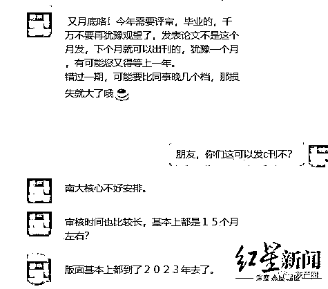
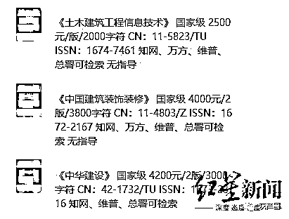
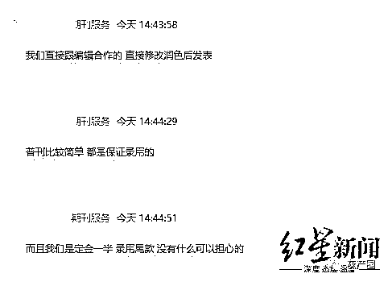
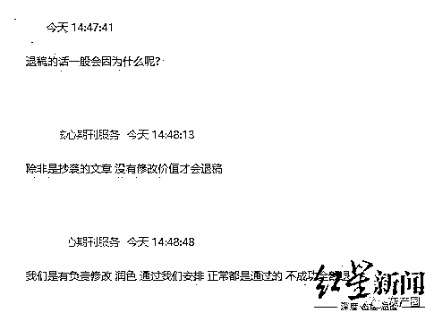
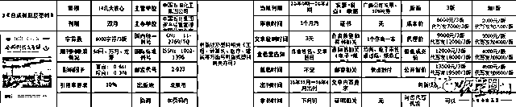

# “熟鸡蛋返生孵小鸡”背后的论文代写代发“黑产”

> 原文：[`mp.weixin.qq.com/s?__biz=MzIyMDYwMTk0Mw==&mid=2247513590&idx=7&sn=c26716786423187028d0f6c7ecbe2263&chksm=97cb7ecea0bcf7d883ecd0ea60ccd1b6d47a1854f4925e277e1534d5454a7e7a5e6ac1e73f05&scene=27#wechat_redirect`](http://mp.weixin.qq.com/s?__biz=MzIyMDYwMTk0Mw==&mid=2247513590&idx=7&sn=c26716786423187028d0f6c7ecbe2263&chksm=97cb7ecea0bcf7d883ecd0ea60ccd1b6d47a1854f4925e277e1534d5454a7e7a5e6ac1e73f05&scene=27#wechat_redirect)

“熟鸡蛋靠意念返生”一类的论文为何能频繁登上省级期刊？通过与多名从事期刊发表的业内人士交流，红星新闻记者了解到，在期刊上发表论文，是大多数事业单位或高校评职称、晋升、评奖以及毕业的必要条件，从而催生出一条无形的产业链。

但因一些学术期刊将自己的版面外包，许多公司低价拿到代理权后，为赚取利益，向投稿者征收高额费用，并保证“给钱就发”，导致该产业链上论文代写、代发、抄袭，代理商胡乱收费等现象日益严重。

期刊版面费明码标价，不同代理商给出不同价格

“我们的研究生毕业要求是在专业学术期刊上发表 2 篇论文。”宁夏某大学研究生张某告诉红星新闻记者，因无期刊发表的联系渠道，他与许多同学只能通过网络查找，但只要输入“期刊”“论文”等关键词，网页上就会出现许多难辨真假的代发公司。

“都是线上操作，不同地方给的价格也不一样，我们也不知道真假。”张某说，尽管大家一再小心，仍有同学被假编辑骗取版面费，或是被代理公司用假期刊忽悠，甚至有同学通过代发机构找了枪手代写论文发表，最后却被查出抄袭。

征稿编辑在微信中向记者兜售代发期刊论文

4 月 27 日，红星新闻记者以学生身份，联系上一名自称可以代发期刊论文、专利申请、课题申报的刘姓编辑，表示需要在核心期刊上刊发一篇论文。对方告诉记者，目前因 C 刊（核心期刊）审查较严，且此前确定版面较多，暂时无法安排，“C 刊的版面价格较高，北大核心（中文）要 5 万元左右，且审核时间比较长，大多在 1-5 个月，现在安排不了。”

该编辑告诉红星新闻记者，核心期刊论文要求第一作者是博士以上的学位，如果记者非博士生，建议选择普刊类的国家级期刊。“一般由我们先审，再发给杂志社审核，都是人工审核，只要文章大方向没有问题，基本都能过的。”该编辑说。

征稿编辑向记者出具的明码标价的版面费

对方向记者推荐了 3 本土木工程方向的期刊价格标准进行选择，即《土木建筑工程信息技术》2500 元/版/2000 字符；《中国建筑装饰装修》4000 元/2 版/3800 字符；《中华建设》4200 元/2 版/3000 字符。对方还说：“这些期刊上的文章在知网、万方、维普都可以检索到。如果不是知网收录的，价格会更便宜一些。”

据其推荐的 3 本期刊，红星新闻记者联系上另一期刊发表代理商。一名工作人员表示，《土木建筑工程信息技术》的代发价为 1800 元/3000-5000 字符，代写代发则是 2200 元；《中华建设》的代发价为 1600 元/3000-5000 字符；《中国建筑装饰装修》因未被知网收录则没有合作。

期刊发文代理称“普刊保证录用”

“我们会负责修改、润色，只要不是抄袭的文章，经我们安排正常都是通过的，不成功全额退款。而且，普刊比较简单，都是保证录用的。”该工作人员告诉记者。

对于同样的期刊，不同代理商给出不同价格的情况，一知情代理商表示，因各代理商与期刊杂志谈下来的价格不同，加上有些代理商会再向下寻找自己的“分销商”，从而导致市面上相同期刊出现不同的价格，“有可能你接触的是直接与杂志社合作的代理商，他会给你很低的价格，也有可能你接触的是‘分销商’，那他给你的价格就会有中间费，要高一些。”

期刊发文代理向记者承诺“不成功全额退款”

论文代发已成一条分工明确的“黑色”产业链

曾在某文化公司担任征稿编辑一职的罗某告诉记者，该公司名义上是一家涉及企业形象的文化传播公司，但实际上则是一家专门为国内各大期刊杂志征收稿件的代理机构，“与全国上百家期刊杂志有合作关系，范围涵盖科技、建材建筑、医学、农业和食品、文学艺术、教育教学等多个类别。也包括一些核心期刊。”

罗某说，该公司因工作任务重、工资薪酬低等原因，人员流动性较大，几乎每月都在招收新人。据其回忆，2015 年 8 月时，该公司仅编辑就有 200 余人固定坐班，“招聘的职位有编辑和写手。编辑没有学历要求，会使用互联网软件，会聊天就行。”

“入职前三天会进行上岗培训，主要是教一些应对话术和发展客户的途径。”罗某说，之后，公司会提供一些社交平台账号，让其去维系客户，“像贴吧、论坛、QQ 群、微信群、微博等，需要刷屏式的发布期刊征稿的广告语，比如优惠大减价、节日发福利，期刊低价（减价）发论文，有意愿请联系 XXX 等等。”同时，公司还要求这位征稿编辑新建 10 个以上的社交平台新账户，并提交账号和密码作为公司所有。

除了维系之前的老客户和宣传渠道，罗某等新员工还需寻找新的客户与渠道。“高校的新生 QQ 群、老乡微信群，教师、律师、公务员集中的 QQ 群，以及一些专业类别的技术微信群都是我们重点添加的方向，因为他们是有发论文的需求的。”罗某说，为了成功添加进群，他们会将账号进行包装，“换符合这一行业或领域特征的头像，再改相匹配的签名。但还是有群主不让进群。”

罗某称，成功加群只是第一步，还需巧妙躲避因发广告而被踢出群的风险，“虽然我们改了话术，说有朋友在做论文发表可以帮忙推荐，但难免还是会被当作发广告的。”因此，每当他们进入一个群，首先就导出群成员名单，并在被踢出群后根据账号信息单独添加成员，一对一地进行征稿宣传，“每天必须有新增的意向客户，否则达不到绩效考核标准，会被扣工资。”

物色到有意向客户后，据罗某介绍，公司会转发一份所有合作的期刊价目合集表，然后根据表单内容进行报价推荐。该合集表不仅有公司目前正在合作的期刊杂志介绍，还有截稿时间、审核时间、出刊时间、有无证书、有无发票等信息标注。

在罗某提供的一份合集表截图上，红星新闻记者看到，北大核心类期刊《合成树脂及塑料》的公开报价为 13500 元/3 版（代写代发价 19500 元/3 版），但其成本价仅 6000 元/3 版。此外，该期刊还有 9000 元/3 版（代写代发价 12000 元/3 版）的代理价和 12000 元/3 版（代写代发价 18000 元/3 版）的最低成交价。国家级期刊《中华建筑》的成本价则标注的是 1500 元/2 版，但公开报价则是 2000 元/2 版。

上述“文化传播公司”为期刊《合成树脂及塑料》开出的版面报价

“报价高的期刊表单上是标注了颜色的，需要优先推荐。没有颜色的期刊，公司则要求我们尽量不推荐。而且，只有部分期刊是可以出具发票的，但基本都是广告公司的发票，且还需要收取 10%的税费。”罗某说，在入职时公司曾要求他们签署了一份保密协议，其目的就是不让员工对外泄露该份合集表。协议上还要求，如若离职则三年内不得从事同类行业。

据一名仍在该行业工作的编辑杨某介绍，客户选择好自己投稿的期刊后，就会先将自己的文章发给编辑，编辑判断文章内容与期刊要求无异后，转发给期刊所属的杂志社或上级代理方进行审核。

“像科技类的期刊，杂志社一般都会自己设立一个部门进行审稿，因为他们对专业的要求很大。而其他的杂志社，大多都是期刊原本的杂志社编辑进行审稿。”杨某说，文章审核通过后，他们会让客户进行付款，“有些公司是要求全款支付，也有公司要求先付订金，等发表后付尾款。付款方式看客户自己选择，可以直接转给编辑，也可以走代理公司的对公账户，但我们均不会和客户签任何的协议约定。”

杨某告诉红星新闻记者，当客户付款成功后，他们只需转告给杂志社可以安排发表，以及告知客户文章将刊发在该刊的哪期即可。“到了这个阶段，基本就没有编辑的事了，客户只需等待文章发表，编辑将期刊样本邮寄给他就好。”杨某说，整个过程中，他们这样的代发机构或代发人员其实类似中间商，赚取的只是客户与杂志社之间的“信息服务费”。

代写论文写手要求硕士或博士 价格按专业、学位划分

罗某还称，如果客户有发文需求，但不想写，他们会推荐客户选择代写的方式，“代写的价格也不同，需要根据专业类别和写手学位划分。”据其回忆，自己原来的公司对写手的要求是硕士或博士，有多年写作经验。“做代写工作的写手有 10 来个，但都是高管在线上联系。”

上述“文化传播公司”的招聘信息

而一名汉语言文字学专业的毕业研究生告诉记者，她曾在某期刊中介机构兼职“编写”论文近半年，每千字 10 至 15 元不等，“编写”的内容十分广泛，涉及房屋建造、桥梁建造、园林绿化、公共管理、医院管理、课程教学等，“对方要求，无特殊情况只能使用近五年参考文献，查重率不能超过 30%。对深度、广度无任何要求。”

该女士称，这个“行业”的一般做法是复制、粘贴，换种说法，比如将被“把”字句改为“被”字句，同义词替换等，“我一个小时可以弄 1500 字，只要语句通顺，查重合格发给他们，一般不会要求修改。每月 28 日结账，一个月赚几百。”

据其称，期刊中介招聘时宣称自己是文化传媒公司，在招写作者，“我想锻炼写作，又想着可以赚点钱补贴生活，但谁知道是做这些。我对那些都不懂，随意拼凑，结果还发在了一些省级以上的刊物，感觉这是在骗人，为虎作伥、弄虚作假，所以，不久后便退出了。”

来源：红星新闻

← 向右滑动与灰产圈互动交流 →

