# 起底电诈黑科技“GOIP”：国内架设，国外诈骗，人机分离，一年拨出几亿次！

> 原文：[`mp.weixin.qq.com/s?__biz=MzIyMDYwMTk0Mw==&mid=2247513670&idx=1&sn=496d83403a976b59e6b32a8a92a786ec&chksm=97cb7d7ea0bcf4688d11c8bf461c4484acb99eb3acb6626c00bbe78bc4eb84b9a607a407b497&scene=27#wechat_redirect`](http://mp.weixin.qq.com/s?__biz=MzIyMDYwMTk0Mw==&mid=2247513670&idx=1&sn=496d83403a976b59e6b32a8a92a786ec&chksm=97cb7d7ea0bcf4688d11c8bf461c4484acb99eb3acb6626c00bbe78bc4eb84b9a607a407b497&scene=27#wechat_redirect)

如今网络科技的发展更新快，电讯网络工具更新换代，为现代工作提供便捷服务的同时，也被不法分子利用进行违法犯罪活动，逃避警方的打击。不法分子在国内根本无法实施电诈活动。

前几年不法分子是在境外通过拨打网络电话来国内进行违法活动，现在国家管控严格断了不法分子的野路子。不断更新的新技术比如 GOIP 技术是近年来诈骗分子的“新宠”。

[`v.qq.com/iframe/preview.html?width=500&height=375&auto=0&vid=r3242x8zhkh`](https://v.qq.com/iframe/preview.html?width=500&height=375&auto=0&vid=r3242x8zhkh)

   GOIP 成为电信诈骗“新宠”

GOIP 技术，是实现运营商 GSM / CDMA / WCDMA / LTE，移动信号与互联网 SIP 协议相互转换的技术，一般以 GOIP 网关的设备形态出现。

加上一个卡池可以放上成百上千 SM 卡来回拨打电话，甚至可以实现卡池与 GOIP 设备分离进行使用，GOIP 网关可以提供互联网 SIP 语音通话与移动网络的对接，并隐藏真实号码多卡多待和群呼群发通过该设备实现电话异地跳转呼叫、群发诈骗短信等违法犯罪目的，利用这个设备使其来电号码显示为预先设定的电话，冒充亲朋好友、公检法、税务、电信运营商、银行、快递、购物平台、贷款平台等进行违法活动。

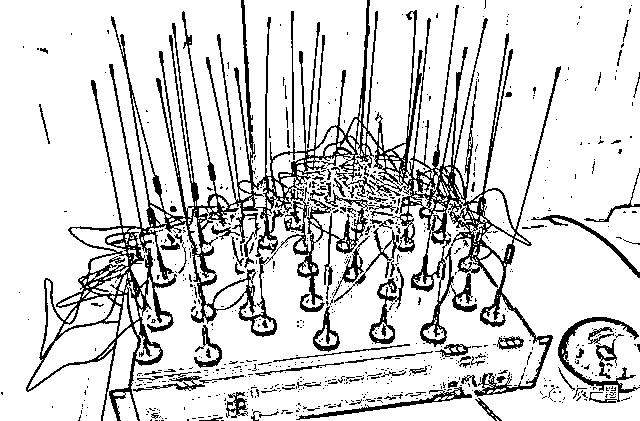**GOIP 移动版语音网关设备**

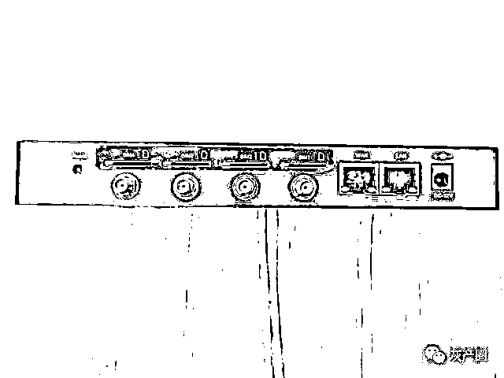来源网络

据公安部网安局信息公布早在 2018 年，广东珠海就已经出现有人用 GOIP 技术不断改换号码，冒充警察进行电信诈骗；

2019 年 8 月，贵州贵阳警方接连捣毁 8 个利用 GOIP 实施犯罪的窝点。不法分子通过定点放置 GOIP 设备，随意切换号码的方式拨打受害人电话，从而进行电信诈骗，隐蔽性极高。

**工作原理**

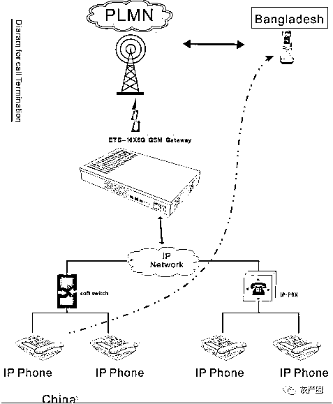

来源网络

**实施呼叫系统**

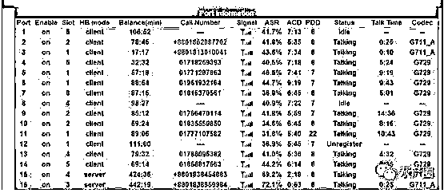来源网络

你 GOIP 了吗？你在哪 GOIP？已成了“骗圈”的口头禅，可以说 GOIP 设备”是网络通信的一种硬件设备，能将传统电话信号转化为网络信号，可以通过服务器远程控制 GOIP 设备，将电话或短信发出。

但是，GOIP 设备不是随便可以使用的，根据《中华人民共和国电信条例》有关规定，使用 GOIP 设备必须通过相关部门的审批，否则均不得使用。

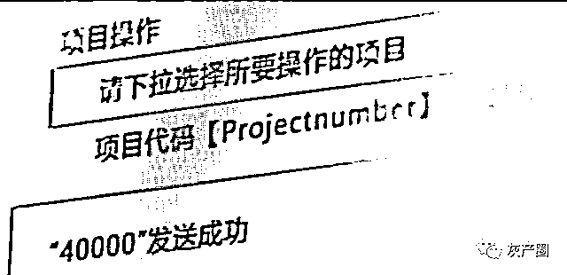来源网络

GOIP 设备支持接入大量手机卡，并能将传统电话信号转化为网络信号，支持群发短信、远程控制、机卡分离等功能。

诈骗人员可以将同时安装了上百张电话卡的 GOIP 设备放在国内，自己藏在境外，通过这些设备，拨打诈骗电话，实施诈骗。GOIP 设备则成为诈骗犯罪的“高科技保护伞”。

来源网络

看随着移动互联网的高速发展，VOIP 和 GOIP 被广泛应用。VOIP 全称 Voice Over Internet Protocol，是基于 IP 的语音传输，而 GOIP 全称 Gsm Over Internet Protocol，可以说是 VOIP 的升级。它们之间既有共同点，也存在很多不同。

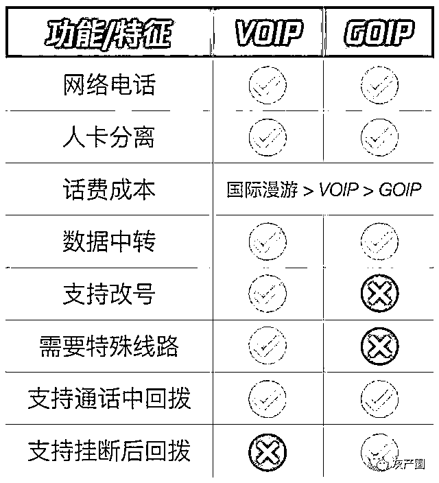来源网络

警方缴获到 GOIP 设备后，面临着众多技术方面的难题，比如不知道设备是哪个厂商生产的，不知道怎么连接到设备，不知道设备的账号密码被不法分子改成什么了，不知道设备中数据是什么东西，不知道如何继续跟踪处理提取的数据等等，这时候如果携带设备去找厂商或者企业技术支持，会花费较大的精力和时间成本，并且某些证据往往具有时效性，极大的延误的对网络犯罪行为的处置工作。

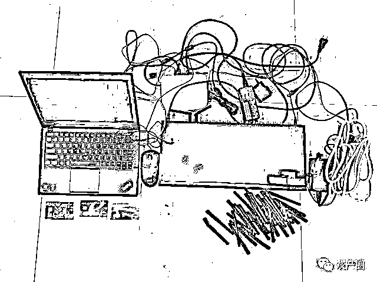来源网络

因此针对这一突出的问题，现在厂家提供密钥自动化工具就能够自动连接 GOIP 设备，自动化识别相应设备的厂商及型号，无需了解设备的厂商以及设备密码，只需简单操作就可以绕过设备登陆，自动从设备中提取设备中的证据数据然后生成取证报告，提供后置处置建议，以便于进一步溯源取证，为下一步的办案工作提供了更多便利性。

来源网络

打击不法分子任重而道远，电诈分子一般藏身在泰国，通过在国内网站上发布高薪福利工种进行招募和熟人介绍有可靠的人做担保，到了泰国实行封闭管理，不能出门。

她们拿着三个月有效签证，泰国管不了为此也为电诈增加了温床。

分工明确每天开工之组织者会给每人一份资料和脚本，里面有目标客户的电话和详细信息，大家都太怕电话诈骗通常一些陌生号码打来响一声你可能会挂断，骗子们会连续拨打三次以上，你可能就会认为有人有急事找你。

**举个例子：**

骗子们冒充执法部门的脚本：态度严厉冰冷，公事公办细节真实准确，客户资料联系你时骗子会背的熟练，做到一气呵成。

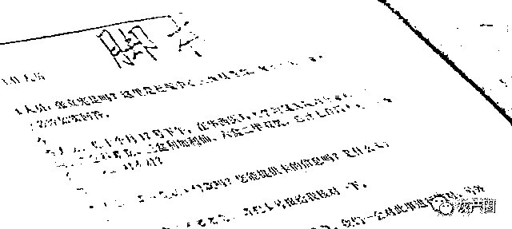来源网络

**分工：**

一号线任务，核心就是围绕受害者的利益，不管是想要得到的利益还是受害者怕失去的利益。

一号线拨打完成任务结束，就是二号线加药整个流程使被害者信以为真。

接下来就是三号线任务：负责网络支付转账的组织分工模式。

近期警方案例

用 GOIP 设备为境外诈骗分子提供搭建服务的犯罪行为屡见不鲜，以下案例只是冰山一角。

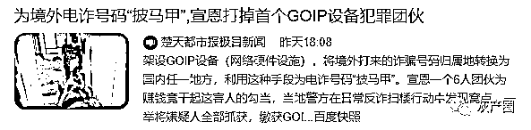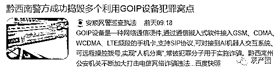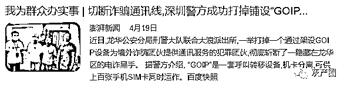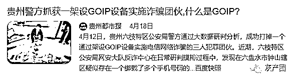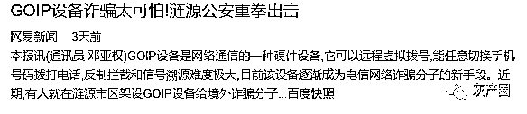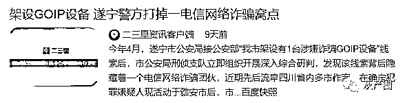    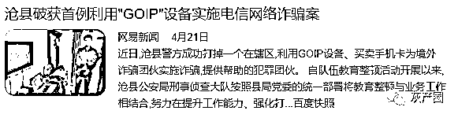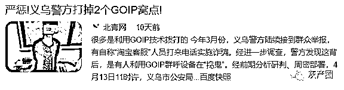    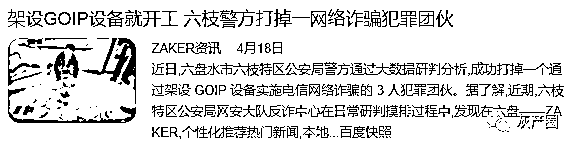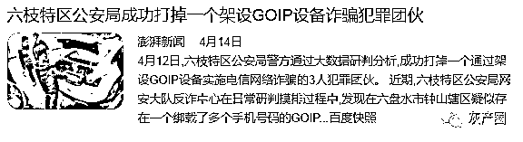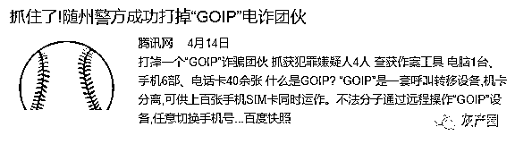

目前，在二手平台已经基本屏蔽相应关键词，也对二手商品进行了清查，在闲鱼里面已经搜不到 GOIP 设备了。

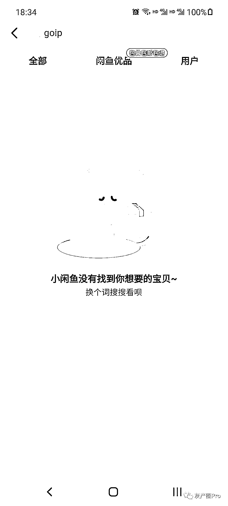

但是，在转转平台，可以搜索到一家卖 GOIP 设备的，可以说是漏网之鱼了，希望转转官方人员看到本篇文章能做出相应处理。

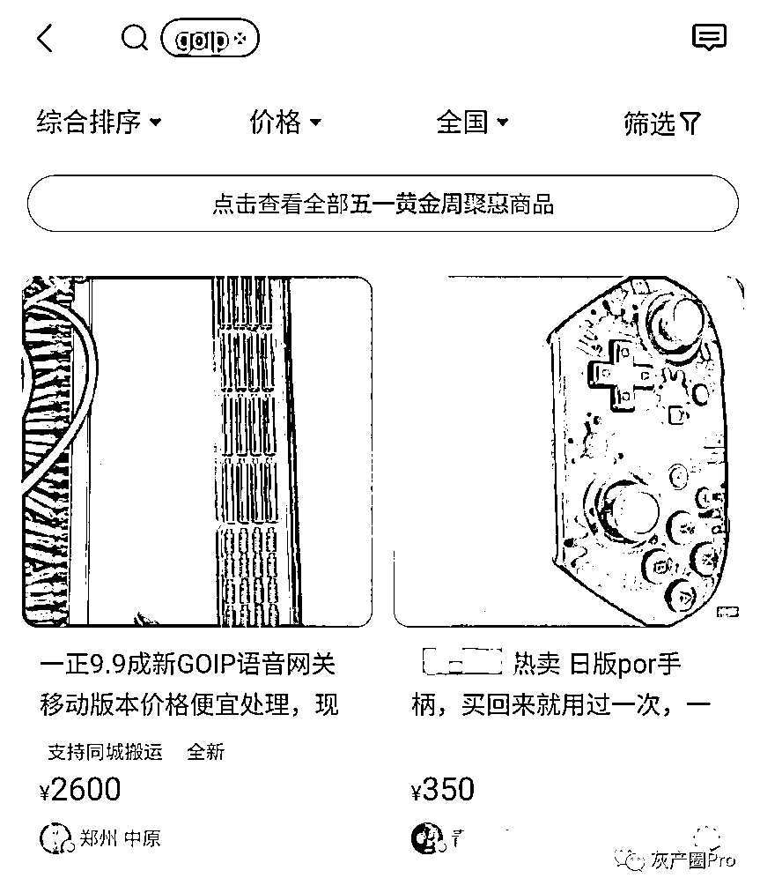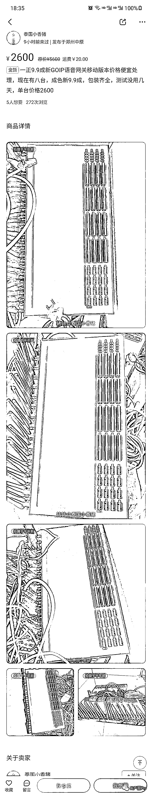

同样，在淘宝平台搜索“GOIP”能发现大量的商家在销售此类设备，虽然销量很低，但是不排除私下交易可能性。

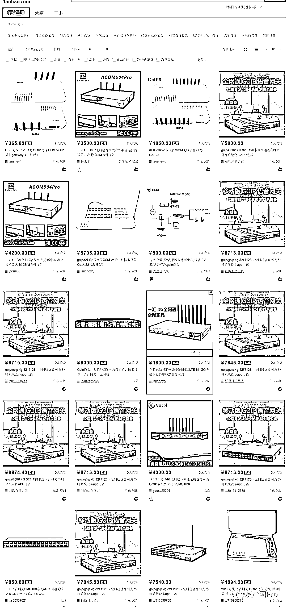

在京东平台小编也同样搜索到相关设备在销售。

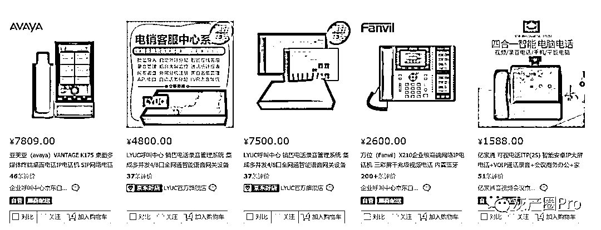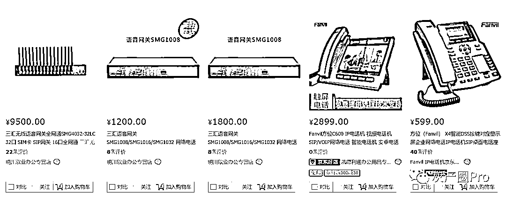

在百度搜索"GOIP"前五页，小编同样找到了几家卖 GOIP 设备的公司网页

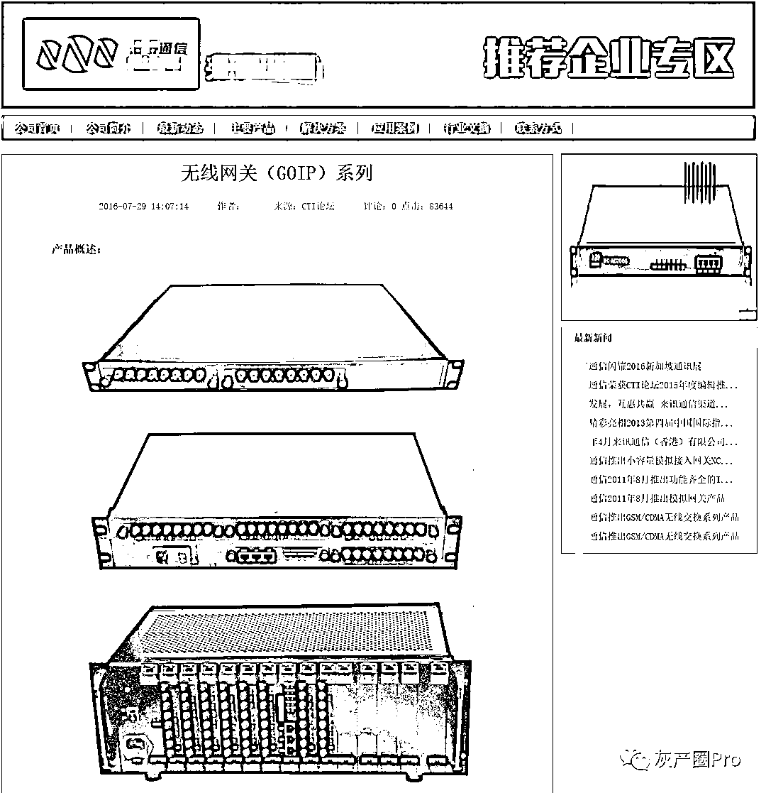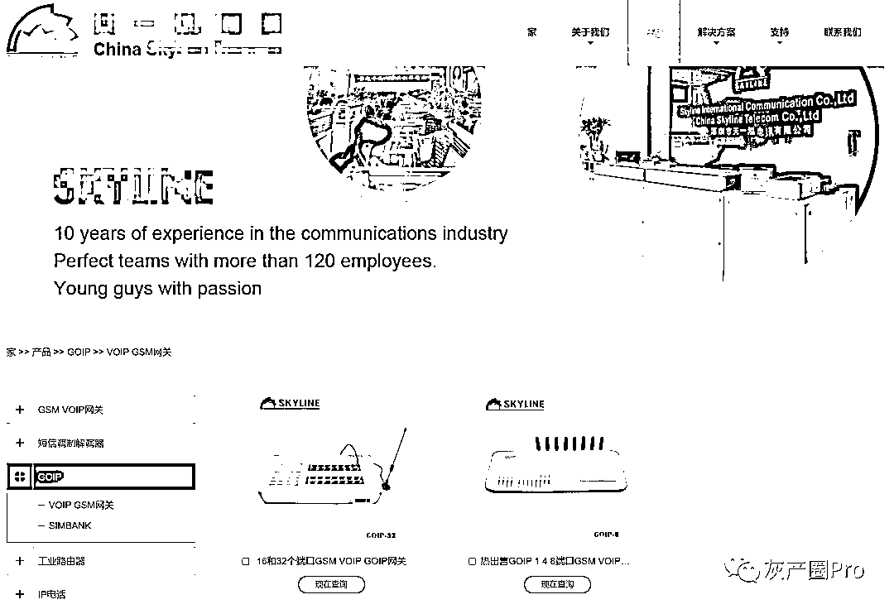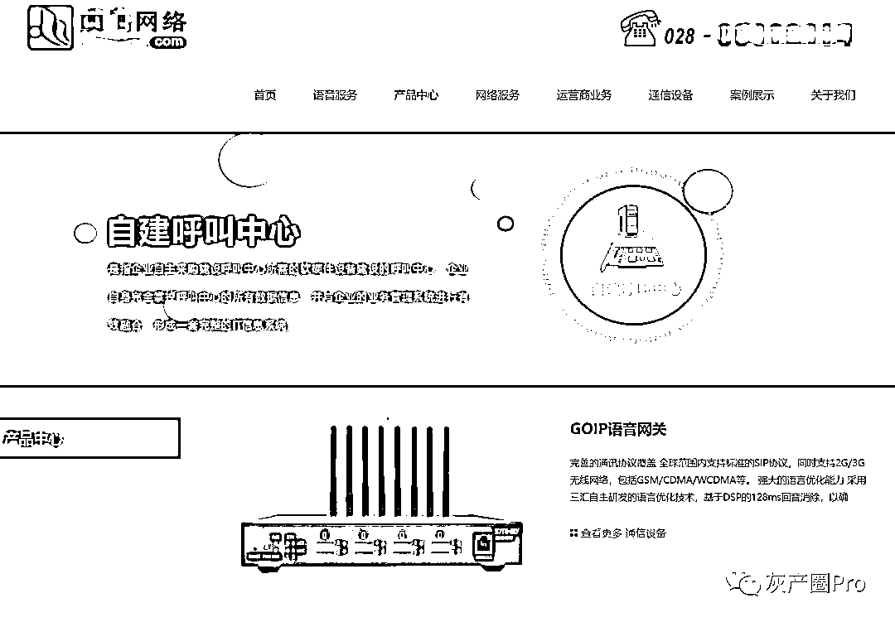

如何防范

**个人信息安全要牢记：**

不轻信、不回拨陌生来电及信息，遇到“客服”、“工作人员”、“公检法”人员等来路不明的身份，应当拨打电话向官方渠道进行核实。

保管个人信息，切勿将个人信息、支付敏感信息、短信验证码随便告诉陌生人，尤其是身份证号码、银行卡号、有效期、安全码和密码等重要信息，手机相册身份证照及时删除。

防范新型电信网络新型诈骗。不轻信陌生人提供的网站链接，要与官方信息核实确认，仔细辨别网站域名真伪，防范不法分子通过各类钓鱼网站链接，诱导获取消费者个人信息，诱导向陌生账户转账付款。

防范网络赌博风险。不要出租或出借自己的身份证件，不买卖银行卡，不为赌博、非法集资、电信网络诈骗等犯罪活动提供洗钱便利。

**最后忠告：**

**国外不是不法之地的天堂**

**回头是岸等你回家**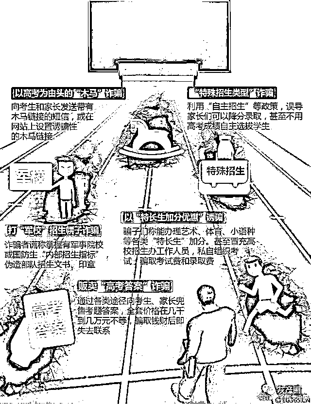

← 向右滑动与灰产圈互动交流 →

