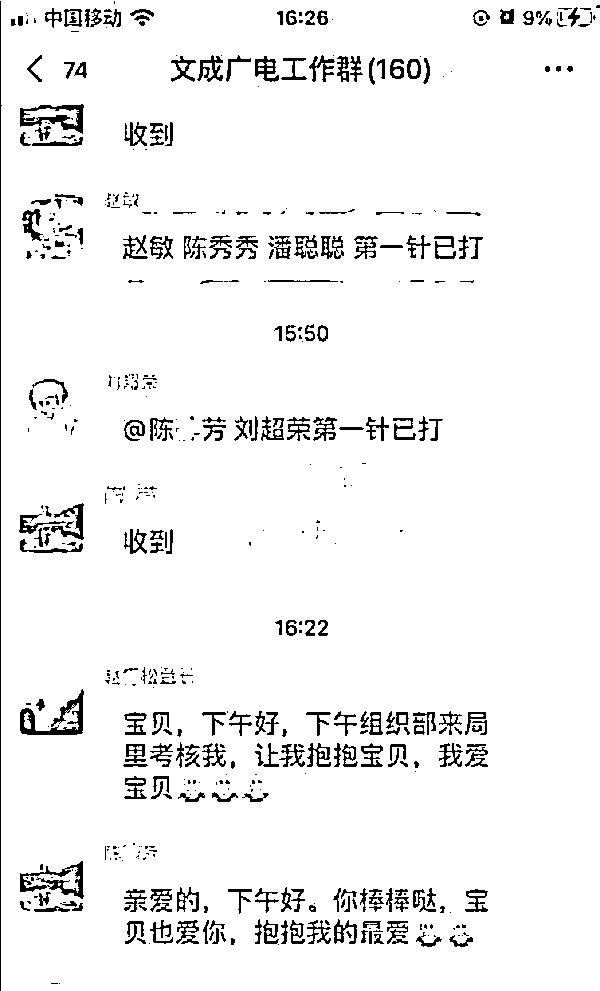
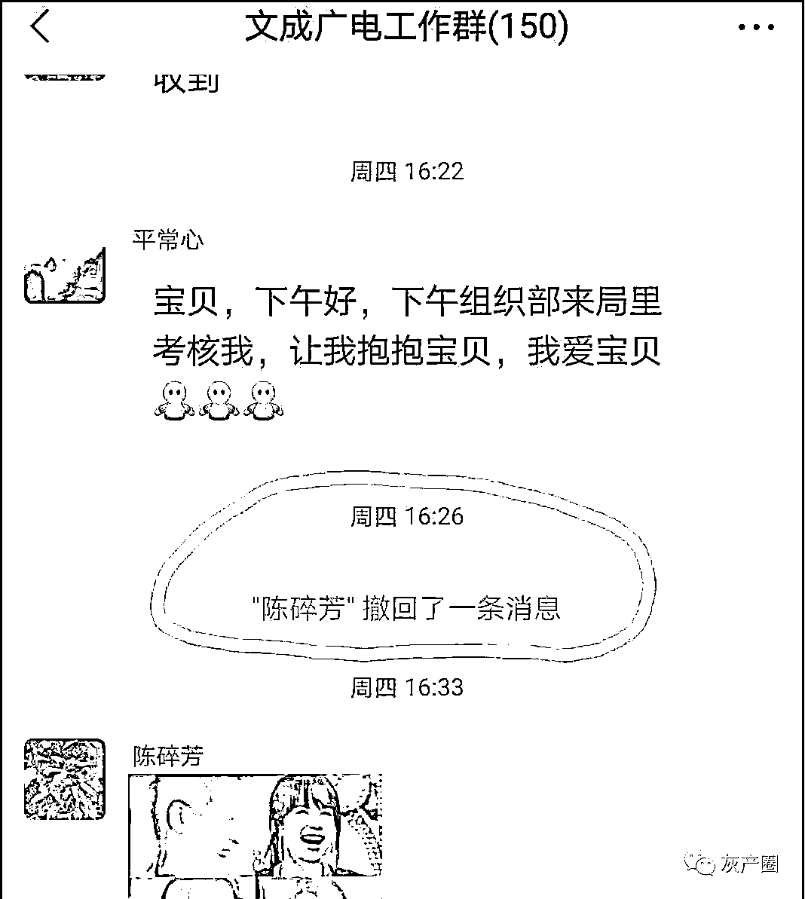
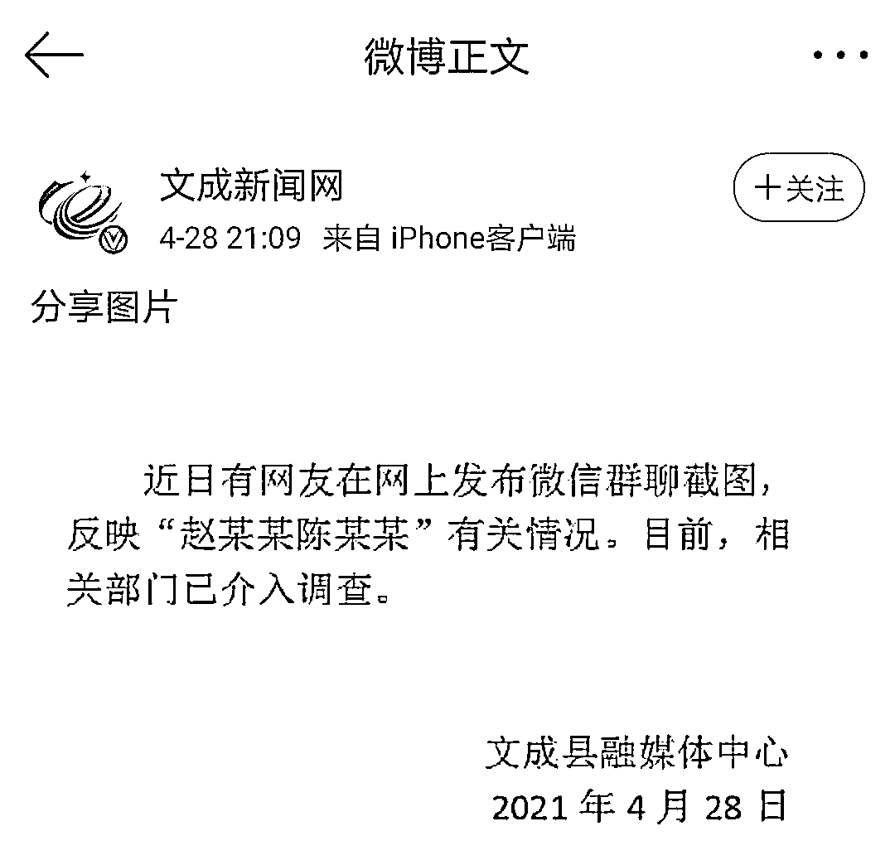
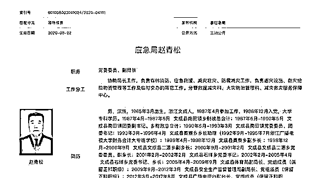

# 副局长与女员工群内互称宝贝？官方调查

> 原文：[`mp.weixin.qq.com/s?__biz=MzIyMDYwMTk0Mw==&mid=2247513670&idx=2&sn=9ddd47dd3ad613b4c19588fb5baf8b5b&chksm=97cb7d7ea0bcf46881027731b1714d855b6a83bbe7423016e882b0087e4544d9e0ac5966c0e4&scene=27#wechat_redirect`](http://mp.weixin.qq.com/s?__biz=MzIyMDYwMTk0Mw==&mid=2247513670&idx=2&sn=9ddd47dd3ad613b4c19588fb5baf8b5b&chksm=97cb7d7ea0bcf46881027731b1714d855b6a83bbe7423016e882b0087e4544d9e0ac5966c0e4&scene=27#wechat_redirect)

近日，一段“文成广电工作群”内的男女两人暧昧聊天对话在网上疯传。**目前，****有关部门已经介入调查。** 

“宝贝，下午好，下午组织部来局里考核我，让我抱抱宝贝，我爱宝贝”。“亲爱的，下午好。你棒棒哒，宝贝也爱你，抱抱我的最爱”。

截屏信息显示，发送信息的两个人，一个是“赵青松台长”，另一个是“陈碎芳”。另有一张截图显示，陈碎芳在回复赵青松台长的信息后，又撤回了消息，并以笑脸对其表示。

有意思的是，一开始这个文成广电工作群里有 160 个人，陈碎芳误回信息撤回后，只剩下 150 个人了。

**这 10 个人为什么那么快退群？**

**莫非另有隐情？**

****

****4 月 28 日 21 时 09 分，浙江省温州市文成新闻网官方微博通报称，近日，有网友在网上发布微信群截图，反映 " 赵某某陈某某 " 有关情况。目前，相关部门已介入调查。该通报的落款单位是文成县融媒体中心。****

********

******涉事二人是单身男女？******

******夫妻关系？还是涉嫌婚外情？******

************

******针对前述问题，29 日上午，澎湃新闻致电文成县纪委监委和温州市纪委监委相关部门，未获有效回应。文成县纪委监委相关部门一位工作人员向澎湃新闻表示，此事暂无法透露相关内容。******

******29 日上午，文成县融媒体中心一名工作人员告诉澎湃新闻，县里已经在处理相关舆情。 ******

************

******据悉，文成县政府官网显示，**赵某松现任文成县应急管理局党委委员、副局长。**2012 年 3 月—2017 年 8 月，赵某松曾任文成县广播电视台副台长、党组成员（保留正科职级）。而文成县人力资源和社会保障局 2021 年 3 月 30 日发布的“关于确定刘某燕等 35 位职员任职资格的通知”显示，**陈某芳系文成县融媒体中心职员**，1995 年参加工作，2021 年 2 月，其由管理十级升为管理九级。****** 

******赵青松简历******

****据文成县政府官网介绍，赵青松，男，汉族，1965 年 3 月出生，浙江文成人，1987 年 4 月参加工作，1988 年 12 月入党，大学学历。****

****1987 年 04 月-1987 年 05 月 文成县南田镇乡财政总会计；****

****1987 年 05 月-1990 年 05 月 文成县南田镇团委副书记、乡财政总会计；****

****1990 年 05 月-1993 年 03 月 文成县南田镇党委委员、团委书记；****

****1993 年 03 月-1996 年 04 月 文成县黄寮乡乡长助理（1992 年 9 月-1995 年 7 月浙江广播电视大学财务会计大专班学校）；****

****1996 年 04 月-1998 年 12 月 文成县黄寮乡副乡长 ；****

****1998 年 12 月-2000 年 09 月 文成县文成县二源乡副乡长；****

****2000 年 09 月-2001 年 02 月 文成县文成县二源乡党委委员、副乡长；****

****2001 年 02 月-2002 年 02 月 文成县石垟乡党委书记；****

****2002 年 02 月-2005 年 04 月 文成县石垟乡党委书记、乡长；****

****2005 年 04 月-2009 年 09 月 文成县体育局副局长、党组成员（保留正科职级）；****

****2009 年 09 月-2012 年 03 月 文成县安全生产监督管理局副局长、党组成员（保留正科职级）；****

****2012 年 03 月-2017 年 08 月 文成县广播电视台副台长、党组成员（保留正科职级）；****

****2017 年 08 月-2019 年 01 月 文成县林业局副局长、党委委员（保留正科职级）；****

****2019 年 01 月至 2020 年 04 月 文成县应急管理局副局长、党委委员（保留正科职级）；****

****2020 年 04 月，文成县应急管理局副局长、党委委员（保留正科职级）。****

****来源 ：潇湘晨报、澎湃新闻、文成新闻网、海峡网****

****************

****← 向右滑动与灰产圈互动交流 →****

********