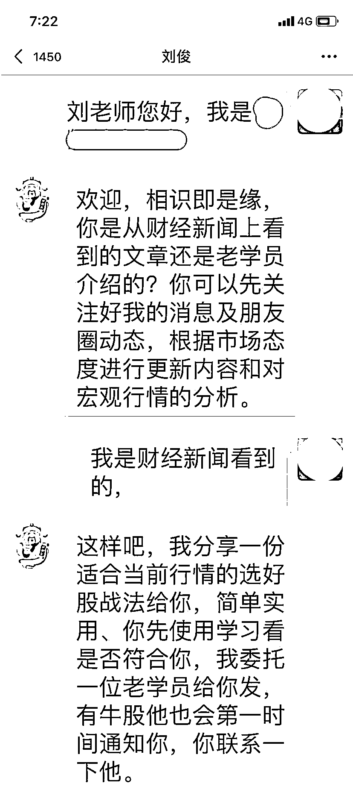
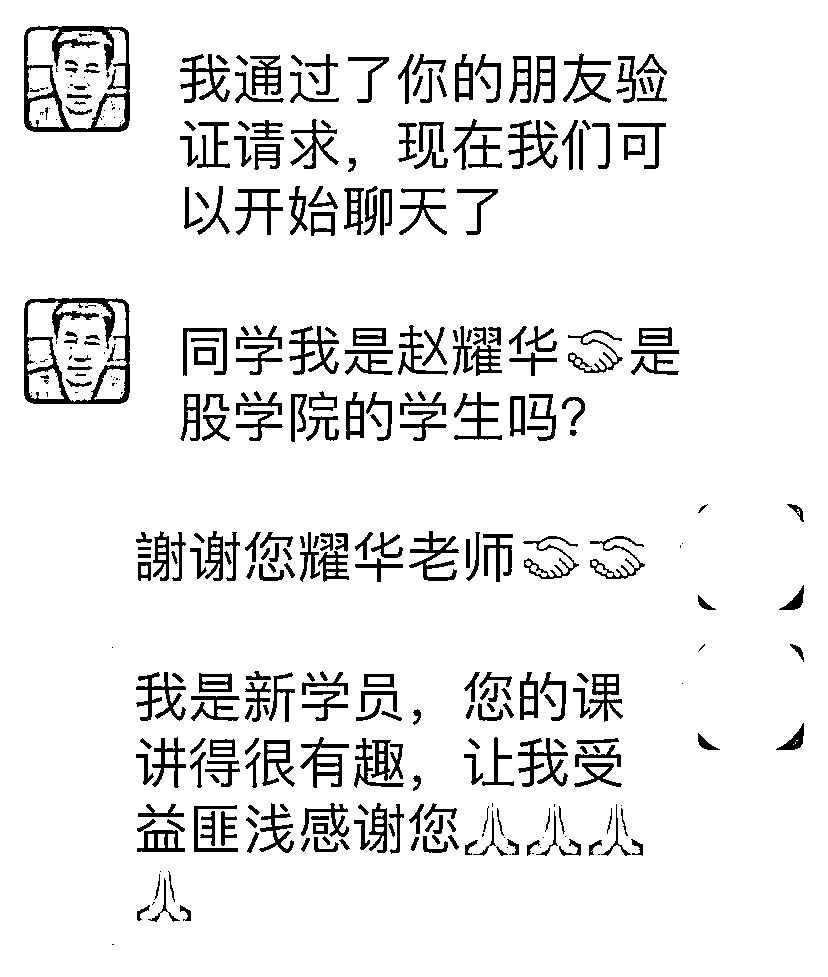
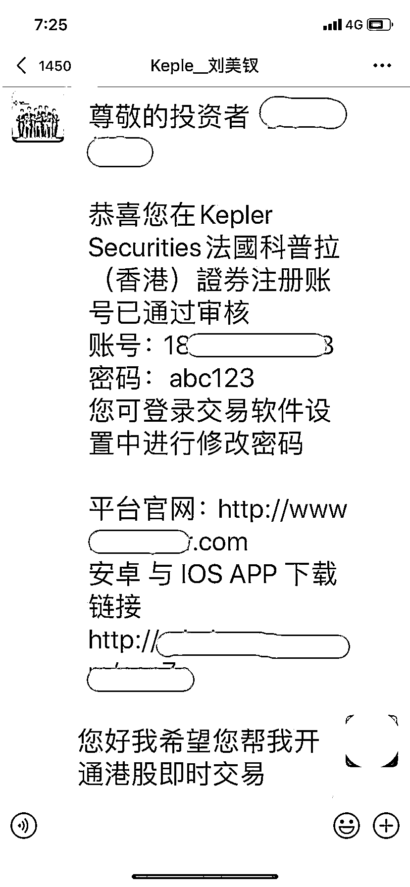

# 长沙男子不知如何打理手里的闲钱，认识“专业财经分析师”后……

> 原文：[`mp.weixin.qq.com/s?__biz=MzIyMDYwMTk0Mw==&mid=2247513670&idx=4&sn=7339f5b2bb75f73bd38fbbb9df40f431&chksm=97cb7d7ea0bcf468b5ef71fbf6958a249f27be75157a6df7d26b61cd1c579fc2d255b46876a4&scene=27#wechat_redirect`](http://mp.weixin.qq.com/s?__biz=MzIyMDYwMTk0Mw==&mid=2247513670&idx=4&sn=7339f5b2bb75f73bd38fbbb9df40f431&chksm=97cb7d7ea0bcf468b5ef71fbf6958a249f27be75157a6df7d26b61cd1c579fc2d255b46876a4&scene=27#wechat_redirect)

长沙的许先生是手里有一笔闲钱，存银行觉得利息太低，拿去炒股却老是被 " 割韭菜 "，想做其他投资又苦无门路，这让他十分焦虑。

想先定个挣它一个亿的小目标为什么就这么难？

一天，许先生在看到一篇财经文章，作者 " 刘俊 " 是一位 " 专业分析师 "，在文中对近期股市行情做了详细分析，直言：" 散户们看不懂行情都是因为学习不够、知识不足。"

看完文章许先生直拍大腿，顿觉茅塞顿开，对 " 刘俊 " 口中的网上课程产生兴趣，遂通过文末联系方式加了 " 刘俊 " 好友，决定接受其知识的熏陶。

" 刘俊 " 的态度很热情，指点许先生关注他朋友圈里的股市动态更新，还安排了一位 " 老学员 " 给许先生发来了一堆学习资料。

" 今天又小赚 5 万，谢谢老师 "" 幸好昨天买了，不然今天亏大了 "" 刘老师，今天买什么？天涯海角反正跟你走，让我买啥就买啥 "" 恭喜龚先生盈利到账 "" 只要大家听我的，保证每一单都让你们赚到 "" 这段时间行情好，大家要抓住机会 " ……

许先生被邀请进入一个投资理财交流群，群里很热闹，不断有群友晒出盈利截图，都是在 " 导师 " 带领下赚的钱。

" 看来不是钱难赚，而是自己没找对路子。" 许先生很心动，立即在群内报名了投资理财课程。在听了一段时间的 " 洗脑 " 课程之后，许先生顿时觉得各位 " 导师 " 无比亲切，感觉自己离致富的梦想就差了个 APP，随即下载了对方推荐的投资软件，开通了用户账号。

第一天，充值 15 万元，在 " 导师 " 指导下操作，盈利 2 万余元并成功提现。第二天，加大投入，又赚了一笔。第三天、第四天……许先生赚得盆满钵满。

" 许先生，你怎么上了我们的课程还是这种散户的心态呀，没赚个几百万提现有什么意义呀！" 这时，" 导师 " 劝说许先生不要频繁提现，因为提现需要缴纳手续费，把钱放在平台可以利滚利。此时，许先生的防备心尽去，看到 APP 上自己的账户余额在不断增大，便没多想。

接下来的 20 多天，许先生陆续充值 76 万元，APP 账户显示盈利近 300 万元。心满意足的许先生准备提现，结果却发现账户冻结，咨询客服，被告知必须交 50 万元提现手续费，许先生按照客服要求充值完成后，账户依然处于冻结状态。此时客服又要许先生再充值 15 万升级为 VIP，许先生拒绝，随后客服将许先生拉黑，许先生这才如梦初醒。

许先生报警后，民警复盘其被骗过程，发现他犯了三个致命错误：

一是轻信了 " 专家 "。骗子添加他人的微信、QQ，利用虚假身份与受害人认识，然后通过聊天增加熟悉度，取得信任。他们或通过一对一聊天，或把人拉进预先设好的群聊，对受害人进行围猎。

二是眼红了 " 高额收益 "。骗取受害人信任后，骗子就诱导受害人到所谓的投资理财平台上进行投资，制造高收益假象进行蛊惑。受害人误以为是在真实、正规的平台交易，实际上这些投资理财平台是骗子搭建的虚假平台。

三是落入了 " 语言陷阱 "。当受害人发现无法提现时，往往心慌意乱，骗子趁机以缴纳手续费等理由诱导受害人继续投入，直至受害人发现被骗。

警方提醒：理财投资必须选择合法正规的平台和机构，可以在证监会、期货业协会网站了解其资质或实地查看情况。不要轻易相信 QQ、微信群里的 " 民间高手 "、" 行业专家 "、" 精英 "，更不要在一些来历不明的网络平台上投资；切勿盲目加入未经核实的投资理财群，这有可能是预设好的局，群里可能除了你自己，全部都是骗子，你会不知不觉落入圈套。

来源  潇湘晨报 记者 | 满延坤

← 向右滑动与灰产圈互动交流 →

