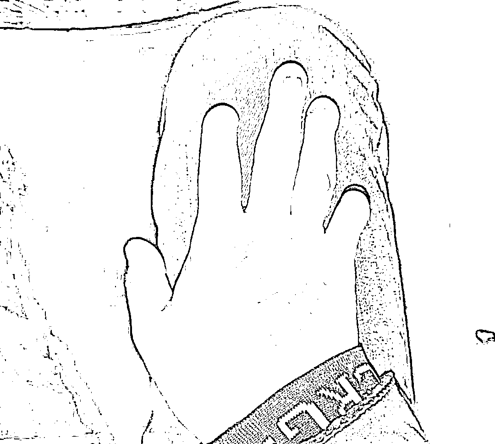
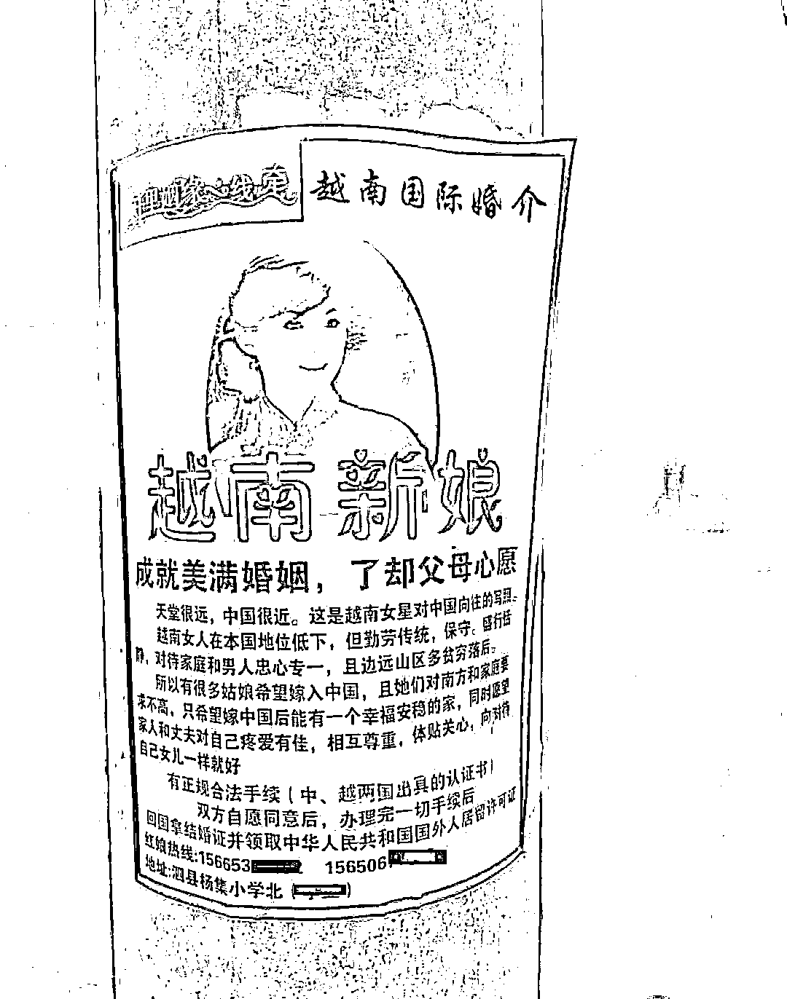
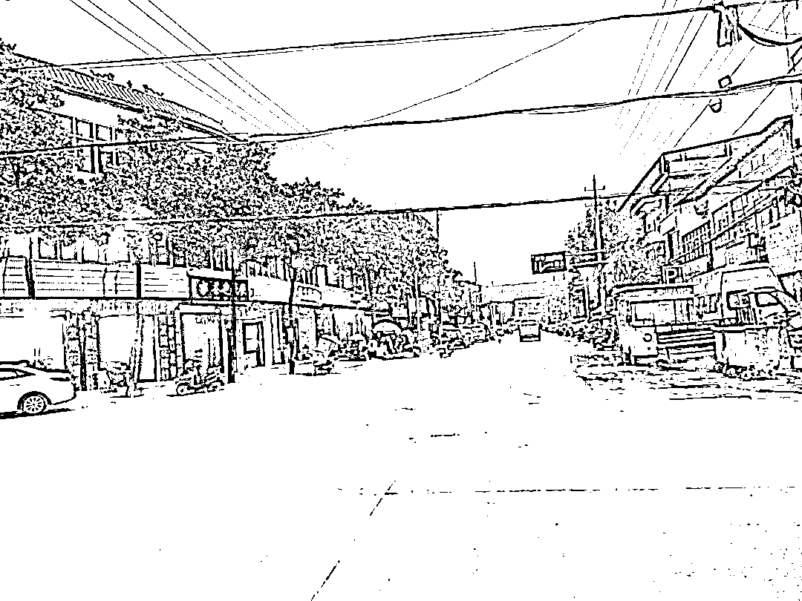
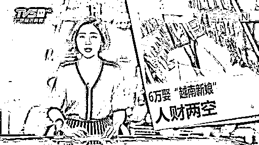
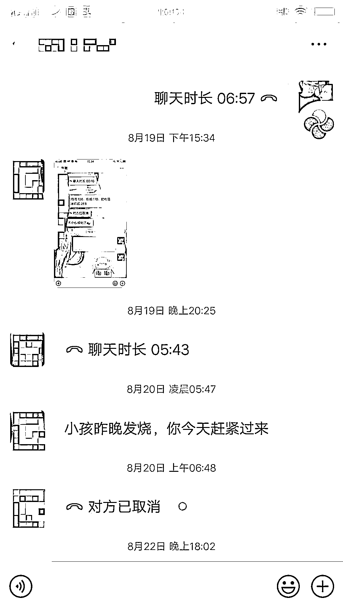
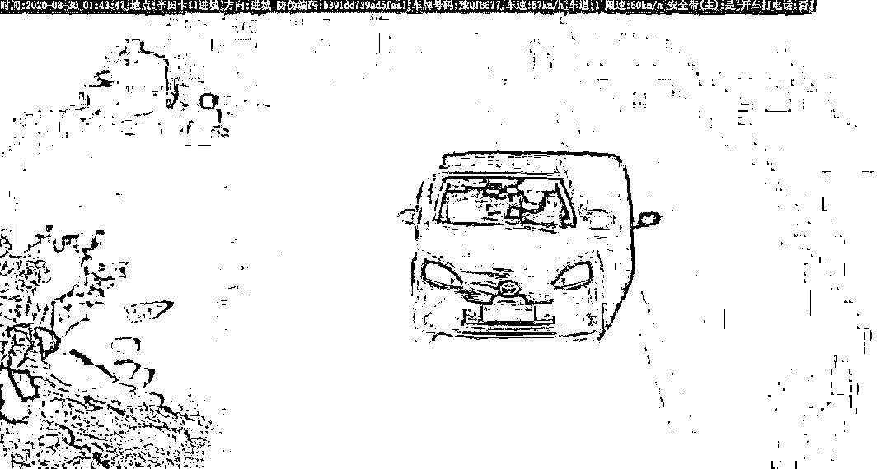
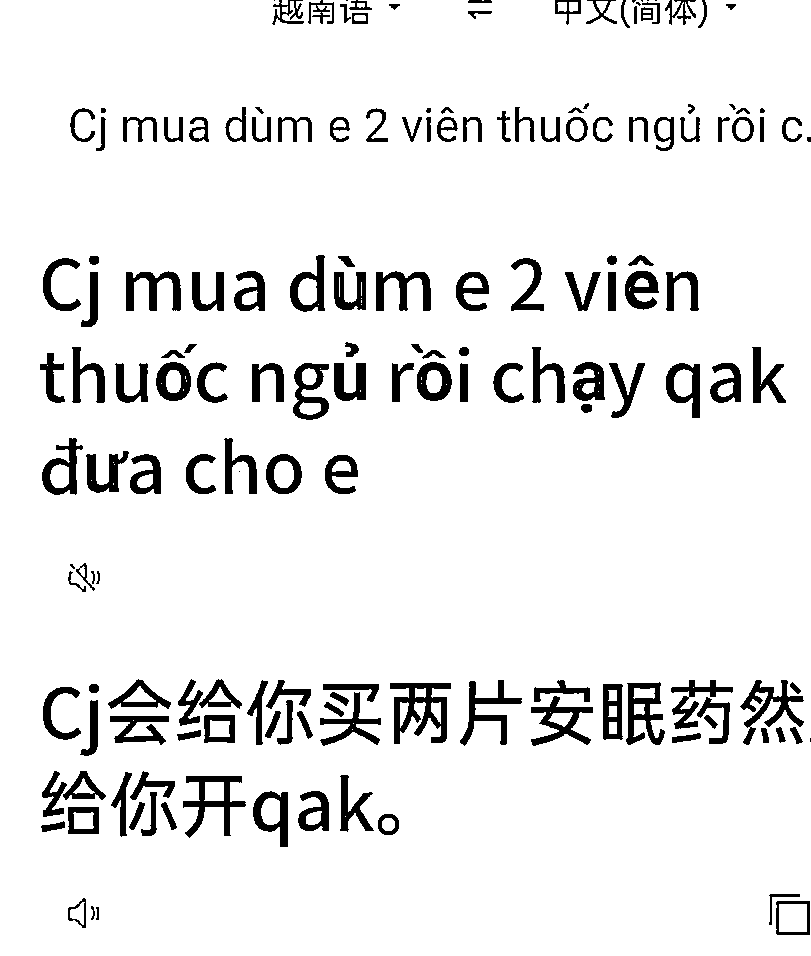

# 越南新娘骗局升级：继续狩猎中国光棍

> 原文：[`mp.weixin.qq.com/s?__biz=MzIyMDYwMTk0Mw==&mid=2247513714&idx=1&sn=f552bbfdb0df3139f13acbd3aaa4a6d2&chksm=97cb7d4aa0bcf45cacd24f3b5e50f543d0a69fe8363d28f3d2c2dcbc06b8aa61a8fbcc059f58&scene=27#wechat_redirect`](http://mp.weixin.qq.com/s?__biz=MzIyMDYwMTk0Mw==&mid=2247513714&idx=1&sn=f552bbfdb0df3139f13acbd3aaa4a6d2&chksm=97cb7d4aa0bcf45cacd24f3b5e50f543d0a69fe8363d28f3d2c2dcbc06b8aa61a8fbcc059f58&scene=27#wechat_redirect)

但尽量，还是不要和越南姑娘相亲了

连续 5 天，陈江辉都在车里过夜。 

立冬的第三周，湖北气温断崖式下跌，他离家时毫无准备，仅靠车内一条薄毛毯御寒。窗外雨疏风骤，没有夜生活的县城早早陷入沉寂。车灯熄灭以后， 四周唯一的亮光来自他的手机屏幕。   

去年 9 月，第二个越南新娘再次被媒人拐跑后，他决定报警，要求媒人赔偿两次娶妻损失的 16 万。

镇派出所、县公安局来回跑，两个月下来，一直没有立案。陈江辉只好驱车前往县人民检察院上诉，他自认为证据充分，可检察院又给出了相似的回复：

“回去等消息吧。”    

这两年时间里，陈江辉没有工作，生活重心全部压在家庭上。如今老婆孩子被人拐走，远在异国，自己全身上下只剩几千块家底。

回村怕被媒人的“黑势力”打击报复，待在县城，又舍不得住旅馆，陈江辉不知道，自己还能坚持多久。

和陈江辉一样的中国农村男人有很多。**一开始，他们花下十几万“买”下了一个越南老婆。买来的老婆跑了是常态，整个家族的人倾巢而出找不回来也是常态。毕竟，他们遭遇的，是一场链条严密，静心布局的针对性围猎。**

仅仅是逃跑技术，他们在利用 GPS 定位，快速开车来把人接走的同时，还会在周边设置了信号屏蔽器。你想打电话叫人拦截，就发现自己早已被拦截了。

这个世界早已不一样了，这些旧世界的光棍汉，束手无策。

花九万买越南新娘

和很多买了东南亚新娘的男子一样，性压抑和对异性的渴望，曾经拉扯着陈江辉的生活。

黄石最偏远的阳新县洋港镇泉口村，陈江辉是当地最穷的那波人，这种贫穷，直接在这个年轻男人身上留下了明显的痕迹。

自有记忆起，他的右手手指就严重变形，手背上覆盖着深浅不均的挛缩疤痕。听爸妈说，那是他烤火的时候摔了一跤不慎烧伤的遗留。

对于儿子的身体上的缺憾，这对父母不以为意，认为这伤疤只是看着吓人，但对做事影响不大，不值得浪费钱去医院修复。    

可陈江辉不这么想，**因为这道疤痕，他活在自卑的阴影里 。**

念书的时候，陈江辉总是把手藏在袖子里，偶尔写作业不小心把右手暴露在别人目光下，他就觉得自己像在裸奔一样羞耻。

后来到广州打工，陈江辉才发现这种内向和习惯性的闪躲，对自己更严重的影响——因为害怕被发现自己的缺陷，他错失了很多与心仪异性接触的机会。

  直到年近三十，他依然没有谈婚论嫁的对象，更没攒下什么钱。

陈江辉是广袤土地上无数底层剩男的缩影 ，西安交通大学教授李树茁曾指出，80 年代后出生的男性中，将有 10%至 15%的人找不到或不能如期找到配偶，而农村剩男的比例还要比这高得多。

在国内的婚恋市场，他们是绝对的弱势方，不具备为女性提供阶层跃迁机会的能力，更无力负担动辄几十万的彩礼，甚至拿不出钱谈一场像样的自由恋爱。

**种种因素之下，“一锤子买卖”式的跨国婚姻成为这些男性的最优，甚至唯一选择，而面向他们的骗局，也由此诞生。**

让陈江辉迈进骗局的，是一笔“横财”。

2018 年年底，陈江辉的母亲在工地意外去世，45 万赔偿款，突然砸向这个家庭。

这些钱，一开始都进了陈江辉父亲的腰包。在陈江辉眼里，父亲是个脑子不好，又喜欢“窝里横”的人。

母亲去世前，父亲和她吵过一次，一如过去的几十年一样，对着妻子又踢又打；母亲走后没几天，父亲就和一个“整天唱歌跳舞”的阿姨打得火热，鞍前马后地替人买菜做饭、垫付房租。

沉迷在自己的爱情里，这位父亲完全忘了儿子的终生大事，直到女婿，也就是陈江辉的妹夫，带着当地专做“越南老婆”生意的媒人找上门，才如梦初醒，开始拿着剩下的钱张罗起来。  

媒人叫李国庆，他老婆也是越南人，结婚生子多年来不但没跑，小日子还过得风生水起，看着这对出现在面前的恩爱夫妻，陈家父子开始相信李国庆说的话，“我老婆靠谱，我老婆找来的女孩自然也靠谱。”  

与此同时，不少短视频、自媒体等都在声称自己娶了越南等东南亚国家的女子，并通过各种“自身案例”，展现越南女子勤劳、温顺的一面，关键是，花销极低。

李国庆告诉陈江辉，越南极其贫穷，男的游手好闲，女的勤俭持家，所以越南女人都一门心思，只想来中国找老公。

***越南新娘广告***

“整个中国男女比例失调，不打开思路放眼国际很多人注定一辈子打光棍。”

“成功案例”近在眼前，再加上被挑起的对于单身的焦虑，陈江辉心动了。他想，通过媒人介绍直奔主题，刚好也能省去常规婚恋中他所不擅长的繁琐前戏 。  

为了迎接新娘的到来，陈江辉家里添了一辆车，还打算造一栋新房。

可惜，新房选址不好，在一块比马路低了两层楼高的泥巴地里，光是填土、打水泥柱就花了近 10 万。剩下的工程量，足够把陈家手里那点钱全部榨干，新房梦只好暂时搁浅。

2019 年 1 月，妹夫开车载着陈江辉和父亲去李国庆家看越南女孩。

女孩挺漂亮，会讲简单的中文，对陈江辉也表示满意。李国庆说，这个女孩在越南特意先学了中文才过来找老公，“你好好待她，人肯定不会跑”。

**尽管没有任何书面协议，但长期浸淫在乡村熟人社会的逻辑里，陈江辉对此并没有任何怀疑 。**

他掏出九万介绍费给李国庆，请叔叔大伯等亲戚吃了顿饭 ，就把女孩正式领回家了。

美好的新婚，只维持了一个月，一个月后，女孩提出想回越南玩，李国庆这时候突然开口，说自己刚好准备去越南接别的女孩过来，可以顺路捎上她。他还向陈江辉一家保证，一定把人带回来，否则就赔 10 万块。 

但李国庆终究还是食言了。

那个女孩没有再回来，陈江辉去越南新娘贴吧发寻人启事 ，有吧友认出他老婆，说她是从国内别的地方逃跑过来的，辗转嫁过很多人。 

哪个在中国的越南女孩没嫁过很多人？**每隔几个月，她们就又当一次“新娘”。**

怀别人孩子的新老婆

陈江辉开始意识到自己被骗了，尤其是在看到贴吧里那么多类似的案例以后。

“越南新娘跑了，丢下八个月的儿子。”

“越南女办酒后四天就跑，我现在没脸上班、没脸接战友、同事电话。”

“钱到手卷款逃跑，十八万打了水漂。见到此人联系我。”      

在声势浩大的哀嚎和控诉中，他的遭遇并不十分稀奇。

  **这些人群整理出来的经历，包括情节、逃跑时间、逃跑方式，甚至是要钱的方式，都出奇地一致。**一个月左右，提出要回越南娘家探亲，成了娶了越南女子的中国男人们很难迈过去的一道坎。

陈江辉还是心存侥幸，他找到媒人李国庆，希望对方能给一个说法。和所有越南新娘中介一样，李国庆不承认诈骗，也不愿赔钱。但却出人意料地答应再赔他一个老婆。

这一次，陈江辉见到了那个“大眼睛、笑容明媚”的石梅然，一见钟情。

石梅然说，自己是从越南偷渡过来的，没有护照签证，只带了一张越南身份证，没有办法和他登记结婚。但陈江辉并不在乎，他觉得，对方也爱他，他们两情相悦，一纸结婚证根本不重要。

石梅然就这么跟陈江辉回了家 。虽然没法正式登记结婚，但陈江辉从未怀疑过这段婚姻的合理性。

***陈江辉与石梅然合影***

**石梅然来了两个月，肚子就鼓了起来，医院的检查结果显示：她已经怀孕四个多月。也就是说，李国庆给他介绍的时候，石梅然就已经怀孕了。亲朋好友都说这孩子不能要，要了会被人笑话，但陈江辉却不愿为了男人那点面子损害老婆的身体。**

**“小孩能在我家出生也是种缘分，如果一两个月的时候发现我可能就听他们的了，她能活到四个月，说明她命大。”**

**对于石梅然的过去，陈江辉从不过问，他害怕自己父母之间那种剑拔弩张的氛围，又入侵这个刚成立不久的小家。而且，由于陈江辉这类农村光棍，本身就对结婚对象的要求降低了很多，处于一个弱势地位。便更不好挑起事端。**

**这个小家曾经看似坚不可摧，而炸药开始埋下的时候，陈江辉却浑然不觉。**

**石梅然有一次跟越南老家通话，得知媒人李国庆的老婆私自联系她母亲，索要一万块打胎费。石梅然去找李国庆夫妻俩要钱，对方死不认账，两边大吵一架，闹掰以后，她跟陈江辉说了一个秘密：**

**李国庆带越南女孩来事先都会跟她们说好，待一年就跑，回越南或者找下家，反正钱都会给够。**

****当然，这种跑路，是需要多方合作的。**比如中介的支持，越南方父母的参与，甚至作为牵线人的男方亲戚配合。**

**事实上，在庞大的越南新娘大军中，但凡会说些中国话的，基本都是惯犯。他们常年参与这种婚姻流转游戏，从中获取相当钱财以后，便快速甩盘找下一个目标。**

**目标群体，大多在河北、河南、安徽等传宗接代观念比较重的地区，以及江西这一类彩礼要价高的省份。在这些地方的乡村，结婚的成本包括彩礼、置办新房等，基本不低于 50 万，加上男方大多是被挑选的。因此，那些出不起这笔钱，或者不被挑中的男中年，就成了这些跨国婚姻组织围猎的目标。**

**毕竟，为了他们的“终身大事”，怎么拉扯凑挪，这些人都还是有个十来万的。**

****这类组织，不只是越南，在整个东南亚，都早已形成成熟的链条。****

**在越南、老挝、柬埔寨等地，有专门的机构招募愿意参与这类骗局的女子，包括丧夫的、专门以此为职业的，也有不少本身就是从事肉体服务的小姐。当然，也有中国人专门去物色这一类女子的，他们会在中越边境的崇左一带的红灯区，找越南籍的女子加入合作。**

****越南新娘们，打一开始就把这些当作一盘生意。不过，那群“中国新郎”们，却总觉得自己遇到了爱情。****

**震惊过后，陈江辉的心很快又安定下来。他觉得这次交底相当于夫妻关系的一个里程碑。意味着老婆完全接纳了他，他们之间应该再也没有什么秘密，可以齐心协力将婚姻的小船驶向安宁的港湾。**

**接下来的一年里，陈江辉和石梅然一起带孩子，他在网上刷单赚点零花钱，石梅然做微商卖起了化妆品，日子过得“忙碌却幸福”。**

**这幸福只持续到今年 8 月，没有什么会永垂不朽。**

**疫情阴霾退去之后，陈江辉带着老婆孩子，一起到武汉玩，逛户部巷的时候，石梅然看到有人卖抖音上很火的那种冒烟冰淇淋，觉得很新奇，问了价格 25 元一碗，陈江辉觉得不划算，牵着石梅然就要走。 **

**石梅然生气了，说要回家，当天陈江辉就开车带她回阳新县玩了半天，回到龙港镇又逛了冶商平价。为了将功补过，还给她买了一个榴莲。 **

****

********

*********陈江辉附近，曾带石梅然逛过的洋港街********* 

******他没有想到，这件小事会让婚姻陡然生变。******

******8 月 18 日上午，石梅然让他去拿快递。等他回到家，却发现妻子已经不在了，一起消失的还有两个手机，以及两万块现金。******

******陈江辉想不到的事，每天都在发生。毕竟，只要跑得动，哪有越南新娘不跑的呢？只不过，怀孕的石梅然待得久了一点，他便以为遇到了真情。******

********逃走，是这些东南亚新娘们早已熟练的技术活。**“嫁”过门不久，彩礼加中介费等十来万都到账以后，她们一般都会在一个月左右闹着要回东南亚探亲。男方一般不会直接答应这样的请求，毕竟跑路风险很大。******

******最后会有两种可能，**一，拗不过的，答应和女方一起回东南亚；二，坚决不答应。********

******但不管哪种，最后这些东南亚女子都会成功逃跑出去的。当然，如果怀孕了的，就会等小孩大一点好带走。要知道，小孩是可以用来跟男方提款的无限额度信用卡。******

******大头是个安徽一个县城郊区的青年，由于从事编程相关工作，曾在网上看过各种防止东南亚籍女子逃跑攻略。“我看得比较开，毕竟这些女人们，本身和你就没什么感情，嫁给你就是一个交易，我们就是通过钱，获得一个相处的机会。所以，他们想着跑也是可以预料的。”******

******通过中介将老挝籍女子买回来以后，大头先是收缴了老挝新娘的护照和手机，并且严加看守。在一个多月以后，他也遭遇了“闹着回国探亲”的套路，他买了机票，和他的“老婆”一起回去。******

******在前往万象的飞机上，女子和他看似柔情蜜意。直到下飞机走入境通道时，他才发现，自己是外国人，和拥有老挝护照的老婆，走的不是一个通道。外国人通道手续比较繁琐，当他办完了入境时，老挝女子早已不知所踪。******

******身在河北的李建军则是另外一个狠角色，他娶越南女子目的很明确。他知道人是肯定会跑的，“我只要她给我生个小孩，生完了爱去哪就去哪”。******

************

************

*********新闻上，类似案例屡见不鲜********* 

********娶下越南女子后，他采取了强硬的囚禁政策。手机、护照等物品不多过问，但常年锁门不得外出。********

******只是两个多月过去以后，她依然没有怀上。有天晚上大半夜，她叫醒李建军，说自己来了月经，弄得一身都是，要去洗澡处理一下。李建军看着她衣服上染上的红色，陪她去了房间外的洗手间。******

******在门外守了十几分钟后，她让李建军帮她拿纸巾和卫生巾，她还要蹲厕所处理下出血。李建军就去了。等他回来的时候，一阵阵的马桶冲水声响起，但叫喊却再没人回应。******

******等他冲下楼时，一辆外市籍车牌的车轰着油门快速开走，早已不是他能追上的了。回到家里，他发现马桶水阀那里，紧紧地被一根铁钉卡住了，而**越南老婆留下的物品里，除了种种开锁工具，还包括大量的事后避孕药。********

******他拿起手机想通知邻村的乡亲在前方拦截，却怎么都拨不出电话。焦急之时，他看到路边有一辆面包车正在捣弄一个电瓶一类的东西，想喊他们帮忙，对方回复说车坏了没办法。******

********后来他才在网上发现，他们捣弄的东西是信号屏蔽器。********

******“白跟你睡啊？”******************

******石梅然躲在媒人李国庆家的消息，是陈江辉的妹夫一家告诉他的。******

********一走进门，李国庆的老婆立马撇清关系，说石梅然自己想跑，过来找她帮忙。**石梅然也没有过多辩解，告诉陈江辉现金和手机已经被接她的司机拿去，微信里的五万七，则转到了越南老家的账户。******

******回家以后，陈江辉和父亲决定先把孩子送到武汉给妹妹照顾，等石梅然把那五万七转回来以后，再接回家。******

******李国庆又开始介入这个事件，他打来电话，说这钱从中国转到越南容易，从越南转回中国却很难。话锋一转，李国庆说自己的老婆会操作，不如让那边先把钱，转到他老婆的越南账户里。******

******陈江辉和父亲，还是信了。******

******石梅然家里人最后还真转过来的，只有三万七，她们说老家有人去世，暂时挪用两万块做丧葬费。陈江辉还来不及去纠结另外两万的下落，他妹妹又打来电话，说孩子发烧了，病得很严重。******

************

************

***********陈江辉和妹妹的聊天*********** 

********陈江辉急匆匆赶往武汉，到了地方，一摸孩子额头，不烫。********

********妹妹不停劝他，小孩发烧容易反反复复，还是带回家比较好。到这时，陈江辉依然没有嗅到套路的气息。毕竟，那是自己的亲生妹妹。********

**********层层叠叠的骗局，已经把陈江辉包围起来。**********

********几天后，他在家里看着电视，李国庆的老婆敲响了门，她说自己来洋港玩，经过他家想借个厕所。陈江辉虽然心中不悦，也没多想，打开了危险的大门。********

********那天晚上，陈江辉睡得很沉，醒来感觉像宿醉断片一样，完全想不起睡前发生了什么。他抬起头呼唤自己的妻子，发现没人回应，起床一间间找过来，才知道，石梅然带着孩子消失了。********

********直觉告诉他，这事和李国庆脱不了干系，但面对陈江辉的质问，李国庆却表现出毫不知情的样子，还当着他的面给石梅然发消息，问她去哪了。 ********

********石梅然没有回复。********

********陈江辉魂不守舍回到家里，突然想起，石梅然曾经把她惯用的聊天软件 ZALO 的账号密码写在本子上，登陆以后，通过石梅然和李国庆的聊天记录，他终于看见了这个骗局的一角。********

********妹夫把陈江辉和石梅然在户部巷的不愉快告诉了李国庆，李国庆借机找到石梅然煽风点火，说陈江辉太小气，这么久了也不带她回越南看看，不如卷钱跑路，自己会把去年那一万打胎费还给她，还可以再帮她找个条件更好的老公。    ********

********石梅然信了。********

**********她知道，在中国，要挑选个更好的老公，太容易了。而且，又能轻易再拿到一笔彩礼的分成。**********

********于是，拿着李国庆老婆上门送来的手机和安眠药，带着陈江辉妹妹想办法骗陈江辉接回来的孩子，在重重掩护之下，坐上李国庆安排的一辆红色轿车，逃之夭夭。********

****************

*************监控拍摄，带走石梅然的车*************

********信息量太大，陈江辉感觉太阳穴附近的血管，“**像有无数只蚂蚁在爬**”。  ********

********半个月后，石梅然在 ZALO 上用另一个账号加了陈江辉好友，她说自己也被李国庆骗了，出走的时候现金和手机都放在李国庆家，更早些时候被扣下的那两万“丧葬费用”，也被李国庆两口子吞了。********

********至于为什么要逃走，石梅然的理由是，她以为那两万块可以归自己所有，再加上陈家父子强行把孩子送走，让她心里不痛快，被李国庆夫妇连哄带骗，就帮着撒了谎，“没想到这对无耻夫妻打的是两头骗的算盘。”********

**********“越南新娘的嘴，骗中国光棍的鬼”。**********

********东南亚新娘，本来就作为一个骗局出现，一个流转链条过长的骗局，需要无数个谎言支撑。在这过程里，不同的势力闯入盯上这些“中国新郎”，打算分上一杯羹。与此同时，这些势力之间也相互套路，最后大多会因为分赃不均，分崩离析。********

********在这时候，东南亚新娘们，乐于娶扮演无辜得角色，所有的出逃行为都是“被迫的”，“被骗的”。********

********围绕陈江辉的信息，真真假假四处爆炸，唯一能确信的是，自己钱被骗了。********

********他拿着和石梅然的聊天记录，去李国庆家里要钱，李国庆自然不给。报警以后，折腾了一个多月，闹到县公安局和信访办，才终于有人受理，拿着信访办给的文件到派出所的时候，陈江辉发现，同一个村被李国庆夫妻骗的人排了一队。********

********办案的民警对他们十分气愤，每个报案的人，都会被劈头盖脸一顿骂：********

********“谁叫你找越南老婆，找的时候不打招呼跑了来找我们，买老婆本身就违法知不知道？还赔钱？买的老婆跟你生活这么长时间，白跟你睡啊？骗完你们钱以后，能不跑吗？你还以为有真爱？”********

********站警察的角度，这番话完全没毛病。********

**********但“中国新郎”们，不想当光棍，更接受不了人财两空的处境。**********

********弱者对弱者洗劫************************

********在村里人眼中软弱了二十几年的陈江辉，终于决定硬一次，却发现困难重重。********

********在购买越南新娘的整个过程里，陈江辉觉得自己一直在凭良心办事，没有任何错处，可实际上，处处都能让人逮着把柄。********

********去年，石梅然的妹妹介绍来三个越南朋友，说想来洋港找老公，妹夫一家知道以后，跟陈江辉说，这钱不赚白不赚。********

********陈江辉看李国庆拼命带人来都没事，就答应帮这三个姑娘跟村里的男人牵线，**介绍费一个收 10 万，其余两个收 8 万。**********

********那时，陈江辉让女方简单地做了个保证，承诺不会骗婚，就算达成了协议。********

********后来，那三个女人先是跑了一个，陈江辉退了部分钱给男方，也得到当事人谅解。可这件事，却成了李国庆威胁他的把柄。********

****************

****************

***********妻儿“逃走”以后，陈江辉家越发冷清 *********** 

********陈江辉去派出所询问案件进展，民警问他，听说你也做越南新娘的买卖生意，你是不是和李国庆一样的人贩子？理智上，陈江辉认为派出所“抓他”的可能不大，但心里还是忍不住一阵忐忑，尤其事情越闹越大，甚至惊动检察院以后。********

********“谁知道李国庆他们狗急跳墙还会怎么陷害我。”********

********他终于看清楚骗局的全貌，妹夫一直是李国庆的帮凶，长期帮忙物色村里适龄、有钱的单身男人，在陈江辉家拿到母亲死亡的赔偿金以后，就把目光放到了他身上。而这其中，短暂相处一个月的越南女孩，以及后来的石梅然，都只是李国庆和妹夫一起从他手里骗走钱财的诱饵。********

********在他们行骗过程中，作为核心人物，随时要应对各种突发状况的越南新娘们，早已谙熟所有的应对套路。她们可以为了获取男方的信任，随时出卖中介媒人，以表现得真诚相对，也可以说很粗暴极端的情话，让人觉得很深情很珍惜这个“家”。********

********事实上，一切都不过是一盘生意而已。很多被骗的光棍汉，会在这过程中发现其中的门路，轻易就让自己成为“李国庆”。陈江辉给人介绍的三个越南新娘，就可以让他拿到 26 万。但陈江辉的性格，让他无法投身于这行。别人的越南新娘跑了，他利索就把钱退了回去。但李国庆不会。********

********即使陈江辉能说清楚这其中的逻辑，也握着自己认为足够充分的证据，但涉外婚姻维权，依然是一件困难的事情。********

********中国农村光棍与越南女子相亲所缔结的商品化跨国婚姻，根子里，是凭借婚姻自由，名义上摆脱了买卖婚姻的原罪，从而获得一种程序的合法性。********

**********但说白了，这就是买卖婚姻。**只是通过跨国的形式，将交易行为置于政府对婚姻管理的“灰色地带”，避免了政府对这种婚姻行为的干涉。********

********然而，当他们遭遇新娘逃婚、伙同中介诈骗等风险时，商品化的跨国婚姻很容易成为弱者对弱者洗劫的手段。********

********陈江辉们面对的困难不仅于此，就连一同受骗的父亲，都站在他的对立面。********

********父亲不止一次劝过他，既然自己也不清白，钱就别想要回来了，与其花时间去到处告状，不如赶紧找个正经事做，过得比别人好才是硬道理。看儿子不愿意听，非要坚持讨一个说法，这位老人唉声叹气，往后一靠，丢下一句，“那你准备坐大牢吧，那才是生不如死。”********

****************

****************

***********石梅然和李国庆的聊天翻译*********** 

********陈江辉还是更相信自己心里朴素的正义，他一遍又一遍向身边的人们解释：********

********“如果她自己跑了，说明我不够优秀，没能留住她的心，我不会去找媒人。如果是媒人把她带跑了，我绝对不服，肯定不能算了。媒人是介绍老婆的，收了钱怎么还能怂恿我老婆卷钱跑路？”   ********

********可每一个听到的人，都和他父亲一样，摇摇头，劝他不要再认死理 。********

********陈江辉依然相信，这一年多的时光里，他和石梅然给予过彼此的快乐都是真切存在的。********

********“她没有存心骗我，她只是脑子不好，容易被忽悠。”********

********他们现在还用 ZALO 继续联系，石梅然说自己非常后悔，愿意重新回到他身边，和他一起去告李国庆。********

********“只要把这个事了结，我觉得我们还是能好好走下去的。”********

********至于什么时候回到陈江辉身边，石梅然没有说，陈江辉，也没有问。********

********文中媒人李国庆为化名。********

******** 来源： 金角财经 ********

********************************

********← 向右滑动与灰产圈互动交流 →********

****************