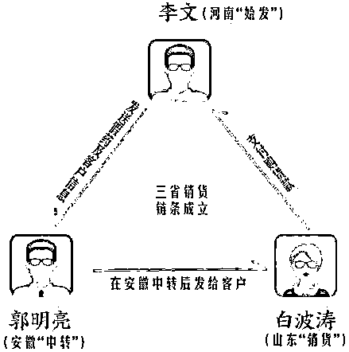
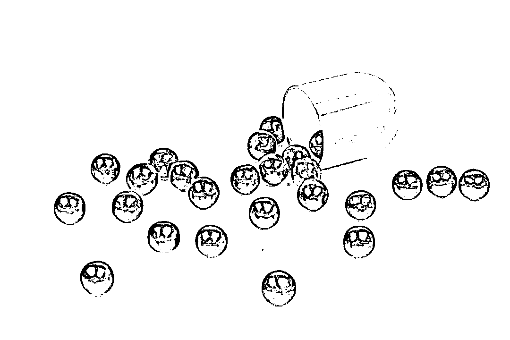
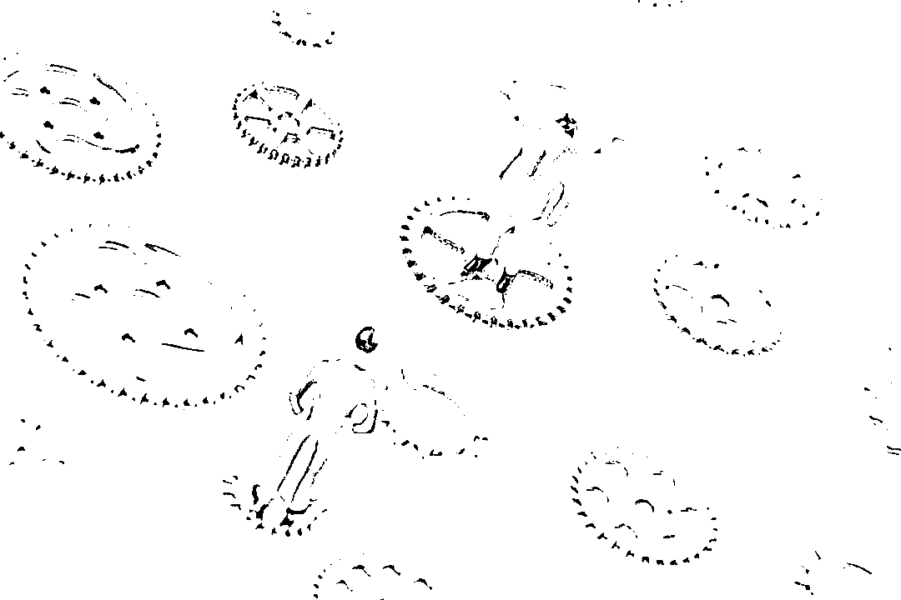
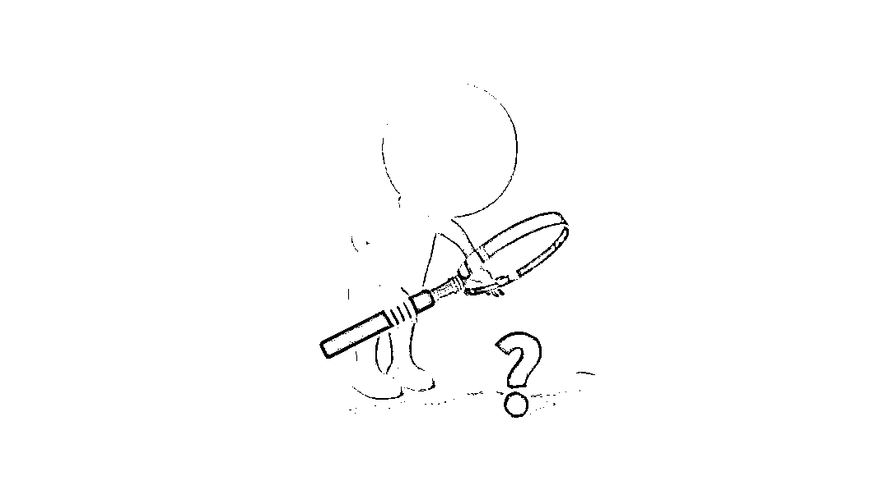
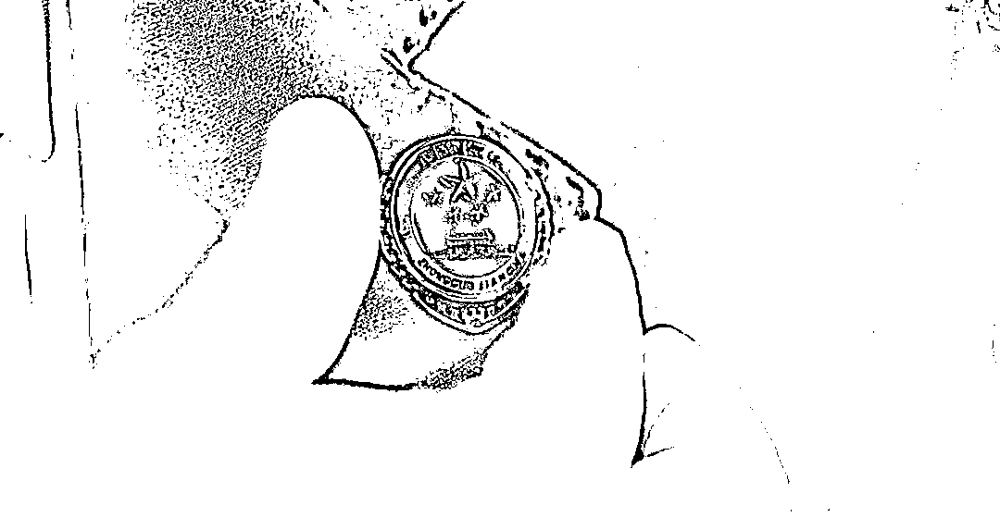

# 3000 多瓶“神药”的生产流程触目惊心……

> 原文：[`mp.weixin.qq.com/s?__biz=MzIyMDYwMTk0Mw==&mid=2247513714&idx=2&sn=a0f74c574e94795fdbc24d5c4721cf26&chksm=97cb7d4aa0bcf45c8614814314f48bed084f0b5cec26b1104b2e463f093ddb2922d9da745e71&scene=27#wechat_redirect`](http://mp.weixin.qq.com/s?__biz=MzIyMDYwMTk0Mw==&mid=2247513714&idx=2&sn=a0f74c574e94795fdbc24d5c4721cf26&chksm=97cb7d4aa0bcf45c8614814314f48bed084f0b5cec26b1104b2e463f093ddb2922d9da745e71&scene=27#wechat_redirect)

**3000 多瓶“神药”出自河南**

**途经安徽**

**最后在鲁北群众中流传**

**它究竟有什么神奇之处**

**经过办案部门的深挖细查**

**神秘面纱终于揭开**

**真相浮出水面——**

今年 1 月，山东省博兴县检察院以涉嫌销售假药罪对白波涛、李文、郭明亮等三人提起刑事附带民事公益诉讼。三名被告人均自愿认罪认罚，对所犯罪行供认不讳。

日前，法院经审理，以被告人白波涛犯销售假药罪判处有期徒刑六个月，并处罚金 3 万元；以被告人李文犯销售假药罪判处有期徒刑一年，并处罚金 5 万元；以被告人郭明亮犯销售假药罪，判处有期徒刑八个月，并处罚金 3 万元。同时，附带民事诉讼被告白波涛、李文、郭明亮三人于判决生效后 20 日内，支付惩罚性赔偿金 14.4 万元，并责令三人在县级以上媒体公开赔礼道歉。

至此，这个潜伏 5 年之久，跨越山东、河南、安徽三地的假药销售链条被成功截断。

**子承父业的“神药”**

**进军鲁北市场**

图片来源于网络，与正文无关

上世纪 90 年代末，河南南阳籍乡村医生“李大夫”辗转至山东博兴行医时，声称用“祖传秘方”自制的药丸对哮喘、风湿和腰腿疼等疾病有奇效，并因此结识了当地村民白波涛兄弟俩。兄弟二人经营着一家喷漆小作坊，由于长期接触刺激性气味，白波涛的哥哥患哮喘病已有多年，服用了“李大夫”的药丸后，其多年的病症很快痊愈。自此，双方便互留了电话号码，白波涛的脑海中也留下了一个关于“神药”的记忆。

2005 年初春，“李大夫”的儿子李文在河南某酒厂担任业务员，因工作需要经常出差。一次偶然机遇，他认识了白波涛的妻侄，透露了自己手上持有用“祖传秘方”制成的“神药”。由于之前的那段渊源，李文很快与白波涛取得了联系，并希望兄弟二人能为其“扬扬名”。

经过白波涛兄弟俩不遗余力地宣传，李文和“祖传秘方”的系列传言，很快在周边村庄扩散开来。有身患哮喘、风湿和腰腿疼等疾病的群众，都委托白波涛向李文购买“神药”，李文就通过这样的方式打开了鲁北乡村的市场。

受当时条件所限，每当白波涛需求的“神药”达到一定数量，李文便会携带药品专程从老家河南赶到山东博兴，亲自上门服务。

**快递异地“出货”**

**销售链条逐渐完善**

图片来源于网络，与正文无关

2005 年初秋，在跑酒厂业务的途中，李文认识了安徽阜阳的菜农郭明亮。得知郭明亮有“老寒腿”的毛病，李文便将自己随身携带的“神药”无偿相赠，并恳请他帮着传播“神药”名声；若乡邻们有购买“神药”的需求，郭明亮也帮着找李文购买。二人也由此结下了深厚友谊。

自 2015 年开始，快递行业蓬勃发展，同时河南省相关执法部门也加大了对假药的管制力度。见状，李文便伙同郭明亮想出了转移销售地址、开展“线上”业务的点子。

每次交易前，李文与外省“客户”事先约定好“神药”的订购品名、数量，然后再以寄卖化妆品或日用百货的方式，从河南发往安徽。收到“神药”后，郭明亮作为“中转站”，根据李文提供的信息，分头向外界发货。白波涛便是李文和郭明亮共同的“下家”。

为避免执法部门发现，白、李二人事先约定，每半年进行一次交易。每次交易中，郭明亮会按照事先约定完成装箱。就这样，一条跨越河南、安徽、山东三省的“神药”销售链条，逐渐形成规模。

**揭开“神药”生产流程** 

**真相令人惊心**

图片来源于网络，与正文无关

这个“神药”到底是什么，又是怎样“生产”出来的？

原来，李文首先以数元的成本价购进一批装有 100 粒药片的裸瓶“原材料”，然后再对其进行“二次加工”——联系打印店，定制“神药”标签，私下伪造药品名称、批准文号、生产单位，同时为“神药”量身定做“药品说明书”，标注出药品名称、患者群体、药品成分、注意事项。经过二次加工的“神药”，其外观与药店售卖的药品毫无差异，足能以假乱真。随后，李文以每瓶 13 元的价格出售给白波涛。

经鉴定，李文所生产的“神药”，主要来自“高效风湿宁胶囊”“复方川羚定喘胶囊”。该两类药品均标注“河南省台前县风湿哮喘病研究所生产、研制”字样。

据悉，上述两类药物曾被患者称为“抗病神药”。1998 年 9 月，两类药品均因含有违禁成分被吊销药品批号，属于国家明令禁止的违禁药物，其药品成分主要是醋酸泼尼松、布洛芬、双氯芬酸钠等激素类成分，具有镇痛作用。这几种药物成分，由于靠激素控制疾病且具有镇痛等作用，会给患者造成一种“很有效果”的假象。而李文也正依靠着这一止痛效果明显的“神药”，唬住了不少不明真相的群众。

按照国家医药管理相关规定，上述药物面向特定病患群体，需要严格按剂量进行服用，且有相应的禁忌和注意事项。如果长期服用该类药物，不仅会延误病情诊治，错失早期治疗的机会，还可能造成内分泌失调等严重并发症。

**刑事附带民事** 

**检察官双重“亮剑”**

图片来源于网络，与正文无关

据李文等三人供述，2015 年 12 月至 2019 年 5 月期间，在这条持续多年的非法假药销售链条上，白波涛进货总金额为 4.81 万元，向周边群众销售“神药”3000 多瓶。待“神药”到手后，白波涛除部分用于治疗自身的哮喘病以外，还额外追加每瓶 2 元左右的差价，从中牟取利润，郭明亮作为“中间商”也从中牟利近 3 万元。

山东博兴农民高晓山是“神药”的被害人之一。2019 年 5 月，高晓山为帮其祖父治疗哮喘病，便托人从白波涛处购入数瓶“神药”。然而，高晓山的祖父在服药过后病情没有得到缓解。心存质疑之下，他便在网上搜索“神药”上标注的生产厂家和批准文号，结果大吃一惊，该“神药”既没有相关的生产厂家，亦缺乏相应的批准文号。他随即向公安机关报案。

经公安机关立案追捕，白波涛、李文、郭明亮等人全部被抓捕归案。到案后，上述三人对自身的犯罪事实供认不讳。

2020 年 12 月，博兴县公安局将该案移送博兴县检察院审查起诉。“对于假药销售案，绝不能简单地一判了之！”在办案过程中，检察官严格审核，多次实地走访白波涛辐射的“销售区域”，寻找多位被害人求证，进一步固定了案件的证据链条。

检察官经分析认为，销售假药影响了多名被害人的身体健康。今年 1 月，博兴县检察院以涉嫌销售假药罪对被告人李文等三人提起刑事附带民事公益诉讼，要求在追究刑事责任的同时，依法判决三名被告支付销售假药金额三倍的惩罚性赔偿金 14.43 万元，并在媒体上进行公开赔礼道歉。

日前，法院经审理作出如上判决。三名被告人当庭表示服从判决，不提出上诉。

来源：检察日报，最高人民检察院

← 向右滑动与灰产圈互动交流 →

