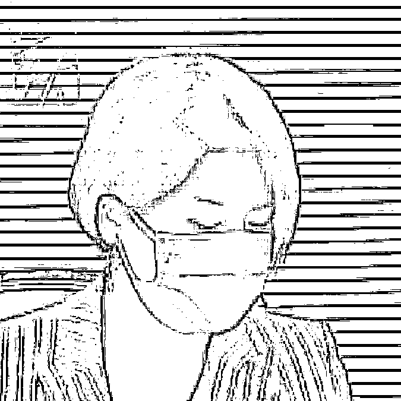
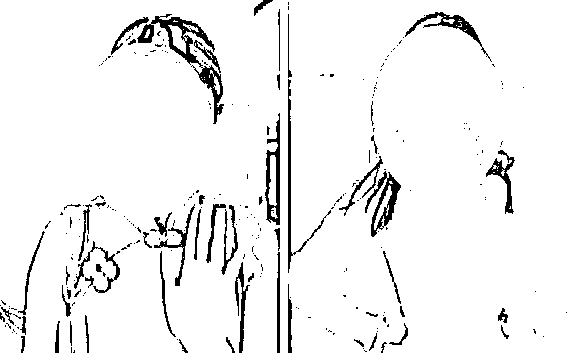
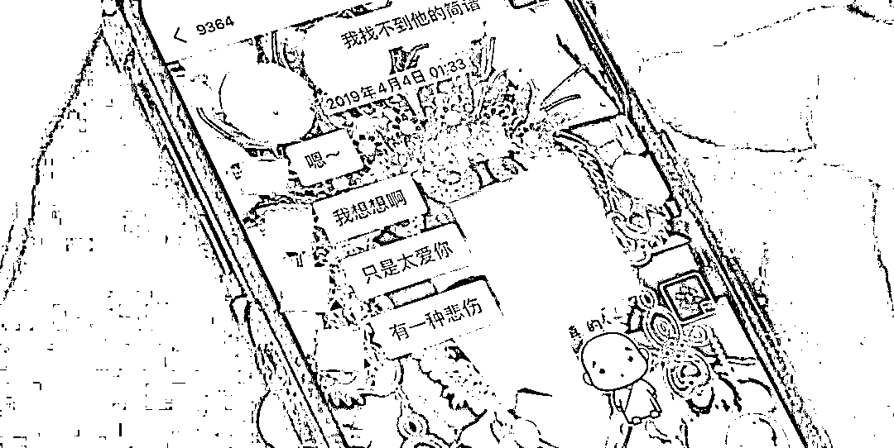
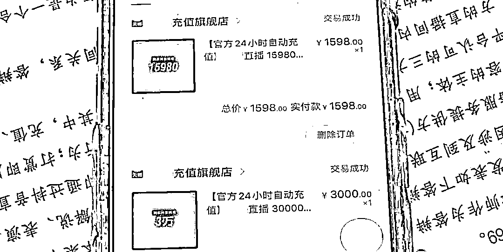
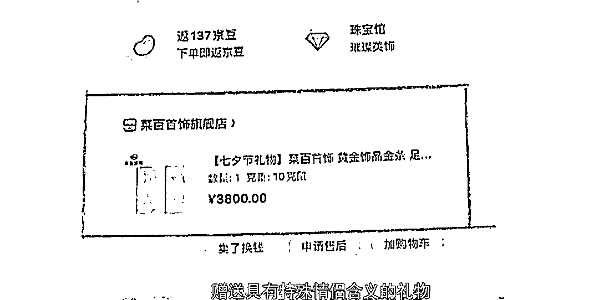
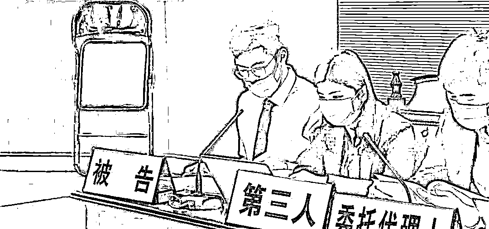

# 太崩溃！妻子整理亡夫遗物时发现惊人秘密，她一怒之下…

> 原文：[`mp.weixin.qq.com/s?__biz=MzIyMDYwMTk0Mw==&mid=2247513714&idx=4&sn=4194f885b9a7d4e5bfdaeec22746eeaa&chksm=97cb7d4aa0bcf45c4c96c2ee5bb3dfb0bcaccac63e7cf2e7d8428dcd68f4fd8b98a2a5d75391&scene=27#wechat_redirect`](http://mp.weixin.qq.com/s?__biz=MzIyMDYwMTk0Mw==&mid=2247513714&idx=4&sn=4194f885b9a7d4e5bfdaeec22746eeaa&chksm=97cb7d4aa0bcf45c4c96c2ee5bb3dfb0bcaccac63e7cf2e7d8428dcd68f4fd8b98a2a5d75391&scene=27#wechat_redirect)

**一名男子在 2 年里**
**“打赏”女主播 250 多万元****男子过世后****妻子整理遗物才发现这事……**妻子以
**未经配偶同意私自赠与他人大额财产****损害夫妻共同财产为由**将这名网络女主播及直播平台告上了法庭要求他们退钱！

**近日**

**厦门湖里法院开庭审理了这起纠纷**

[`mp.weixin.qq.com/mp/readtemplate?t=pages/video_player_tmpl&action=mpvideo&auto=0&vid=wxv_1847213877927706628`](https://mp.weixin.qq.com/mp/readtemplate?t=pages/video_player_tmpl&action=mpvideo&auto=0&vid=wxv_1847213877927706628)

**亡夫打赏主播 250 多万元**

**妻子发现后一怒之下……**

**原告 甄女士**我们当时的两套房产全部被售卖，我和他的父母原来以为他卖房的钱，是用在公司经营上，但却没有想到他的一部分钱是用在了包括直播打赏，包括赠送礼物，以至于现在的一个状态，我和他的父母至今还在外面租房居住。法庭上，原告甄女士说，她的丈夫杨先生去年 6 月过世。甄女士在整理遗物时发现，杨先生在某直播平台上，**向一名女主播“打赏”赠与了价值人民币 250 多万元的虚拟礼物****。**

并且，甄女士还在丈夫和这名女主播的微信聊天记录中发现，**双方不仅经常互道晚安，甚至还会对彼此说出“我爱你”这样的话，明显有悖于一般男女正常交往的关系****。**

甄女士于是将主播

以及该平台一起告上法庭

要求返还赠与的财物

**原告代理人**原告丈夫和被告一（女主播）长期线下见面，原告丈夫为其订酒店并一起旅行，还向被告一（女主播）赠送各种实体礼物，并在七夕节等具备特殊情侣含义的日期，赠送具有特殊情侣含义的礼物，并向被告一（女主播）赠送床垫等生活家居类物品。**损害夫妻共同财产的共有权**原告的代理人认为，在婚姻关系存续期间，杨先生在未经原告甄女士同意的情况下，私自赠与他人大额财产，损害了甄女士对夫妻共同财产的共有权，甄女士有权予以否认并要求被告退回。**违反公序良俗**同时原告代理人还提出，杨先生向这名女主播赠与财物的行为违反了公序良俗，损害社会公共利益，也应依法认定无效。而杨先生的部分赠与行为，是通过直播平台进行的，平台方应与这名女主播共同承担相关赠与财物返还的义务。

**对此**

**被告女主播的代理人认为**

**↓↓↓**

在法庭上，被告女主播的代理人认为，杨先生在主播直播的过程中打赏，**不是赠与行为，而是一种网络文化娱乐服务消费行为**。另外，杨先生打赏的总金额虽然高达 250 多万元，但他的充值次数有 13000 多次，每次充值金额都不大，**不能证明充值行为侵犯了夫妻共同财产的处分权**。

**被告代理人**

用户对主播进行小额打赏的精神文化消费行为，为真实有效，主播或平台皆不具有返还义务。答辩人作为主播，在直播间与用户互动或展示其才艺，现暂无证据表明其行为有违反法律或有悖于公序良俗。

**平台方的代理人认为**

**↓↓↓**

平台方的代理人则表示，在 2018 年 11 月到 2020 年 6 月间，杨先生还打赏过其他 10 名女主播。他们也认为，**杨先生的充值打赏行为，是消费行为，而不是赠与行为。因此，也没有退还的义务**。

**被告代理人**

答辩人公司系互联网直播平台服务的提供者，通过网络技术服务搭建平台，满足用户之间的精神需求，用户平台上购买抖币并兑换成虚拟礼物，打赏给主播的行为属于消费行为而非赠与行为，本案原告与二被告间均不构成赠与合同关系。

“打赏”主播究竟是赠与还是消费？

甄女士能否拿回 250 多万元呢？

**目前，这起纠纷仍在审理中**

事实上

**如今网络直播盛行**

**夫妻中的一方花几十甚至上百万**

**去打赏主播的事件并不少见**

**0****1**

**丈夫打赏主播 30 万**

**妻子索要退款被法院驳回**

一年半时间内，已婚的钟先生在某直播平台充值 1100 多次，对 370 多名主播累计打赏近 30 万元，妻子江女士将丈夫和直播平台一并诉至法院，要求返还全部打赏。2020 年 12 月，安徽省芜湖市中级法院经审理认为，**充值打赏的性质属于网络消费，而不是无偿赠与。**因为双方签订了《用户服务协议》和《充值协议》，直播平台也已经根据协议，向钟先生提供了视频直播、视频上传分享、搜索、虚拟社区币等服务。**钟先生作为完全民事行为能力人，应受自身签订协议的约束，并对自己的行为负责。**双方之间也不存在无偿转让财产的意思表示，不符合赠与合同的法律特征。最终法院驳回江女士全部诉讼请求。**0****2**

**男子婚内打赏女主播 21.5 万元**

**离婚后，妻子告上法庭**

张女士和吴先生（化名）2012 年结婚，2019 年年初，张女士发现丈夫吴先生与某直播平台的女主播林小姐（化名）存在不正当男女关系。

因此，二人于 2019 年 2 月离婚。离婚后，张女士才发现，在与吴先生夫妻关系存续期间，**吴先生在某平台有多次充值行为，并以“赠送礼物”的方式打赏给主播林小姐。**

吴先生承认自己在婚内通过某平台充值“打赏”主播林小姐 4.5 万元，除此之外还私下转账给林小姐 17 万元，吴先生承诺将上述总计 21.5 万元归还给前妻张女士，并愿意配合张女士找到主播林小姐要回上述款项。然而，吴先生没有归还上述款项，主播林小姐也“失联”了。

2020 年 9 月，法院一审判决，**吴先生和林小姐需共同返还给张女士 17 万元及相应利息，**与此同时，吴先生还需返还张女士 4.5 万元及相应利息。

**0****3**

**丈夫花 74 万打赏女主播**

**妻子起诉主播要求退还**

上海张女士的丈夫刘先生自 16 年年初就开始在某直播平台看直播，经陆续花掉家中 74 万元。据张女士描述，**这 74 万元是家中 15 年的所有积蓄，而自己平时因为忙着照顾孩子，对丈夫打赏女主播的事情并不知情。**张女士认为，丈夫打赏女主播的钱属于夫妻共同财产，所以向法院提出诉讼，要求女主播和所在的直播公司返还这部分钱。经法院审理查明，刘先生在打赏主播的三年时间里，分别换了 6 个账号进行充值，打赏金额比较分散且是长期行为，**无法判断网络公司处理这部分钱财的时候是不知情还是恶意的。**而且赵女士说，三年时间中自己与刘先生朝夕相处，却并不知晓刘先生所从事的这些活动，显然说不通。最终上海市杨浦区人民法院的判决，**刘先生瞒着妻子向女主播打赏的 74 万元是不需要返还的。**通过以上案例可以发现有些打赏可以要回来有些却不行 **## **直播中的巨额“打赏”**

## **可以要回来吗？**** **根据《民法典》合同编规定**

赠予合同是赠与人将自己的财产无偿给予受赠人，受赠人表示接受赠予的合同。同时还规定，赠予财产转移之前可以撤销赠予；受赠人严重侵害赠与人或者其近亲属的合法权益时可撤销赠予等等。

用户完成“打赏”

一般来说赠予合同即履行完毕

**只要不发生法定撤销的情形**

**主播可以拒绝返还财产**

也就是说，一般情况下

**一个正常的成年人**

**巨额“打赏”是不可以再要回来的**

但是在特殊情况下尤其是“巨额打赏主播”的情况下打赏的钱是可以追回的！

**1**

**未成年人、成年限制民事行为能力人****“巨额打赏主播”，原则上可以追回**

依据《民法典》的规定，未成年人、成年限制民事行为能力人所实施的民事法律行为是无效或者效力上有瑕疵的，这些人“巨额打赏主播”的行为是超出了能力范围的，因此法律赋予了监护人宣告无效或者撤销的权利，原则上可以追回。

事实上，大部分家长们在与平台交涉退款事宜时，平台往往会以无法证明“打赏”行为是未成年人作出的为由，拒绝退款，一般都需要以诉讼的方式来维护合法权利。

**2**

**用公款打赏主播****赏金属于违法犯罪所得应予追缴**

因为挪用公款打赏主播，实际上打赏的款项是违法犯罪所得，司法机关查明后，“打赏”的赃款可能会面临被追缴。

**3**

成年人用自己合法赚的钱打赏也有可能依法追回

正常的成年人打赏女主播原则上是不能追回的，但是有一种情况下有可能追回。如果成年人有配偶，配偶一方可以主张自己对巨额打赏完全不知情，该行为侵犯了夫妻双方对共有财产的处分权，向法院起诉撤销该赠予。尤其是在打赏者打赏巨额财产后，**与主播存在婚外情等不正当交往时，原则上法院会认定此类行为违反公序良俗，主播接受这种打赏的，依法应当予以退还****。**

来源 | 海峡导报、特区新闻广场、第一帮帮团、中国网、 CCTV 今日说法等

← 向右滑动与灰产圈互动交流 →

