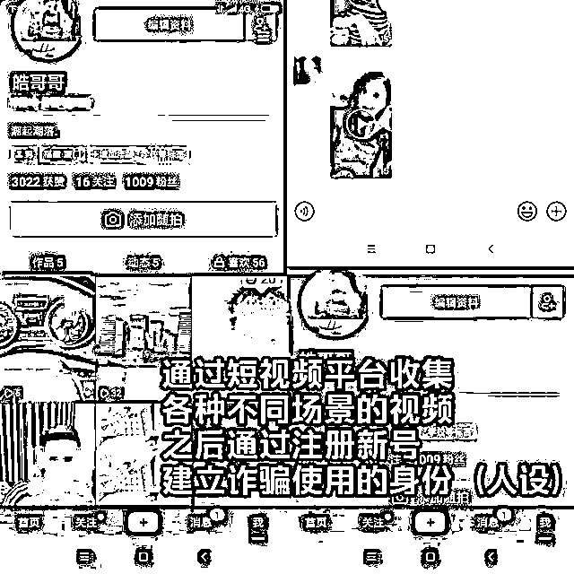
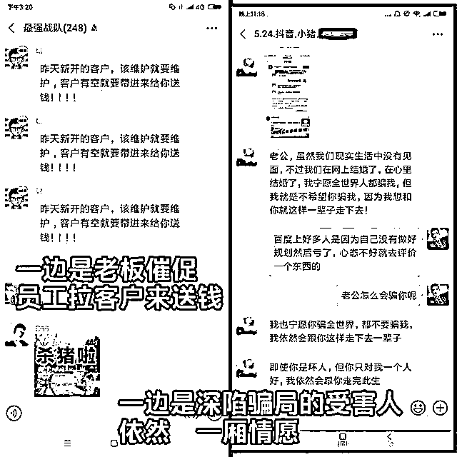

# “杀猪盘”背后触目惊心！诈骗流程大曝光！

> 原文：[`mp.weixin.qq.com/s?__biz=MzIyMDYwMTk0Mw==&mid=2247513745&idx=1&sn=b7279d964133573392ef0d4049e23140&chksm=97cb7da9a0bcf4bf50cf1d144a0d31b991e412309398aebac0dae989dc5cf30744ab279e197a&scene=27#wechat_redirect`](http://mp.weixin.qq.com/s?__biz=MzIyMDYwMTk0Mw==&mid=2247513745&idx=1&sn=b7279d964133573392ef0d4049e23140&chksm=97cb7da9a0bcf4bf50cf1d144a0d31b991e412309398aebac0dae989dc5cf30744ab279e197a&scene=27#wechat_redirect)

去年 12 月，南宁的张女士通过某社交软件认识了一位同龄男子。本以为是两情相悦，张女士万万没想到，自己已经掉进对方精心设计的圈套中。

“**认识熟悉之后，他就让我帮他做一笔理财生意，并把网络上的账户和密码告诉了我，**当时就觉得，这个人挺靠谱的；我帮他操作了以后，马上就赚了一笔钱，我还当场看到赚的钱到账了。”

受害人 张女士

而张女士所说的“熟悉”，其实只是在微信上聊了十几天。又过了几天，男子又邀请张女士利用这个网络平台赚钱，**“我投资了 6 万，马上就赚了 6 千元，而且实实在在地提了现，所以我一直没怀疑过。”**

尝到甜头的张女士为了赚更多钱，便开始通过各种渠道借钱投资，**“从网上借贷，还通过微信和支付宝贷款，也向朋友借了钱，当时就想着能挣钱，而且提现也快，赚了钱就立马提现还款，应该没有什么问题。”**

就这样，**张女士向平台投入了一百多万元，原以为很快就可以得到回报，谁知却发现根本无法提现，**张女士这才发现自己被骗了。

接到报案后，民警立即展开调查，发现张女士投资的网络平台已经无法登录，民警判断，张女士遇到的正是典型的“杀猪盘”诈骗。

民警辗转北京、河北、福建、贵州等地，抓获犯罪嫌疑人 14 名，这些嫌疑人涉及至少 68 起案件，涉案金额达 1013 万元，受害人遍布全国各地。

南宁市公安局西乡塘分局网络安全保卫大队民警麦宇才介绍，在这类骗局中，嫌疑人往往会先添加女性为作案目标，然后通过聊生活、培养感情博取信任，之后再用虚假的投资平台激起对方兴趣，**“前期会让受害人先赚点小钱，之后再一步步诱骗受害人进行大额投资。”**

目前，该起案件还在进一步调查中。

记者了解到，2020 年，南宁警方以扫黑除恶专项斗争、“云剑-2020”“长城 2 号”等专项行动为牵引，以大数据为支撑，以快查快打、“断卡”行动、精准防骗为重点，多警种合成作战，多维度打击整治，全市刑拘涉电信网络诈骗犯罪人数为 2019 年同期的 2.1 倍，创下历年最高纪录；南宁市反虚假信息诈骗中心全年冻结涉案账户数量、资金同比分别上升 112%、108%，返还退赃金额同比上升 21.14%；取得了 2020 年省会市自治区首府计划单列市打击治理电信网络诈骗犯罪工作第二名的历史最好成绩。

小编想要告诉大家的是

**“杀猪盘”离你我并不遥远**

↓↓ 

** 第 1 步**

** 寻找素材，包装身份 **

首先这种诈骗团伙里每个一线的“员工”都要建立自己新的身份，也就是人设。一般来说，男的就假装高富帅，阳光帅气，有豪车，爱健身；女的则假装是经营美容店失败的个体户，年轻貌美、命途多舛，容易博取同情。 

人设的建立需要大量的视频和照片素材，为此，犯罪团伙也做了大量的搜集、积累。此外，很多“员工”包装身份用的是同一套视频和图片素材，仅仅是换一下名字而已，“员工”之间也经常进行素材交流。

** 第 2 步 **

** 广泛撒网，猛加好友 **

包装完自己的“人设”后，这些团伙成员就开始大规模地在陌陌、抖音、婚恋交友等平台上添加好友。通过日常点赞、温馨问候、询问问题、挑逗搭讪等手段，让这些“客户”添加自己的微信。 

一般来说，女“员工”就添加男客户，男“员工”就添加女客户，分工明确。

** 第 3 步 **

** 培养感情，发展网恋 **

加完好友，最最重要的事情就是建立感情。按照剧本的流程，刚添加完好友，不可操之过急，只能蜻蜓点水般地进行日常问候，几天之后才开始往网恋方向去走。 

通过一来二去的嘘寒问暖以及情感问题上的“敞露心扉”，有些客户慢慢就中了这样的感情炮弹。

** 第 4 步 **

** 拉向深渊，投资诈骗 **

感情建立起来之后，员工就开始有意无意地将话题向所谓“赚钱”的路子上引，慢慢把裹藏在甜蜜炮弹里面的深渊揭开。

他们先是跟客户说自己平时在做资金盘的投资，并且通过各种手段（网站漏洞）可以稳赚。然后就引导客户小试牛刀，第一次或者第二次会真的返现给客户，让客户尝到一些甜头，随后怂恿客户追加投资。

到了这个时候，不管理财网站上的账户是否有盈利，客服都会以账户异常、平台异常等借口不让提现，有的时候骗够了钱，甚至会关停网站。就这样，“杀猪盘”里的“猪”，被杀得血本无归，甚至背负巨债。

网上交友涉及金钱往来的 

一定要注意多提防多查证

如遇到可疑电话号码

**可拨打 96110 报警**

或**手机下载国家反诈中心 APP**

避免上当受骗

来源：法治最前线  公安部网安局  

← 向右滑动与灰产圈互动交流 →

