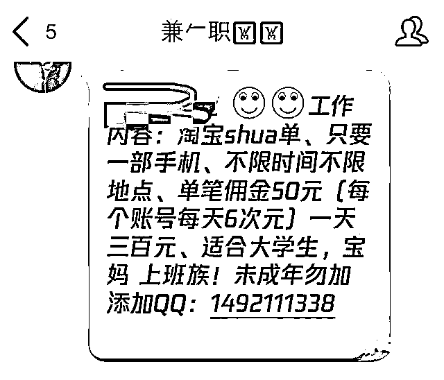
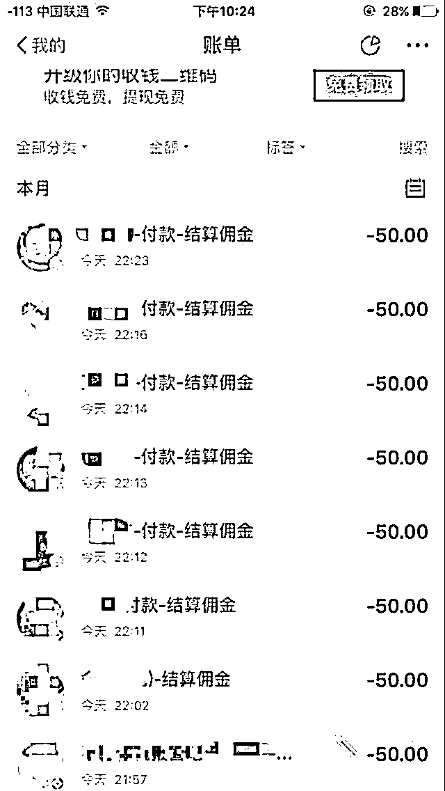
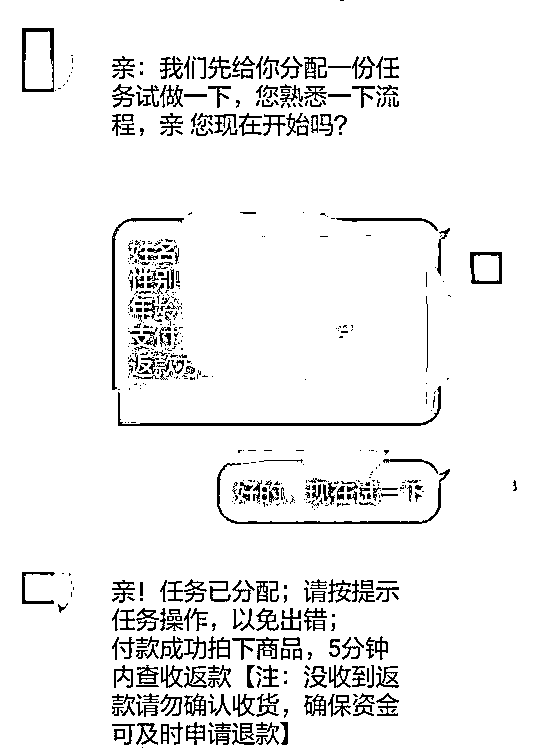
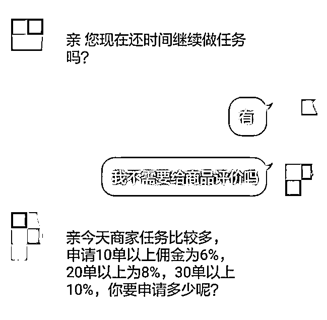
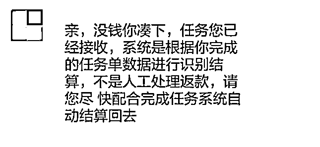
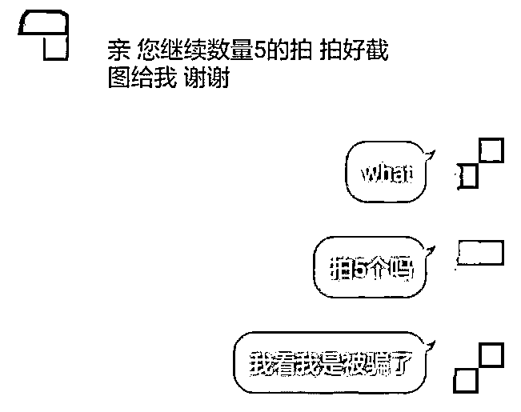
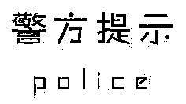

# 刷单套路到底是怎样的？

> 原文：[`mp.weixin.qq.com/s?__biz=MzIyMDYwMTk0Mw==&mid=2247513745&idx=2&sn=b282bec01c2578b17ec0c0af6c21cecf&chksm=97cb7da9a0bcf4bfe795c9350c7536c41413b1bf0a87ab0e79d2d079c9ceaa6978f01899a478&scene=27#wechat_redirect`](http://mp.weixin.qq.com/s?__biz=MzIyMDYwMTk0Mw==&mid=2247513745&idx=2&sn=b282bec01c2578b17ec0c0af6c21cecf&chksm=97cb7da9a0bcf4bfe795c9350c7536c41413b1bf0a87ab0e79d2d079c9ceaa6978f01899a478&scene=27#wechat_redirect)

刷单套路到底是怎样的？****（一）通过 QQ 群，网络小广告吸引目标群体。****

****

****（二）晒兼职收益，晒付款截图，骗取信任。****

****

****（三）先甜后苦，先给你糖吃。****

****

****（四）第二单开始让你付出成本不断加大，最后无路可退。****

****

****（五）以“任务单未完成”为由拒退本金是刷单诈骗通用手段。由于此时已经付出巨大成本，所以会越陷越深，直到被吃干抹净。****

****

**随着投入的本金越来越多，即使这时受害者已经怀疑受骗，但为了拿回成本，依然会选择再赌一把！而骗子会以批次任务未完成、当天任务未完成、二维码信誉已满无法支付等各种理由搪塞，直到你没钱还借不到钱为止。**

****

**骗子们的骗术一般分四步：**

**1**

**设置诱饵。骗子往往以“轻松高薪”做诱饵，声称刷单后在 5 至 10 分钟即可返还本金和至少 5%的佣金，动动手指挣大钱，承诺佣金和垫资成正比。**

**2**

**骗取信任。骗子会提供所谓的公司备案信息给受害人查询，或发送合同让受害人签字;伪造后台交易记录打消受害者疑虑。**

**3**

**施以小利。先让受害人练习刷单，购买低价商品，购买成功后会迅速将本金和佣金返还，让刷单者放松警惕。与此同时，客服会试探询问刷单者银行卡或支付宝等有多少流动现金，以便精准诈骗。**

**4**

**实施诈骗。让受害人购买虚拟物品减少付款流程，提供的链接商品为电话费、充值卡等虚拟商品，一次刷单任务包含多重陷阱，制造一个虚假的发单系统，称完成一次任务即可返还本金和佣金。然而一次任务包含多个订单，所有订单完成才能返款本金和佣金。最后以系统卡单为由，要求受害人重新支付某些订单来激活继续骗钱，受害者一旦意识到受骗，骗子便立马将其拉黑消失。**

****

**    任何要求垫资的兼职和刷单都是诈骗，不要有“贪图小便宜”和“轻轻松松赚大钱”的心理，不要轻信所谓的高额回报，不要轻易点击陌生链接。找兼职工作要到正规的招聘、中介平台或公司，签订详实的劳务合同，以保护自己的合法权益。遭遇诈骗要及时报警，并将对方的电话号码、QQ、微信、聊天记录等留存提交给警方，以便警方破案。**

**来源：武汉市反电信网络诈骗中心，利箭在出击**

********

**← 向右滑动与灰产圈互动交流 →**

****