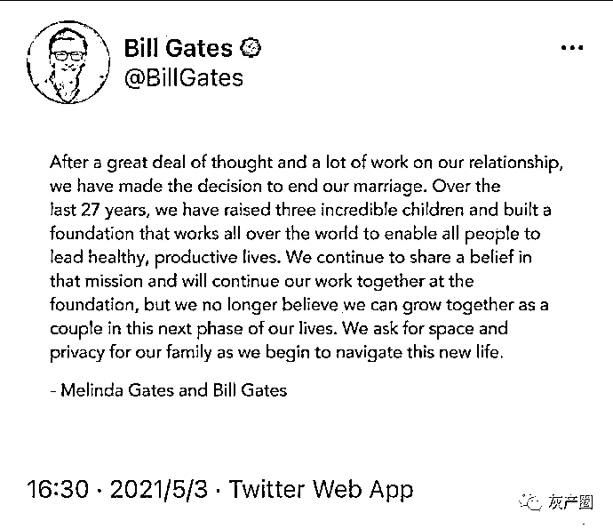
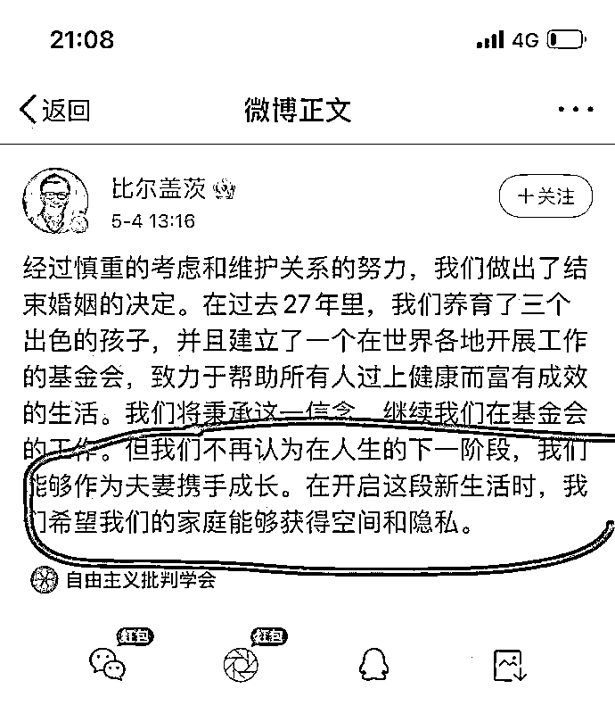
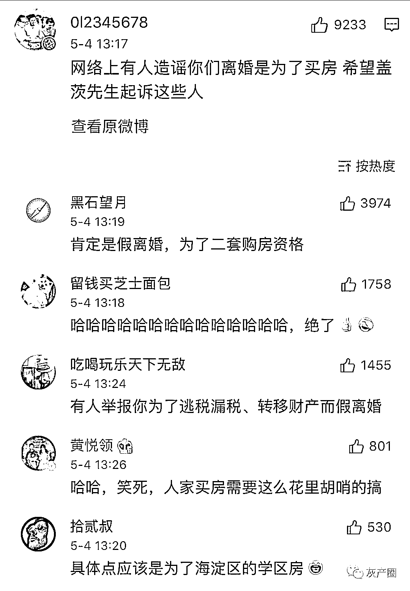
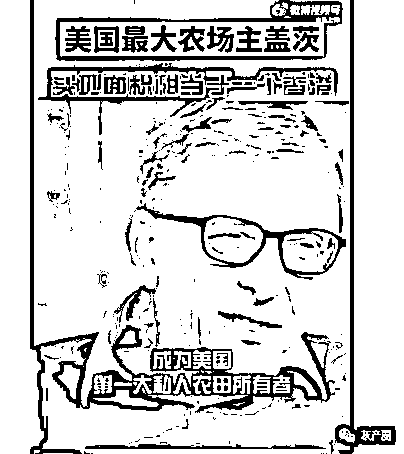
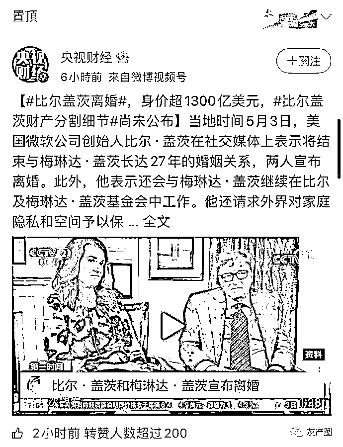
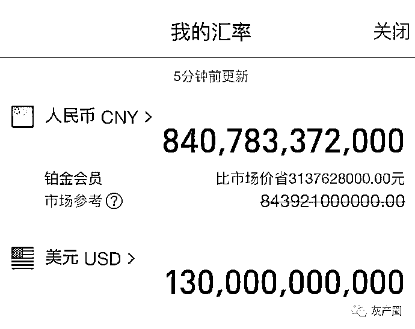
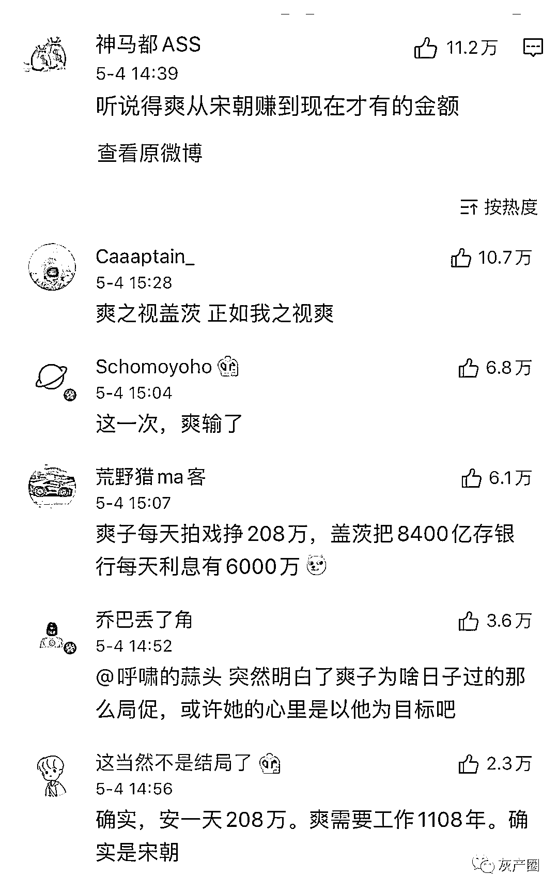
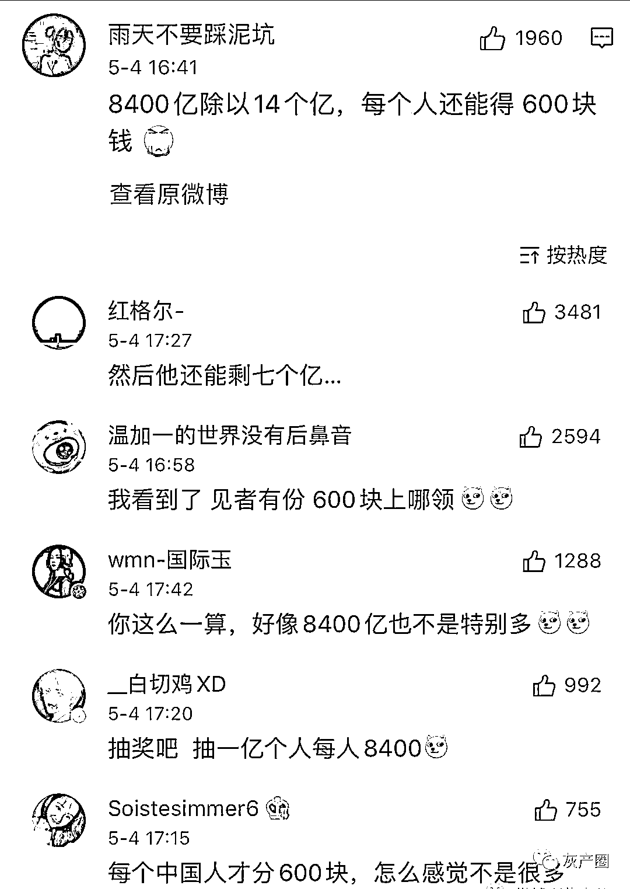

# 比尔盖茨离婚，网友关心这钱怎么分？8400 亿，郑爽从宋朝赚到现在

> 原文：[`mp.weixin.qq.com/s?__biz=MzIyMDYwMTk0Mw==&mid=2247513810&idx=3&sn=64ab9630545a01adfadac188e0325550&chksm=97cb7deaa0bcf4fc6473554403185c5f36e91f3cf5807ca7356057fcce67c7e9580bc39b6e4b&scene=27#wechat_redirect`](http://mp.weixin.qq.com/s?__biz=MzIyMDYwMTk0Mw==&mid=2247513810&idx=3&sn=64ab9630545a01adfadac188e0325550&chksm=97cb7deaa0bcf4fc6473554403185c5f36e91f3cf5807ca7356057fcce67c7e9580bc39b6e4b&scene=27#wechat_redirect)

5 月 3 日，据外媒报道，盖茨夫妇发推特宣布 27 年婚姻生活画上句号。
盖茨夫妇目前暂未公布财产分割具体细节，据媒体曝光的离婚文件显示，两人并未签署婚前协议，女方在离婚申请中也未要求支付配偶赡养费。盖茨夫妇所在居住地华盛顿州属于“共同财产州”，法官通常将判决平分婚内财产，但夫妻二人也可通过协议达成财产分配的共识。而超级富豪离婚背后，往往都有着天价和解协议。一个比尔盖茨夫妻冷知识：比尔盖茨除了在计算机操作系统界拥有着无与伦比的垄断地位，他在美国还占有 25 万公顷土地，美国良田面积也才一千万公顷。比尔盖茨一个人，就拥有了美国 2.5%的良田，以及万分之一的国土面积。网友们关心最多的还是两人的钱怎么分？毕竟比尔盖茨的财富高达 1300 亿美元，约合人民币 8400 亿！已经数不过来了网友只能拿出最新的计数单位“爽”！ 网友迟迟无法正视这笔钱，直到有一位网友动用了我国庞大的人口基数，才给冲淡

全是狗粮呀：李国庆：兄弟你怎么这么快？我还在冷静期

全球市场经济：通过比盖证明了，没有彼此真爱的婚姻终究是要结束的，哪怕是有钱也不行。

OHlarm_04:好家伙，七亿八千万三百三十七万零两千你就直接给忽略了

来源：微博那些事儿

← 向右滑动与灰产圈互动交流 →

