# 太恶劣！“宠物盲盒”爆卖，小猫小狗竟被塞货箱、活活憋死！中通快递深夜回应…

> 原文：[`mp.weixin.qq.com/s?__biz=MzIyMDYwMTk0Mw==&mid=2247513810&idx=4&sn=6693efebadebf4f3b1893ab493bf3a67&chksm=97cb7deaa0bcf4fc29cbf83893a6d32d1d2398f15e5a10f1ab8cf4e9e025efafd04e3a877db8&scene=27#wechat_redirect`](http://mp.weixin.qq.com/s?__biz=MzIyMDYwMTk0Mw==&mid=2247513810&idx=4&sn=6693efebadebf4f3b1893ab493bf3a67&chksm=97cb7deaa0bcf4fc29cbf83893a6d32d1d2398f15e5a10f1ab8cf4e9e025efafd04e3a877db8&scene=27#wechat_redirect)

宠物盲盒？还是宠物亡盒！

5 月 3 日，网友爆料成都市区中通快递公司的网点，竟然承运了 160 余只活体的小狗小猫。这些动物却是商家打着售卖“盲盒”的名义，而将活体宠物快递至买家。 

这在网上一下子炸开了锅，#宠物盲盒#迅速冲上热搜。

成都出现大量“宠物盲盒”

许多小猫小狗奄奄一息

盲盒经济的兴起，很大一部分原因便是满足消费者对不确定性的好奇心和惊喜感。然而万万没想到，人类的好奇真的会害死猫。

3 日晚，“成都爱之家动物救助中心”志愿者拦截下一辆中通快递运输车，据其官微介绍，“货箱里全是小猫小狗的惨叫声，若是货箱门关闭，完全没有空气流通，只有被活活憋死！

已经有不少小猫小狗奄奄一息甚至死去！死去的小猫小狗，直接被中通工作人员丢在路边！” 

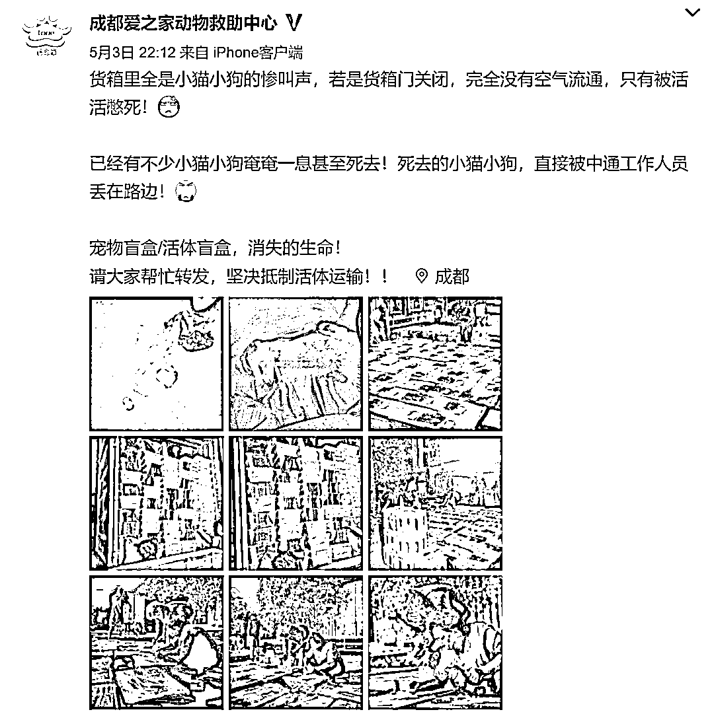

[`v.qq.com/iframe/preview.html?width=500&height=375&auto=0&vid=y3243cwljd3`](https://v.qq.com/iframe/preview.html?width=500&height=375&auto=0&vid=y3243cwljd3)

视频来源：人民日报

在运输的快递和售卖商家的眼中，这些小猫小狗并不是一个生命，而是一个物品。

随后，成都爱之家动物救助中心拦下货车并报了警。志愿者在货车内共发现 160 多只小猫小狗。截至 5 月 4 日凌晨 4 点，已经有 4 只死亡。

目前，动检部门对所有猫狗依法暂扣，转移到石板滩宠物城临时安置，正在进行检疫。

这些被打包当货物运输的小猫小狗，就是网络上越来越火的“宠物盲盒”。 

“宠物盲盒”是什么？

网友怒了：缺德！

这两年“盲盒”经济十分火热，很大一部分原因便是满足消费者对不确定性的好奇心和惊喜感。然而万万没想到，有人居然用活体来做盲盒。 

有网友在 1 月时便在网上曝光，有网购平台甚至悄然兴起宠物活体盲盒，售价从十几元到上千元不等，涉及猫、狗、仓鼠、乌龟等小动物。

其中有的商家甚至直接在商品描述里打出“玩得起就下单，玩不起别买！”的标语。

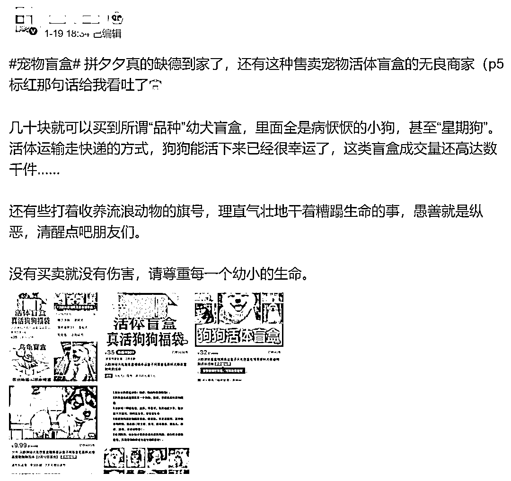

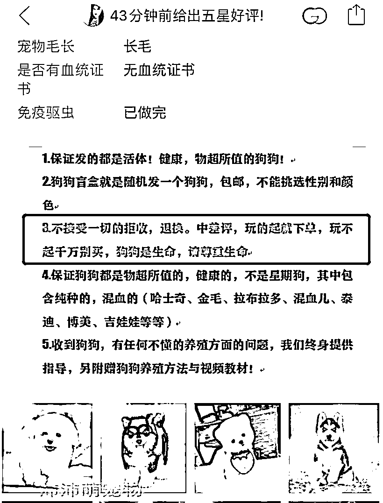

到底有多残忍？有网友分享，“很多买家在打开箱子的那一刻，期待已久的活生生的小生命，已经在运输中闷死、饿死、憋死、热死冷死，甚至是被盲盒中的其他小狗小猫咬死……”

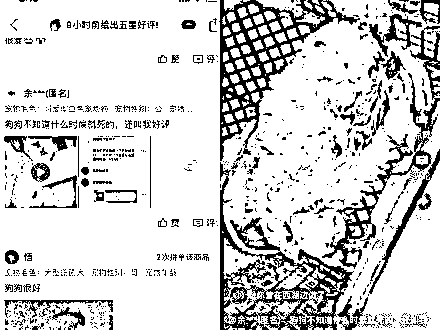

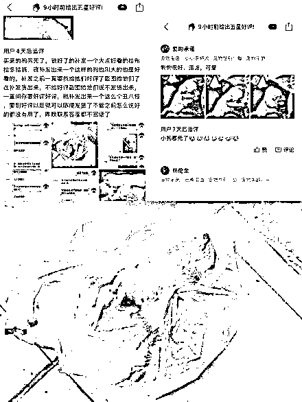

”就算当场不死，也活不过一周，被称为「星期狗/猫」。“

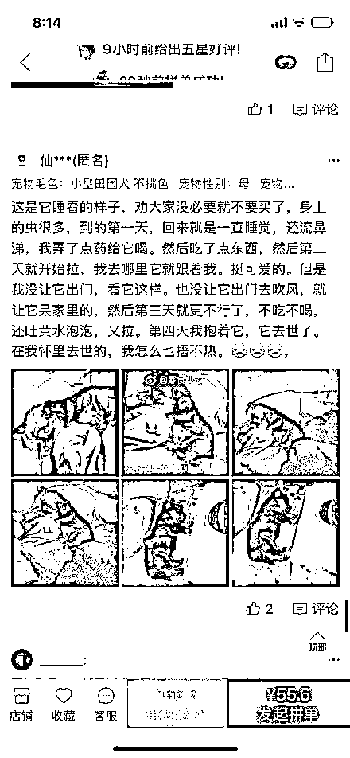

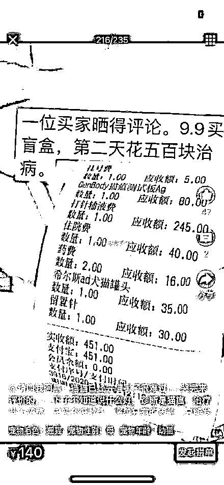

更可怕的是，有网友在快递站捡到了个没人要被丢弃的 9.9 狗狗盲盒，主人觉得开出来的狗太丑就直接退件。被退货的狗狗在快烂掉的盒子里，饿的瑟瑟发抖，整个盒子都是运输中堆积的屎尿，臭到 up 拍不下去。up 主给狗狗喂了很久的营养液，最后狗狗依然体力不支而去世了。快递站的人也不管，狗狗走了，无法完成退件，快递员觉得臭就直接丢弃了，赔个 9.9 元，这件事就算完了。

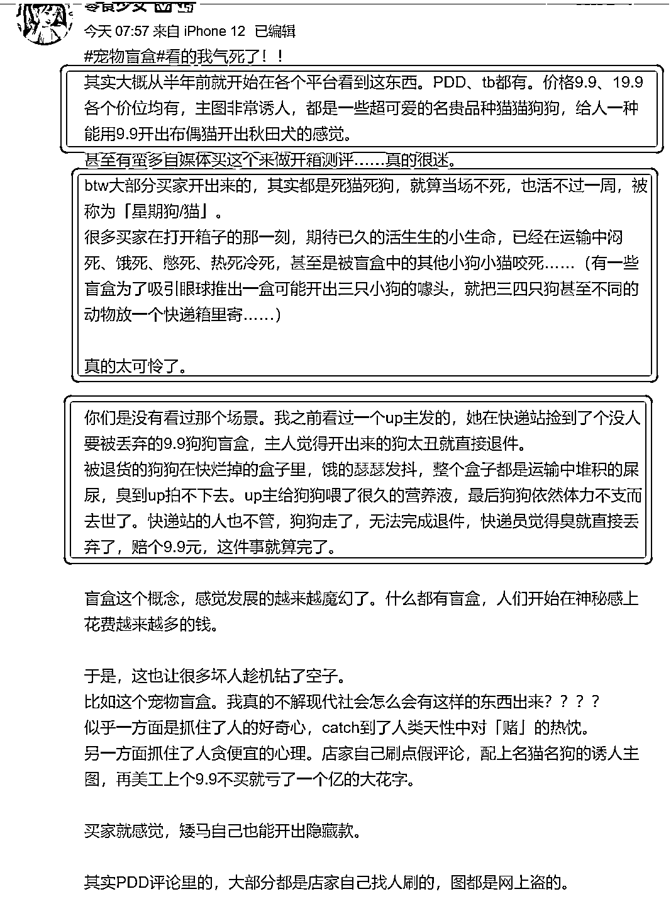

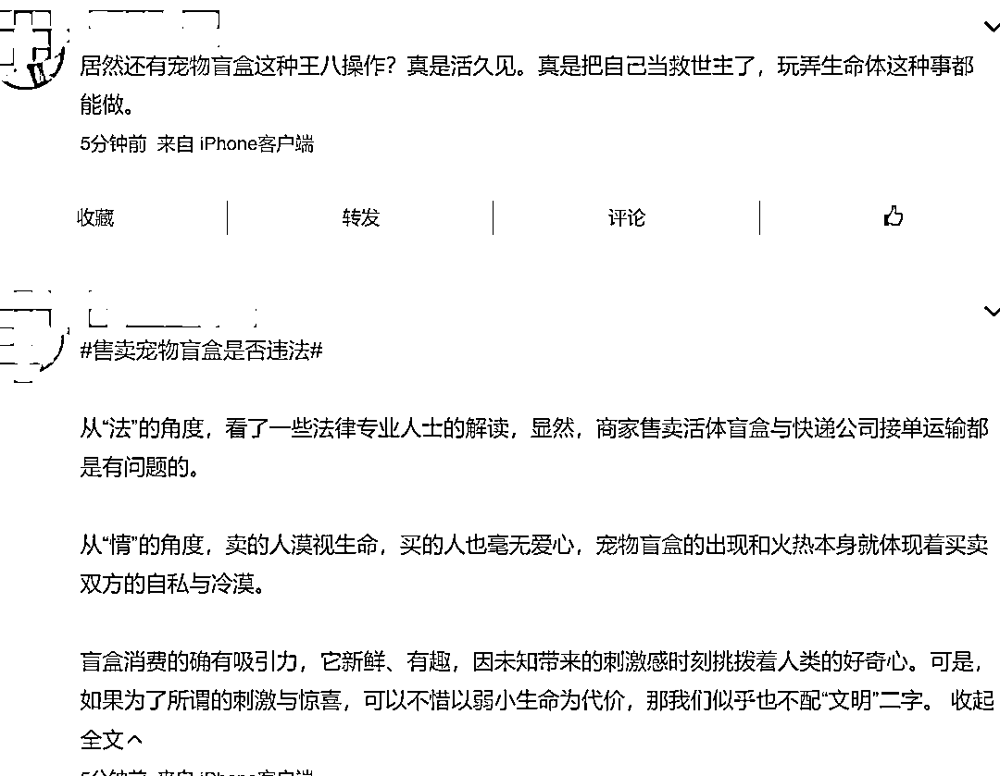

还有网友指出，在宠物盲盒上，不仅仅是快递公司、还有平台、卖家、买家都需要严管。

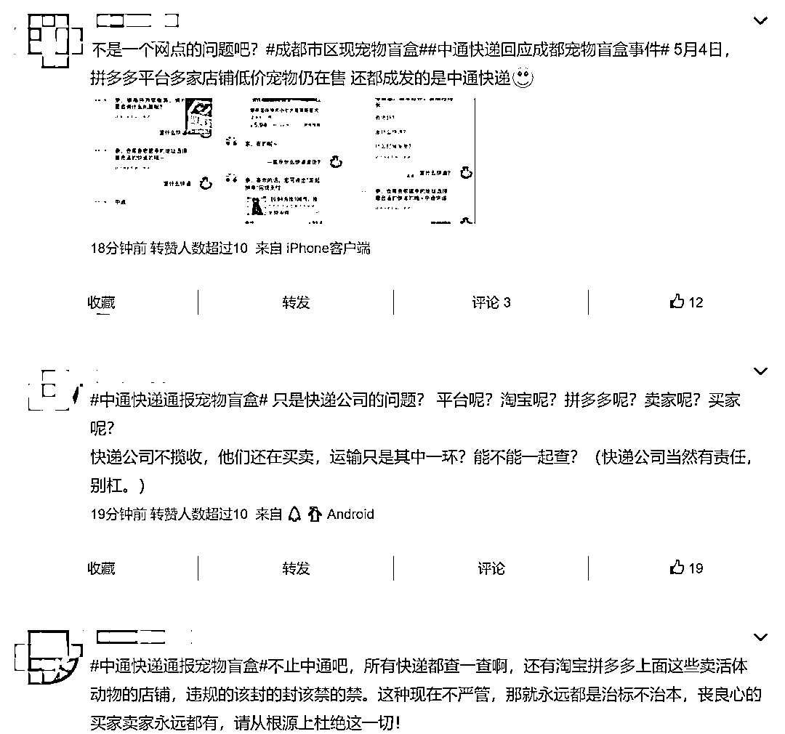

央视评论：人心不盲

就不会有如此恶劣出格的盲盒！

**央视评论称，用盲盒装动物，将一些人的快乐建立在动物痛苦甚至失去生命的基础上，是对人性的背离，也是娱乐的异化。相关法律禁止寄递活体动物，商家必须遵守，快递公司也不应明知故犯。尊从人性，尊重法律，人心不盲，就不会有如此恶劣、如此出格的盲盒。**

**环球网也评论：宠物盲盒，还是宠物亡盒？背离人性，漠视生命，不是制造惊喜的手段。**

**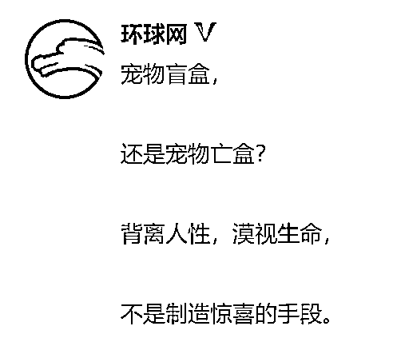**

****国家邮政曾要求规范动物寄递**** 

**2020 年 3 月 19 日，据<ai type="8" parm="{}">国家邮政局</ai>官方微信号消息，<ai type="8" parm="{}">国家邮政局</ai>向全行业发出通知，要求规范活体动物寄递、严厉打击非法寄递野生动物及其制品行为，切实保障寄递渠道安全、公共卫生安全和人民群众生命健康安全。**

**通知强调，要严格规范受保护的野生动物以外的活体动物寄递。各企业要在助力生鲜产品寄递，促进农产品流通和服务保障民生的同时，严格规范受保护的野生动物以外的活体动物寄递行为，严禁收寄具有毒害性、攻击性、妨害公共卫生等危险活体动物。对于可以寄递的活体动物，企业应当要求寄件人进行安全妥善包装。在运输、分拣、投递环节，要将内件为活体动物的邮件快件进行有效物理隔离，在确保活体动物邮件快件本身安全性的同时，避免其他邮件快件污染、损毁。在投递环节，还应告知收件人邮件快件的内件属于活体动物，提醒其注意安全防范。**

**通知中还要求，要依法从严查处违法违规行为。各级邮政管理部门要切实履行监督管理职责，积极配合相关部门健全完善野生动物保护监管执法管理体制，加强联合执法和协作配合，建立健全执法协作机制，依法严厉打击非法寄递野生动物及其制品、危险活体动物行为。督促企业严格执行寄递安全“三项制度”，落实安全生产主体责任。加大执法力度，对提供活体动物寄递服务的企业进行重点检查，督促其强化制度落实和内控管理。**

**、**

**中通快递回应：网点违规揽收**

**相关负责人停职**

****

**当然，此次被爆出运输宠物盲盒的中通快递，也成为众矢之的。**

**4 日，新京报联系到涉事货车所属的中通快递成都荷花池分部。负责人胡先生称，中通内部规定严禁收寄活物，涉事业务员是新来的员工，其违规接单。他称将会按规定对涉事业务员进行处罚，并已经解除与三联花鸟市场的部分合作关系。**

**<ai type="7" parm="{}">据澎湃新闻，中通快递</ai>通报“宠物盲盒”一事，系平台电商客户线上销售，网点违规揽收。网点暂停揽收业务全面自查，并配合相关部门调查，相关负责人停职，扣除其全年绩效奖金。**

**5 月 4 日深夜，<ai type="7" parm="{}">中通快递</ai>发布关于成都荷花池网点违规寄递活体动物事件的情况通报。** 

**通报称，5 月 3 日晚，有媒体报道<ai type="7" parm="{}">中通快递</ai>成都荷花池网点违规寄递狗、猫等活体动物。对此，<ai type="7" parm="{}">中通</ai>通报中称，获悉信息后，集团总部和四川省管理中心第一时间成立工作组。经调查核实，这批活体动物系平台电商客户线上销售，<ai type="7" parm="{}">中通快递</ai>成都荷花池网点违规揽收。**

**<ai type="7" parm="{}">中通</ai>方面表示，快递物流企业的健康发展不仅建立在严格的寄递规范和安全管理之上，还需秉持正确的生命观和价值观，为此，<ai type="7" parm="{}">中通快递</ai>向公众、媒体和客户诚挚道歉。**

**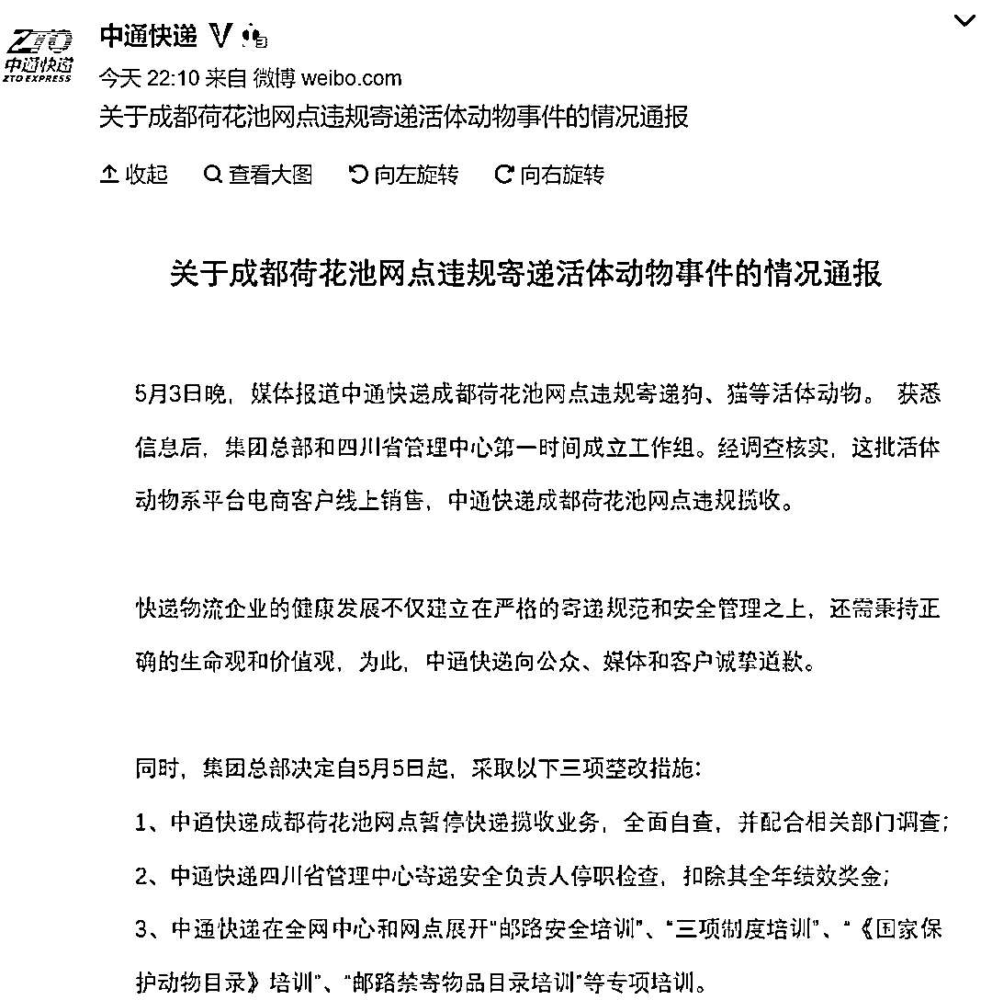**

**同时，集团总部决定自 5 月 5 日起，采取以下三项整改措施：**

**1、<ai type="7" parm="{}">中通快递</ai>成都荷花池网点暂停快递揽收业务，全面自查，并配合相关部门调查；**

**2、<ai type="7" parm="{}">中通快递</ai>四川省管理中心寄递安全负责人停职检查，扣除其全年绩效奖金；**

**3、<ai type="7" parm="{}">中通快递</ai>在全网中心和网点展开“邮路安全培训”、“三项制度培训”、“《国家保护动物目录》培训”、“邮路禁寄物品目录培训”等专项培训。**

**<ai type="7" parm="{}">中通</ai>方面还表示，<ai type="7" parm="{}">中通快递</ai>将严格按照<ai type="8" parm="{}">国家邮政局</ai>“规范活体动物寄递”的具体要求，坚决贯彻执行相关法律法规，全面落实禁止寄递和限制寄递的有关制度规范，采取有力措施，切实加强活体动物寄递规范安全管理。**

**而受此消息影响，晚间，中通快递美股一度跳水超 3%，从原本的大涨 2.5%到跌超 1%。截至记者发稿，仍跌 0.83%。**

**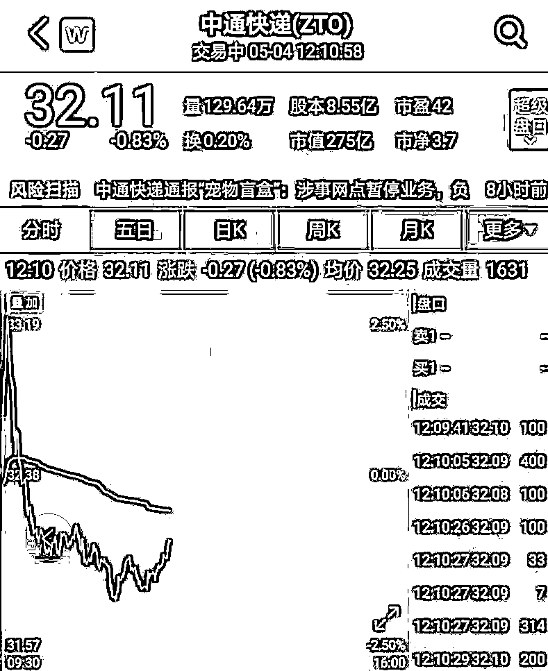**

**最后，引用成都爱之家动物救助中心的话：请拒绝宠物盲盒！** 

**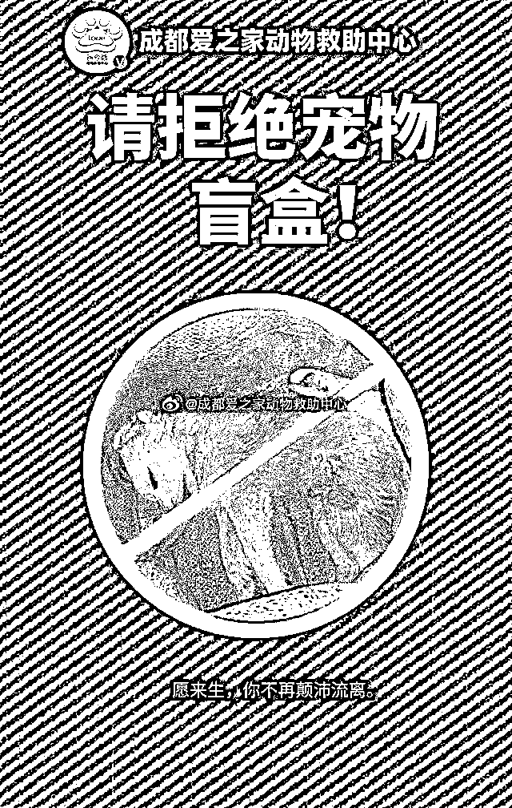**

**来源：中国基金报**

********

**← 向右滑动与灰产圈互动交流 →**

****