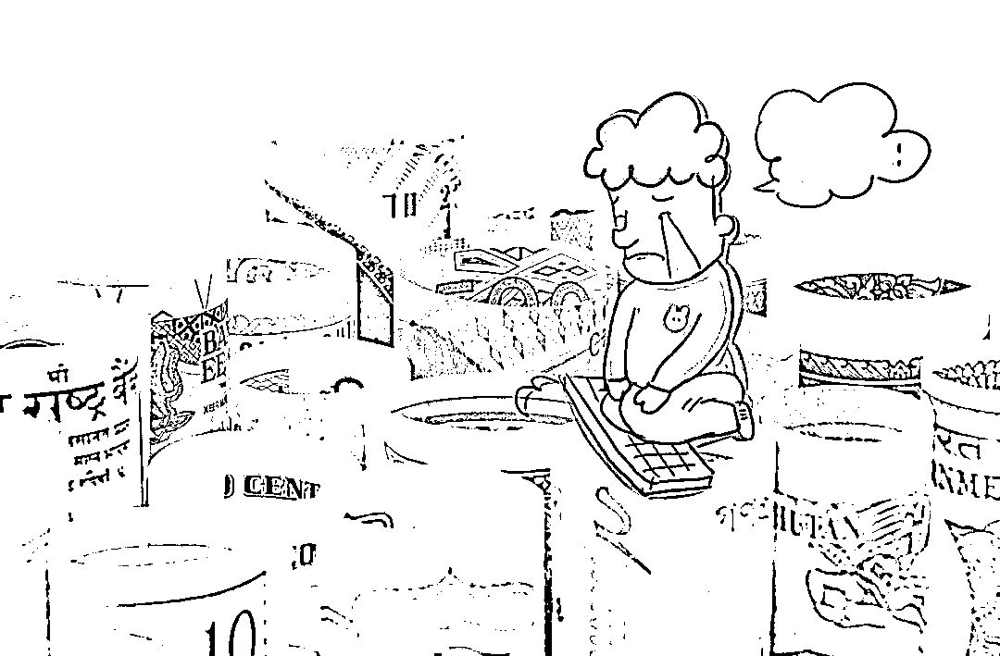
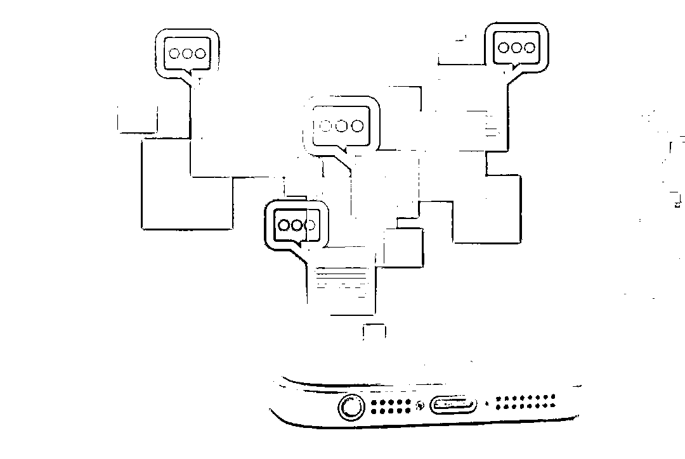
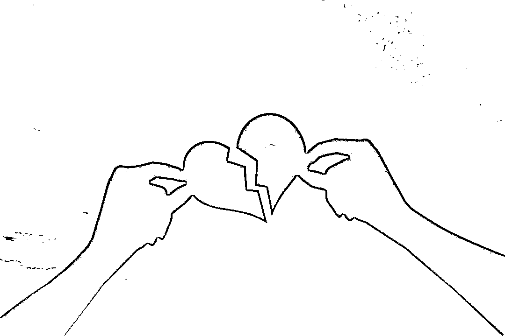

# 又一“时间管理大师”出现：骗情！骗婚！骗钱！

> 原文：[`mp.weixin.qq.com/s?__biz=MzIyMDYwMTk0Mw==&mid=2247513810&idx=5&sn=458fb8d0c5941ff09aac882669a8e972&chksm=97cb7deaa0bcf4fc9f0c1d85ebbb98ea118fa39b53149d89a6c3cbbeaa6f11451c64101dc7e2&scene=27#wechat_redirect`](http://mp.weixin.qq.com/s?__biz=MzIyMDYwMTk0Mw==&mid=2247513810&idx=5&sn=458fb8d0c5941ff09aac882669a8e972&chksm=97cb7deaa0bcf4fc9f0c1d85ebbb98ea118fa39b53149d89a6c3cbbeaa6f11451c64101dc7e2&scene=27#wechat_redirect)

**2020 年 10 月的一天**

**两位女士来到派出所报案**

**由此揭开了这个周旋在**

**多名女性之间的**

**“时间管理大师”的真面目**

**……**

还没与前任妻子离婚，便与现任妻子领证；为得到岳父母和女友们经济上的支持，多次谎称自己父母患癌或病故；在女友们眼中，他“人好、孝顺、低调、有内涵、脾气好”，只是需要定期“加班和出差”……2020 年 10 月，两位女士走进上海市浦东新区的一处派出所报案，称她们遭遇了诈骗，正是这次报警揭开了龙某这个“好男人”的真面目。

今年 1 月 28 日，上海市浦东新区检察院以涉嫌诈骗罪、重婚罪将龙某提起公诉。近日，龙某被法院判处有期徒刑十四年，并处罚金 4 万元。

男友总能遇到各种“难事”，每个月都会开口借钱

图片来源于网络，与正文无关

2016 年，上海的吴小姐在网游上认识了时年 30 岁的龙某，二人颇为投缘，2017 年确定了恋爱关系。2019 年 4 月，龙某来到上海，不久之后，二人同居了。

在吴小姐眼里，他们的感情一直都很好，唯一让她有点苦恼的是，**男友龙某似乎总能遇到各种“难事”——母亲生意失败、帮朋友还债等等。**每到这时，龙某便会开口向吴小姐借钱，家境富裕的吴小姐每回都有求必应，为男友解困。几乎每个月龙某都会开口借钱，到底借过多少，估计他自己都不记得了。

2019 年 10 月，龙某以到宁夏银川出差为由，向吴小姐借了 6000 元机票钱。但这次回来之后不久，龙某便以损坏了公司设备需要赔付为由向吴小姐借了 10 余万元，后来龙某又颓丧地告诉吴小姐，他可能会因此坐牢，需要一个人冷静冷静，于是搬离了二人的爱巢。

从此，二人的联络就越来越少了，后来龙某甚至断了与吴小姐的联系。**截至此时，在他们交往期间，吴小姐已经陆续借给龙某 100 余万元，但她丝毫未觉异常。**吴小姐心中想的是，男友大概真的遇到了难处，甚至可能已经进了监狱，她就这样一直等着，期待男友出狱后联系她。

转眼时间来到了 2020 年 10 月，吴小姐还在痴等着男友龙某。直到有一天，她接到一个自称赵女士的人打来的电话，问她是否认识龙某，是否跟他有经济上的纠葛。**而赵女士接下来说的话，对吴小姐来说不啻为晴天霹雳——原来她一直和别人“共享”着男友。**

赵女士与龙某相识在 2019 年。刚认识时，龙某就表现出了对赵女士的好感。之前所谓的“银川出差”，其实是龙某拿着吴小姐的钱跟赵女士去旅游了。在银川旅游期间，他们确定了恋爱关系。当年 11 月，二人便同居了。赵女士发现龙某几乎每周都有固定的“加班和出差”安排，但并未在意。交往期间，龙某以为朋友病重的母亲筹款看病为由向赵女士借钱，赵女士觉得他为人仗义，毫不犹豫地把钱给了他。后来龙某又以还信用卡、放贷等理由数次借钱，前后共 10 余万元。**直到赵女士无意间在龙某的手机里发现了别的女人存在的痕迹，心中生了疑，怀疑自己被骗。**

虽然龙某极力解释，但怀疑的种子一旦埋下，便不可收拾。此后，赵女士经常与龙某争吵。2020 年 10 月，赵女士忍无可忍，催促龙某还钱。龙某无奈之下，还给她 8 万元，两人的关系就此破裂。

分手后，赵女士辗转联系上了吴小姐，将龙某的真面目揭开。得知真相后，二人一同去派出所报了案。

为不穿帮竟编造“父母双双离世”的谎言

图片来源于网络，与正文无关

警方立案后不久，龙某到案。经警方初步侦查，众人才发现，这竟然只是案件的冰山一角。

原来，龙某的女友不止吴小姐和赵女士，还有周女士和柳女士，均是龙某在 2019 年结识的，周、柳二人也分别借给龙某 10 万元和 2 万余元。龙某之前还给赵女士的 8 万元，是他找别人借的，债主之一就是周女士。此外，在交往期间，周女士还曾两度怀孕，但在龙某的劝说下，两度流产。

随着案件侦查的深入，更令人惊讶的事实渐浮水面。

在与女友们交往过程中，龙某虽未隐瞒曾有过婚姻的事实，却从未提过自己并不是处于离异状态。**事实上，龙某还一度处于重婚状态。**

龙某有过两次婚姻，与两任妻子分别育有一子一女，他在 2015 年 12 月与现任妻子方小姐办理结婚登记时，还未与前妻刘女士离婚。龙某在与方小姐结婚两年后，才与刘女士办理了离婚手续。

而这一切，方小姐一家人浑然不知。“我和父母对龙某印象都很好，而龙某也一直都‘营造’着其从小家境优越，但后来家道中落的高学历人士形象。”方小姐说。

当初结婚时，**为了不穿帮，龙某编造了“父母双双离世”的谎言，避免了双方父母见面。**2016 年至 2018 年，龙某以购买员工股为由向岳父母借款 160 余万元，至今未还。

所有谎言随着龙某到案被戳破，直到警察找上门，方小姐才如梦方醒。

同时周旋多名女性间，骗了 300 余万元

图片来源于网络，与正文无关

此外，警方还查明，龙某还以家人生病为由向两位同事分别借款 13 万元和 5 万余元。

当检察官问起：“你的钱都花到哪里去了？”龙某称：“都拆东墙补西墙挥霍掉了……”龙某的父母、前妻都没有从他这里得到过经济上的资助。

检察机关认为，龙某在自身没有偿还能力的情况下，多次编造父母生病、死亡，岳父母生病，生意失败等理由借钱骗取多名被害人钱款。**根据现有证据，可证实龙某共计骗取他人 300 余万元。此外，龙某在婚姻关系存续期间又与第三人登记结婚，涉嫌重婚罪，遂以诈骗罪、重婚罪将其提起公诉。**

对于几位被害人来说，虽然走出了骗局，但错付了真心却是无法接受的。案发后，多位被害人表示不愿意谅解，愿意将一切交给法律裁决。

来源：检察日报、最高人民检察院、利箭在行动

← 向右滑动与灰产圈互动交流 →

