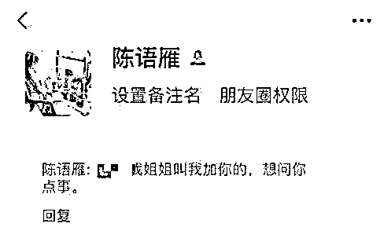
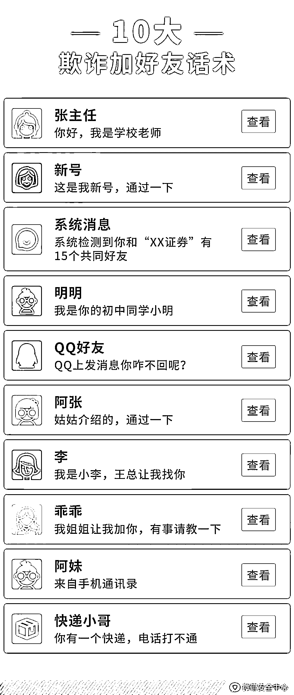
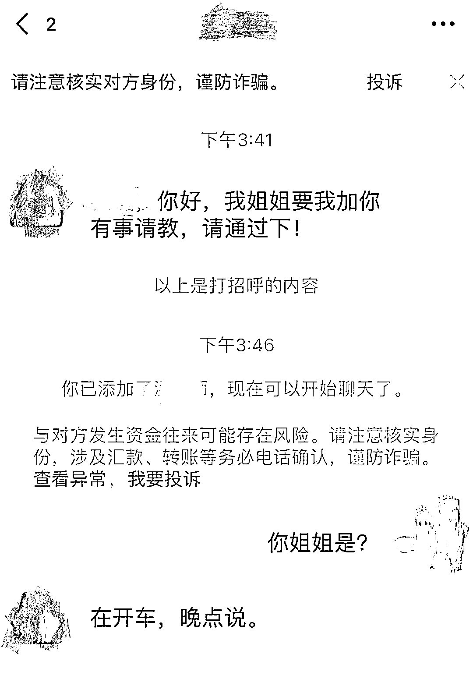
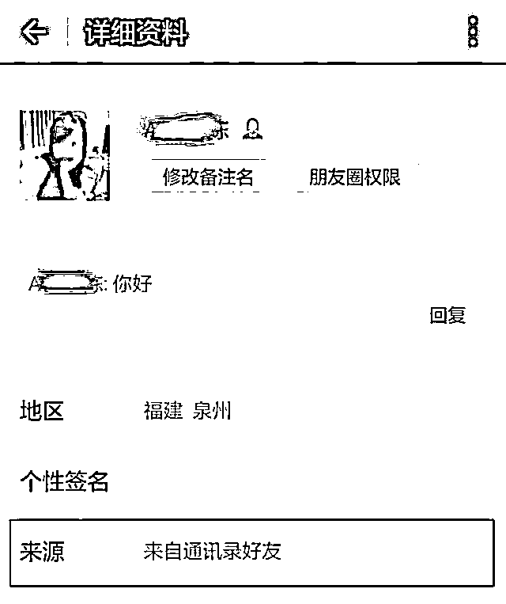
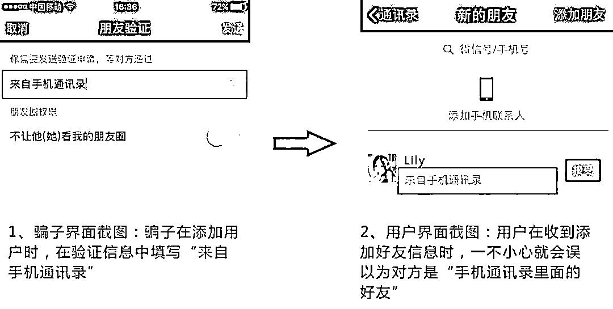
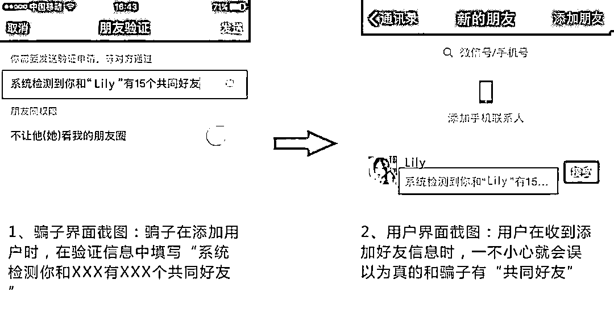
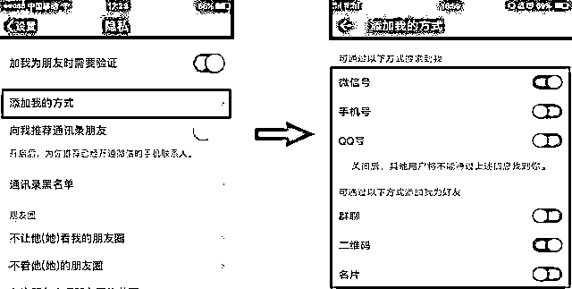
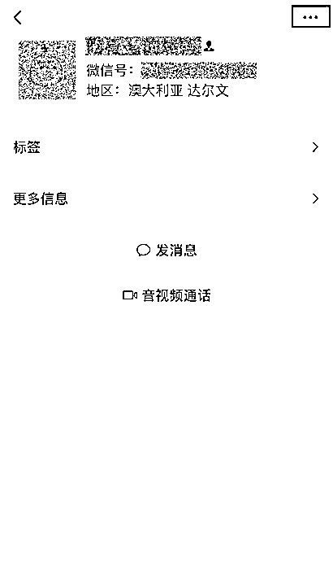
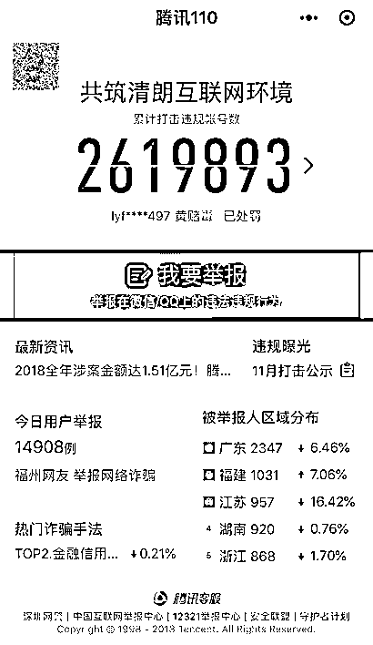

# 十大微信加好友骗术，你遇到过几种?

> 原文：[`mp.weixin.qq.com/s?__biz=MzIyMDYwMTk0Mw==&mid=2247513810&idx=6&sn=a64fa00add2930efc21d4e2fd2a0c1fa&chksm=97cb7deaa0bcf4fc5ba6ab5115f206f3970fa7c35fb1bc6c7ca516a613438a9ec031536394f8&scene=27#wechat_redirect`](http://mp.weixin.qq.com/s?__biz=MzIyMDYwMTk0Mw==&mid=2247513810&idx=6&sn=a64fa00add2930efc21d4e2fd2a0c1fa&chksm=97cb7deaa0bcf4fc5ba6ab5115f206f3970fa7c35fb1bc6c7ca516a613438a9ec031536394f8&scene=27#wechat_redirect)

叮咚～

不管是网络创业者还是微信营销人 

加好友是必要的基础

获得微信好友有两种方法

一种是被动，一种是主动

但无论哪一种方法

要想通过验证成功率高

都需要**“打招呼”**

你是不是经常收到类似的加好友验证

从姐姐到姑姑、从学校老师到公司老总

全世界都在找你

甚至有些人还可以准确叫出你的名字

报上你的电话号码

**当你通过验证后，他们却都默契地说**

**有事，等会说**

其实这都是恶意营销团伙和诈骗分子

为了降低你的警惕心

顺利加好友使用的话术

微信安全中心总结了欺诈中

**10 种最常见的“加好友”话术**

广大市民以后遇到此类“说辞”

记得擦亮眼睛，以防被骗

**陌生人添加好友的目何在？**

一旦你通过了这些人的好友添加，你就会被拉进**荐股群、赌博群、欺诈群、色情群、广告群**……进群后，你就会被铺天盖地的垃圾广告、“大师”荐股所淹没；或者被赌博、色情等信息骚扰得不厌其烦。

此外还有一种情况，你遇到“养号”的了。从你通过验证的那一刻，对方的任务就算完成了，你们之间不再会有任何联系。不管你问他什么，他都只会告诉你：

那么什么是养号？养号的目的是啥？他们怎么知道你的姓名和电话？

**什么是养号？**

所谓“养号”，就是黑灰产犯罪团伙通过各种方式和理由，把自己手中的帐号伪装成正常人，添加微信好友（一个号上限为 5000 好友），加满之后，再进行出售。

**养号的目的是啥？**

因为这些号添加的都是真实用户，大部分被用于恶意营销中；某些养号者还会精准筛选特定人群，比如消费力强的年轻女孩、刚买房需要装修的房主、全职妈妈等，这些价格更高。

**他们怎么知道你的个人信息？**

在当前隐私泄露普遍比较严重的环境下，大家在日常生活中的方方面面都有可能泄露自己的个人信息，而不法分子就会通过各种渠道购买这些资料。

**诈骗分子是如何找上你的？**

诈骗团伙拥有非常完备的产业链，他们会从网上搜集或购买用户泄漏的手机号信息，继而通过用多部手机、外挂批量随机添加用户。

当他们有了你的手机号之后，“来自手机通讯录好友”这个问题就很好解释了，**只需要将你的号码存到他自己的手机通讯录当中，再从他的微信上来添加你，你的验证来源提示自然就显示“来自通讯录好友”了，**但其实这个通讯录是对方的。

**两种常见的欺诈话术**

**一、冒充系统消息** 

骗子在发送添加好友请求时，在验证信息中填写“来自手机通讯录”“系统检测你和×××有×××个共同好友”，一个小小的障眼法就可能成功让你通过他们的好友验证。

*   来自通讯录：

*   系统检测你和×××有×××个共同好友：

**二、冒充熟人找上门** 

*   “你是不是有病啊，我昨天怎么得罪你了？”

*   “QQ 上发消息你咋不回呢？”

*   “我是老刘，王总让我找你。”

*   “我姐姐让我加你有事请教，请通过一下！”

*   “你好，朋友推荐我做活动呀，求通过！”

**如何保护自己？**

*   善用添加好友的方式，能有效减少身份信息泄露风险，拒绝骚扰；

    **“好友添加方式”设置路径：**

    **打开微信→我→设置→隐私→添加我的方式**

*   **学会辨别添加好友的验证信息。**不确定的信息不去理会，或者要求对方提供具体身份信息；

*   添加好友后，最好能够通过**语音、视频、电话**等直接方式再次确认一下对方的身份，安全第一；

*   添加了陌生好友之后，如果没进行过什么沟通，话题就**涉及钱财要注意**。微信系统的风险提示也需要仔细留意。

*   **如果确认对方有恶意，请随时举报，提交充分证据，**这样在审核确认后，坏人的帐号会被第一时间处理，防止其继续骗人。

**如何投诉举报**

**官方提醒**

不要随意通过陌生人的好友申请，最好是只加认识的人或是能确认身份的人为微信好友。若遇到被陌生人骚扰的情况，可直接在微信客户端进行投诉举报。

**客户端投诉个人账号**

****

**小程序投诉**

****

**最后提醒**

骗子套路深

## 各种套路千万别当真

如果被诈骗了  大家一定要及时

**报警！****报警！！****报警！！！**

来源：终结诈骗、腾冲警方、利箭在行动

← 向右滑动与灰产圈互动交流 →

