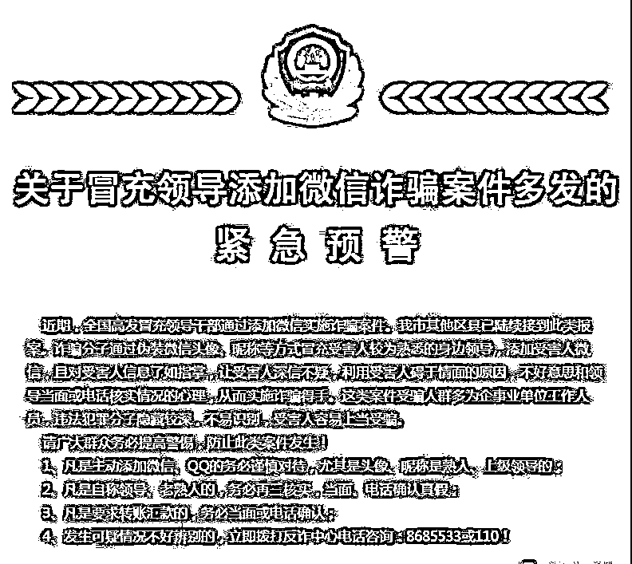
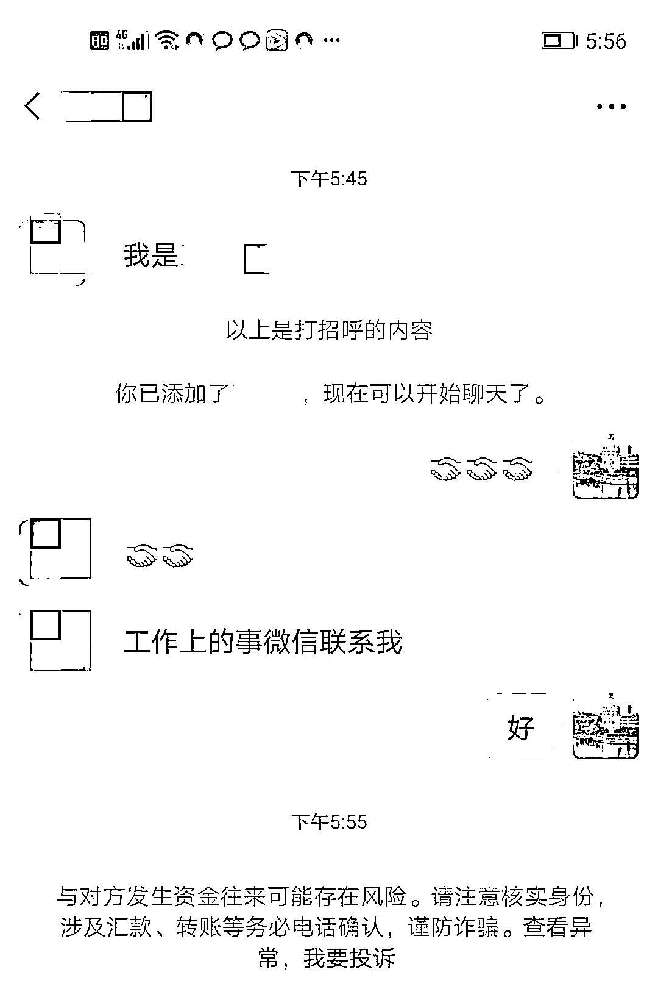
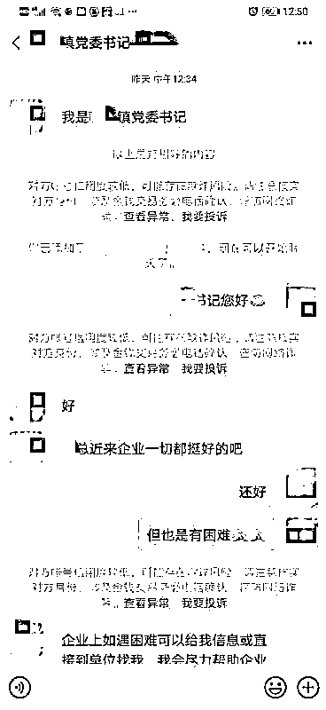
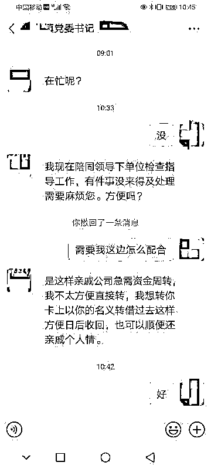
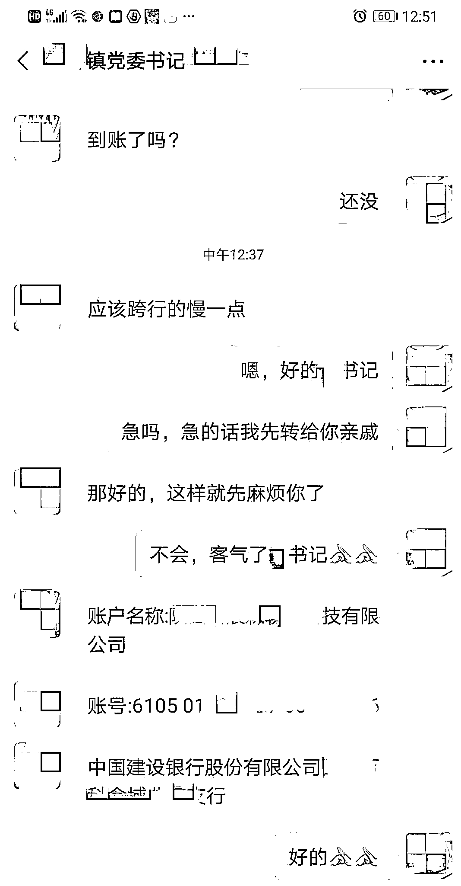
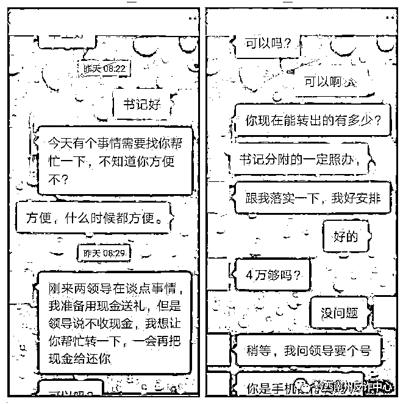

# 全国多家公安局已发出紧急预警，赶紧看！

> 原文：[`mp.weixin.qq.com/s?__biz=MzIyMDYwMTk0Mw==&mid=2247513810&idx=7&sn=14468ff7f9f474c89fe2d12c81eb93ce&chksm=97cb7deaa0bcf4fcd44ceca2d8ff305aa0469a74ad624996ee56eb855f56c7778100a42d1531&scene=27#wechat_redirect`](http://mp.weixin.qq.com/s?__biz=MzIyMDYwMTk0Mw==&mid=2247513810&idx=7&sn=14468ff7f9f474c89fe2d12c81eb93ce&chksm=97cb7deaa0bcf4fcd44ceca2d8ff305aa0469a74ad624996ee56eb855f56c7778100a42d1531&scene=27#wechat_redirect)

近日，全国各地不法分子冒充县上领导和乡镇领导加微信后，以调研、借款为由实施诈骗的案件高发，涉案人数多、范围广、金额大，是近年来电信诈骗受害人数最多，损失最大的一种电信诈骗案件。这类诈骗案件以盗用领导头像，假借领导名义，使用 QQ、微信主动添加被害人，犯罪嫌疑人以给领导转账不方便为由，请其帮忙转款实施诈骗，而且诈骗屡屡得手。

**骗术揭秘**

**常见诈骗套路**

** 1 **

**冒充领导主动添加好友**

骗子通过不法渠道，盗取群众手机通讯录上所有联系人的联系方式，随后精准发送信息，骗子对单位组织架构、人员组成、联络信息等了如指掌，一番伪装后，便通过微信或 QQ 大面积“撒网”添加相关人员为好友。

** 2 **

**言语随和拉近距离**

骗子用关心企业的口吻，甚至主动提出帮助受害人解决困难，极大降低戒备之心，获取受害人信任。

** 3 **

**进入正题，提出转账要求**

随后立即提出要求帮忙转账汇款的要求，比如亲戚借钱、上级领导要求转账、朋友急用等等。抓住一般人对领导不敢质疑的心理，有时甚至使用“尽快”“马上”“立即”这些催促性的词语，既营造了紧张气氛，又利用时间差降低受害人核实转账需求真假的可能性。

我看“头像”和“昵称”都是他本人，而且能说出我是谁，应该就是领导没错了吧？

领导关心企业发展，是对我们的信任，只是借用一下账户，应该问题不大。

**大部分人都抱着这样的心理，然后被骗子“乘虚而入”。**

**一位“领导”也通过微信**

**要求“下属”进行转账**

**事实上两位“领导”都是骗子！！！**

这类冒充领导、熟人的诈骗

已经从之前的电话诈骗一步步升级

跟随人们生活的步伐

也走了三步递进的“战略”

越来越紧跟时代了

**1**

**第一步：电话诈骗**

骗子打电话冒充领导，并称自己有事钱不够，急需钱。

**2**

**第二步：QQ 诈骗**

紧跟着电话诈骗的步伐，骗子们开始在 QQ 上行骗了。这种方法比电话好，没有声音的要求。

**3**

**第三步：微信诈骗**

当今，微信已经成为很多人沟通的必备工具，而骗子们也盯上了这块“肥肉”。升级版 QQ 冒充领导演变成了高级版微信诈骗了。

**警方提示**

1、涉及转账、汇款等事宜，**不要通过 QQ 或微信等网络工具联系**，凡是在 QQ 和微信中提及转账汇款的，不要轻易相信，**一定要打电话核实**，防止不法分子钻漏洞。自己的 QQ 和微信**不要暴露太多具体信息，比如职业、住址、姓名等。**

2、**不要轻易加人为好友**，或也不能随意进其他朋友圈，对电脑定期杀毒、增打补丁，**以防不法分子借木马病毒盗取信息。**

3、公司单位应**制定详细的财务审批规章制度，严密拨款流程，****禁止利用电话、QQ、微信等通讯工具下达拨款指令。**同时，加强印章管理。购物印章、U 盾必须由**专人或多人保管**，工作期间随身携带，非工作时间放置保险箱。

4、更不要点击、下载接受陌生人的文件或链接。一旦确定对方是骗子，请立即**拨打 110 咨询举报。**

**已有上百家公安局发出紧急预警，为什么天天仍有那么多人被骗？**

宣传千万次，从不认真看。
骗后急报警，天天催破案。
骗子在境外，警察侦办难。
破案要条件，防范是关键。
源头被阻断，哪里有发案？
信息多转发，人人来宣传。 

伎俩多知晓，防患于未然！

多转发！！！多扩散！！！

**2021 年**

**公安部刑侦局公布**

**十类高发电信网络诈骗手段及防骗提醒**

**01**

**冒充公检法诈骗**

案例：桂林市荔浦县一单位财务出纳吴某被不法分子电话冒充公检法机关工作人员，以其身份信息被冒用涉嫌“洗钱”犯罪为由诈骗资金 521.7 万元。公安机关已抓获涉案人员 29 名，冻结涉案账户资金 1500 余万元，扣押黄金 66 千克、铂金 1 千克。

**防骗提醒：**

1、留意来电号码。此类案件中，大多数来电都是通过改号软件从境外拨打，来电显示上会有“+”或“00”等前缀，如出现此类异常，可以基本判定为骗子无疑。 

2、公检法人员绝对不会通过电话、微信通知你核查资金、将钱款转移到“安全账户”，更不会让你上网浏览自己的通缉令或者逮捕令，或者将此类材料邮寄到个人手中。凡通过电话、短信等要求进行转账、汇款、资金核查操作的都是诈骗，切记不相信、不转账。

3、实在不能辨别真伪，请拨打来电号码当地的 110 进行核实（当地区号+110）。

**02**

**代办信用卡、贷款诈骗**

案例：深圳反诈中心组织深圳市公安局龙岗分局刑警大队在侦办一起网络贷款诈骗案件系列案件中，发现不法分子通过购买公民个人信息，将潜在贷款对象作为侵害目标，以电话营销贷款和提升各网络贷款平台贷款额度为幌子，收取手续费后拉黑受害人。

**防骗提醒：**

目前，有不少银行把信用卡业务外包给其他公司，所以一些公司提供贷款服务、办理信用卡并不奇怪，关键在于如何分辨真伪。申请办理任何可透支的金融类卡时，都会受到申请单位的严格审查，并核定金融类卡的消费额度。绝对不会是所谓的“工作人员”承诺您多少就是多少。整个申请过程都是免费的，即使涉及交费，也会让你到单位或银行办理，并给予相关收据、收条。切莫被所谓的“高额”“低息”或“无息”诱惑。

**03**

**兼职刷单类诈骗**

案例：受害人李某在 QQ 上收到好友发来的兼职刷单信息，梦想轻松致富的她在询问过刷单事宜后，开始按照对方的指示操作，将自己账户内的 1 万多元现金分批通过向对方提供的二维码转账的方式，支付给对方。

**防骗提醒：**

网络刷单诈骗的实施者准确掌握了受害人的心理。在最开始的时候，骗子会以练习刷单业务流程为幌子，刷单成功，购物本金和刷单佣金可以迅速返还。受害者尝到了甜头、一旦上钩后，就需要完成连续任务，数额达到一定规模，骗子又会以各种系统故障、账户冻结等理由，诱导其向诈骗账户再度汇钱。很多受害人直到被骗子“拉黑”后才发觉上当受骗。最为恶劣的是，当诈骗团伙骗取完受害人的现金后，还会诱导受害人通过各大银行和网络金融平台借取小额贷款，进一步榨取受害人的钱财。

**04**

**冒充熟人领导电话诈骗** 

案例：在甘肃兰州某事业单位工作的珊珊，睡梦中被电话吵醒，对方声称“我是你的领导”，听声音很像上司孟主任。尽管口音略有些异样，但珊珊想到最近孟主任做了牙科手术，可能因此声音变了，就没起疑心。第二天早上 8 点多，快到单位的她再次接到了“变了声”的“孟主任”的电话。虽然对垫钱这件事有些不乐意，但珊珊平时对孟主任敬畏有加，不敢多问，再加上对方反复强调留好凭证，可以报销。珊珊就没有再怀疑，半小时内先后 3 次在 ATM 机上向“孟主任”转账 3 万元。事后，她一核实，才意识到自己被骗。

**防骗提醒：**

1、听口音，这种诈骗类型具备比较强的地域特征，犯罪嫌疑人一般南方口音比较重，当接到这类口音电话时，要提高警惕

2、问虚实，对方获取了事主部分信息，但是信息有限，可以反问对方是否是身边可以看到的人，如对方顺口回复，就可确认是骗子无疑。

3、如不能确定对方身份，可详述具体事件进行确认。如对方称是单位领导不方便直接问时，可向同事侧面了解领导相关情况，谨慎核实。

**05**

**冒充网购客服退款诈骗** 

案例：嘉兴市居民黄某报案称，被不法分子冒充“天天快递”的客服，以需要撤销投诉并给予 3 倍的理赔为诱饵，诱使其点击钓鱼网站的方式被骗 19980 元。公安机关经过大量工作，捣毁窝点 11 个，抓获赖某等福建龙岩籍犯罪嫌疑人 40 余名，扣押手机 80 余部、手机卡 500 余张、银行卡 700 余张、作案电脑 20 余台、现金 50 万元，冻结涉案资金 1000 余万元。

**防骗提醒：**

1、当遇到自称卖家的电话说需要退款或者重新支付时，要亲自登录官方购物网站查询，或者拨打正规客服，不要轻易点击所谓店家提供的网址，更不能在这些网页上填写相关信息。

2、各类购物平台的客服人员不会提出用户提供个人银行卡信息及转账要求。 

3、银行卡号、验证码信息一定要保管妥当，不要轻易外泄。

**06**

**QQ 微信冒充老板亲友诈骗** 

案例：广州白云的赵女士突然收到微信信息，一个和老板一模一样的微信添加好友请求。从当时的聊天记录来看，在拿到公司流水单的 5 分钟之后，对方就发来了一个截图，要求汇货款 33 万到一个账号，并流畅回答了赵女士的一系列问题。但是到了中午，真假老板两个人同时联系赵女士。真老板吩咐她一件事情，假老板又跟她在微信说另外一件事。赵女士把事情原委向真老板和盘托出后，才醒过神来，立刻冲到银行，但是已经太迟，对方账户的钱款已经转走。

**防骗提醒：**

1、微信、QQ 添加好友要谨慎，发现 QQ、微信被盗，马上通知亲友、同事，防止冒你之名行骗。 

2、财务人员应当严格按照财务制度和工作流程处理财务事宜，不能因任何特殊原因违规操作。

3、不要在 QQ、微信上处理财务事宜，凡是涉及资金转账事宜的必须当面或者电话核实。

**老乡介绍 " 好工作 "**

**17 岁少年加入诈骗团伙**

17 岁的四川男子范康康 ( 化名 ) 经老乡介绍，于今年年初从四川来到湖南长沙某写字楼工作，老乡事先未告诉他，这份工作是做什么的，但老乡向其吹捧，这份工作工作时间短且轻松，底薪 3000 元加无上限的提成，收入十分可观，被诱惑的范康康未曾多想，就跟着老乡来到了长沙 " 赚大钱 "。

" 我们每个人使用的微信名统一都叫‘叶落 飘雪’，头像都是美女照片，职业是支教老师 ……" 刚开始，范康康并不知道自己的工作就是向人骗钱，上岗后，他才知道这是一份骗人的工作，但因为工资可观，自己也就没有离开。

**07**

**网络招嫖诈骗** 

案例：浙江省温州市永嘉县居民徐某报案称，被不法分子以提供色情服务为名实施诈骗。警方发现 1 个以海南省儋州籍人为首的招嫖诈骗犯罪团伙，涉及受害人 1000 余名，涉案金额 160 万元。

**防骗提醒：**

招嫖行为本身违法，诈骗分子以此为借口行骗更是肆无忌惮，广大群众一定要洁身自好。上网看到此类信息时请不要理会，一旦经不住诱惑就很容易掉进诈骗分子的陷阱。

**08**

**投资理财诈骗** 

案例：重庆市云阳县公安局在工作中发现 1 个以荐股为由实施诈骗的犯罪团伙。嫌疑人赵某、张某夫妇成立公司，租用高级写字楼，在无任何股票经纪资质的情况下，招募没有证券业务知识的人员，编写话术模板，以向他人推荐股票收取“信息费”为由实施诈骗。警方锁定嫌疑人的身份和窝点，随即组织警力赶赴广西桂林，与当地警方联合开展集中抓捕行动，当场抓获嫌疑人 154 名，冻结涉案资金 1000 余万元。

**防骗提醒：**

投资有风险，投资理财一定要到正规平台，在微信群、QQ 群等交流理财知识并不靠谱，一旦涉及汇款转账就要警惕了。此外，不要被社交平台上所谓高回报的贵金属、原油、期货等投资、“推荐股票”之类的说辞所迷惑。

**09**

**征婚交友诈骗** 

案例：哈尔滨居民杨某报案称，其在婚恋网站上认识一男子，该男子冒充“澳门新葡京娱乐城”网上赌博平台维护人员，以高额回报为诱饵，诱使其在平台充值，共计被骗 93 万元。截至目前，公安机已抓获犯罪嫌疑人 2 名。

**防骗提醒：**

1、网络交友要谨慎，特别是婚恋网站、社交网站、交友 APP 上的好友，深度交往时务必核实信息，防止对方以虚拟身份实施诈骗。不要轻信网上发过来的图片和视频。

2、不要随意转账或者汇款，当素未谋面的网友忽然提及财物时，要提高警惕，不要被甜言蜜语冲昏头脑。

**10**

**机票改签诈骗** 

案例：浙江瑞安的陈女士在家收到一条飞机出故障被迫取消的短信。几天前，她的确在网上购买了从温州飞往郑州的机票。因为短信信息和她订购的机票完全一致，陈女士就放松了警惕，按短信内容拨打所谓的“客服电话”，之后被诈骗 10 万余元。

**防骗提醒：**

1、收到航班延误、取消短信时，应拨打航空公司官方客服电话或向机场工作人员核实。

2、切记退票、退款是不需要输入密码和验证码的，更不需要先行汇款。

来源：刑事正义、警界

← 向右滑动与灰产圈互动交流 →

