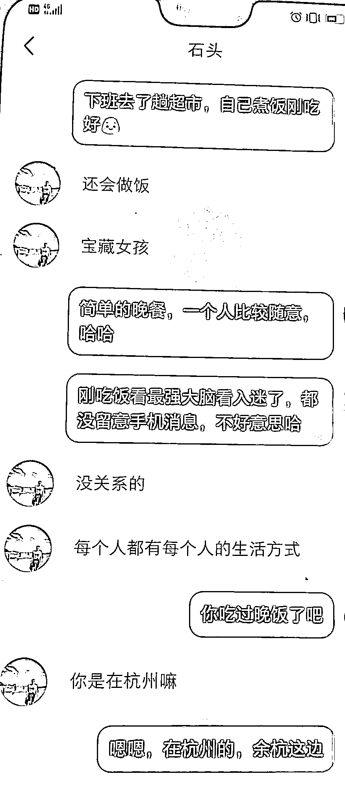
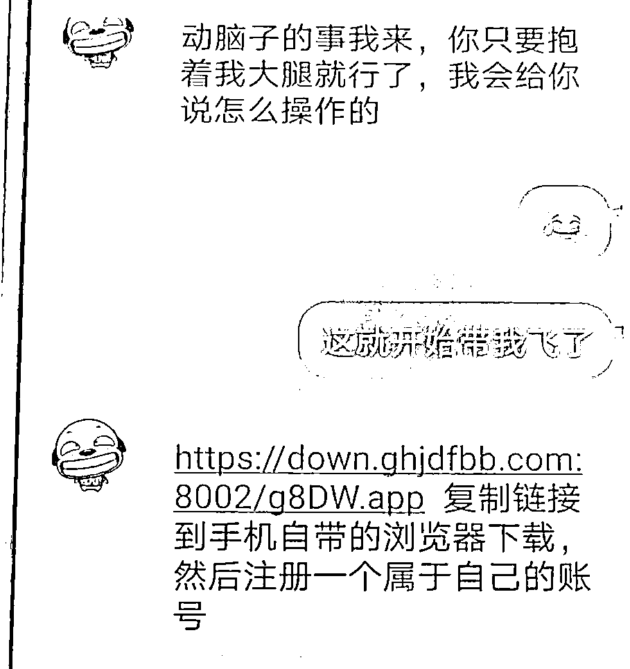
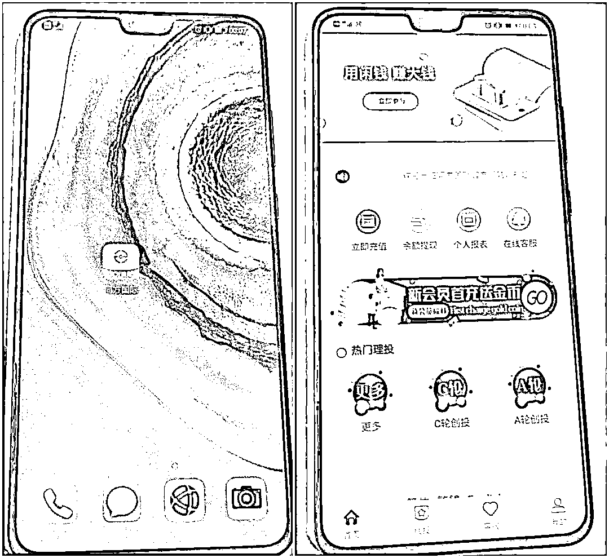
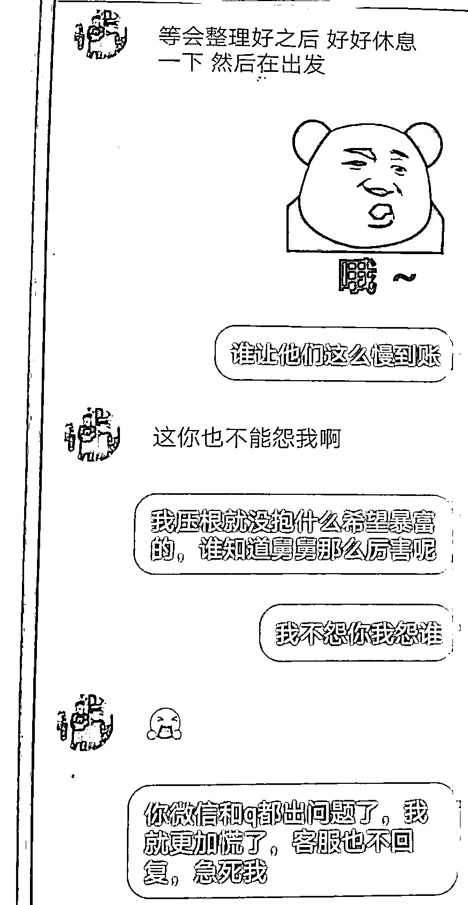
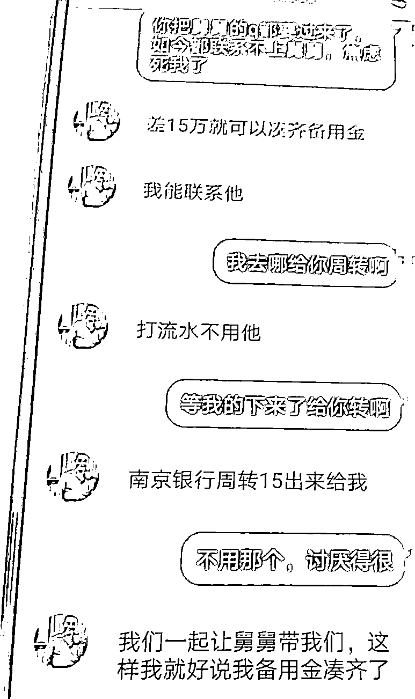
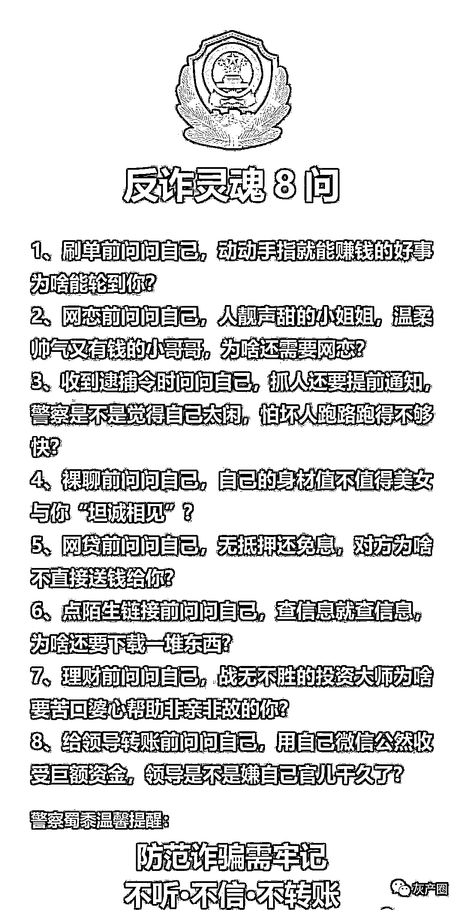

# “我中了情毒！”30 岁姑娘深夜哭诉：恋爱几天花了 82 万

> 原文：[`mp.weixin.qq.com/s?__biz=MzIyMDYwMTk0Mw==&mid=2247513871&idx=1&sn=dcf0dd1bf54f8dec6ab7dd1896839059&chksm=97cb7c37a0bcf521c568ff37dd722afef42b4bfa021f0a17fb109a55bc8cf87d0a873a2cb1ce&scene=27#wechat_redirect`](http://mp.weixin.qq.com/s?__biz=MzIyMDYwMTk0Mw==&mid=2247513871&idx=1&sn=dcf0dd1bf54f8dec6ab7dd1896839059&chksm=97cb7c37a0bcf521c568ff37dd722afef42b4bfa021f0a17fb109a55bc8cf87d0a873a2cb1ce&scene=27#wechat_redirect)

“前前后后，我一共打出了 82 万多，我自己都不知道我怎么会相信他，他一次一次对我说可以赚钱……我刚开始只想谈个恋爱的！”

2021 年 5 月 2 日深夜，杭州一名女子来到南苑派出所报警，称她在一网络平台上结识一名男子，后在男子一步步引导下被骗 82 万余元。

杭州 30 岁女子与小红书相亲贴上

认识的网友谈起了恋爱

“一开始，我只是浏览了一个关于相亲的帖子。”来报案的女子姓曾（化名），今年 30 岁。4 月 19 日晚，曾姑娘闲来无事，就上“小红书”打发时间，正好看到一个相亲的帖子，单身的曾姑娘就留了言。没多久，有一个昵称“石头”的人来与曾姑娘聊天，并表示想和曾姑娘交个“朋友”。曾姑娘通过 QQ 加了对方好友，看着“石头”QQ 空间里的信息，曾姑娘动了心，很快加了微信。对方的微信昵称叫“追逐”，自称名叫周强，在一家互联网企业上班，曾姑娘在对方的甜言蜜语中，与素未谋面的“周强”陷入了“热恋”。

男友设下重重“杀猪”陷阱，骗走 82 万

“我中了情毒，也中了发财梦的毒……”

4 月 21 日，“周强”对曾姑娘说，自己有一个投资软件“同方国际”可以赚钱，并发送了一个网址链接给曾姑娘让她下载，曾姑娘一开始充值 520 元试水，以“押大押小”的形式“投资”，没想到立即赚了 636 元，曾姑娘对“男友”更是相信了。随后，曾姑娘多次向“同方国际”APP 内充值，开始小额度时，三次都能按时提现。 4 月 24 日下午，曾姑娘向“同方国际”充值 5 万元。这时“周强”告诉他，这个 APP 没有会员不能继续玩了，需要充值 30 万成为会员才能继续。曾姑娘在男友“周强”的引导下向银行贷款，投了 30 万元成为 VIP 会员。谁料，账户里的钱突然“亏损”了。 伤心之下，男友“周强”又给曾姑娘推荐了一个“高人”——他的“舅舅”，在香港做风投，可以带曾姑娘赚钱。 
加了男友“舅舅”的 QQ 后，这个“舅舅”一上来就给曾姑娘他们组了个小群，并在群内“骂”了二人一顿，说做投资竟然没有准备备用金。曾姑娘很委屈，曾姑娘对“舅舅”说，自己实在是没有钱了。“舅舅”说必须要有 30 万的备用金，让曾姑娘去借。曾姑娘又贷款 30 万，并将其中 20 万充入了“同方国际”的 APP 中，没想到没多久就中了一个“特码”——奖金 280 万元！天降横财，但是无法提现。曾姑娘火急火燎去询问客服，客服称需要交纳 10%的税费才能提现。但此时，曾姑娘已经没钱可以“交税”。这时温柔又体贴的男友“周强”提议借钱交税。于是曾姑娘向朋友借款，给 APP 客服打去 13.8 万元“税费”。 
然而，大奖一直没有兑现，迎头而来的是一个个打击：APP 内的钱款迟迟无法提现，“男友”和“舅舅”不停地因为“电脑中毒”更换 QQ 和联系方式，最后也联系不上……曾姑娘终于发现，原来她陷入了一场骗子精心设计的“杀猪盘”骗局！曾姑娘先后累计向 APP 充值转账 82 万余元，其中大部分还是贷款和向朋友借款而来。“我中了情毒，也中了发财梦的毒……”曾姑娘在与“男友”的聊天中有过疑虑，但是最终被甜言蜜语哄骗。接到曾姑娘报警后，南苑派出所已经展开调查。解密可恨的“杀猪盘”骗局

**▶ 什么是杀猪盘？**

杀猪盘是一种流行于东南亚地区的诈骗方式，所以也叫“东南亚杀猪盘”，如今已席卷全国。
诈骗分子把受害人叫“猪”，把交友工具（APP 及婚恋网站）叫“猪槽”，把聊天剧本叫“猪饲料”，把恋爱叫“养猪”，把诈骗钱财叫“杀猪”，是一种新型网络电信诈骗方式，这就是杀猪盘。**▶ ** **“杀猪盘”套路五步法**

01

**取得信任**

骗子通过各种 APP 交友软件或婚恋网站添加你为好友，之后频繁与你聊天。在聊天过程中对你倍加关心和关爱，让你对其产生信任，每天各种嘘寒问暖。与你确定恋爱关系，让你对他（她）的认识更深，深信不疑。 

02

**引诱投资**

关系稳定，时机差不多的时候，骗子引诱你在他（她）们自制的平台购买股票（彩票、期货等各种投资）。大多数人抱着试试的心态小额投入几笔，骗子会通过后台操作，让你小赚几笔。 

03

**大额投入**

当你尝到甜头之后，骗子会并声称自己已经掌握了这个股票 APP（彩票、期货等各种投资）的规律，只要跟着他（她）稳赚不赔。这时，你已经深信不疑，便往平台里面大量投入。 

04

**无法提现**

等到受害人投入大量金额之后，看到平台金额并未增加，准备将里面的金额提现，发现提不出来。 

05

**人间蒸发**

再想与对方交涉时，骗子已经消失得无影无踪，人间蒸发。等到受害人恍然大悟，发现自己上当受骗后，钞票已经进入骗子的口袋了。

**最后，不光是女孩会上当受骗，男生也会被骗的。所以大家一定要提高警惕，积极审视下你现在的男（女）朋友，有没有让你投资，到底是不是杀猪盘。你被人当成了猪，是不是被套路了，自纠自查，及时止损。**

来源：杭州日报

← 向右滑动与灰产圈互动交流 →

