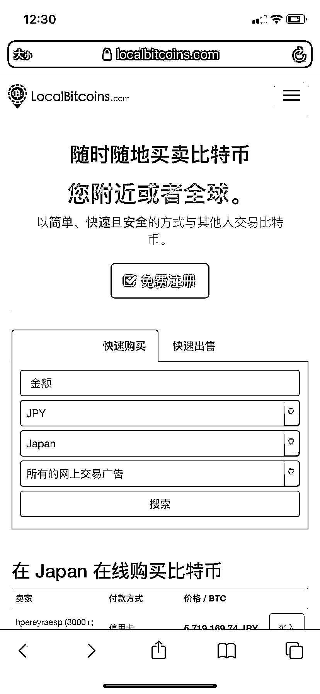

# 诈骗分子为何屡屡得逞？带您破解诈骗套路！

> 原文：[`mp.weixin.qq.com/s?__biz=MzIyMDYwMTk0Mw==&mid=2247513871&idx=2&sn=f29d42de8bf8b48b3979d94f733ca381&chksm=97cb7c37a0bcf521b4b812052cac7647853fd9ce0c871581b5ea51a6a9565e371ab8393df41e&scene=27#wechat_redirect`](http://mp.weixin.qq.com/s?__biz=MzIyMDYwMTk0Mw==&mid=2247513871&idx=2&sn=f29d42de8bf8b48b3979d94f733ca381&chksm=97cb7c37a0bcf521b4b812052cac7647853fd9ce0c871581b5ea51a6a9565e371ab8393df41e&scene=27#wechat_redirect)

近年来，我们多少都遭遇或听说过各种电信诈骗，一些人能够及时识破骗局，而一些人对诈骗分子的谎言深信不疑，损失惨重。本期提醒将继续带领大家深挖诈骗套路，破解谎言，让大家能够一眼识破诈骗分子的伎俩。希望大家认真阅读，广泛转发，保护自己和家人的财产安全。

（本文涉及案情的图片来自受害人提供的资料，其余图片来自网络。点击图片可查看大图。）

**01**

****一、诈骗分子靠什么方法诈骗？****

**诈骗起点千千万，万变不离一个“假”字。如果一个陌生人要求转账汇款，人们都会断然拒绝，而诈骗分子所要做的，就是不停地“假戏真做”，让受害人觉得“真”，进而答应诈骗分子的一切要求。**

**●** 假身份**。树立一个假身份是诈骗的开始。他（她）可以是秉公办案的公检法人员，温柔多金的男（女）朋友，乐于助人的好同学，可爱迷人的网络主播，精通投资的理财师，身世凄惨的普通人……然而他们的真实面目都只有一个：诈骗分子。**

**俗话说“人生如戏，全靠演技”，诈骗团伙有完善的剧本，丰富的人设资料，可以让你对他的身份深信不疑。而一旦你对他们的“人设”产生了信任，就会下意识地忽略他们话中的疑点。**

****

**（伪装成警察的诈骗分子）**

**● **假证件，假公文**。为了博取受害人的信任，诈骗分子会出示一大堆证件文件：警官证、逮捕令、保密协议、法院传票、工作证、公司执照……很多人在看到这些材料之后，就对对方的身份深信不疑，彻底丧失警惕心。下面这些资料，都是诈骗分子根据受害人提供的个人信息伪造出来的假文件！**

****

****

****

****

****

****

**（各式假公文）** 

**● **假故事**。上面的假公文配上一个精心编造的故事，可以从理性和感情两方面对受害人进行“洗脑”。无论说你是重大案件的涉案人员要配合调查，还是说自己精通投资内幕、可以带你赚钱，或是说最近手头拮据需要接济，亦或是高价换汇、刷单挣钱……不管诈骗分子说得多么头头是道、天花乱坠，都只是为了最后的目的：骗取钱财！**

****

**（伪造自杀情节，利用同情心诈骗）**

**● **假平台，假 APP**。假平台（APP）多见于**虚拟货币**（如比特币）投资诈骗和**非法赌博**、**直播网站**、**刷单**诈骗等。犯罪团伙会先建立一个虚假的投资平台，诱骗受害人前来投资、下注或观看视频等。此类平台往往先以提现等蝇头小利“回馈”用户，一旦受害人追加大额投资，则动辄无法提现，或需要追加“保证金”，甚至整个平台凭空消失。一些非法 APP 还会盗取用户手机信息，再通过曝光隐私信息威胁用户。**

****

****

**（虚拟比特币投资平台，让人血本无归）**

**● **假威胁**。诈骗分子对受害人的“威胁”一般分为两种：配合诈骗过程的“表演”，和诈骗被识破后的“恐吓”。在行骗过程中，诈骗分子会不停地警告受害人如果不执行指令，将会被拘捕、判刑，绝对不能对外界透露相关信息，必须时刻报告自己的活动。更有甚者，在已骗得受害人钱财后，还指示受害人联系家人声称自己被绑架，索要赎金，再次行骗。**

**如诈骗被识破，诈骗分子也会以“我是 XX 黑社会的，我知道了你的住址，不给钱我就上门”等威胁受害人。此类威胁在**裸聊**诈骗中尤其常见。**

****

****

****

**（诈骗分子伪装成检察院人员，对受害者进行精神控制）**

****02****

******诈骗分子的方法为什么能够得逞？******

******诈骗分子的上述手段之所以能够得逞，是因为精准抓住了以下几点。******

******● **恐惧心理**。冒充公检法和使馆人员的诈骗，是在利用人的恐惧心理。在日常生活中，绝大部分人都是安分守己、合法谋生，突然被告知自己卷入重大案件会被判刑，第一反应就是害怕。当人处于恐慌状态时，往往无法做出理智的判断，只能一步步掉入诈骗分子的陷阱。******

******●**贪财心理**。投资类诈骗多利用人的贪财心理，给人许诺“一夜暴富”的虚假保证。很多人无法抵御高收益率带来的诱惑，选择性忽略投资项目的可疑之处甚至违法风险。******

******●**感情用事**。在先谈恋爱再骗钱的“杀猪盘”中，骗子都会先耐心布局，深情脉脉，让受害人对眼前的爱情深信不疑，甚至在被骗取钱财后仍幻想着“他（她）还爱我，绝对不会骗我”。******

******●**信息不对等**。人无完人，一个人不可能精通所有领域的知识，只要诈骗分子从你不了解、不熟悉的方向切入，一般人很难在短时间内判断真假。******

********03********

********如何避免被诈骗？********

******看了上述诈骗分子的常用方法和得逞原因，我们便也知道了识破和应对诈骗的方法。******

******● **经常学习防诈骗常识，有备无患**。遭遇诈骗，绝不是受害人的错，但确实可能给受害人造成难以承受的损失。既然诈骗团伙每天都在“悉心钻研”如何骗人，我们也必须要提高警惕，多了解最新的诈骗手法，尽量避免因为和骗子存在“信息差”而上当。******

******建议下载“**国家反诈中心**”APP，该 APP 可根据居住地精准推送反诈信息，并有在线举报功能（图中二维码暂时停用，可到各应用市场搜索“国家反诈中心”下载）。同时，推荐关注“**灰产圈**”微信公众号，及时了解最新诈骗种类。******

************

******●**抗得住诱惑，耐得住寂寞**。所谓“赚大钱的方法都写在刑法里”，当看到投资虚拟货币、股票黄金、私自换汇、网络刷单甚至网络赌博时，一定要牢记这不是赚钱的机会，而可能涉嫌违法犯罪。**网上恋爱再甜蜜，谈钱立刻就分手；网络主播再可爱，裸聊一定会被骗**。******

******●**不惧威胁，勇敢回击**。如果诈骗分子已经套取了你的个人信息，并以此作威胁，不要因恐惧而“花钱消灾”。请直接告知骗子你已报警，**并彻底删除其所有联系方式**。诈骗分子的目的是骗取钱财，不是造成人身伤害，被识破后会迅速转移目标继续行骗。如担心信息泄露引发后续问题，可提醒亲友注意防范并向居住地警署备案。******

******来源：公安部刑侦局、防骗每日电讯、反诈骗先锋******

************************

******← 向右滑动与灰产圈互动交流 →******

************