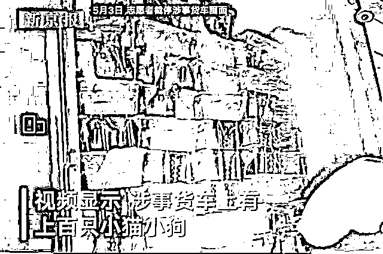
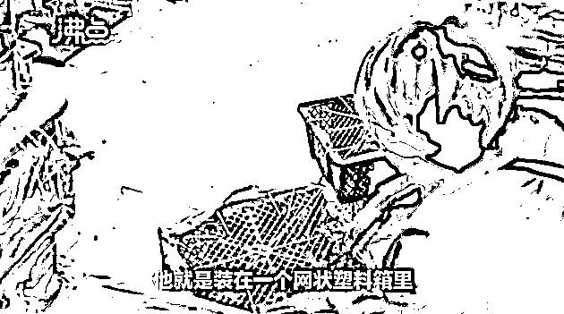
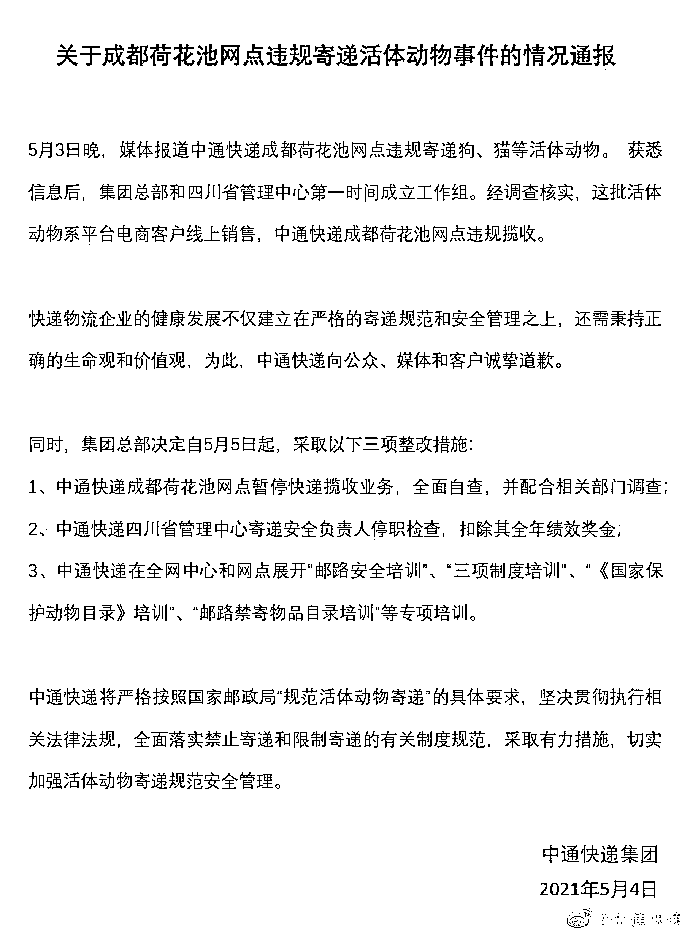
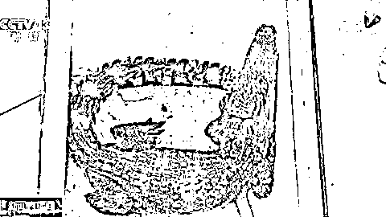
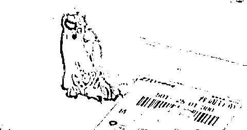
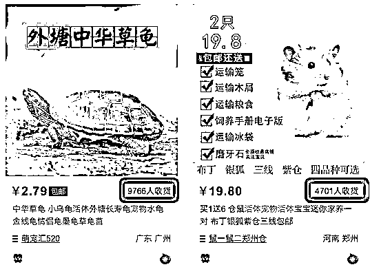
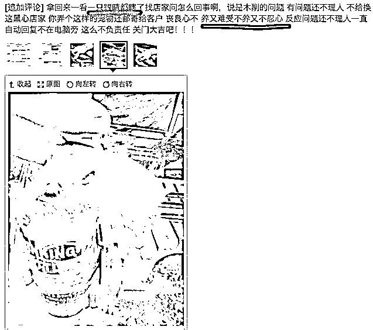
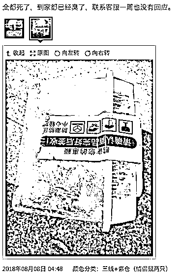

# 垃圾中通，给孩子发活鳄鱼，大量运输活体致死

> 原文：[`mp.weixin.qq.com/s?__biz=MzIyMDYwMTk0Mw==&mid=2247513927&idx=1&sn=aeaf720e30b5c97db17fec47a51b0ecf&chksm=97cb7c7fa0bcf569fa51d57adb780f0364543bc63044d0538ed00e1f064d1dde4339923bc7d2&scene=27#wechat_redirect`](http://mp.weixin.qq.com/s?__biz=MzIyMDYwMTk0Mw==&mid=2247513927&idx=1&sn=aeaf720e30b5c97db17fec47a51b0ecf&chksm=97cb7c7fa0bcf569fa51d57adb780f0364543bc63044d0538ed00e1f064d1dde4339923bc7d2&scene=27#wechat_redirect)

5 月 3 日，成都爱心志愿者从中通快递手中，解救了上百只被邮寄的小猫小狗，其中不少已奄奄一息。
据了解，这些宠物盲盒皆是网购订单，在发送的前一天，会断食断水。央视评论称： 用盲盒装动物，将一些人的快乐建立在动物痛苦甚至失去生命的基础上，是对人性的背离，也是娱乐的异化。相关法律禁止寄递活体动物，商家必须遵守，快递公司也不应明知故犯。尊从人性，尊重法律，人心不盲，就不会有如此恶劣、如此出格的盲盒。因央视的强势介入，中通快递集团火速回应，并将“锅”甩给了快递点：是快递点违规操作。但是，经过历史回顾，**这已经不是中通快递第一次违规收寄活体了，中通的恶行早有记录。**2018 年，央视就曾报道中通快递错将半米长的活鳄鱼送给孩子一事。通过快递面单可知，快递公司是中通快递。当然，在这条活体贩卖链条上，**中通快递只是中间的一环。** **在淘宝上，有不少宠物卖家通过违规邮寄活物，且销量惊人。****截至发稿时依旧存在大量“商品”**。这些不幸的小动物经过长途运输 + 暴力分拣，下场往往不会太好。（小仓鼠瞎了一只眼睛）（全部化成脓水）

这次中通快递被曝出残害生命，只是冰上一角。**如果淘宝等上游平台不治理，只惩罚一个中通，恐怕不能解决任何问题。**

来源 ：IT 之家