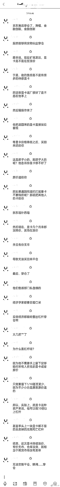
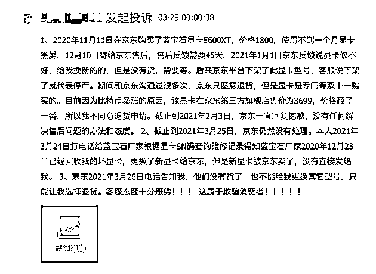
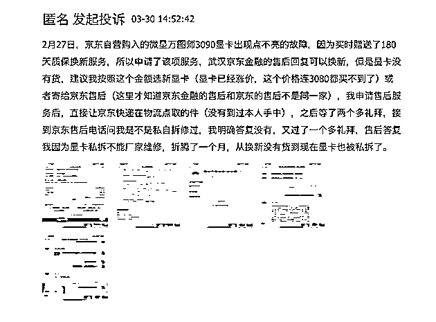
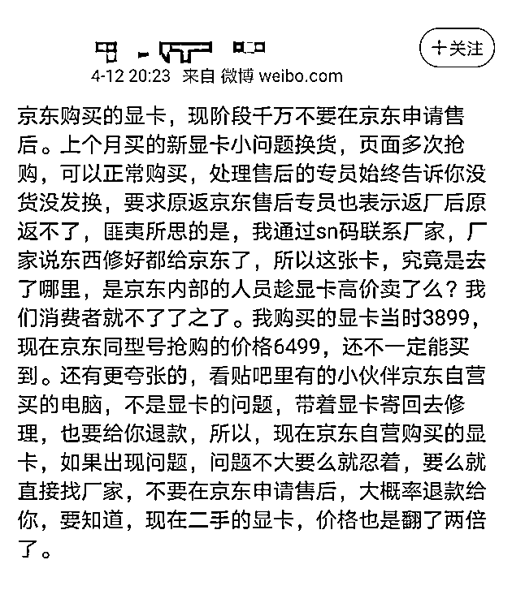
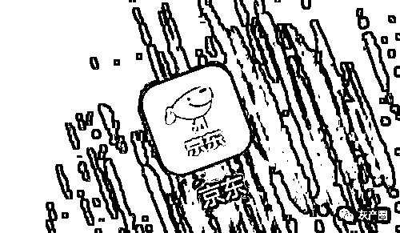

# 被曝显卡售后不肯维修要原价退款，京东回应：不存在

> 原文：[`mp.weixin.qq.com/s?__biz=MzIyMDYwMTk0Mw==&mid=2247513927&idx=2&sn=71eafe9e444782910c20173b689a31de&chksm=97cb7c7fa0bcf5690db0f4e9e145301416aaf7793ec33cb58431a588b0520602c79c4f43af9b&scene=27#wechat_redirect`](http://mp.weixin.qq.com/s?__biz=MzIyMDYwMTk0Mw==&mid=2247513927&idx=2&sn=71eafe9e444782910c20173b689a31de&chksm=97cb7c7fa0bcf5690db0f4e9e145301416aaf7793ec33cb58431a588b0520602c79c4f43af9b&scene=27#wechat_redirect)

## **▍其实事情是这样的 **

近日有博主晒出一张聊天截图，聊天内容直指京东显卡穿仓：疑似京东把客户返场修的显卡先高价卖出去，然后等显卡价格下降之后再买回还给客户，但是近期显卡价格不降反涨，有价无市，导致无法买回来平仓，最后穿仓了。

穿仓、平仓是期货用语，这里被用到电商物流领域。上述聊天内容指出，京东售后将用户送修的显卡返厂修好后不直接返还给用户，而是借着显卡价格水涨船高的态势，直接高价转手卖出，意图等显卡价格降低后再买回来还给用户。期间，甚至以修不好为由要求用户按照购买价原价退款，而遇到死缠烂打不肯退款的，京东售后则会拆西墙补东墙，将其他人返修的卡返还给用户。然而，人算不如天算，近期显卡价格不降反涨，有价无市，最终导致无法买回来平仓，最终穿仓了。

此前就有网友投诉京东显卡售后有问题，在黑猫投诉上，有用户表示，坏显卡原厂已经换新给京东，京东拒绝发货欺骗顾客没货。

还有用户称，申请显卡换新后被告知显卡没有货，建议按照原金额选新显卡，但此时显卡已经涨价。

对于京东显卡售后相关传闻，5 月 7 日，京东方面回应——

**京东一直严格遵循相关售后服务政策，不存在传言中显卡售后服务 “金融化“的情况。京东会本着以客户为先的理念，妥善处理个别显卡售后的问题，目前包括显卡在内的商品售后维修都正常运行。京东呼吁风清气正的网络环境，对个别人的恶意造谣传谣，京东已经对相关信息保存证据，并保留追究相关方法律责任的权利。**

会妥善处理个别显卡售后问题不存在显卡售后“金融化”情况

大家都散了吧！

[`v.qq.com/iframe/preview.html?width=500&height=375&auto=0&vid=s3244nqb10c`](https://v.qq.com/iframe/preview.html?width=500&height=375&auto=0&vid=s3244nqb10c)

来源：新浪科技&黑猫投诉

← 向右滑动与灰产圈互动交流 →

