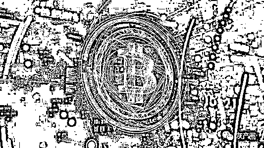
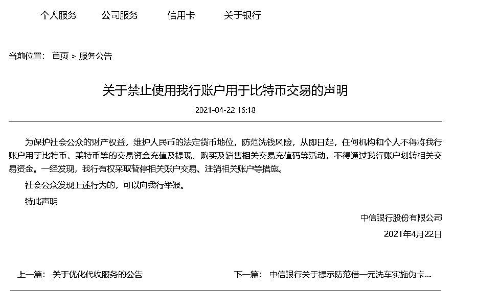
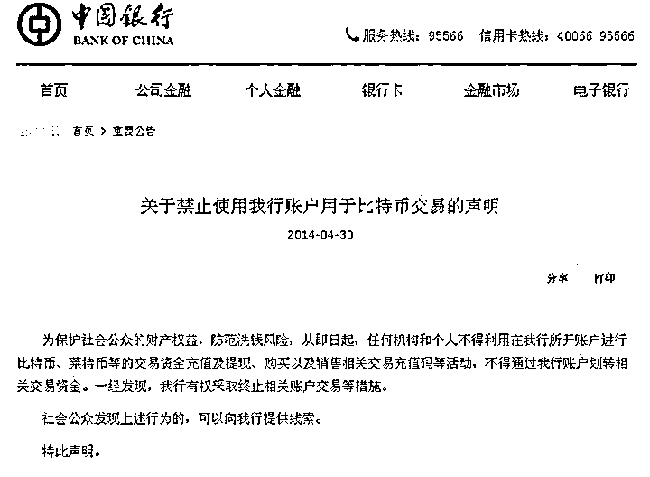
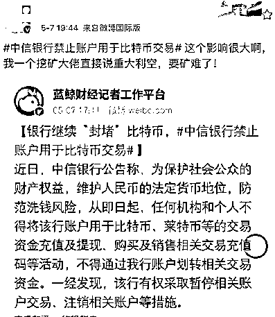
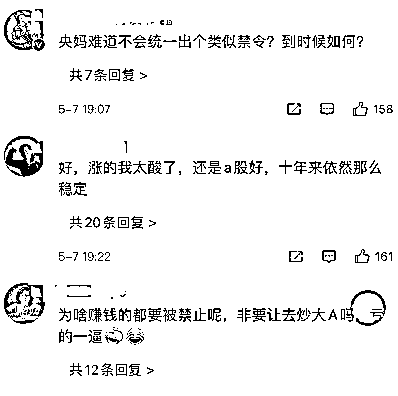
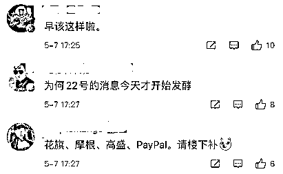
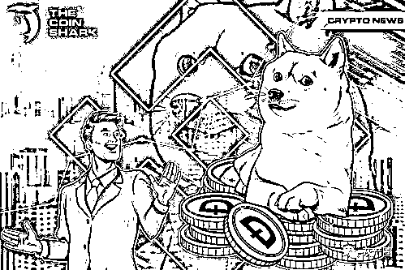
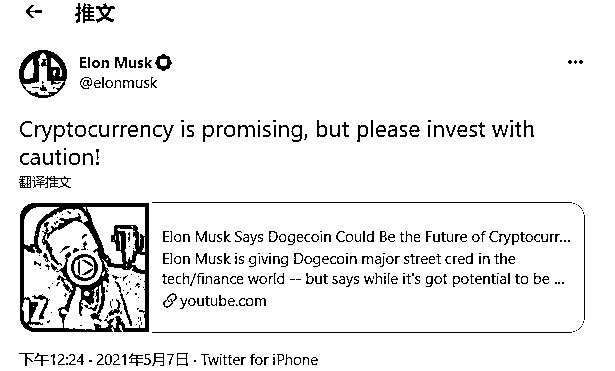

# 突发！中信银行宣布，"封堵"比特币！一经发现，注销账户

> 原文：[`mp.weixin.qq.com/s?__biz=MzIyMDYwMTk0Mw==&mid=2247513927&idx=3&sn=8a75b3167ab77d9681ab94eb1768e0aa&chksm=97cb7c7fa0bcf5692650353f4c19117362dcf440821e479c37cde0b2d6a61be57fa0427d4738&scene=27#wechat_redirect`](http://mp.weixin.qq.com/s?__biz=MzIyMDYwMTk0Mw==&mid=2247513927&idx=3&sn=8a75b3167ab77d9681ab94eb1768e0aa&chksm=97cb7c7fa0bcf5692650353f4c19117362dcf440821e479c37cde0b2d6a61be57fa0427d4738&scene=27#wechat_redirect)

这段时间，比特币、狗狗币等加密货币火到不行，不少人出于投机心理开始密切关注该领域，甚至入场购买加密货币进行炒作。

7 日传来消息，中信银行“封堵”比特币，禁止账户用于比特币交易！瞬间在微博刷屏了

中信银行禁止账户用于比特币交易

近日，中信银行官网发布公告称，从即日起，任何机构和个人不得将中信银行账户用于比特币、莱特币等的交易资金充值及提现、购买及销售相关交易充值码等活动，不得通过中信银行账户划转相关交易资金。一经发现，中信银行有权采取暂停相关账户交易、注销相关账户等措施。

不过，小编查了一下，这不是国内首家银行封堵比特币，2014 年 4 月，招商银行宣布禁止其账户用于比特币、莱特币等数字货币的交易。接着，华夏银行、建设银行、中国银行、光大银行、平安银行、农业银行、浦发银行、广发银行、兴业银行、工商银行、交通银行、民生银行等 13 家银行在短短两个星期内发布类似公告。

网友评论

马斯克提醒狗狗币风险：

加密货币有前景，但请谨慎投资

5 月 7 日，特斯拉 CEO 埃隆·马斯克（Elon Musk）在推特上转发一段标题为「马斯克称狗狗币（Dogecoin）可能成为加密货币的未来」的视频，并为视频配文称，加密货币很有前景，但请谨慎投资。 

视频显示，马斯克被粉丝围堵着索要签名，有粉丝提问称狗狗币可以扩展、不像比特币一样数量有限，会不不会因此带走传统硬币的价值，马斯克对此表示认同。

马斯克称，人们不应该把毕生积蓄投资在加密货币上，这是很不明智的行为。「加密货币未来很有可能成为地球上的主流货币，但这也只是推测，主流货币也可能有很多个，这种想法也有点投机。不要在加密货币上投入太多，我推测加密货币中前景最好的会是狗狗币。」

英国央行行长：

买加密货币就要做好血本无归准备

英国央行行长安德鲁-贝利（Andrew Bailey）在比特币、以太币和狗狗币等加密货币资产大幅上涨后表示，人们只有在准备好损失所有钱的情况下才应该购买加密货币。

贝利周四表示，他认为比特币等加密货币没有内在价值，“我只想强调我近年来多次说过的话，恐怕它们没有内在价值。”

“这并不意味着人们不重视它们，因为它们可以具有外在价值。但它们没有内在价值。”

贝利补充称：“很抱歉，我要再次非常直率地说：只有在你准备好赔光所有钱的时候才能买它们。”

贝利说，他不相信加密货币是真正的货币，他说：“货币和加密货币这两个词对我来说恐怕是毫不相干的。”贝利的言论呼应了今年早些时候英国金融市场行为监管局（FCA）的观点。

FCA 今年 1 月表示，与加密货币相关的投资和贷款产品“风险非常之高”。如果消费者投资这类产品，“他们应该做好赔光所有钱的准备。”

尽管贝利发出了警告，但这位英国央行行长表示，他没有看到资产出现任何可能给整体金融稳定带来问题的波动迹象。

来源：中国基金报

← 向右滑动与灰产圈互动交流 →

