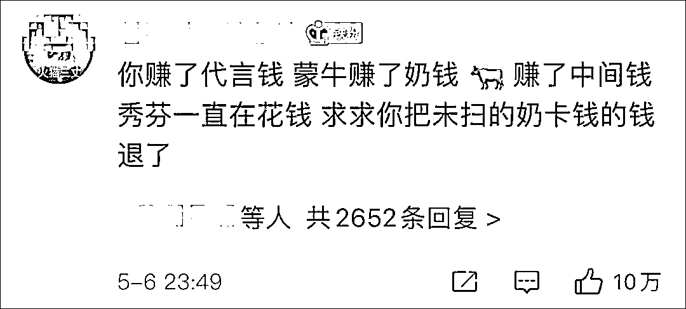
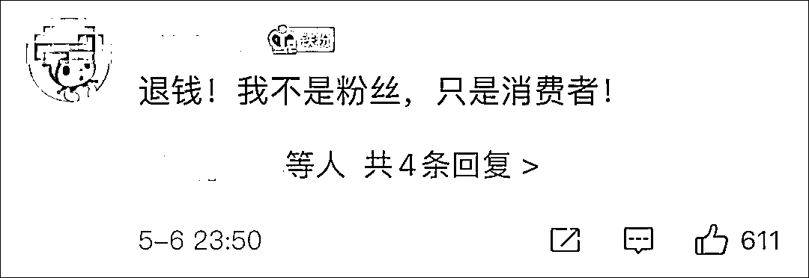

# 爱奇艺深夜致歉，粉丝喊"退钱"

> 原文：[`mp.weixin.qq.com/s?__biz=MzIyMDYwMTk0Mw==&mid=2247513927&idx=4&sn=0f4ff9f14232fbd84def7dd71073297b&chksm=97cb7c7fa0bcf569de721442ec32d2be9b63a6b38cbbc8293a6bf5c8e9b4d0071c177dc18345&scene=27#wechat_redirect`](http://mp.weixin.qq.com/s?__biz=MzIyMDYwMTk0Mw==&mid=2247513927&idx=4&sn=0f4ff9f14232fbd84def7dd71073297b&chksm=97cb7c7fa0bcf569de721442ec32d2be9b63a6b38cbbc8293a6bf5c8e9b4d0071c177dc18345&scene=27#wechat_redirect)

5 月 6 日深夜，爱奇艺方面针对近日《青春有你》第三季的停录风波再次发声，公开致歉后发布了最新的整改措施。

爱奇艺方面表示，平台已经并正在继续做深刻反省，“作为一档综艺节目，首先必须要保证价值观导向正确，这样才能对得起大家的热爱。在节目制作和播出过程中，我们忽视了价值观导向和社会责任，忽视了节目应有的合理规则，忽视了节目缺陷可能产生的严重负面影响，我们为此负全部的责任。”

声明提及的整改措施包括：

1、原定 5 月 8 日的成团之夜停止录制和直播，节目组继续慎重研究并调整节目规则。

2、**从即刻起，关闭《青春有你 3》所有助力通道。**

3、对于已经购买商家“活动装产品”但未使用的用户，平台和商家共同协商，确保妥善解决，相关细则将在《青春有你 3》的官方微博公布。

对于爱奇艺的回应，不少网友并不买账，**纷纷留言要求退钱并询问何时才能成团。**

此前，网上热传的一段视频中，几位中年人围坐在沟渠边，将牛奶包装一一撕开，把瓶内的牛奶全部倒进了沟里，仅留下瓶盖。 

这实则是选秀节目《青春有你 3》的粉丝，为“打投”偶像而购买赞助《青春有你 3》的商家的饮品，通过微信扫码瓶盖内二维码即可兑换为“果粒值”为参赛选手投票，票数最高的九位选手可以“成团出道”。

《青春有你第三季》被定位为新青年励志综艺节目，于 2021 年 2 月 17 日开始播出，共有 119 名男性练习生参加。在节目的录制过程中，观众可以通过多种方式为喜欢的选手助力。成团夜原定于 5 月 8 日播出，将从 20 名学员之中决出助力值最高的 9 位出道学员名单。

5 月 4 日晚，北京市广播电视局公开发文，责令爱奇艺暂停《青春有你》第三季后续节目录制，并要求平台完善节目管理制度，认真核查并整改存在的问题。

对此，@爱奇艺青春有你 于次日（5 月 5 日）回应称，将严格落实广电行政部门有关管理规定，从即日起暂停该节目录制，切实履行平台主体责任，积极承担媒体社会责任，进一步完善节目管理制度，认真核查并整改存在的问题，力求更加严格细致地把握节目制作的每个环节，积极营造清朗健康的网络环境，感谢各界对节目的关心和监督，对其中出现的问题我们深表歉意。

除了倾倒牛奶造成浪费外，也有网友爆料称，**选秀节目粉丝买奶投票已经形成灰色产业链——黄牛在囤积了很多奶票之后会高价卖给后援会。**

粉丝购买奶卡为偶像投票

粉丝的非理性行为对选秀节目来说是利益来源。据蓝鲸财经此前报道，截至 4 月 5 日，**《创造营 2021》与《青春有你 3》已经有超 5 位选手后援会集资破千万，超 30 位选手后援会集资破百万。**

而对于粉丝来说，选秀节目投票体系的公平性则屡遭质疑。2019 年，国内偶像选秀借鉴的韩国《Produce》系列身陷排名造假风波。韩国警方最终确认《Produce101》全系列造假，除了安俊英 PD 等人承认了的第三季和第四季之外，《Produce》整一系列都和观众投票结果不同，制作团队也介入其中并进行了造假。和国内买奶投票的间接模式不同的是，《Produce101》系列是更直接的短信投票模式。

另有爆料称，《青你 3》的热门选手余景天疑似非法持有中国、加拿大的双重国籍，其父母名下的产业——景立 KTV（景立歌城）疑似涉黄、涉毒。此前，余景天在节目比赛、粉丝募集资金等平台排名第一，他也被认为是成团后 C 位（中心位）的最强候选人。

对此，余景天的经纪公司在其官方微博@星宇愔乐 AstroMusic 发布声明，称余景天没有做过任何与网传相关的负面行为或者参与对社会产生负面影响的活动。但事情发酵后，大量观众在《青你 3》的官方微博下评论，要求余景天退赛。最终，余景天因个人原因退赛。

央视则在 5 月 5 日评论称，随着《中华人民共和国反食品浪费法》正式实施，反食品浪费已有刚性的法律约束。严重浪费食品的行为，是“顶风作案”，应依法严惩；对误导青少年三观的商家和平台，必须加强监管，不能放任其只顾产品销量、节目流量，罔顾法律和自身社会责任。

**商家的营销套路******

****据 AI 财经社报道，《青春有你》第三季的冠名赞助商为蒙牛真果粒，真果粒特意推出了四款饮品作为支持，更直白地说，只有这四款产品可以让粉丝扫码投票。****

****真果粒“青春有你”系列每箱内有一张奖卡，花果轻乳系列则在瓶盖内设置了二维码，不管是奖卡，还是二维码，都可以兑换助粒值为支持的选手助粒。这就意味着，粉丝买得越多，选手得到的支持就越高，在选秀过程中就有机会胜出。****

****这种模式，对于想要争取年轻消费者的快消品牌来说，熟门熟路。有统计显示，除了 2018 年《创造 101》的冠名赞助商是手机品牌 OPPO，其余每一季度的主流偶像选秀节目的冠名赞助商全部都是饮品巨头。蒙牛和伊利这两个乳业巨头几乎瓜分了每年最热门的综艺节目。2019 年与 2020 年的《青春有你》和《创造营》系列都是由蒙牛冠名赞助。****

****为此，企业付出的代价也不菲。****

****2020 年，蒙牛的广告及宣传费用为 68.03 亿元，占收入比重为 8.9%，这意味着，一年 365 天，蒙牛每天有 1800 多万元的广告宣传支出。但相比上一年，这已经是减少了 20%，2019 年蒙牛此项花费为 84.9 亿元，约占总营收的 11%。****

****不过，疯狂营销并非是蒙牛独有。2019 年，伊利在营销费用上投入 110.41 亿元，约占全年总营收的 12%。单在 2019 年，两家乳业大厂一年的广告营销投入之和就超过 195 亿元，这意味着，这两家企业平均每天会花费 5000 多万元用于营销投放。****

****在 2020 年财报中，蒙牛表示，花果轻乳通过冠名赞助爱奇艺《青春有你 2》成功上市推广，上市以来深受都市白领、大学生等消费群体的喜爱，电商平台多次售罄。不过，如果了解到花果轻乳的销售逻辑，“售罄”也不是没有道理。****

****来源：观察者网****

****************

****← 向右滑动与灰产圈互动交流 →****

********