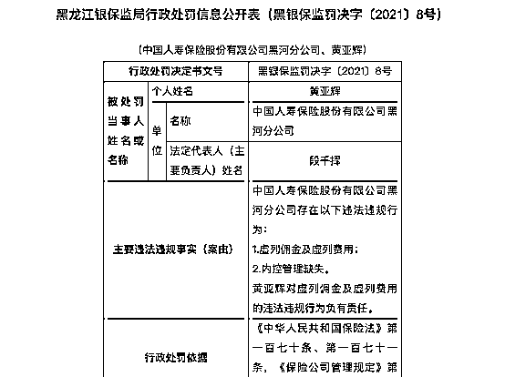

# “客户死亡获赔 120 万”，中国人寿致歉！

> 原文：[`mp.weixin.qq.com/s?__biz=MzIyMDYwMTk0Mw==&mid=2247513927&idx=5&sn=7dfacff046248a8c7f6eeb6022b9cb62&chksm=97cb7c7fa0bcf5697930681d2e3b28512f7eb40dfa36271ea515c9cc591d6acf617305ec28ab&scene=27#wechat_redirect`](http://mp.weixin.qq.com/s?__biz=MzIyMDYwMTk0Mw==&mid=2247513927&idx=5&sn=7dfacff046248a8c7f6eeb6022b9cb62&chksm=97cb7c7fa0bcf5697930681d2e3b28512f7eb40dfa36271ea515c9cc591d6acf617305ec28ab&scene=27#wechat_redirect)

**中国人寿再上热搜。**  

* * *

# 近日，一则中国人寿宣传“客户意外身亡获赔 120 万”的视频在网络热传。视频显示，几名肩披中国人寿绶带的人员抬着写有“张某某先生意外身故获赔 1200000 元”的理赔单，浩浩荡荡地走在街上。

# 此举引发网友强烈质疑，并一度冲上微博热搜。

今日晚间，中国人寿重庆市分公司确认了此事的真实性，并发表致歉声明。 

[`mp.weixin.qq.com/mp/readtemplate?t=pages/video_player_tmpl&action=mpvideo&auto=0&vid=wxv_1858846612198866952`](https://mp.weixin.qq.com/mp/readtemplate?t=pages/video_player_tmpl&action=mpvideo&auto=0&vid=wxv_1858846612198866952)

视频来源：正观新闻

**中国人寿回应不当宣传：**

**已当面致歉 对支公司经理免职处理**

****

**“中国人寿股份重庆市分公司服务号”微信公众号 5 月 7 日发布消息： 近日，我公司永川支公司在对一位意外身故客户的家属作出大额赔付的过程中，相关工作人员出现不当宣传行为，造成恶劣影响，对此我们向客户家属和广大民众表示深深的歉意。**

**我公司已诚恳向客户家属当面致歉并取得谅解，同时对支公司经理进行免职处理，并对其他相关人员开展批评教育。**

******消息还提到：我公司将继续秉持“诚实守信、客户至上”的服务理念，不断加强全员教育培训，不仅要为社会大众提供优质保险产品，更要为客户提供贴心温暖的优质服务，为履行企业社会责任和创造社会价值作出更大努力。**

**中国人寿方面还表示，公司已诚恳向客户家属当面致歉并取得谅解，同时对支公司经理进行免职处理，并对其他相关人员开展批评教育。**

****此前陷入遭员工举报旋涡****

****多人被处理****

********

******前段时间，中国人寿也因一名女员工的实名举报备受关注。******

******今年 2 月，一位自称在中国人寿嫩江支公司工作 16 年的女员工，实名举报嫩江支公司总经理保费造假，骗保套钱谋取私利等问题。（点击图片查看此前报道）******

************

******该员工举报称，自 2018 年，她就多次向黑龙江银保监局、黑河银保监分局实名举报中国人寿黑河、嫩江公司相关负责人存在造假套钱等行为，由于拒绝帮领导报账而遭到领导打压排挤，并在 2019 年 8 月遭到开除。******

******该视频曝光后，中国人寿员工实名举报公司造假事件各社交平台迅速冲上热搜，并引发广泛关注。******

******经过 2 个月的调查，4 月 28 日，针对前员工张某某网络实名举报黑龙江省黑河市嫩江支公司时任经理孙某某相关问题一事，中国人寿发布调查通报。（点击图片查看此前报道）******

************

******通报显示，2021 年 2 月 24 日，中国人寿就前员工张某某网络实名举报黑龙江省黑河市嫩江支公司时任经理孙某某相关问题，立即成立专项调查组赶赴当地展开调查。******

******通过为期两个月的调查，调查组查阅系统数据、财务凭证、人员档案、会议记录等相关资料 99949 份，与 748 人次进行核实。经调查，张某某反映的嫩江支公司时任经理孙某某相关违规违纪问题部分属实。******

******孙某某任期内嫩江支公司在销售年金保险产品时存在与银行储蓄产品进行对比并承诺额外收益的问题；在销售队伍建设和销售管理中存在队伍人力不实、活动管理不严的问题；在销售过程中存在虚列费用、套取佣金的问题。******

******基于以上调查结果，中国人寿根据监管机构相关行政处罚和公司管理规定，决定对相关责任人进行严肃处理，给予嫩江支公司时任经理孙某某撤职处分；给予黑河分公司时任总经理黄某某撤职处分；并对黑龙江省公司及嫩江支公司 6 名责任人进行追责处理。******

******针对此次嫩江支公司反映出的问题，中国人寿称将以此为戒，举一反三，进行全面排查，对各类违纪违规问题一经发现，严肃查处，绝不姑息。******

********黑龙江银保监局开出两则罚单********

********对相关责任人给予警告并罚款********

****************

********4 月 28 日，黑龙江银保监局公告称，因虚挂中介业务套取佣金；给予投保人保险合同约定以外的其他利益；未经批准变更营销服务部营业地址等违法违规事实，黑龙江银保监局对中国人寿保险股份有限公司嫩江支公司作出行政处罚，罚款 50 万元，并对相关责任人给予警告并罚款 9 万元。********

****************

********此外，黑龙江银保监局还公布了一则处罚，中国人寿保险股份有限公司黑河分公司因虚列佣金及虚列费用；内控管理缺失等，根据相关规定，黑龙江银保监局对其给予警告并罚款 51 万元，对相关责任人给予警告并罚款 4 万元。********

****************

********来源：中国基金报，证券时报********

********************************

********← 向右滑动与灰产圈互动交流 →********

****************