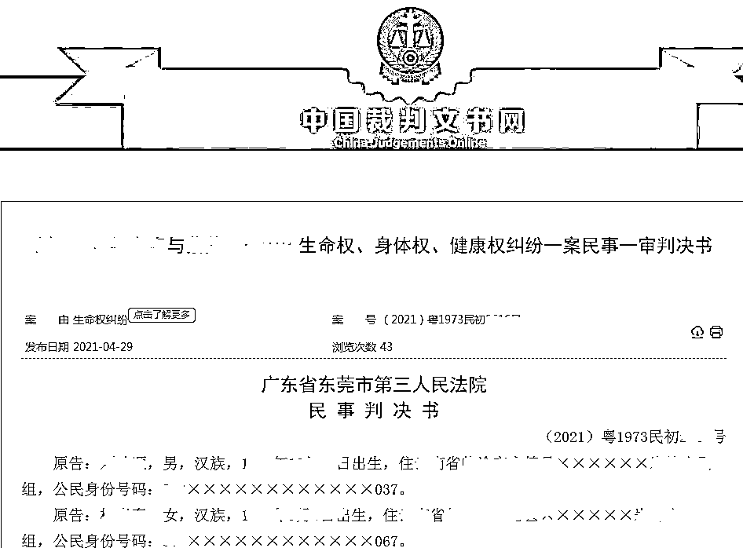
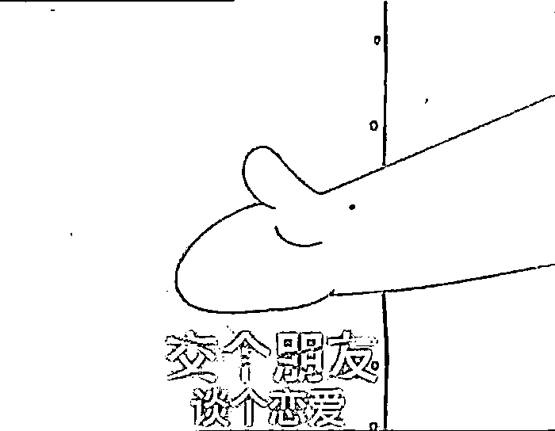
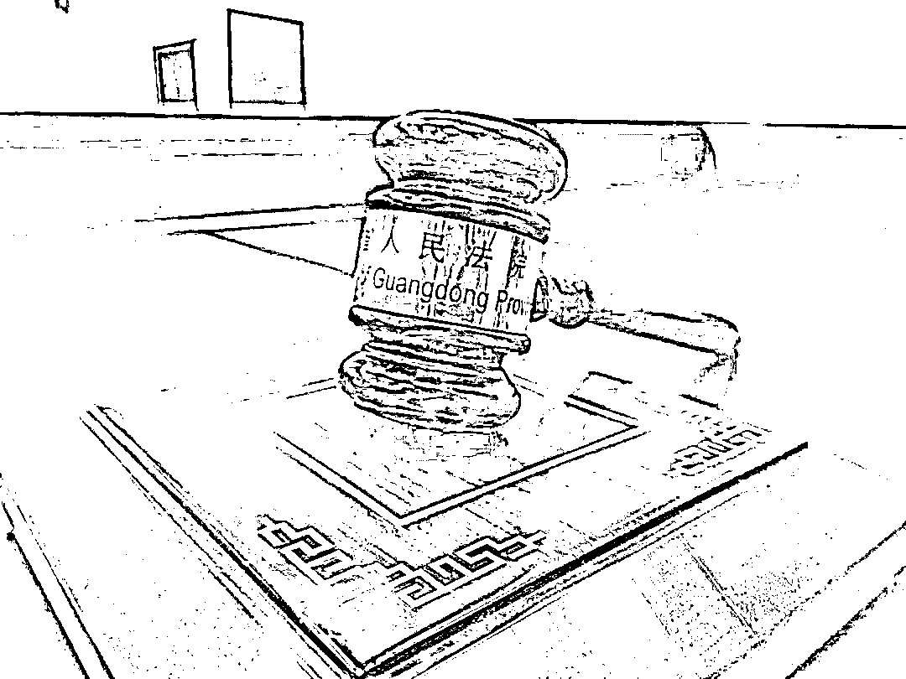

# 18 岁“小三”跳楼身亡，父母向原配索赔 109 万！法院判了...

> 原文：[`mp.weixin.qq.com/s?__biz=MzIyMDYwMTk0Mw==&mid=2247513927&idx=6&sn=62e39203baa604f6203c3586c8ed8ed5&chksm=97cb7c7fa0bcf569ab21573f1e2820c1bdbadc3e550542eb02980abfe50e73d090022d8b13ed&scene=27#wechat_redirect`](http://mp.weixin.qq.com/s?__biz=MzIyMDYwMTk0Mw==&mid=2247513927&idx=6&sn=62e39203baa604f6203c3586c8ed8ed5&chksm=97cb7c7fa0bcf569ab21573f1e2820c1bdbadc3e550542eb02980abfe50e73d090022d8b13ed&scene=27#wechat_redirect)

原配千里寻夫，

找到的却是“小三”，

不料对方跳楼身亡。 

死者父母将原配诉至法院，

称是她的辱骂刺激了他们的女儿。

少女之死，谁之过？

近日，东莞市第三人民法院

对该案作出了一审判决。

千里寻夫，“小三”跳楼

1991 年出生的顾佳比丈夫李寻（当事人均为化名）大 6 岁，二人育有一子，一家人本来和睦美满。但丈夫的一次外出工作经历，改变了这一切。

李寻称，2020 年 5 月，**他在江苏工作时，认识了 18 岁的阿欢。6 月，二人就确定了情侣关系。**

　　

丈夫的这段婚外恋，让顾佳难以接受，但她依旧希望丈夫能浪子回头。可李寻依旧“叛逆”，开始逃避，**2020 年 10 月上旬，他和阿欢一同在广东东莞，在一间公寓租了房，开始了同居生活。**

为了挽回这段婚姻，10 月，顾佳和婆婆一起，千里迢迢从河南来到东莞寻找李寻。她说，婆媳俩几经周折，才找到阿欢与李寻同居的地方。10 月 16 日晚，她见到了阿欢，但并没见到丈夫。

“我的儿子和你在一块吗？如果在一块的话就叫我儿子回来，我就把儿子带走，和你就没有关系了。”顾佳的婆婆向阿欢发问。

**就在这天晚上，阿欢在租住的房屋 8 楼楼顶跳楼身亡。**这也让顾佳被告上了法庭。阿欢父母认为，是顾佳的原因，他们的女儿才选择跳楼。**其父母向顾佳索赔 109 万余元，**李寻作为丈夫也被起诉，被要求承担这笔“共同债务”。

死者父母：

她不断谩骂刺激，导致悲剧

**事发当晚到底发生了什么？**

**阿欢的父母为何将矛头直指顾佳？**

据阿欢的父母称，事发当晚，顾佳带人在阿欢的住处围堵她，期间还粗口谩骂阿欢。“期间有人报警，民警已经在现场，但顾佳仍然一直辱骂阿欢，言语犀利粗俗，不堪入耳。”**其父母称，顾佳咄咄逼人的态度，使得阿欢精神极为紧张，**为了躲避顾佳的辱骂，阿欢寻找了机会跑上楼。 

“但顾佳一直对其紧追不舍，一路追到八楼（楼顶）。”其父母称，此时，阿欢已经站在墙边的围栏上，由于顾佳的谩骂，阿欢情绪十分激动，精神状态已经处于崩溃的边缘。尽管民警多次阻拦顾佳，并警告其不要刺激阿欢，但顾佳仍然辱骂阿欢。

“最后，阿欢在顾佳的辱骂中精神奔溃，直接从八楼跳下，后经医院医生抢救无效死亡。”**其父母一方称**，阿欢年仅 18 岁，正值青春年华，其心理和心智也仅能称为心理学上的“刚成年”。**顾佳一路紧追不舍的辱骂和言语的刺激压破阿欢最后一道心理防线，系导致其跳楼死亡的主要原因。**

原配：

好言相劝，她却我行我素

在顾佳的口中，却并非如此。**她称，**自己本是和睦幸福之家，自从李寻与阿欢发生婚外情，李寻抛妻弃子与阿欢非法同居。自**己多次对阿欢好言相劝，让她放弃李寻，阿欢却我行我素，置若罔闻。**

无奈之下，2020 年 9 月，顾佳带着婆婆来到东莞，将李寻带回河南。“阿欢此时本应心存愧疚，真诚悔过，但她却不思悔改，为了自己快乐，不惜拆散他人家庭，又追到河南，将李寻骗走，重新带回东莞。”顾佳说，阿欢为了阻止她再次找到李寻，以其堂哥的身份信息登记租房，非法同居。“阿欢的堂哥不仅不规劝阿欢，反而助纣为虐，向阿欢提供身份证。”

同年 10 月，她和婆婆一起再次来到东莞。“此时的阿欢如果能良心发现，就此罢手，本案就不会发生。”顾佳称，阿欢仍执迷不悟，反而与其哥密谋将李寻带走躲避。“我当时认为是阿欢不肯让我老公出来，就报警了，要求警察到场处理”。

她说，阿欢回到租住房收拾行李时，发现民警已经到达现场，自觉无颜面对，在自己没被发现时一个人爬上八楼楼顶，坐在楼的边沿上面，结束了自己的生命。

**顾佳辩称，自始至终，她都没有任何辱骂阿欢的行为。**

证人：

听到原配说“你跳下去啊”

据公寓房东称，在楼顶时，当时现场有顾佳和其婆婆、公安人员、阿欢堂哥，“阿欢说不要靠近她，靠近她就跳下去”，现场的人都不敢靠近，后来阿欢还是跳下去了。

**“你跳下去啊，我自杀的时候都没有人看，你自杀的时候还有人知道。”阿欢堂哥在接受询问时称，顾佳说过这样的话。**

民警曾询问顾佳，有无话语刺激阿欢，顾佳曾说“如果我跟我老公离婚了，你跟我老公想怎样就怎样”。

李寻承认，在这次之前顾佳也找过阿欢一次，说了一些难听的话，但并没做过过激的事。

法院：

原配不用赔，丈夫要谴责

法院审理认为，阿欢事发时已年满 18 周岁，对其跳楼轻生的行为与后果理应有明确的认知。而其堂哥等人与其有利害关系，证言不能单独作为认定案件事实的根据。其堂哥作证称：“顾佳一直粗口骂阿欢，脏话不堪入耳，骂了 10 多分钟，顾佳叫阿欢跳下去”等内容，顾佳并不确认，且根据派出所对多人的询问，亦无法反映出顾佳有以上辱骂行为。

信息时报资料图

法院认为，阿欢系自己主动一个人跑到出租房八楼进行跳楼，期间顾佳与其并无肢体冲突，虽然，顾佳说过“你跳下去啊，我自杀的时候都没有人看，你自杀的时候还有人知道”的话语，但是该话语并不具有明显的刺激性，不足以导致阿欢发生跳楼行为。**阿欢明知李寻有配偶，而多次与其同居，有违公序良俗，**顾佳从河南赶赴东莞寻夫，与阿欢发生言语冲突，只要没有超出一定界限，亦属情理可原。

法官特别指出，**李寻在婚姻关系存续期间，与阿欢非法同居，系严重违反社会公德和家庭美德的行为，亦有悖于社会主义核心价值观，应予以谴责。**

法院一审判决，**驳回阿欢父母的全部诉讼请求。**

来源 ：信息时报，潇湘晨报

← 向右滑动与灰产圈互动交流 →

